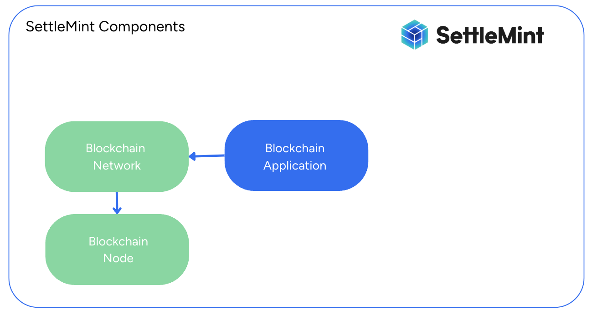

This guide will explain each of the tools and services on SettleMint and how they connect to build a blockchain application.

## The Blockchain Application

    

The first step to building anything on SettleMint is to [create an application](../building-with-settlemint/create-an-application). You can think of an application as the collection of resources that you need to build your blockchain application. This includes a blockchain network, smart contracts, middleware, storage, integrations, and insights.

## Add a Blockchain Network and Node

  

After creating a blockchain application, you now need to [add a blockchain network](../building-with-settlemint/add-a-network-to-an-application) and node to your application. SettleMint offers a variety of different [blockchain networks](../about-settlemint/supported-blockchains) to choose from whatever your usecase may be.

## Create a Smart Contract

  

## Add a Middleware

  

Blockchain applications produce data that lives on the blockchain, but we need
to be able to access that data in order to use it. Creating a
[middleware](../building-with-settlemint/middleware) allows us to do so. SettleMint
currently offers three middleware services: The Graph, Smart Contract Portal
Middleware and Firefly Fabconnect.

## Add Storage

  

Your blockchain application may need to store data. Blockchains are good for
running different processes in a decentralized way but can be costly to store
large amounts of data. SettleMint offers [two storage
options](../building-with-settlemint/storage): IPFS (decentralized) and MinIO
(centralized) S3 storage.

## Add an Integration

  

Blockchains are not the only technology that your blockchain application may
need to interact with. SettleMint offers an [Integration
Studio](../building-with-settlemint/integration-studio) which allows you connect your
blockchain application to other technologies such as databases, APIs, and more.
This tool is a low-code to which also offers a visualization of any business
logic included in your integration.

## Add a Custom Deployment

Your blockchain application may require custom components or frontend applications that are not provided by the standard SettleMint platform offerings. 
The [Custom Deployment](../building-with-settlemint/custom-deployment/) feature allows you to deploy your own Docker images on the SettleMint platform. This provides the flexibility to
 integrate custom solutions, such as frontend applications, within your blockchain-based projects, enhancing the overall functionality and user experience of your application.

## Getting Started

Ready to build? Head over to:

- [Building with SettleMint](../building-with-settlemint/add-a-network-to-an-application) for detailed platform instructions
- [Developer Guides](/developer-guides/guide-library) for step-by-step tutorials on common use cases
