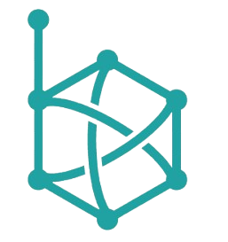
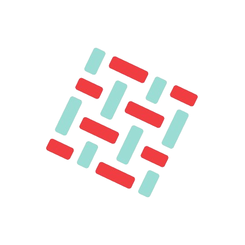
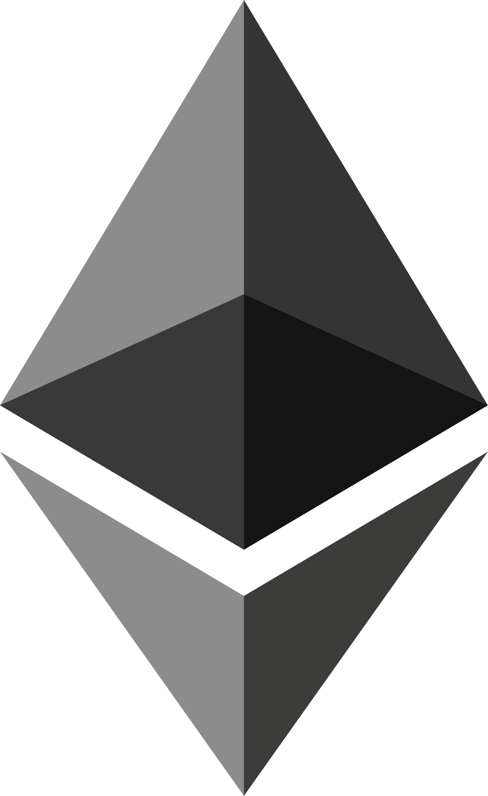

import { Card, Cards } from 'fumadocs-ui/components/card'

When launching a blockchain development project, the selection of a blockchain protocol is one of the most important decisions that has to be made. Protocols matter because they determine the scope of functionality your application can provide.

SettleMint currently supports the following protocols:

## Permissioned Blockchains

<Cards>
  <Card
    href="/documentation/docs/blockchain-guides/Hyperledger-Besu/enterprise-ethereum-the-basics/"
  >
    <h3 className="mb-4">Hyperledger Besu</h3>
    

      
 
        
      

      
Ethereum client designed to be enterprise-friendly

    

  </Card>

  <Card
    href="/documentation/docs/blockchain-guides/Hyperledger-Fabric/hyperledger-fabric-the-basics/"
  >
    <h3 className="mb-4">Hyperledger Fabric</h3>
    

      
 
        
      

      
An enterprise-grade permissioned distributed ledger

    

  </Card>

  <Card
    href="/documentation/docs/blockchain-guides/quorum/quorum-the-basics/"
  >
    <h3 className="mb-4">Quorum</h3>
    

      
 
        
      

      
An implementation of Ethereum supporting data privacy

    

  </Card>
</Cards>

## Public Blockchains

<Cards>
  <Card
    href="/documentation/docs/blockchain-guides/ethereum/ethereum-the-basics/"
  >
    <h3 className="mb-4">Ethereum</h3>
    

      
 
        
      

      
Goerli, Mainnet, Sepolia Testnet & Holesky Testnet. Full nodes

    

  </Card>

  <Card
    href="/documentation/docs/blockchain-guides/avalanche/avalanche-the-basics/"
  >
    <h3 className="mb-4">Avalanche</h3>
    

      
 
        
      

      
Mainnet & Fuji testnet. Full nodes

    

  </Card>

  <Card
    href="/documentation/docs/blockchain-guides/polygon/polygon-the-basics/"
  >
    <h3 className="mb-4">Polygon</h3>
    

      
 
        
      

      
Mainnet & Mumbai Testnet. Full node

    

  </Card>

  <Card
    href="/documentation/docs/blockchain-guides/polygon-zkevm/polygon-zkevm-the-basics/"
  >
    <h3 className="mb-4">Polygon zkEVM</h3>
    

      
 
        
      

      
Mainnet & Testnet. Full nodes

    

  </Card>

  <Card
    href="/documentation/docs/blockchain-guides/Arbitrum/arbitrum-the-basics/"
  >
    <h3 className="mb-4">Arbitrum</h3>
    

      
 
        
      

      
Mainnet & Testnet. Full nodes

    

  </Card>

  <Card
    href="/documentation/docs/blockchain-guides/Optimism/optimism-the-basics/"
  >
    <h3 className="mb-4">Optimism</h3>
    

      
 
        
      

      
OP Mainnet & OP Goerli. Full nodes

    

  </Card>

  <Card
    href="/documentation/docs/blockchain-guides/Hedera/hedera-the-basics/"
  >
    <h3 className="mb-4">Hedera</h3>
    

      
 
        
      

      
Hedera Mainnet & Testnet. Full nodes

    

  </Card>
</Cards>
