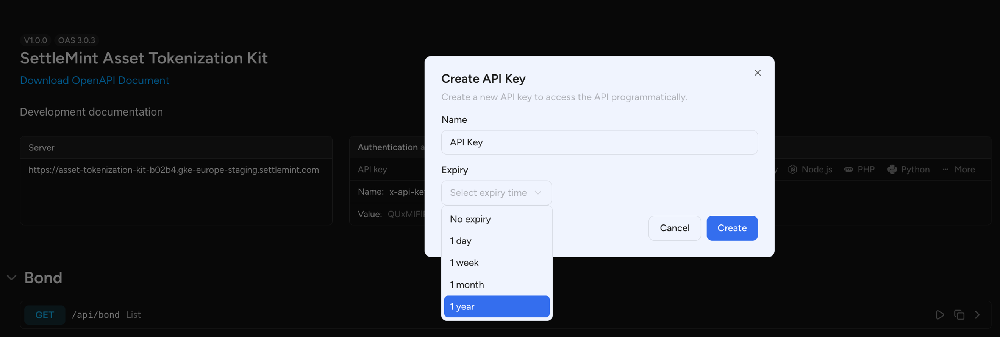
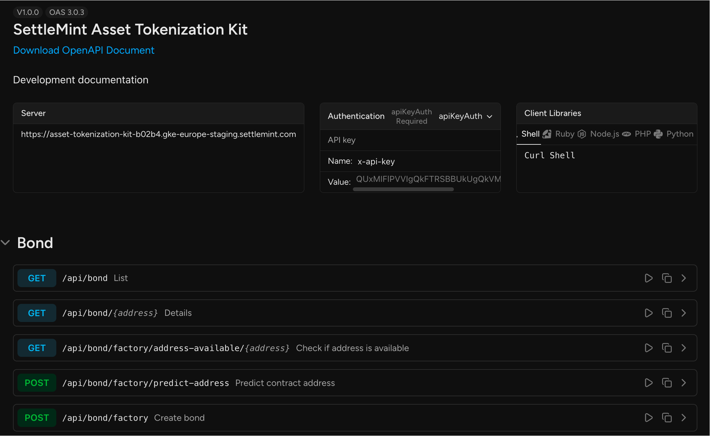
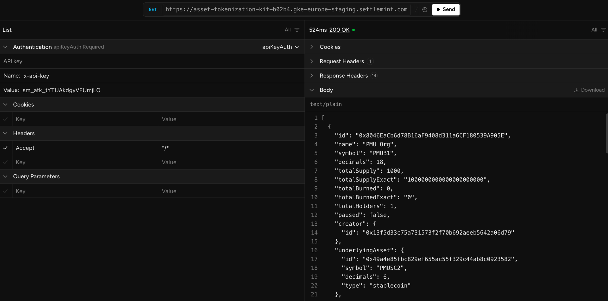

## API Reference — Asset Tokenization Kit

To start integrating with the SettleMint Asset Tokenization Kit APIs, the first
step is to generate an API key. This key is required to authenticate all
programmatic access to your deployed instance, and it ensures that only
authorized applications or developers can perform operations such as deploying
assets, transferring tokens, updating access roles, or retrieving transaction
and portfolio data.

  

From the API portal interface, navigate to the “API Keys” tab and click on the
“Create API Key” button in the top-right corner. This will open a modal where
you are required to enter a Name for the key (e.g., “Admin UI”, “Investor App”,
or “Integration Layer”) and optionally set an expiry date/time if you want to
limit the duration of access. Setting an expiry is a recommended practice when
issuing temporary or scoped keys for testing, third-party vendors, or automated
scripts.

Once the key is created, it will appear in the list of active keys along with
its name, creation date, expiry (if set), and a masked view of the key value.
You will use this key in your requests by adding it to the HTTP header as
follows: x-api-key: YOUR_GENERATED_KEY_HERE

  

This key must be included in every API request to authenticate and authorize
your actions. Without it, the backend will reject the request with a 401
Unauthorized error. Be sure to store this key securely and avoid hardcoding it
into public repositories or frontend applications exposed to browsers. For web
apps, it is recommended to proxy API requests through a backend or use
serverless middleware that injects the key securely.

  

Each deployment has its own scoped API keys, meaning keys are only valid for the
specific environment they were created in (e.g., staging, production). The base
URL and available endpoints are listed in the API Documentation tab, where you
can also download the full OpenAPI (Swagger) schema for code generation or
external API tooling.

The API documentation portal is accessible through an interactive web interface
that provides detailed specifications for each endpoint, including request
formats, parameters, and response structures. Built on the Swagger framework,
the portal also includes a “Try It Out” feature, allowing users to test API
calls in real-time using sample or authorized credentials. This environment
supports rapid integration, debugging, and validation of token operations
directly from the browser.

## Available APIs

SettleMint’s Asset Tokenization Kit APIs provide a unified interface for
creating, managing, and interacting with a wide range of tokenized financial
instruments on blockchain. These APIs cover asset classes such as bonds,
equities, cryptocurrencies, funds, stablecoins, and deposits—each with
capabilities to deploy contracts, mint and transfer tokens, configure financial
parameters, and enforce role-based access control. Additional endpoints support
user identity lookup, transaction tracking, yield management, and portfolio
analytics, offering full transparency and operational control. Built for modular
integration, these APIs enable secure, compliant, and scalable deployment of
digital assets across enterprise and institutional platforms, while supporting
extensibility through customizable settings and real-time market data
integrations.

### Bond APIs

| Method | Endpoint                                        | Description                                   |
| ------ | ----------------------------------------------- | --------------------------------------------- |
| GET    | `/api/bond`                                     | List all bond contracts                       |
| GET    | `/api/bond/{address}`                           | Get bond contract details                     |
| GET    | `/api/bond/factory/address-available/{address}` | Check if a bond contract address is available |
| POST   | `/api/bond/factory/predict-address`             | Predict a future bond contract address        |
| POST   | `/api/bond/factory`                             | Deploy a new bond contract                    |
| POST   | `/api/bond/transfer`                            | Transfer bond tokens                          |
| POST   | `/api/bond/mint`                                | Mint new bond tokens                          |
| POST   | `/api/bond/mature`                              | Mark bond as matured                          |
| POST   | `/api/bond/redeem`                              | Redeem matured bond tokens                    |
| PATCH  | `/api/bond/set-yield-schedule`                  | Set or update yield distribution              |
| PATCH  | `/api/bond/top-up`                              | Top up underlying bond capital                |
| POST   | `/api/bond/withdraw`                            | Withdraw underlying bond asset                |
| DELETE | `/api/bond/burn`                                | Burn bond tokens                              |
| PUT    | `/api/bond/access-control/grant-role`           | Grant access control role                     |
| DELETE | `/api/bond/access-control/revoke-role`          | Revoke access control role                    |
| PATCH  | `/api/bond/access-control/update-roles`         | Update assigned roles                         |
| PUT    | `/api/bond/block-user`                          | Block a user from bond contract               |
| DELETE | `/api/bond/unblock-user`                        | Unblock a user                                |

---

### Cryptocurrency APIs

| Method | Endpoint                                                  | Description                       |
| ------ | --------------------------------------------------------- | --------------------------------- |
| GET    | `/api/cryptocurrency`                                     | List all cryptocurrency contracts |
| GET    | `/api/cryptocurrency/{address}`                           | Get cryptocurrency details        |
| GET    | `/api/cryptocurrency/factory/address-available/{address}` | Check if address is available     |
| POST   | `/api/cryptocurrency/factory/predict-address`             | Predict future contract address   |
| POST   | `/api/cryptocurrency/factory`                             | Deploy new cryptocurrency         |
| POST   | `/api/cryptocurrency/transfer`                            | Transfer tokens                   |
| POST   | `/api/cryptocurrency/mint`                                | Mint new tokens                   |
| POST   | `/api/cryptocurrency/withdraw`                            | Withdraw tokens                   |
| PUT    | `/api/cryptocurrency/access-control/grant-role`           | Grant a role                      |
| DELETE | `/api/cryptocurrency/access-control/revoke-role`          | Revoke a role                     |
| PATCH  | `/api/cryptocurrency/access-control/update-roles`         | Update user roles                 |

---

### Equity APIs

| Method | Endpoint                                          | Description                          |
| ------ | ------------------------------------------------- | ------------------------------------ |
| GET    | `/api/equity`                                     | List all equity contracts            |
| GET    | `/api/equity/{address}`                           | Get equity contract details          |
| GET    | `/api/equity/factory/address-available/{address}` | Check if equity address is available |
| POST   | `/api/equity/factory/predict-address`             | Predict equity contract address      |
| POST   | `/api/equity/factory`                             | Deploy new equity                    |
| POST   | `/api/equity/transfer`                            | Transfer equity tokens               |
| POST   | `/api/equity/mint`                                | Mint new equity tokens               |
| POST   | `/api/equity/withdraw`                            | Withdraw token                       |
| DELETE | `/api/equity/burn`                                | Burn equity tokens                   |
| PUT    | `/api/equity/access-control/grant-role`           | Grant role                           |
| DELETE | `/api/equity/access-control/revoke-role`          | Revoke role                          |
| PATCH  | `/api/equity/access-control/update-roles`         | Update roles                         |
| PUT    | `/api/equity/block-user`                          | Block user                           |
| DELETE | `/api/equity/unblock-user`                        | Unblock user                         |

---

### Fund APIs

| Method | Endpoint                                        | Description                        |
| ------ | ----------------------------------------------- | ---------------------------------- |
| GET    | `/api/fund`                                     | List all fund contracts            |
| GET    | `/api/fund/{address}`                           | Get fund contract details          |
| GET    | `/api/fund/factory/address-available/{address}` | Check if fund address is available |
| POST   | `/api/fund/factory/predict-address`             | Predict contract address           |
| POST   | `/api/fund/factory`                             | Deploy new fund                    |
| POST   | `/api/fund/transfer`                            | Transfer fund tokens               |
| POST   | `/api/fund/mint`                                | Mint fund tokens                   |
| POST   | `/api/fund/withdraw`                            | Withdraw token                     |
| DELETE | `/api/fund/burn`                                | Burn fund tokens                   |
| PUT    | `/api/fund/access-control/grant-role`           | Grant role                         |
| DELETE | `/api/fund/access-control/revoke-role`          | Revoke role                        |
| PATCH  | `/api/fund/access-control/update-roles`         | Update roles                       |
| PUT    | `/api/fund/block-user`                          | Block user                         |
| DELETE | `/api/fund/unblock-user`                        | Unblock user                       |

---

### Stablecoin APIs

| Method | Endpoint                                              | Description                   |
| ------ | ----------------------------------------------------- | ----------------------------- |
| GET    | `/api/stablecoin`                                     | List stablecoin contracts     |
| GET    | `/api/stablecoin/{address}`                           | Get stablecoin details        |
| GET    | `/api/stablecoin/factory/address-available/{address}` | Check if address is available |
| POST   | `/api/stablecoin/factory/predict-address`             | Predict contract address      |
| POST   | `/api/stablecoin/factory`                             | Deploy stablecoin contract    |
| POST   | `/api/stablecoin/transfer`                            | Transfer stablecoin           |
| POST   | `/api/stablecoin/mint`                                | Mint new stablecoin           |
| DELETE | `/api/stablecoin/burn`                                | Burn stablecoin               |
| PUT    | `/api/stablecoin/freeze`                              | Freeze user account           |
| PUT    | `/api/stablecoin/pause`                               | Pause contract                |
| DELETE | `/api/stablecoin/unpause`                             | Unpause contract              |
| PATCH  | `/api/stablecoin/update-collateral`                   | Update collateral data        |
| PUT    | `/api/stablecoin/block-user`                          | Block user                    |
| DELETE | `/api/stablecoin/unblock-user`                        | Unblock user                  |
| POST   | `/api/stablecoin/withdraw`                            | Withdraw token                |
| PUT    | `/api/stablecoin/access-control/grant-role`           | Grant role                    |
| DELETE | `/api/stablecoin/access-control/revoke-role`          | Revoke role                   |
| PATCH  | `/api/stablecoin/access-control/update-roles`         | Update roles                  |

---

### Deposit APIs

| Method | Endpoint                                           | Description                           |
| ------ | -------------------------------------------------- | ------------------------------------- |
| GET    | `/api/deposit`                                     | List deposit contracts                |
| GET    | `/api/deposit/{address}`                           | Get deposit details                   |
| GET    | `/api/deposit/factory/address-available/{address}` | Check if deposit address is available |
| POST   | `/api/deposit/factory/predict-address`             | Predict contract address              |
| POST   | `/api/deposit/factory`                             | Deploy deposit contract               |
| POST   | `/api/deposit/transfer`                            | Transfer deposit token                |
| POST   | `/api/deposit/mint`                                | Mint new deposit tokens               |
| DELETE | `/api/deposit/burn`                                | Burn deposit tokens                   |
| PUT    | `/api/deposit/freeze`                              | Freeze account                        |
| PUT    | `/api/deposit/pause`                               | Pause deposit contract                |
| DELETE | `/api/deposit/unpause`                             | Unpause contract                      |
| PATCH  | `/api/deposit/update-collateral`                   | Update collateral data                |
| PUT    | `/api/deposit/allow-user`                          | Allow user access                     |
| DELETE | `/api/deposit/disallow-user`                       | Disallow user                         |
| POST   | `/api/deposit/withdraw`                            | Withdraw token                        |
| PUT    | `/api/deposit/access-control/grant-role`           | Grant role                            |
| DELETE | `/api/deposit/access-control/revoke-role`          | Revoke role                           |
| PATCH  | `/api/deposit/access-control/update-roles`         | Update roles                          |

---

### Fixed Yield

| Method | Endpoint                              | Description                  |
| ------ | ------------------------------------- | ---------------------------- |
| GET    | `/api/fixed-yield`                    | List all fixed yield entries |
| GET    | `/api/fixed-yield/{address}`          | Get details by address       |
| GET    | `/api/fixed-yield/bond/{bondAddress}` | Get yield by bond address    |

---

### User & Contact APIs

| Method | Endpoint                     | Description                |
| ------ | ---------------------------- | -------------------------- |
| GET    | `/api/user`                  | List users                 |
| GET    | `/api/user/{id}`             | Get user by ID             |
| GET    | `/api/user/wallet/{address}` | Get user by wallet address |
| GET    | `/api/user/search`           | Search users               |
| GET    | `/api/contact`               | List contacts              |
| GET    | `/api/contact/{id}`          | Get contact details        |

---

### Transaction APIs

| Method | Endpoint                             | Description                  |
| ------ | ------------------------------------ | ---------------------------- |
| GET    | `/api/transaction`                   | List all transactions        |
| GET    | `/api/transaction/address/{address}` | Get transactions by address  |
| GET    | `/api/transaction/{transactionHash}` | Get transaction details      |
| GET    | `/api/transaction/recent`            | Get recent transactions      |
| GET    | `/api/transaction/count`             | Get transaction count        |
| GET    | `/api/transaction/timeline`          | Get timeline of transactions |

---

### Asset Events, Stats & Balances

| Method | Endpoint                                | Description                   |
| ------ | --------------------------------------- | ----------------------------- |
| GET    | `/api/asset-events`                     | List all asset events         |
| GET    | `/api/asset-events/{asset}`             | List events for asset         |
| GET    | `/api/asset-stats/{address}`            | Get asset statistics          |
| GET    | `/api/asset-balance`                    | List all balances             |
| GET    | `/api/asset-balance/{asset}/{account}`  | Get account balance for asset |
| GET    | `/api/asset-balance/portfolio/{wallet}` | Get user portfolio balances   |
| GET    | `/api/asset-activity`                   | Get asset activity data       |

---

### Settings & Provider APIs

| Method | Endpoint                               | Description              |
| ------ | -------------------------------------- | ------------------------ |
| GET    | `/api/setting/{key}`                   | Get setting value by key |
| GET    | `/api/providers/exchange-rates/{base}` | Get exchange rates       |
| PATCH  | `/api/providers/exchange-rates/`       | Update exchange rates    |
| GET    | `/api/providers/asset-price/{assetId}` | Get asset price          |
| PATCH  | `/api/providers/asset-price/{assetId}` | Update asset price       |

---

### Swagger / API Schema

| Method | Endpoint            | Description         |
| ------ | ------------------- | ------------------- |
| GET    | `/api/swagger`      | Swagger UI          |
| GET    | `/api/swagger/json` | Swagger JSON schema |
