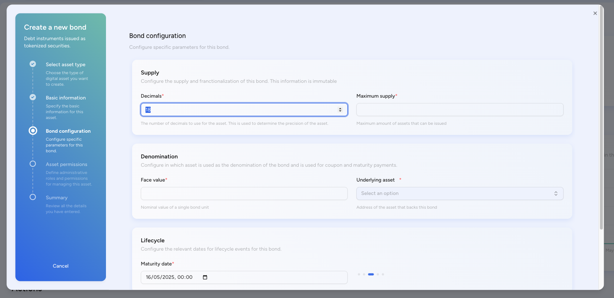
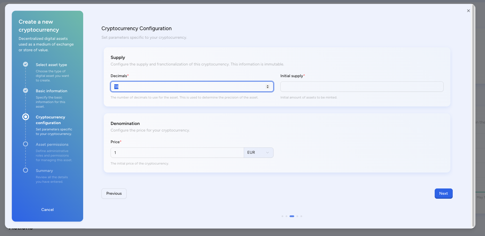

import { Callout } from "fumadocs-ui/components/callout";
import { Tabs, Tab } from "fumadocs-ui/components/tabs";
import { Steps } from "fumadocs-ui/components/steps";
import { Accordion, Accordions } from "fumadocs-ui/components/accordion";
import { Card, Cards } from "fumadocs-ui/components/card";

## What is the SettleMint Asset Designer?

<Callout>
**For financial professionals who need to create digital assets quickly:** The Asset Designer is a revolutionary no-code platform that enables anyone to create, configure, and deploy regulated financial tokens without writing a single line of code. This visual interface transforms the complex process of smart contract development into a simple, guided workflow that takes minutes instead of months.
</Callout>

## Who uses the Asset Designer?

### Primary Users
- **Treasury Managers** creating digital bonds and securities without IT dependency
- **Product Managers** launching new financial products rapidly
- **Compliance Officers** ensuring regulatory adherence in token design
- **Innovation Teams** prototyping tokenization concepts quickly
- **Business Analysts** modeling financial instruments digitally

### Key Problems Solved
- **Technical Barrier:** No blockchain coding knowledge required
- **Time to Market:** Launch tokens in 30 minutes vs 3-6 months
- **Compliance Risk:** Built-in regulatory templates for each jurisdiction
- **Development Costs:** Save $500K+ in smart contract development
- **Error Prevention:** Validated inputs prevent costly mistakes

## How to create tokenized bonds?

### What are tokenized bonds?
Tokenized bonds are blockchain-based debt instruments that automate traditional bond features while adding programmable capabilities. Financial institutions use them to:
- **Reduce issuance costs** by 85% through automation
- **Enable 24/7 trading** with instant settlement
- **Expand investor base** with fractional ownership
- **Automate compliance** with built-in restrictions

### Bond configuration process

<Steps>
**Step 1: Basic Information**
- **Token Symbol:** 3-5 character identifier (e.g., "UST10" for 10-year Treasury)
- **ISIN Code:** International Securities Identification Number for regulatory compliance
- **Face Value:** Denomination per bond token (e.g., $1,000)
- **Total Supply:** Maximum number of bonds to issue

**Step 2: Financial Parameters**
- **Coupon Rate:** Fixed or floating interest rate (e.g., 5% annual)
- **Maturity Date:** When bonds expire and principal is repaid
- **Payment Frequency:** Monthly, quarterly, semi-annual, or annual
- **Day Count Convention:** 30/360, Actual/365, etc.

**Step 3: Backing and Collateral**
- **Reserve Asset:** Link to underlying collateral (real estate, cash, securities)
- **Collateral Ratio:** Over-collateralization percentage for security
- **Audit Frequency:** How often collateral is verified
- **Reserve Location:** On-chain or off-chain custody details

**Step 4: Compliance Settings**
- **Investor Restrictions:** Accredited only, geographic limits, minimum investment
- **Transfer Rules:** Lock-up periods, trading windows, volume limits
- **Regulatory Framework:** SEC Rule 144A, Reg S, MiCA compliance
- **KYC Requirements:** Identity verification level needed
</Steps>

### Real-world bond examples
- **Corporate Bond:** IBM tokenized $150M bond, saving $2M in issuance
- **Municipal Bond:** City of Berkeley's blockchain mini-bonds for public projects
- **Green Bond:** World Bank's $33M blockchain bond for sustainable development

## How to create stablecoins?

### What are stablecoins?
Stablecoins are digital currencies pegged to stable assets like USD or EUR. They solve cryptocurrency volatility while enabling:
- **Instant global payments** at fraction of traditional cost
- **24/7 settlement** without banking hours restrictions
- **Programmable money** with smart contract integration
- **Financial inclusion** for unbanked populations

### Stablecoin configuration process

<Steps>
**Step 1: Currency Details**
- **Token Name:** Full name (e.g., "USD Coin")
- **Symbol:** Trading symbol (e.g., "USDC")
- **Decimals:** Precision level (typically 6 for USD stablecoins)
- **Initial Supply:** Starting circulation amount

**Step 2: Peg Configuration**
- **Peg Currency:** USD, EUR, GBP, or basket of currencies
- **Peg Ratio:** Usually 1:1 with underlying currency
- **Stability Mechanism:** Fiat-backed, crypto-collateralized, or algorithmic
- **Rebalancing Frequency:** How often peg is maintained

**Step 3: Collateral Management**
- **Reserve Type:** Cash, treasuries, commercial paper
- **Proof of Reserve:** Real-time attestation or periodic audits
- **Update Interval:** How often collateral proof is published
- **Reserve Custodian:** Bank or trust company holding reserves

**Step 4: Operational Controls**
- **Minting Rights:** Who can create new tokens
- **Burning Process:** Redemption mechanism for fiat
- **Freeze Capability:** Emergency pause for compliance
- **Blacklist Function:** Block sanctioned addresses
</Steps>

### Stablecoin use cases
- **Cross-Border Payments:** 90% cost reduction vs SWIFT
- **DeFi Collateral:** $150B+ locked in DeFi protocols
- **CBDC Pilots:** 100+ countries exploring digital currencies
- **Corporate Treasury:** Instant settlement for B2B payments

## How to create tokenized funds?

### What are tokenized funds?
Tokenized funds digitize traditional investment vehicles, enabling:
- **Fractional ownership** with $100 minimum vs $100K
- **Instant liquidity** through secondary markets
- **Automated operations** reducing management fees by 60%
- **Global access** to previously restricted investments

### Fund configuration process

<Tabs defaultValue="classification">
  <Tab value="classification" label="Step 1: Fund Classification">
    **Fund Category:**
    - Commodity Funds (gold, oil, agriculture)
    - Event-Driven (merger arbitrage, distressed)
    - Fixed Income (bonds, credit)
    - Multi-Strategy (diversified approaches)
    
    **Fund Class:**
    - Absolute Return (market-neutral strategies)
    - Income-Focused (dividend, yield generation)
    - Growth-Oriented (capital appreciation)
    - Small/Mid/Large Cap (by market capitalization)
  </Tab>
  
  <Tab value="economics" label="Step 2: Economic Parameters">
    - **Management Fee:** Annual percentage (typically 1-2%)
    - **Performance Fee:** Profit share (typically 10-20%)
    - **High Water Mark:** Ensures fees only on new profits
    - **Hurdle Rate:** Minimum return before performance fees
  </Tab>
  
  <Tab value="mechanics" label="Step 3: Token Mechanics">
    - **NAV Calculation:** Real-time or daily pricing
    - **Subscription Process:** How investors buy in
    - **Redemption Rules:** Notice periods, gates, lock-ups
    - **Distribution Policy:** Reinvestment or payout options
  </Tab>
</Tabs>

### Fund token benefits
- **Transparency:** Real-time portfolio visibility
- **Efficiency:** T+0 settlement vs T+2/3
- **Accessibility:** Lower minimums democratize investing
- **Automation:** Smart contracts handle distributions

## How to create tokenized equities?

### What are tokenized equities?
Digital representations of company ownership that provide:
- **Automated cap tables** with real-time updates
- **Programmable rights** for voting and dividends
- **Global accessibility** for international investors
- **Reduced costs** eliminating transfer agents

### Equity configuration process

<Tabs defaultValue="classification">
  <Tab value="classification" label="Step 1: Share Classification">
    **Equity Class:**
    - Common Stock (voting rights, last in liquidation)
    - Preferred Stock (dividend priority, liquidation preference)
    - Restricted Stock (vesting schedules, transfer limits)
    
    **Equity Category:**
    - ESOP Shares (employee ownership)
    - Founder Shares (special voting rights)
    - Convertible Stock (debt-to-equity features)
    - Series A/B/C (venture funding rounds)
  </Tab>
  
  <Tab value="rights" label="Step 2: Rights and Preferences">
    - **Voting Rights:** 1:1, super-voting, or non-voting
    - **Dividend Policy:** Cumulative, participating, or discretionary
    - **Liquidation Preference:** Multiple and participation rights
    - **Anti-Dilution:** Full ratchet or weighted average
  </Tab>
  
  <Tab value="restrictions" label="Step 3: Transfer Restrictions">
    - **Lock-up Period:** Time before shares can trade
    - **Right of First Refusal:** Company/investor purchase rights
    - **Tag-Along Rights:** Minority protection in sales
    - **Drag-Along Rights:** Majority sale enforcement
  </Tab>
</Tabs>

### Equity tokenization examples
- **Startup Cap Tables:** Automated equity management
- **Real Estate:** Fractional property ownership
- **Private Equity:** Democratized access to PE funds
- **Employee Ownership:** Instant ESOP distributions

## How to create cryptocurrencies?

### What are platform cryptocurrencies?
Native tokens that power decentralized ecosystems:
- **Utility Tokens:** Access to platform services
- **Governance Tokens:** Voting on protocol changes
- **Reward Tokens:** Incentivizing user behavior
- **Payment Tokens:** Medium of exchange in ecosystem

### Cryptocurrency configuration

**Step 1: Token Economics**
- **Total Supply:** Fixed, inflationary, or deflationary
- **Initial Distribution:** Team, investors, community split
- **Emission Schedule:** How new tokens are released
- **Burn Mechanism:** Deflationary token burns

**Step 2: Utility Design**
- **Use Cases:** Staking, fees, rewards, governance
- **Value Accrual:** How token captures platform value
- **Velocity Controls:** Mechanisms to reduce selling pressure
- **Network Effects:** How growth increases token demand

**Step 3: Technical Parameters**
- **Token Standard:** ERC-20, BEP-20, SPL
- **Decimal Places:** Typically 18 for divisibility
- **Mintable:** Can supply increase post-launch
- **Pausable:** Emergency stop functionality

### Successful token examples
- **DeFi Governance:** UNI, AAVE, COMP tokens
- **Gaming Currencies:** AXS, SAND, MANA
- **Exchange Tokens:** BNB, FTT, CRO
- **Layer 1 Tokens:** ETH, SOL, AVAX

## Advanced Asset Designer features

### Compliance Templates
- **US Securities:** Reg D, Reg S, Rule 144A templates
- **European:** MiCA-compliant token structures
- **Asian Markets:** SFC, MAS, FSA frameworks
- **Automatic Documentation:** Generates required disclosures

### Integration Capabilities
- **KYC Providers:** Automatic identity verification
- **Oracle Networks:** Real-time price feeds
- **Custody Solutions:** Institutional-grade storage
- **Trading Venues:** DEX and CEX connectivity

### Deployment Options
- **One-Click Testnet:** Instant testing environment
- **Multi-Chain:** Deploy to multiple blockchains
- **Gas Optimization:** Automatic contract optimization
- **Audit Trail:** Complete configuration history

## How to get started?

### Quick Start Guide

<Steps>
1. **Access Asset Designer**
   - Login to SettleMint platform
   - Navigate to Asset Designer module
   - No installation required

2. **Choose Asset Type**
   - Select from 6 pre-built templates
   - Or start with custom configuration
   - Use wizard for guidance

3. **Configure Parameters**
   - Fill in required fields
   - System validates inputs
   - Preview token features

4. **Test Deployment**
   - Deploy to testnet first
   - Verify all functions work
   - Run compliance checks

5. **Production Launch**
   - Get final approval
   - Deploy to mainnet
   - Monitor performance
</Steps>

### Best Practices
- **Start Simple:** Use templates before custom tokens
- **Test Thoroughly:** Always use testnet first
- **Document Everything:** Keep configuration records
- **Plan Compliance:** Consider regulations early
- **Monitor Post-Launch:** Track token performance

## Frequently asked questions

<Accordions>
  <Accordion title="Do I need coding skills to use Asset Designer?">
    No coding required. The visual interface handles all technical complexity. Basic financial knowledge is helpful.
  </Accordion>
  
  <Accordion title="How long does it take to create a token?">
    Simple tokens: 10-15 minutes. Complex financial instruments: 30-60 minutes. Compare to 3-6 months traditional development.
  </Accordion>
  
  <Accordion title="Can I modify tokens after deployment?">
    Depends on configuration. Some parameters (like compliance rules) can be updated. Core economics are typically immutable for security.
  </Accordion>
  
  <Accordion title="What blockchains are supported?">
    Ethereum, Polygon, Binance Smart Chain, Avalanche, and private networks like Hyperledger Besu.
  </Accordion>
  
  <Accordion title="Is there a token creation limit?">
    No limit on number of tokens. Each deployment has gas costs depending on blockchain.
  </Accordion>
  
  <Accordion title="How much does token deployment cost?">
    Testnet deployment is free. Mainnet costs vary by blockchain - typically $500-5000 depending on gas prices and complexity.
  </Accordion>
</Accordions>

## Next steps

Ready to create your first digital asset?

1. [Access Asset Designer](https://platform.settlemint.com/asset-designer)
2. [Watch Tutorial Videos](https://settlemint.com/tutorials)
3. [Read API Documentation →](/application-kits/asset-tokenization/api-portal)
4. [Book Expert Consultation](https://settlemint.com/consultation)