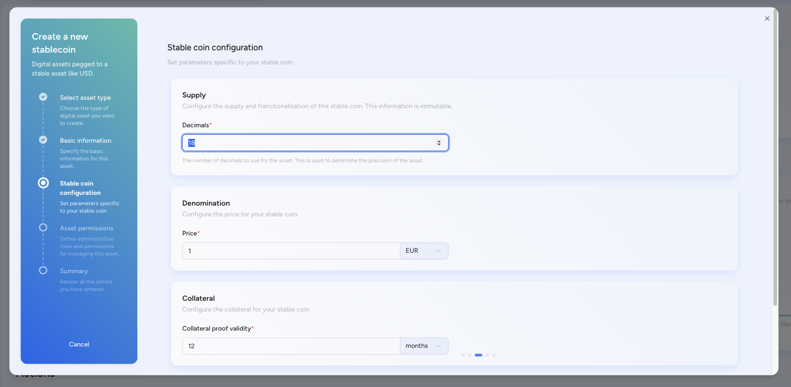
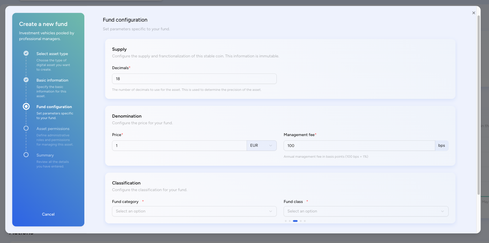

## SettleMint asset designer

The Asset Designer is purpose-built to streamline the creation, issuance, and
lifecycle management of regulated, on-chain financial instruments. Designed for
use by financial institutions, governments, fintech companies, and asset
managers, it provides an intuitive web-based interface that abstracts blockchain
infrastructure and smart contract logic, allowing users to focus on financial
structuring, regulatory compliance, and business execution.

The platform supports tokenization across five key asset classes, bonds,
stablecoins, investment funds, equities, and cryptocurrencies, each with
tailored configuration workflows aligned to their economic models and legal
requirements. Through a modular, guided process, users define asset metadata,
supply models, pricing mechanisms, backing logic, and governance rules. Tokens
issued through the Asset Designer are fully compatible with Ethereum token
standards.

Tokenized bonds

The bond module enables digital issuance of debt instruments such as corporate,
sovereign, or municipal bonds. Tokenized bonds retain core traditional
attributes, face value, coupon structure, maturity date, ISIN, and issuance cap,
while embedding programmable rules around interest payments, redemption
conditions, and transferability.

The interface allows users to define symbol, ISIN, maximum supply, and link the
bond to an underlying reserve or collateral (e.g., real estate, cash). These
blockchain-based bonds are interoperable with DeFi protocols, support automated
coupon disbursements, and can be fractionalized to expand market access. Issuers
benefit from real-time visibility, shortened settlement cycles, and improved
auditability.

### Stablecoins

The stablecoin module facilitates the issuance of price-stable digital
currencies pegged to fiat currencies like USD or EUR. Users configure token
name, symbol, decimal precision, peg currency, and collateral verification
interval, determining how often proof-of-reserve updates must occur.

The platform supports a variety of backing models, including fiat reserves,
algorithmic mechanisms, and on-chain collateralization. Stablecoins created via
the Asset Designer can integrate with proof-of-reserve systems or off-chain
oracles, enabling compliance with regulatory reporting standards. These tokens
enable low-volatility payments, programmable finance, and cross-border
settlements, bridging traditional finance with digital ecosystems.

### Tokenized funds

The fund tokenization module allows asset managers to issue programmable tokens
representing units or shares in collective investment schemes, such as hedge
funds, venture capital funds, or hybrid strategies.

Users define fund category (e.g., Commodity, Event-Driven, Fixed Income
Arbitrage) and fund class (e.g., Absolute Return, Income-Focused, Small-Cap),
configure management fees (in basis points), and set token pricing logic aligned
with traditional NAV calculation. Smart contracts automate redemptions, lock-up
enforcement, and performance fees, while enabling faster onboarding, enhanced
transparency, and optional secondary liquidity for LP units.

### Tokenized equities

SettleMint’s equity tokenization module enables companies to digitize capital
ownership through blockchain-based programmable shares. Users configure equity
class (Common, Preferred, Private Equity) and category (ESOP Shares, Convertible
Stock, Sector-Based Equity), define denomination parameters, and embed rights
such as dividends, voting power, or liquidation preferences.

These tokens serve as legally-aligned digital counterparts to traditional
securities, making them suitable for private placements, employee stock plans,
early-stage funding, or regulated market participation. Real-time cap table
updates, vesting schedules, and compliance integrations help streamline
governance, enhance transparency, and broaden shareholder engagement.

## Cryptocurrencies 

 The
cryptocurrency creation module supports issuance of native digital tokens for
projects building decentralized applications, platforms, or token economies.
Users define token name, symbol, decimals, initial supply, and reference price
unit. These tokens can power governance, staking, utility access, or economic
incentives within digital ecosystems.

SettleMint supports both fixed-supply and dynamic supply models, with optional
smart contract features such as inflation control, burn logic, and vesting
schedules. All tokens are compliant and designed for seamless integration with
wallets, exchanges, DeFi protocols, and DAO frameworks.
