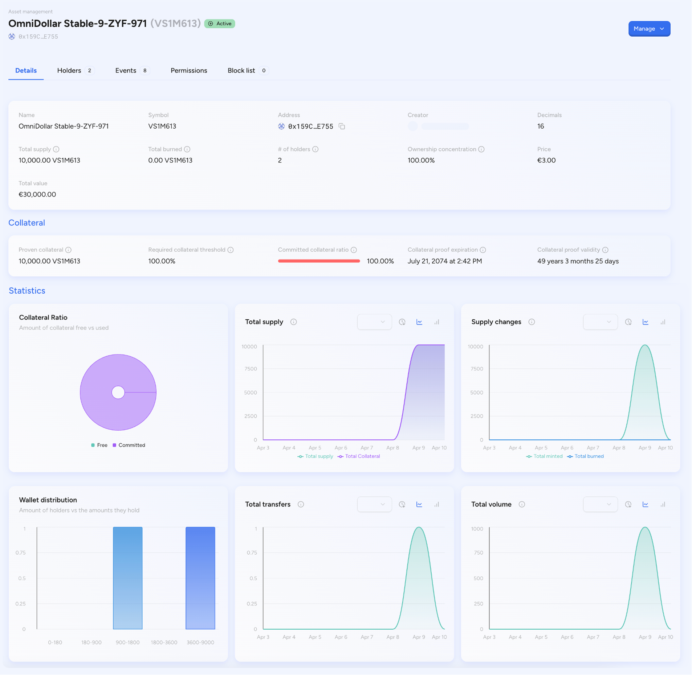

## SettleMint asset manager

Once assets are created using the Asset Designer module, they are listed and
made available in the Asset Management section. This module allows users to
manage, monitor, and operate digital assets across multiple categories such as
bonds, cryptocurrencies, equities, funds, stablecoins, and deposits. The
following sections describe the Asset Management interface and all available
options in detail.

## Asset manager

Asset Manager serves as the operational control center for managing the
lifecycle of digital assets issued on the SettleMint platform. It forms an
integral part of the Issuer Portal and provides a suite of tools and insights
that empower users with administrative roles—such as platform admins or asset
managers—to handle every aspect of asset governance.

### Available asset classes

- **Stablecoins**: These are digital tokens typically backed by fiat currency or
  crypto assets. They are collateralized and pegged to maintain price stability.
- **Bonds**: Represent tokenized debt instruments issued by corporate or
  government entities. Their lifecycle may include maturity dates, interest
  distributions, and other traditional bond mechanics.
- **Funds**: These tokens represent pooled investments or mutual fund-like
  structures. Investors can hold shares proportional to the fund's net asset
  value (NAV).
- **Equities**: Tokenized shares representing ownership in a private or public
  company.
- **Cryptocurrencies**: Either native assets (created directly on-chain) or
  wrapped versions of external assets.
- **Deposits**: Represent stored value, vouchers, or fiat-collateralized digital
  tokens often used in regulated financial settings.

Each asset type can contain multiple instances. For example, under
"Stablecoins," you might find entries such as "OmniDollar" or "SigmaDollar,"
each with its own symbol and contract address. Clicking on a specific asset
entry opens its management dashboard.

## The asset dashboard: a centralized view

Each asset has its own Asset Overview Page, which is where detailed data and
actionable controls are presented. This view is separated into tabs, each
focusing on a specific operational or analytical aspect. These tabs include:

1. Details
2. Collateral
3. Statistics
4. Holders
5. Events
6. Permissions
7. Block List

### 1. Details tab: asset identity and metrics

This section gives the user a comprehensive view of the asset's fundamental
details and performance indicators. The following fields are visible:

- **Name and Symbol**: Identifies the asset using the custom branding and ticker
  symbol defined at creation.
- **Smart Contract Address**: This is the Ethereum-compatible address where the
  asset is deployed. It serves as the point of interaction for any
  blockchain-related queries.
- **Creator**: Displays the wallet or user who initiated asset creation.
- **Decimals**: Defines the number of decimal places the token supports. For
  example, a value of 16 means that the token can be divided to 10^-16 parts.
- **Total Supply**: Total number of tokens that have been minted and are in
  circulation.
- **Total Burned**: Tokens that have been permanently destroyed or removed from
  circulation.
- **Number of Holders**: Unique wallet addresses currently holding the token.
- **Ownership Concentration**: Reflects the percentage of total supply held by
  the top wallet. A 100% concentration means all tokens are held by a single
  address.
- **Unit Price**: The price of one token, often set during asset creation.
- **Total Value**: This is calculated as Total Supply \* Unit Price.

This section enables users to perform a quick but comprehensive review of the
asset's current state.

### 2. Collateral section: ensuring backing integrity

For assets that require collateral—typically stablecoins or deposits—this
section provides detailed visibility into collateral compliance.

- **Proven Collateral**: The actual amount of collateral that has been locked
  and validated.
- **Required Collateral Threshold**: The minimum collateralization ratio
  mandated (usually 100%).
- **Committed Collateral Ratio**: Shows the ratio between committed collateral
  and total asset value. If this dips below 100%, the system may trigger alerts
  or restrictions.
- **Collateral Proof Expiration**: A timestamp after which the current
  collateral proof is considered expired.
- **Collateral Proof Validity**: Indicates how long the current proof remains
  valid.

These data points are critical for regulatory compliance and to maintain user
trust, especially in financial or governmental use cases.

### 3. Statistics section: operational intelligence

The statistics section of the Asset Manager provides visual dashboards that
allow users to analyze the historical and real-time performance of the asset:

- **Collateral Ratio**: A pie chart showing what percentage of collateral is
  free vs. committed.
- **Total Supply**: A time-based chart showing changes in circulating supply.
- **Supply Changes**: Shows mint and burn actions over time.
- **Wallet Distribution**: Displays a bar chart showing how many tokens are held
  across different wallet size brackets.
- **Total Transfers**: Tracks the number of token transfers over time.
- **Total Volume**: Cumulative transaction volume in fiat value.

These visuals are useful for internal reporting, risk assessment, and investor
communications.

### 4. Holders tab: know your token holders

The holders tab lists all wallet addresses that currently hold the token. It
presents the following information:

- **Wallet Address and Label**
- **Token Balance and Value**
- **Wallet Type** (e.g., Regular, Admin, Frozen)
- **Frozen Balance**: If part of the wallet's balance is currently frozen.
- **Status**: Whether the wallet is active or has been restricted.
- **Last Activity**: Timestamp of the most recent interaction with the asset.

This feature helps track concentration risk, compliance exposure, and user
engagement.

### 5. Events tab: auditable history of actions

This tab logs every major operation performed on the asset:

- **Event Timestamp**
- **Event Type** (Mint, Transfer, Create, Collateral Update, etc.)
- **Initiator**: Wallet address or user that performed the action
- **Asset Involved**
- **Details**: Deep link to the event's full metadata

The Events tab is essential for compliance auditing and helps organizations
maintain a verifiable trail of all token-related actions.

### 6. Permissions tab: role-based access control

This section shows all users and wallets with specific roles associated with
asset management. The platform supports granular access levels:

- **Admin**: Full rights including contract pause, role management, and supply
  control
- **Supply Manager**: Can mint or burn tokens
- **User Manager**: Can assign and manage user roles
- **Auditor**: Can only view asset data, but cannot make changes

Each role is attached to a wallet address, and a single wallet can hold multiple
roles.

### 7. Block list tab: managing restricted access

The block list contains addresses that are forbidden from holding or interacting
with the asset. This may be used for:

- Regulatory sanctions
- Suspicious activity prevention
- Operational policy enforcement

Blocked wallets cannot transfer, receive, or interact with the asset. Admins can
add or remove wallets from the block list using the Manage dropdown.

## Manage actions menu

Each asset page includes a Manage button at the top-right. Clicking this opens a
dropdown list of actionable controls:

- **Mint**: Add new supply to circulation.
- **Update Collateral**: Adjust or reaffirm backing.
- **Pause Contract**: Temporarily suspend activity.
- **Add Asset Admin**: Delegate control to another wallet.
- **Block/Unblock User**: Modify access status of specific wallets.
- **View Events**: Jump directly to the events tab for inspection.

These controls ensure that platform users can respond quickly to operational
needs while maintaining control and auditability.
