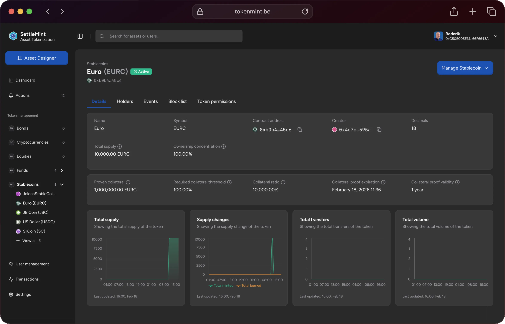

import { Tabs, Tab } from "fumadocs-ui/components/tabs";
import { Callout } from "fumadocs-ui/components/callout";
import { Steps } from "fumadocs-ui/components/steps";
import { Card } from "fumadocs-ui/components/card";

The **SettleMint Asset Tokenization Kit** is a complete development toolkit and reference application for launching digital asset platforms quickly and securely. It eliminates the usual complexity of building from scratch by offering a pre-integrated stack of smart contracts, backend services, and a web-based user interface. Whether issuing stablecoins, tokenized securities, or loyalty points, the kit equips developers with all the core components needed to move from idea to prototype in days.

## Core Components

The kit’s foundation lies in **battle-tested smart contract templates** that follow standards like ERC-20. These templates are extensible and suitable for multiple asset classes:

- Stablecoins and fiat-backed tokens  
- Tokenized bonds and securities  
- Loyalty points or reward systems  
- Real-world asset representations (e.g., real estate, IP)

In addition to the contract layer, a **fully functional dApp UI** is bundled with the kit. This includes both an admin console and user portal, designed to support common workflows from day one:

- Define and configure new tokenized assets using the **Asset Designer**  
- Issue, transfer, and monitor digital assets  
- Manage users through wallet creation, KYC approvals, access control, and blacklisting

Because the backend and frontend layers are already wired together, teams can focus on business logic and design without investing months in integration efforts.

---

## Compliance and Security

Compliance is not an add-on but an embedded principle in the kit’s architecture. It is built to align with enterprise-grade regulatory expectations, supporting both internal governance and external obligations.

The kit includes:

- **Whitelisted address logic** to restrict transfers to approved participants  
- **Transaction limits** configurable per asset or user category  
- **Audit logs** to track all key operations on-chain and off-chain  
- **Role-based access control** to separate admin and user capabilities  
- **KYC/AML workflows** that integrate identity checks into the onboarding process

It also supports alignment with evolving regulations such as **Europe’s MiCA**, reducing the effort for institutions to stay compliant over time.

---

## Operational Monitoring

Institutions need visibility into their asset operations, and the kit offers this out of the box.

The **analytics module** provides:

- Real-time dashboards of asset supply, ownership distribution, and transaction history  
- Visual breakdowns of token activity for operational and compliance teams  
- Exportable data views for reporting, audits, or internal governance

This monitoring framework helps organizations maintain transparency and enforce accountability across tokenized programs.

---

## Developer Enablement

Developers are not left to glue components together manually. The Asset Tokenization Kit ensures all layers work in harmony and offers powerful tools to accelerate custom development.

### Integrated Tools
- **SettleMint SDK and CLI** to scaffold, manage, and deploy projects  
- **Web-based IDE** for instant cloud development  
- **Local dev compatibility** with Git access for use with any code editor

### Pre-Built Blockchain Integrations
- **IPFS** for decentralized document and metadata storage  
- **The Graph** for indexing on-chain data  
- **Hasura** for GraphQL API access to blockchain data

### External Connectivity
- REST and GraphQL APIs to connect with CRMs, core banking systems, and reporting platforms  
- Hooks and webhooks to automate workflows or trigger third-party actions

This results in a developer experience where the focus is on building business-specific logic, not plumbing infrastructure.

---

## Deployment and Automation

Launching environments with the kit is straightforward and scalable. Most setup steps are automated and repeatable across development, testing, and production.

- **One-click deployment** available via SettleMint’s managed infrastructure  
- **CLI-based deployment** for more control or private cloud hosting  
- **Environment presets** for Dev, Test, and Prod configurations  
- Integration with standard **CI/CD pipelines** to support enterprise release cycles

With minimal DevOps overhead, organizations will maintain faster iteration cycles and lower deployment risk.

---

## Speed and Efficiency Gains

Adopting the kit significantly reduces project timelines and developer workload. Organizations will benefit from:

- **4x faster smart contract development** using pre-audited templates  
- **8x faster front-end development** thanks to pre-built dApp interfaces  
- **Launch time in days**, not months, for MVPs or pilot rollouts  
- A **modular codebase** that enables easy customization without rework

Development teams no longer need to reinvent the wheel, and product teams can validate ideas quickly with real users.

---

## Customization and Extensibility

Unlike rigid SaaS platforms, the kit offers complete flexibility. Every component is open and editable:

- Modify or extend smart contracts for unique financial instruments  
- Customize the UI for branding, UX, or business-specific workflows  
- Add new integrations, APIs, or on-chain data sources as required  
- Build new features or compliance rules without breaking the architecture

This extensibility ensures that the kit remains relevant as use cases evolve, making it suitable for both pilots and scaled production environments.

---

## Ideal Use Cases

The Asset Tokenization Kit is well-suited for:

- **Banks and financial institutions** creating programmable money or tokenized debt  
- **Fintech startups** building platforms for fractional ownership, stablecoins, or tokenized securities  
- **Corporates** issuing loyalty tokens or digitizing internal assets like carbon credits  
- **Governments and regulators** running sandbox projects for CBDCs or digital bonds

Its flexibility and compliance-focused design allow it to operate in diverse industry contexts with minimal configuration.

---

## Getting Started

To begin using the kit:

1. **Clone the source code** from SettleMint's Git repository  
2. **Install the SDK and CLI** to scaffold a new project  
3. **Launch the Web IDE** or integrate into your local development environment  
4. **Review documentation and API references** to begin customizing the application

Comprehensive guides, code samples, and pre-configured environments are available to reduce onboarding time for development teams.

---

## Ongoing Support and Roadmap

- The kit is **actively maintained** and updated to meet new technical and regulatory requirements  
- **Support channels** are available for both developer troubleshooting and enterprise onboarding  

---
