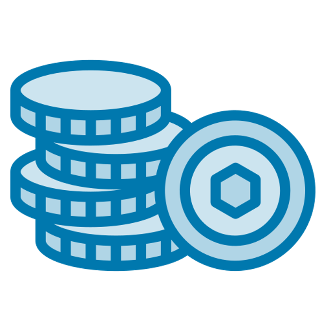
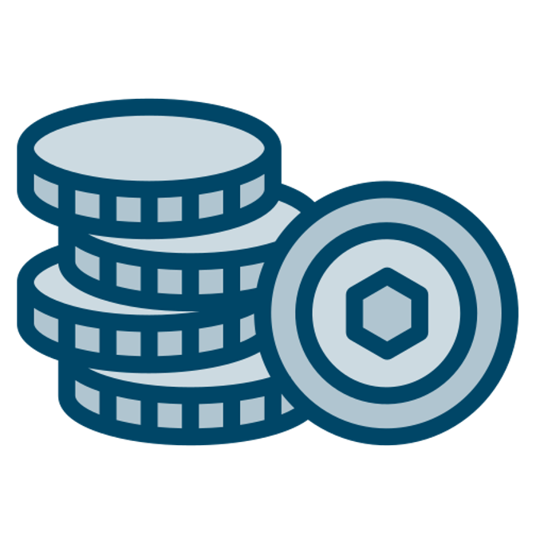
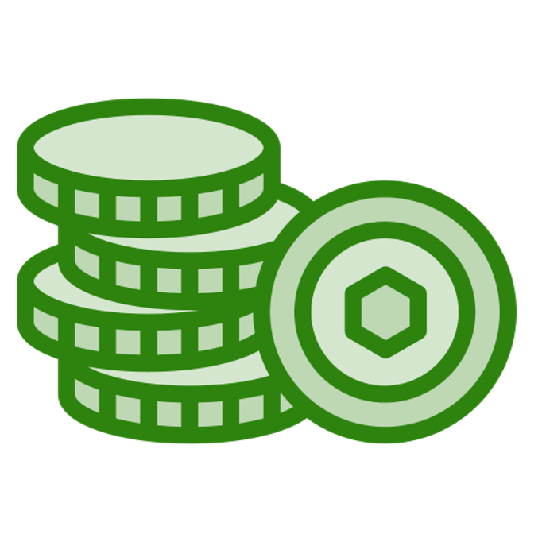
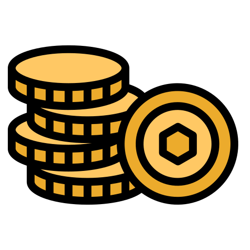

import { Tabs, Tab } from "fumadocs-ui/components/tabs";
import { Callout } from "fumadocs-ui/components/callout";
import { Steps } from "fumadocs-ui/components/steps";
import { Card, Cards } from "fumadocs-ui/components/card";
import { Accordion, Accordions } from "fumadocs-ui/components/accordion";

## What is the SettleMint Asset Tokenization Kit?

<Callout>
**For financial institutions and enterprises digitizing assets:** The SettleMint Asset Tokenization Kit is a production-ready development platform that solves the complex challenge of building digital asset infrastructure. This comprehensive toolkit enables banks, financial institutions, and enterprises to launch tokenization platforms in 2-4 weeks instead of 12-18 months.
</Callout>


## Who uses the Asset Tokenization Kit?

### Primary Users
- **Banks and Financial Institutions** issuing digital bonds, tokenized deposits, and CBDCs
- **Asset Managers** creating tokenized funds and investment vehicles
- **Real Estate Companies** enabling fractional property ownership
- **Corporate Treasuries** launching stablecoins and loyalty programs
- **Government Agencies** piloting digital currencies and securities

### Problems We Solve
- **18-month development cycles** reduced to 4 weeks
- **$2-5M development costs** cut by 70%
- **Regulatory compliance complexity** with built-in MiCA, securities law compliance
- **Technical expertise shortage** with low-code/no-code tools
- **Integration challenges** with pre-built banking and ERP connectors

## What can you tokenize?

### 1. Bonds - Digital Debt Instruments


**Who uses it:** Investment banks, governments, corporations
- **Traditional bonds digitized:** Corporate bonds, government securities, municipal bonds
- **Key features:** Automated coupon payments, maturity management, yield scheduling
- **Compliance:** Built-in regulatory controls, investor restrictions, audit trails
- **Success story:** European bank tokenized €500M in bonds, reducing issuance costs by 85%

**Technical capabilities:**
- Fixed and floating rate support
- Programmable redemption logic
- On-chain interest calculations
- Multi-currency settlements

### 2. Stablecoins - Digital Fiat Currencies


**Who uses it:** Banks, payment providers, fintech companies
- **Use cases:** Cross-border payments, CBDC pilots, tokenized deposits
- **Backing models:** Fiat reserves, asset-backed, algorithmic
- **Compliance:** KYC/AML integration, transaction monitoring, freeze capabilities
- **Performance:** 10,000+ TPS on Layer 2, sub-second settlements

**Key features:**
- Real-time collateral tracking
- Proof-of-reserve integration
- Multi-jurisdiction compliance
- Programmable monetary policy

### 3. Tokenized Funds - Digital Investment Vehicles


**Who uses it:** Asset managers, hedge funds, private equity
- **Fund types:** Mutual funds, hedge funds, ETFs, venture capital
- **Automation:** NAV calculations, performance fees, redemptions
- **Investor benefits:** 24/7 liquidity, fractional shares, instant settlement
- **Cost savings:** 60% reduction in fund administration costs

**Management features:**
- Dynamic portfolio rebalancing
- Automated fee distribution
- Real-time NAV updates
- Investor access controls

### 4. Digital Equities - Tokenized Ownership


**Who uses it:** Startups, private companies, stock exchanges
- **Applications:** Cap table management, ESOPs, private placements
- **Rights management:** Voting, dividends, liquidation preferences
- **Compliance:** Transfer restrictions, vesting schedules, accredited investor checks
- **Integration:** Corporate governance platforms, shareholder portals

**Advanced features:**
- On-chain voting mechanisms
- Automated dividend distribution
- Vesting schedule enforcement
- Multi-class share support

### 5. Cryptocurrencies - Utility and Governance Tokens


**Who uses it:** DeFi protocols, gaming platforms, loyalty programs
- **Token models:** Fixed supply, inflationary, deflationary
- **Use cases:** Platform currencies, governance tokens, reward points
- **Distribution:** Airdrops, mining, staking rewards
- **Ecosystem:** DEX integration, wallet support, analytics

### 6. Deposit Tokens - Institutional Digital Assets


**Who uses it:** Central banks, commercial banks, financial infrastructure
- **Applications:** Interbank settlements, CBDC pilots, wholesale deposits
- **Controls:** Account permissioning, transaction limits, programmable restrictions
- **Integration:** Core banking systems, payment rails, clearing houses
- **Compliance:** Basel III, regulatory reporting, AML monitoring

## Core platform components

<Tabs defaultValue="architecture">
  <Tab value="architecture" label="Smart Contract Architecture">
    - **Battle-tested templates:** Audited by leading security firms
    - **Gas optimization:** 40% lower transaction costs than custom contracts
    - **Modular design:** Plug-and-play components for rapid customization
    - **Standards compliance:** ERC-20, ERC-721, ERC-1155 compatible
  </Tab>
  
  <Tab value="dashboard" label="Administrative Dashboard">
    - **Asset Designer:** Visual tool for creating new token types without coding
    - **User Management:** KYC/AML workflows, role-based access, bulk operations
    - **Analytics Suite:** Real-time metrics, compliance reports, audit logs
    - **Configuration Center:** Business rules, compliance settings, integration management
  </Tab>
  
  <Tab value="developer" label="Developer Tools">
    - **SettleMint SDK:** TypeScript/JavaScript libraries for custom development
    - **REST & GraphQL APIs:** Complete programmatic access to all features
    - **Webhook System:** Real-time event notifications for external systems
    - **Testing Framework:** Automated testing, sandbox environments
  </Tab>
  
  <Tab value="infrastructure" label="Infrastructure">
    - **Multi-chain support:** Ethereum, Polygon, Hyperledger Besu, Quorum
    - **Scalability:** Handles millions of users and billions in volume
    - **High availability:** 99.9% uptime SLA, disaster recovery
    - **Security:** SOC 2 compliant, penetration tested, encrypted storage
  </Tab>
</Tabs>

## How does it reduce development time?

### Traditional Development (12-18 months)
1. **Months 1-3:** Requirements gathering and architecture design
2. **Months 4-6:** Smart contract development from scratch
3. **Months 7-9:** Frontend and backend development
4. **Months 10-11:** Integration and testing
5. **Months 12-14:** Security audits and compliance
6. **Months 15-18:** Production deployment and stabilization

### With Asset Tokenization Kit (2-4 weeks)
1. **Week 1:** Configure token types and compliance rules
2. **Week 2:** Customize UI and integrate with existing systems
3. **Week 3:** Test with real users and refine workflows
4. **Week 4:** Deploy to production with monitoring

## Real implementation examples

### Case Study 1: European Investment Bank
- **Challenge:** Digitize €1B bond issuance program
- **Solution:** Deployed bond tokenization platform in 6 weeks
- **Results:**
  - 85% reduction in issuance costs
  - Settlement time: T+2 days to instant
  - Investor base expanded by 300%
  - Full regulatory compliance maintained

### Case Study 2: Asian Central Bank
- **Challenge:** Pilot wholesale CBDC for interbank settlements
- **Solution:** Launched deposit token platform for 20 banks
- **Results:**
  - $10B in daily settlement volume
  - 99.99% transaction success rate
  - Real-time regulatory reporting
  - Cross-border payments enabled

### Case Study 3: US Real Estate Fund
- **Challenge:** Enable fractional ownership of commercial properties
- **Solution:** Tokenized $500M property portfolio
- **Results:**
  - Minimum investment reduced from $1M to $1,000
  - 10,000+ new investors onboarded
  - Secondary market liquidity created
  - Automated rent distribution

## Compliance and regulatory features

### Built-in Compliance Frameworks
- **MiCA (EU):** Markets in Crypto-Assets regulation compliance
- **Securities Laws:** US SEC, EU prospectus regulations
- **Banking Regulations:** Basel III, PSD2, open banking
- **Data Protection:** GDPR, CCPA compliance tools

### Key Compliance Features
- **Identity Management:** KYC/AML provider integration (Jumio, Onfido, Sumsub)
- **Transaction Monitoring:** Real-time screening, suspicious activity reports
- **Investor Restrictions:** Accreditation checks, geographic limitations
- **Regulatory Reporting:** Automated report generation for authorities

## Technical integration capabilities

### Banking System Integration
- **Core Banking:** Temenos, Finastra, FIS, Jack Henry
- **Payment Rails:** SWIFT, SEPA, ACH, card networks
- **Treasury Systems:** SAP Treasury, Kyriba, ION
- **Risk Management:** Murex, Calypso, Bloomberg

### Enterprise Integration
- **ERP Systems:** SAP, Oracle, Microsoft Dynamics
- **Identity Providers:** Active Directory, Okta, Auth0
- **Document Management:** SharePoint, DocuSign
- **Analytics:** Tableau, Power BI, Looker

### Blockchain Integration
- **Wallets:** MetaMask, WalletConnect, Ledger, Trezor
- **DeFi Protocols:** Uniswap, Aave, Compound
- **Oracles:** Chainlink, Band Protocol
- **Storage:** IPFS, Arweave, Filecoin

## Getting started

### Quick Start Guide
<Steps>
1. **Access the Kit**
   ```bash
   git clone https://github.com/settlemint/asset-tokenization-kit
   cd asset-tokenization-kit
   ```

2. **Configure Environment**
   ```bash
   cp .env.example .env
   # Edit .env with your settings
   ```

3. **Launch Development Environment**
   ```bash
   docker-compose up -d
   # Access at http://localhost:3000
   ```

4. **Deploy Your First Token**
   - Open Asset Designer
   - Select token type (bond, stablecoin, etc.)
   - Configure parameters
   - Deploy to testnet

5. **Go to Production**
   - Complete security review
   - Configure production blockchain
   - Deploy with monitoring
</Steps>

### Resources and Support
- **Documentation:** Comprehensive guides at [docs.settlemint.com](https://docs.settlemint.com)
- **GitHub Repository:** [github.com/settlemint/asset-tokenization-kit](https://github.com/settlemint/asset-tokenization-kit)
- **Developer Support:** 24/7 technical assistance
- **Training:** Free workshops every Tuesday
- **Community:** 5,000+ developers in Discord

## Frequently asked questions

<Accordions>
  <Accordion title="What blockchain development experience do I need?">
    None required. The kit includes visual tools and comprehensive documentation. Basic web development knowledge helps for customization.
  </Accordion>
  
  <Accordion title="How much does it cost to run a tokenization platform?">
    Infrastructure costs start at $5,000/month for small deployments. Enterprise deployments with high availability average $25,000/month.
  </Accordion>
  
  <Accordion title="Can I migrate existing assets to the platform?">
    Yes, we provide migration tools and professional services for digitizing existing securities, funds, and other assets.
  </Accordion>
  
  <Accordion title="Is the platform compliant with my jurisdiction?">
    The kit includes compliance frameworks for US, EU, UK, Singapore, and Japan. Custom compliance modules available for other jurisdictions.
  </Accordion>
  
  <Accordion title="How long does a typical implementation take?">
    - Proof of Concept: 1 week
    - Pilot with real assets: 2-4 weeks  
    - Full production deployment: 6-8 weeks
    - Enterprise integration: 8-12 weeks
  </Accordion>
  
  <Accordion title="What ongoing maintenance is required?">
    Minimal. Automatic updates for security patches. Smart contracts are immutable once deployed. Operations team typically 2-3 people.
  </Accordion>
</Accordions>

## Next steps

Ready to launch your tokenization platform?

1. [Explore the Asset Designer →](/application-kits/asset-tokenization/asset-designer)
2. [Review API Documentation →](/application-kits/asset-tokenization/api-portal)
3. [Schedule a Demo](https://settlemint.com/demo)
4. [Join Developer Workshop](https://settlemint.com/workshops)