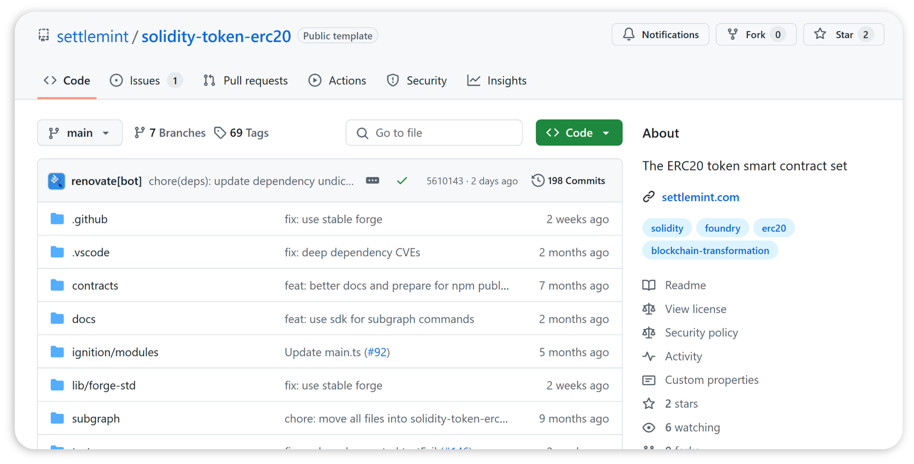

import { Tabs, Tab } from "fumadocs-ui/components/tabs";
import { Callout } from "fumadocs-ui/components/callout";
import { Steps } from "fumadocs-ui/components/steps";
import { Card } from "fumadocs-ui/components/card";

The **SettleMint Asset Tokenization Kit** is a complete development toolkit and
reference application for launching digital asset platforms quickly and
securely. It eliminates the usual complexity of building from scratch by
offering a pre-integrated stack of smart contracts, backend services, and a
web-based user interface. Whether issuing stablecoins, tokenized securities, or
loyalty points, the kit equips developers with all the core components needed to
move from idea to prototype in days.

## Core components

The kit’s foundation lies in **battle-tested smart contract templates** that
follow standards like ERC-20. These templates are extensible and suitable for
multiple asset classes:

- Stablecoins and fiat-backed tokens
- Tokenized bonds and securities
- Loyalty points or reward systems
- Real-world asset representations (e.g., real estate, IP)

In addition to the contract layer, a **fully functional dApp UI** is bundled
with the kit. This includes both an admin console and user portal, designed to
support common workflows from day one:

- Define and configure new tokenized assets using the **Asset Designer**
- Issue, transfer, and monitor digital assets
- Manage users through wallet creation, KYC approvals, access control, and
  blacklisting

Because the backend and frontend layers are already wired together, teams can
focus on business logic and design without investing months in integration
efforts.

---

## Supported Token Classes

---

### Bond

<table>
  <tbody>
    <tr>
      <td style={{width: "30%"}}>

      

      </td>
      <td style={{width: "70%"}}>

      Bond tokens represent debt instruments issued on-chain, offering fixed or floating returns over a predefined maturity period. These can be structured to support traditional coupon-bearing bonds, zero-coupon notes, or tokenized commercial papers. Bonds enable capital raising with regulatory-grade access control and transparency for both issuers and investors.

      </td>
    </tr>
  </tbody>
</table>

<table>
  <tbody>
    <tr>
      <td style={{width: "50%"}}>

      **Key Features**

      - Maturity schedules and yield configuration.
      - Support for redemption, top-up, and withdrawal.
      - Role-based access control and user-level restrictions.

      </td>
      <td style={{width: "50%"}}>

      **Example Use Cases**

      - Tokenized corporate bonds or government securities.
      - Real estate-backed debt issuance.
      - Treasury bond digitization for regulated investors.

      </td>
    </tr>
  </tbody>
</table>

---

### Equity

<table>
  <tbody>
    <tr>
      <td style={{width: "30%"}}>

      

      </td>
      <td style={{width: "70%"}}>

      Equity tokens represent ownership in a company or asset, digitally mirroring shares or voting rights. These tokens can be embedded with compliance logic such as lock-in periods, vesting, or shareholder rights, making them suitable for fundraising, ESOPs, and investor governance in both private and public markets.

      </td>
    </tr>
  </tbody>
</table>

<table>
  <tbody>
    <tr>
      <td style={{width: "50%"}}>

      **Key Features**

      - Ownership tracking and transfer controls.
      - Role-based minting, burning, and blocking of accounts.
      - Smart contract hooks for voting or governance modules.

      </td>
      <td style={{width: "50%"}}>

      **Example Use Cases**

      - Startup equity or cap table management.
      - Private equity fund tokenization.
      - Real-world asset fractional ownership.

      </td>
    </tr>
  </tbody>
</table>

---

### Fund

<table>
  <tbody>
    <tr>
      <td style={{width: "30%"}}>

      

      </td>
      <td style={{width: "70%"}}>

      Fund tokens allow the creation and management of pooled investment vehicles where token holders share profits and risks. These tokens can support minting, redemption, NAV tracking, and enforce access controls as per fund structures like mutual funds, hedge funds, or DAOs managing diversified assets.

      </td>
    </tr>
  </tbody>
</table>

<table>
  <tbody>
    <tr>
      <td style={{width: "50%"}}>

      **Key Features**

      - NAV-based token minting and withdrawal.
      - User access restrictions and investor limits.
      - Full transferability and burn logic.

      </td>
      <td style={{width: "50%"}}>

      **Example Use Cases**

      - Tokenized mutual or hedge funds.
      - Venture capital DAOs.
      - ESG or green finance investment vehicles.

      </td>
    </tr>
  </tbody>
</table>

---

### Stablecoin

<table>
  <tbody>
    <tr>
      <td style={{width: "30%"}}>

      

      </td>
      <td style={{width: "70%"}}>

      Stablecoins are blockchain-based representations of fiat currencies or other stable assets. These tokens aim to minimize volatility and serve as mediums of exchange or units of account within digital ecosystems. The framework supports collateral management, freezing, and pausing mechanisms for regulatory compliance and risk control.

      </td>
    </tr>
  </tbody>
</table>

<table>
  <tbody>
    <tr>
      <td style={{width: "50%"}}>

      **Key Features**

      - Collateral tracking and updates.
      - Freezing and pausing of accounts and contracts.
      - On-chain minting, burning, and withdrawal mechanisms.

      </td>
      <td style={{width: "50%"}}>

      **Example Use Cases**

      - Bank-issued tokenized fiat currencies.
      - Stable medium of exchange in DeFi protocols.
      - Asset-backed token for remittance or settlement.

      </td>
    </tr>
  </tbody>
</table>

---

### Cryptocurrency

<table>
  <tbody>
    <tr>
      <td style={{width: "30%"}}>

      

      </td>
      <td style={{width: "70%"}}>

      Cryptocurrency tokens are fungible digital currencies that can be freely minted, transferred, or withdrawn. They may represent utility, governance, or native currencies of ecosystems, and the tokenization framework supports full lifecycle management with standard access control features for centralized issuance models.

      </td>
    </tr>
  </tbody>
</table>

<table>
  <tbody>
    <tr>
      <td style={{width: "50%"}}>

      **Key Features**

      - Mintable, burnable, and transferable.
      - Role-based issuance and withdrawal.
      - Compatible with EVM wallets and DEXs.

      </td>
      <td style={{width: "50%"}}>

      **Example Use Cases**

      - In-app or platform utility tokens.
      - Centralized exchange-listed assets.
      - Loyalty and rewards token programs.

      </td>
    </tr>
  </tbody>
</table>

---

### Deposit

<table>
  <tbody>
    <tr>
      <td style={{width: "30%"}}>

      

      </td>
      <td style={{width: "70%"}}>

      Deposit tokens represent tokenized claims against reserved assets, often used in custodial or institutional settings. These tokens allow fine-grained access control and account-level permissioning, suitable for asset-backed financing, digital guarantees, and central bank-backed pilot systems.

      </td>
    </tr>
  </tbody>
</table>

<table>
  <tbody>
    <tr>
      <td style={{width: "50%"}}>

      **Key Features**

      - Freeze, pause, allow/disallow user functions.
      - Collateral-based minting and burning.
      - On-chain controls for regulated issuance.

      </td>
      <td style={{width: "50%"}}>

      **Example Use Cases**

      - CBDC sandbox or pilot programs.
      - Regulated commercial bank deposits.
      - Asset-backed loan tokenization platforms.

      </td>
    </tr>
  </tbody>
</table>

## Compliance and security

Compliance is not an add-on but an embedded principle in the kit’s architecture.
It is built to align with enterprise-grade regulatory expectations, supporting
both internal governance and external obligations.

The kit includes:

- **Whitelisted address logic** to restrict transfers to approved participants
- **Transaction limits** configurable per asset or user category
- **Audit logs** to track all key operations on-chain and off-chain
- **Role-based access control** to separate admin and user capabilities
- **KYC/AML workflows** that integrate identity checks into the onboarding
  process

It also supports alignment with evolving regulations such as **Europe’s MiCA**,
reducing the effort for institutions to stay compliant over time.

---

## Operational monitoring

Institutions need visibility into their asset operations, and the kit offers
this out of the box.

The **analytics module** provides:

- Real-time dashboards of asset supply, ownership distribution, and transaction
  history
- Visual breakdowns of token activity for operational and compliance teams
- Exportable data views for reporting, audits, or internal governance

This monitoring framework helps organizations maintain transparency and enforce
accountability across tokenized programs.

---

## Developer enablement

Developers are not left to glue components together manually. The Asset
Tokenization Kit ensures all layers work in harmony and offers powerful tools to
accelerate custom development.

### Integrated tools

- **SettleMint SDK and CLI** to scaffold, manage, and deploy projects
- **Web-based IDE** for instant cloud development
- **Local dev compatibility** with Git access for use with any code editor

### Pre-built blockchain integrations

- **IPFS** for decentralized document and metadata storage
- **The Graph** for indexing on-chain data
- **Hasura** for GraphQL API access to blockchain data

### External connectivity

- REST and GraphQL APIs to connect with CRMs, core banking systems, and
  reporting platforms
- Hooks and webhooks to automate workflows or trigger third-party actions

This results in a developer experience where the focus is on building
business-specific logic, not plumbing infrastructure.

---

## Deployment and automation

Launching environments with the kit is straightforward and scalable. Most setup
steps are automated and repeatable across development, testing, and production.

- **One-click deployment** available via SettleMint’s managed infrastructure
- **CLI-based deployment** for more control or private cloud hosting
- **Environment presets** for Dev, Test, and Prod configurations
- Integration with standard **CI/CD pipelines** to support enterprise release
  cycles

With minimal DevOps overhead, organizations will maintain faster iteration
cycles and lower deployment risk.

---

## Speed and efficiency gains

Adopting the kit significantly reduces project timelines and developer workload.
Organizations will benefit from:

- **4x faster smart contract development** using pre-audited templates
- **8x faster front-end development** thanks to pre-built dApp interfaces
- **Launch time in days**, not months, for MVPs or pilot rollouts
- A **modular codebase** that enables easy customization without rework

Development teams no longer need to reinvent the wheel, and product teams can
validate ideas quickly with real users.

---

## Customization and extensibility

Unlike rigid SaaS platforms, the kit offers complete flexibility. Every
component is open and editable:

- Modify or extend smart contracts for unique financial instruments
- Customize the UI for branding, UX, or business-specific workflows
- Add new integrations, APIs, or on-chain data sources as required
- Build new features or compliance rules without breaking the architecture

This extensibility ensures that the kit remains relevant as use cases evolve,
making it suitable for both pilots and scaled production environments.

---

## Ideal use cases

The Asset Tokenization Kit is well-suited for:

- **Banks and financial institutions** creating programmable money or tokenized
  debt
- **Fintech startups** building platforms for fractional ownership, stablecoins,
  or tokenized securities
- **Corporates** issuing loyalty tokens or digitizing internal assets like
  carbon credits
- **Governments and regulators** running sandbox projects for CBDCs or digital
  bonds

Its flexibility and compliance-focused design allow it to operate in diverse
industry contexts with minimal configuration.

---

## Getting started

To begin using the kit:

1. **Clone the source code** from SettleMint's Git repository [SettleMint Asset Tokenization Kit on GitHub](https://github.com/settlemint/asset-tokenization-kit)
2. **Install the SDK and CLI** to scaffold a new project
3. **Launch the Web IDE** or integrate into your local development environment
4. **Review documentation and API references** to begin customizing the
   application

Comprehensive guides, code samples, and pre-configured environments are
available to reduce onboarding time for development teams.

---

## Ongoing support and roadmap

- The kit is **actively maintained** and updated to meet new technical and
  regulatory requirements
- **Support channels** are available for both developer troubleshooting and
  enterprise onboarding

---
