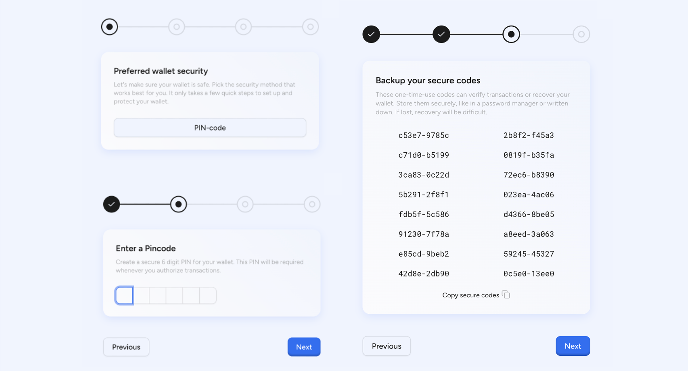

Find the connection endpoint on the connect tab of the custom deployment Section

Go to issuer portal, sign up to create the admin or the issuer account. The
first user to signup gets the admin rights to the application.

The user is required to create a secure 6-digit PIN. This PIN is used to
authorize all wallet-related transactions and ensures that only the legitimate
wallet holder can perform actions such as transferring assets or interacting
with contracts.

After setting the PIN, the system generates a list of one-time-use recovery
codes. These codes allow the user to verify transactions or recover wallet
access in case of credential loss. The interface prompts the user to store these
codes securely, such as in a password manager or offline backup. These codes are
not retrievable after this step.

## Passkey sign in

As part of its secure authentication framework, the Asset Tokenization Kit
supports sign-in via passkeys, offering users a passwordless and
phishing-resistant login experience. Passkeys are based on public key
cryptography and are stored securely on the user’s device or cloud identity
provider (such as Apple iCloud Keychain, Google Password Manager, or Windows
Hello). This ensures that private keys never leave the user’s device,
significantly reducing the risk of credential theft or reuse.

  

During the sign-in process, users will be prompted to authenticate using their
device’s biometric or PIN-based identity (e.g., fingerprint, Face ID, or system
passcode). Upon successful verification, the device automatically signs a
challenge issued by the platform using the previously registered passkey. The
backend verifies the signature against the stored public key, granting access
without requiring a username or password.

  

This approach improves both user convenience and security posture. It eliminates
the need for password resets and prevents common attack vectors such as
credential stuffing, phishing, and man-in-the-middle attacks. For enterprise
users, passkeys can be linked to organizational identity systems or integrated
with device-level access policies for compliance and centralized control.

  

Passkey sign-in can be used as a primary login method or combined with other
mechanisms such as wallet authentication, OAuth providers, or multi-factor
authentication (MFA), depending on the deployment’s security requirements. The
implementation is fully compatible with modern browsers and mobile devices,
providing a seamless experience across environments.

  

Post login you will see the dashboard and will get access to various modules and
services related to asset tokenization.

