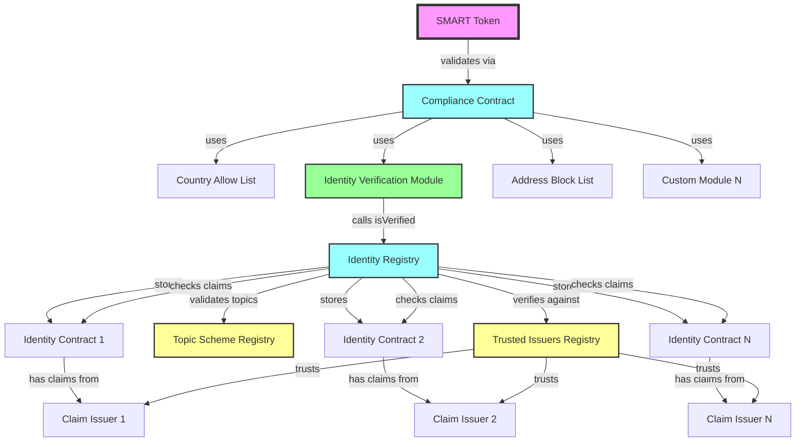
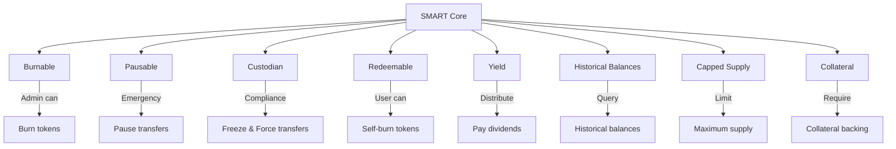
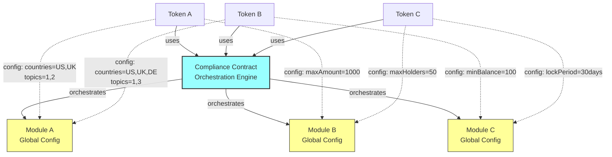
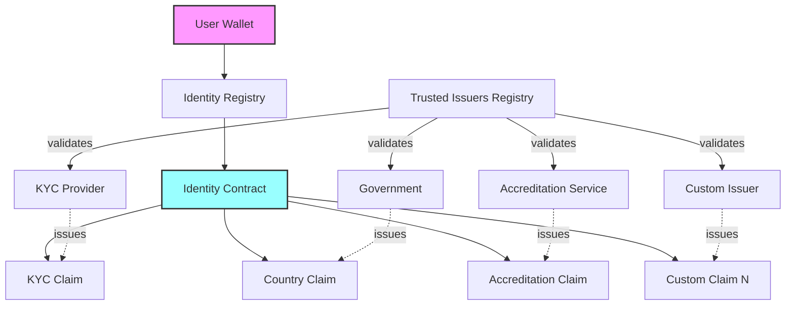
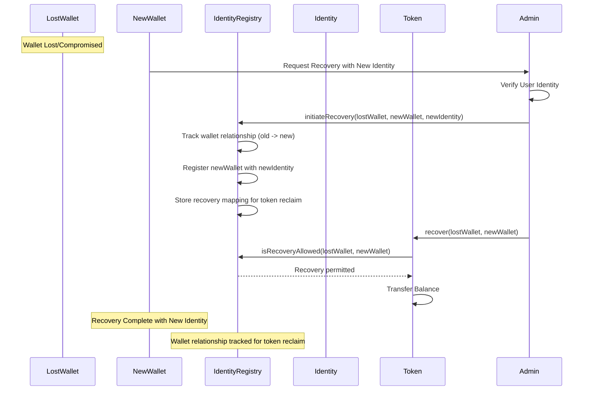
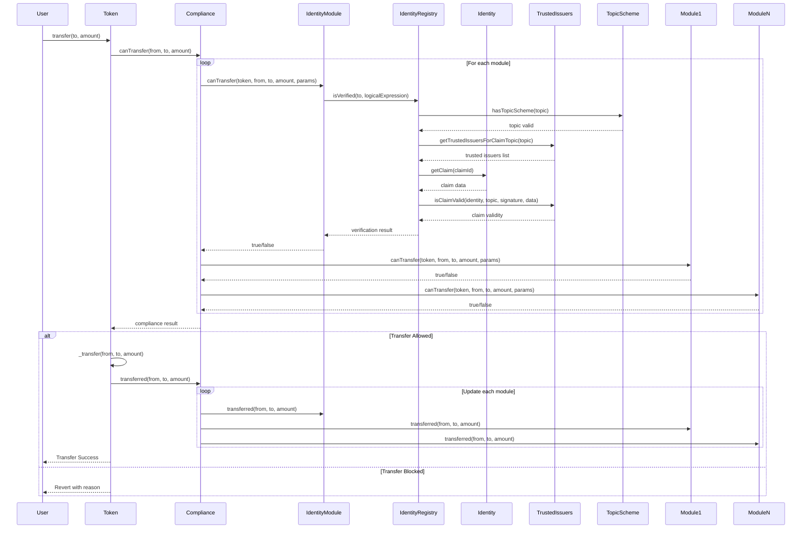

import { Tabs, Tab } from "fumadocs-ui/components/tabs";
import { Callout } from "fumadocs-ui/components/callout";
import { Steps } from "fumadocs-ui/components/steps";
import { Card, Cards } from "fumadocs-ui/components/card";
import { Accordion, Accordions } from "fumadocs-ui/components/accordion";

[Discord](https://discord.com/invite/Mt5yqFrey9) •
[NPM](https://www.npmjs.com/package/@settlemint/solidity-smart-protocol) •
[Issues](https://github.com/settlemint/solidity-smart-protocol/issues)

## What is SettleMint's SMART Protocol?

SMART **(SettleMint Adaptable Regulated Token)** Protocol is an advanced, modular
smart contract framework designed and developed by SettleMint for creating regulatory-compliant security
tokens and tokenizing real-world assets. Built as a derivation of ERC-3643 with
ERC-20 foundations using OpenZeppelin, it provides a complete infrastructure
for:

- **Security Token Issuance**: ERC-3643 derived and ERC-20 compliant tokens for
  regulated financial instruments
- **Asset Tokenization**: Bonds, equity shares, deposits, funds, and stablecoins
- **Advanced Identity Management**: On-chain KYC/AML compliance with ERC-734/735
  identities and **logical expressions** for complex verification rules
- **Regulatory Compliance**: Modular compliance rules for different
  jurisdictions
- **DeFi Integration**: Full ERC-20 compatibility for seamless ecosystem
  integration

### Key Highlights of SMART

- **ERC20 Compliance**: Fully implements `ERC20` and `ERC20Upgradeable`,
  ensuring compatibility with Ethereum tooling and DeFi ecosystems.
- **Externally Modular Architecture**: SMART uses composable extensions (e.g.,
  `SMARTBurnable`, `SMARTCollateral`) in a plug-and-play model.
- **Token-Configurable Compliance**: SMART tokens can be configured to use
  specific modular rules and parameters without needing custom compliance
  contracts.
- **Token-Agnostic Identity Verification**: Identity registry remains reusable
  across tokens and use cases—tokens dynamically pass required claim topics into
  the verification logic.
- **Authorization Agnostic**: SMART is compatible with any authorization logic
  via hooks (e.g., OpenZeppelin `AccessControl`).
- **ERC-2771 Meta-Transaction Support**: Compatible with trusted forwarders for
  gasless transactions and improved UX.
- **Upgradeable & Non-Upgradeable Support**: SMART supports both upgradeable
  (proxy-based) and fixed (non-upgradeable) token deployments—giving issuers
  full control over token mutability.
- **KYC is optional**: SMART supports both regulated and unregulated assets.
  Tokens can opt into identity verification (KYC/AML) or operate
  permissionlessly—ideal for both security tokens and cryptocurrencies.
- **Built-in ERC-165 Interface Detection**: Every SMART token implements
  ERC-165, allowing external systems to query which capabilities (burnable,
  redeemable, etc.) a token supports—improving composability and tooling.
- **Two-Step Identity Recovery Flow**: If a user loses access to their wallet,
  recovery happens in two stages: first, a new identity is registered for the
  new wallet via the Identity Registry (by a manager) and the relationship is
  tracked; then, the user reclaims tokens from the lost wallet after the token
  validates the recovery with the Identity Registry—offering secure and
  structured recovery.

## Architecture Overview

SMART Protocol consists of three main layers:

### 1. **Token Layer** - Smart contract tokens with configurable compliance

### 2. **Compliance Layer** - Orchestration engine with modular rules

### 3. **Identity Layer** - On-chain identity management and verification

**Key Insight**: The compliance contract acts as an orchestration engine,
executing different modules based on each token's configuration. This allows
multiple tokens to share the same compliance infrastructure while having
completely different compliance requirements.

### ERC Standards Implemented

SMART Protocol implements multiple Ethereum standards to provide comprehensive
functionality:

#### **ERC-20: Fungible Token Standard**

- **Full Compatibility**: Complete ERC-20 and ERC-20 Metadata implementation
- **DeFi Ready**: Works seamlessly with DEXs, lending protocols, and wallets
- **Extensions**: Transfer hooks, pausable transfers, burnable tokens
- **Upgradeability**: UUPS proxy pattern support for contract upgrades

#### **ERC-3643: T-REX Security Token Standard**

- **Regulatory Compliance**: Built-in KYC/AML and jurisdiction-specific rules
- **Transfer Restrictions**: Conditional transfers based on investor eligibility
- **Identity Verification**: Integration with trusted identity providers
- **Compliance Modules**: Pluggable rules for different regulatory requirements
- **Components**:
  - Identity Registry for investor management
  - Compliance validation engine
  - Trusted issuers registry for claim verification
  - Claim topics for required documentation types

#### **ERC-734: Key Holder Standard**

- **On-chain Identity**: Self-sovereign identity management
- **Multi-purpose Keys**: Management, action, claim signing, and encryption keys
- **Execution Framework**: Multi-signature execution with key-based approval
- **Key Management**: Add, remove, and replace keys with proper authorization

#### **ERC-735: Claim Holder Standard**

- **Verifiable Claims**: On-chain attestations about identity attributes
- **Trusted Issuers**: Claims validated by authorized third parties
- **Topic-based Organization**: Claims categorized by topics (KYC, nationality,
  etc.)
- **Revocation Support**: Ability to revoke outdated or invalid claims

#### **ERC-2771: Meta-Transaction Standard**

- **Gasless Transactions**: Users can transact without holding ETH
- **Improved UX**: Third-party relayers can sponsor transaction costs
- **Trusted Forwarders**: Secure delegation of transaction execution
- **Native Integration**: Built into all SMART Protocol contracts

## Token Layer

### SMART Token

The main security token contract that derives from ERC-3643 principles while
maintaining full ERC-20 compatibility through OpenZeppelin. Available in two
variants:

- **SMART.sol**: Non-upgradeable implementation
- **SMARTUpgradeable.sol**: UUPS upgradeable implementation

### Token Extensions

Each extension adds specific functionality through well-defined interfaces:

#### **Administrative Extensions**

1. **Burnable Extension** (`extensions/burnable/`)
   - **Purpose**: Allows designated administrators to burn tokens from any
     account
   - **Use Cases**: Regulatory compliance, token destruction, supply management
   - **Key Functions**: `burn(address account, uint256 amount)`
   - **Access Control**: Supply Manager role required

2. **Pausable Extension** (`extensions/pausable/`)
   - **Purpose**: Emergency pause functionality for all token transfers
   - **Use Cases**: Security incidents, regulatory orders, system maintenance
   - **Key Functions**: `pause()`, `unpause()`
   - **Access Control**: Token Admin role required

3. **Custodian Extension** (`extensions/custodian/`)
   - **Purpose**: Freeze addresses and force transfers for compliance
   - **Use Cases**: Legal orders, sanctions compliance, dispute resolution
   - **Key Functions**: `freeze(address account)`,
     `forceTransfer(from, to, amount)`
   - **Access Control**: Compliance Manager role required

#### **User-Facing Extensions**

4. **Redeemable Extension** (`extensions/redeemable/`)
   - **Purpose**: Users can burn their own tokens (self-redemption)
   - **Use Cases**: Token buybacks, voluntary redemptions, exit mechanisms
   - **Key Functions**: `redeem(uint256 amount)`
   - **Access Control**: Token holders can redeem their own tokens

5. **Yield Extension** (`extensions/yield/`)
   - **Purpose**: Distribute dividends or yield to token holders
   - **Use Cases**: Dividend payments, profit sharing, interest distribution
   - **Key Functions**: `distributeYield(uint256 totalAmount)`, `claimYield()`
   - **Access Control**: Yield Manager role for distribution

#### **Data & Analytics Extensions**

6. **Historical Balances Extension** (`extensions/historical/`)
   - **Purpose**: Query historical balance data at specific blocks
   - **Use Cases**: Snapshot governance, historical reporting, audit trails
   - **Key Functions**: `balanceOfAt(address account, uint256 blockNumber)`
   - **Features**: Automatic snapshot creation on transfers

#### **Supply Management Extensions**

7. **Capped Extension** (`extensions/capped/`)
   - **Purpose**: Enforce maximum token supply limits
   - **Use Cases**: Fixed supply tokens, inflation control, tokenomics
   - **Key Functions**: `cap()`, `totalSupply()`
   - **Features**: Prevents minting beyond cap, immutable once set

8. **Collateral Extension** (`extensions/collateral/`)
   - **Purpose**: Require collateral backing for token issuance
   - **Use Cases**: Asset-backed tokens, stablecoins, secured instruments
   - **Key Functions**: Collateral managed through token's OnchainID identity
   - **Features**: Each token has its own identity contract for collateral
     management

## Compliance Layer

### Overview

The diagram shows a clean separation of concerns:

- **Token Layer**
  - Multiple tokens can exist independently
  - Each token defines its own compliance requirements
  - Tokens use the shared compliance contract for orchestration

- **Compliance Contract**
  - Single orchestration engine shared by all tokens
  - Executes compliance checks based on token-specific configuration
    - Routes requests to appropriate modules

- **Module Layer**
  - Shared compliance modules with global configuration
  - Each module can be used by multiple tokens with different parameters
  - Modules contain both global settings and token-specific configuration

### Compliance Contract

Orchestrates compliance checks as an engine based on token configuration:

- Executes modules configured on each specific token
- Performs pre-transfer validation using token's module list
- Updates post-transfer state for configured modules
- No modules stored directly - purely orchestration engine

### Compliance Modules

The SMART protocol provides a flexible, extensible compliance module system with
both default modules and support for custom implementations. The system supports
country restrictions, identity verification with logical expressions, transfer
limits, time-based restrictions, and more.

Key highlights:

- **Advanced Identity Verification**: Complex logical expressions beyond simple
  AND-only requirements
- **Flexible Configuration**: Global infrastructure with per-token parameters
- **Modular Architecture**: Mix and match modules based on regulatory
  requirements
- **Extensible Framework**: Create custom modules for specific compliance needs

Available module categories:

- **Country-based**: Allow/block lists for jurisdictions
- **Identity-based**: Verification, allow/block lists for identities and
  addresses
- **Transfer & Supply**: Token supply limits, investor count restrictions
- **Time-based**: Lock-up periods, holding requirements

## Identity Layer

### Identity Registry

Central registry mapping wallet addresses to identity contracts. Features:

- Stores identity contract addresses for each wallet
- Manages identity verification status
- Handles wallet recovery mechanisms
- Supports identity transfers

### Trusted Issuers Registry

Manages trusted entities that can issue identity claims:

- Stores trusted issuer addresses
- Maps issuers to claim topics they can attest
- Supports multiple issuers per topic

### Topic Scheme Registry

Defines the claim topics available for compliance:

- Lists valid claim topics globally
- Maps topics to verification requirements
- Shared registry across all tokens

### 2 step recovery mechanism

## Complete System Flow

Now that we've covered all three layers, here's how they work together during a
token transfer:

### Token Transfer Flow

### Transfer Validation Steps

1. **Identity Verification**
   - Verify receiver has valid identity contract and required claims
   - Sender verification is assumed (already owns tokens, so was previously
     verified)

2. **Compliance Validation**
   - Compliance engine runs through modules configured on the specific token
   - Each configured module performs its specific checks
   - All configured modules must approve for transfer to proceed

3. **Balance Updates**
   - Execute standard ERC-20 transfer
   - Update compliance module states
   - Emit transfer events

## ERC-3643 vs SMART Protocol

| **Aspect**                               | **ERC-3643**                                | **SMART Protocol**                                                          | **Notes**                                                              |
| ---------------------------------------- | ------------------------------------------- | --------------------------------------------------------------------------- | ---------------------------------------------------------------------- |
| **ERC20 Compatibility**                  | Partial / constrained                       | Fully `ERC20` and `ERC20Upgradeable` compliant                              | Ensures full compatibility with DeFi and wallets                       |
| **Upgradeability**                       | Centralized via Implementation Authority    | Supported via UUPS; system-agnostic (project decides upgrade pattern)       | SMART provides the option but doesn't enforce a pattern                |
| **Modularity**                           | Partially modular                           | Modular by default (OpenZeppelin extension pattern)                         | SMARTBurnable, SMARTRedeemable, SMARTPausable, etc.                    |
| **Identity / Compliance Contract Reuse** | Typically one-off per token                 | Reusable across all tokens                                                  | Efficient architecture, simplifies ecosystem-wide compliance           |
| **Compliance Model**                     | Single compliance contract, may be modular  | Fully modular compliance rules; also supports monolithic if desired         | Flexible based on project use case                                     |
| **Compliance Configuration**             | No token-specific configuration             | Rule-specific parameters configurable per token                             | Enables rule reuse with different behaviors                            |
| **Claim Topics Storage**                 | External Claim Topics Registry              | Defined and stored per token                                                | Improves clarity and portability of tokens                             |
| **Identity Verification**                | Simple AND-only logic for required topics   | **Advanced logical expressions** with AND/OR/NOT                            | Enables complex rules like "CONTRACT OR (KYC AND AML)"                 |
| **KYC Optional**                         | Implied as required                         | **Optional** per token, part of the modular compliance                      | Allows issuing cryptocurrencies or unrestricted tokens                 |
| **Authorization**                        | Agent-based role system                     | Access-control agnostic                                                     | Supports OpenZeppelin `AccessControl`, custom roles, or hybrid models  |
| **Burning Logic**                        | Owner-initiated only (`burn(user, amount)`) | `SMARTBurnable` (admin burn) + `SMARTRedeemable` (self-burn)                | Enables more flexible redemption logic (e.g. for bonds)                |
| **Meta-Transaction Support**             | Not specified                               | Fully ERC-2771 compatible (trusted forwarders)                              | Enables gasless transactions and better UX                             |
| **Immutability**                         | Name and symbol mutable                     | Immutable following ERC20 standard                                          | Avoids confusion and aligns with token standards                       |
| **Interface Detection (ERC-165)**        | Not part of standard                        | **Built-in ERC-165 support**                                                | Enables introspection: e.g., query if token supports Burnable, etc.    |
| **Token Recovery Flow**                  | Custodian-based recovery                    | Two-step: identity registry manager handles recovery + user reclaims tokens | SMART separates identity and asset recovery for better security and UX |

## **Common Use Cases**

| **Use Case**               | **Asset Type**          | **Key Extensions**                  | **Compliance Requirements**                       | **Explanation**                                                                                                                                               |
|----------------------------|------------------------|-----------------------------------|-------------------------------------------------|------------------------------------------------------------------------------------------------------------------------------------------------------------------------|
| **Corporate Bonds**         | SMARTBond              | Yield, Redeemable, Pausable       | Accredited investor, KYC                          | Tokenizes corporate debt securities enabling fractional ownership, dividend/yield distribution to investors, emergency halts on trading, and easy redemption options.   |
| **Real Estate Shares**      | SMARTEquity            | Custodian, Historical Balances    | KYC, Jurisdiction restrictions                    | Enables fractional ownership in real estate assets with investor identity verification, jurisdictional compliance, and historical ownership tracking for audits.          |
| **Tokenized Deposits**      | SMARTDeposit           | Yield, Capped                    | Bank verification, deposit insurance              | Digitizes deposits with capped supply and yield distribution, integrating bank-level identity verification and deposit insurance requirements in compliance with laws.     |
| **Investment Funds**        | SMARTFund              | Yield, Custodian, Burnable        | Fund prospectus, investor suitability             | Tokenizes shares in mutual or venture funds allowing investor accreditation checks, ongoing yield distribution, and token burn for fund redemptions or rebalancing.     |
| **Regulatory Stablecoins**  | SMARTStableCoin        | Pausable, Custodian               | Money transmitter license                          | Represents fiat assets on-chain with pause and freeze features for regulatory control and compliance with money transmitter licensing for stablecoin operations.          |
| **Equity Shares Tokenization** | SMARTEquity | Custodian, Historical Balances, Capped | KYC, Securities laws compliance                  | Digitizes company shares as compliant security tokens enabling real-time transfers, shareholder voting, dividends, and regulatory reporting under securities laws.          |
| **Commodity Tokens**        | SMARTCommodity         | Collateral, Capped                | Asset backing verification, KYC                    | Tokenizes commodities like gold, oil, or agricultural products, backed by physical reserves, enabling fractional ownership and seamless global trading on DeFi platforms.  |
| **Intellectual Property (IP) Rights** | SMARTIP              | Custodian, Redeemable             | Rights management, royalty distribution           | Represents fractional ownership or licensing rights in patents, copyrights, trademarks allowing automated royalty payments, transparent usage tracking, and compliance.    |
| **Art & Collectibles**      | SMARTArt               | Custodian, Historical Balances    | Provenance tracking, Anti-fraud                    | Tokenizes expensive artwork and collectibles allowing fractional ownership with secure provenance data and regulating transfers to meet legal compliance.                 |
| **Debt Instruments & Loans** | SMARTDebt              | Burnable, Redeemable              | Loan agreements, accredited investor checks        | Tokenizes loans or debt pools enabling flexible repayment, secondary market trading, and enforcing contract terms via programmable compliance logic on transfers.           |
| **Supply Chain Assets**    | SMARTSupplyChain       | Custodian, Transfer Limits       | Provenance, Anti-counterfeit                        | Represents goods and materials in production/distribution with tracking, provenance verification and compliance with trade regulations and quotas.                        |
| **Invoice & Receivables**   | SMARTInvoice           | Redeemable, Historical Balances  | Invoice validation, anti-fraud                       | Digitizes invoices/receivables as tokens for liquidity; facilitates invoice factoring, peer-to-peer lending, and reduces fraud through immutable blockchain records.        |
| **Carbon Credits**          | SMARTCarbon            | Capped, Transfer Limits          | Environmental regulations                          | Tokenizes carbon offsets allowing companies and investors to transparently trade verified emission reductions complying with regulatory frameworks.                      |
| **Tokenized Insurance Policies** | SMARTInsurance         | Custodian, Redeemable             | Regulatory insurance compliance, KYC                | Enables fractional ownership or participation in insurance pools, automating claims, transparency in policy status, and compliance with insurance regulations.             |
| **Stable Asset Backing**   | SMARTCollateralized    | Collateral, Pausable             | Asset backing audits, KYC                            | Tokens backed by real-world assets like fiat, gold, or other collateral managed on-chain provide stable value tokens with built-in compliance for audits.                   |
| **Revenue/Royalty Streams** | SMARTRoyalty           | Yield, Custodian                 | Licensing agreements, investor KYC                   | Tokenizes revenue rights for music, films, books, or other intellectual property, enabling fractional royalties distribution with transparent transaction records.          |
| **Shareholder Voting Tokens** | SMARTVote              | Custodian, Historical Balances    | Corporate governance compliance                       | Provides tokenized voting rights linked to equity tokens allowing secure, verifiable digital shareholder voting compliant with corporate governance policies.                |
| **Tokenized Treasuries & Sovereign Bonds** | SMARTSovereign       | Redeemable, Burnable            | Government regulations, investor accreditation      | Tokenizes government-issued bonds or treasury instruments enhancing liquidity, transparency, and automated compliance with government securities laws.                      |
| **Loyalty & Membership Tokens** | SMARTLoyalty           | Redeemable, Transfer Limits      | Membership management rules                          | Represents customer memberships or loyalty points with flexible redeemability, transferable restrictions, and regulatory compliance for loyalty programs.                   |

SMART tokenization protocol from SettleMint rethinks the ERC-3643 architecture by moving modularity, configuration,
and verification closer to the token layer. This creates a more flexible,
reusable, and standards-compliant framework for compliant token issuance in
dynamic regulatory environments. By decoupling identity and compliance logic
from any single token, SMART improves scalability and opens doors for broader
cross-application identity use.

## Next steps

Ready to launch your tokenization platform?

1. [Explore the Asset Designer →](/application-kits/asset-tokenization/asset-designer)
2. [Review API Documentation →](/application-kits/asset-tokenization/api-portal)
3. [Schedule a Demo](https://settlemint.com/demo)
4. [Join Developer Workshop](https://settlemint.com/workshops)