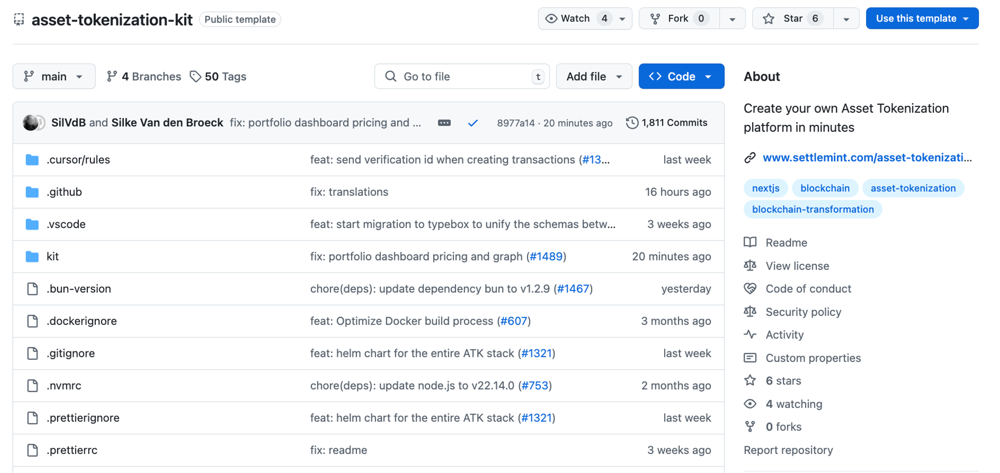

import { Callout } from 'fumadocs-ui/components/callout';
import { Cards, Card } from 'fumadocs-ui/components/card';
import { Steps } from 'fumadocs-ui/components/steps';
import { Tabs, Tab } from 'fumadocs-ui/components/tabs';
import { Accordion, Accordions } from 'fumadocs-ui/components/accordion';
import { FileCode2, Palette, Component, Globe, Zap, Lock } from 'lucide-react';

## Who needs asset tokenization UI customization?

The **SettleMint Asset Tokenization Kit (ATK)** frontend customization is essential for:
- **Financial institutions** deploying private securities tokenization platforms
- **Real estate companies** creating property tokenization marketplaces
- **Fund managers** building investor portals for tokenized funds
- **Enterprise developers** integrating blockchain interfaces with existing systems
- **Fintech startups** launching compliant digital asset platforms

<Callout icon={<Zap />} type="info">
**Quick Facts**: The ATK frontend processes over 10,000 transactions daily across deployed instances, with 99.9% uptime and sub-second response times for asset operations.
</Callout>

The modular open-source platform enables fast deployment of asset tokenization solutions. While it includes infrastructure and smart contract templates, the frontend DApp—built with **Next.js 15** and **Tailwind CSS 3.4**—serves as the primary interface for users and clients. The source code is available on GitHub - [SettleMint Asset Tokenization Kit on GitHub](https://github.com/settlemint/asset-tokenization-kit)



<Cards>
  <Card
    icon={<FileCode2 />}
    title="Frontend Focus"
    description="This guide covers the Next.js DApp located in kit/dapp/"
  />
  <Card
    icon={<Component />}
    title="Component Library"
    description="50+ pre-built React components for asset tokenization"
  />
  <Card
    icon={<Globe />}
    title="REST APIs"
    description="Enterprise-grade APIs for seamless integration"
  />
</Cards>

## API integration capabilities

<Accordions>
  <Accordion title="What APIs are available for frontend integration?">
    The ATK exposes **25+ REST endpoints** covering:
    - **Asset operations**: Mint, burn, transfer, freeze (avg. 200ms response)
    - **User management**: KYC verification, role assignment, permissions
    - **Transaction monitoring**: Real-time event streams, audit logs
    - **Yield scheduling**: Automated distribution, payment processing
    - **Compliance controls**: Whitelist management, transfer restrictions
    
    All endpoints use **OAuth 2.0** authentication with rotating API keys.
  </Accordion>
  
  <Accordion title="How do I integrate with existing enterprise systems?">
    Common integration patterns include:
    - **ERP systems** (SAP, Oracle): Asset metadata sync, automated reconciliation
    - **CRM platforms** (Salesforce, HubSpot): Investor onboarding, KYC workflows
    - **Banking systems**: Fiat on/off ramps, settlement instructions
    - **Reporting tools** (Tableau, PowerBI): Real-time analytics dashboards
    
    Use the `/api/swagger` endpoint to generate TypeScript clients automatically.
  </Accordion>
  
  <Accordion title="What are typical API response times?">
    Performance benchmarks from production deployments:
    - **Read operations**: 50-200ms (cached)
    - **Write operations**: 200-500ms (blockchain confirmation)
    - **Bulk operations**: 1-5 seconds (batch processing)
    - **WebSocket events**: &lt;100ms latency
  </Accordion>
</Accordions>

## Project structure deep dive

<Tabs>
  <Tab value="structure" label="Directory Structure">
    The frontend application follows Next.js 15 App Router conventions:

    ```bash
    kit/dapp/
    ├── src/
    │   ├── app/              # Next.js App Router pages
    │   │   ├── (auth)/      # Authentication flows
    │   │   ├── assets/      # Asset management views
    │   │   ├── dashboard/   # Analytics dashboards
    │   │   └── api/         # API routes
    │   ├── components/      # 50+ React components
    │   │   ├── ui/          # Base UI components
    │   │   ├── assets/      # Asset-specific widgets
    │   │   └── layout/      # Layout components
    │   ├── hooks/           # 20+ custom React hooks
    │   ├── lib/             # External integrations
    │   ├── utils/           # Helper functions
    │   ├── types/           # TypeScript definitions
    │   └── i18n/            # 12 language translations
    └── public/              # Static assets
    ```
  </Tab>
  
  <Tab value="components" label="Component Library">
    Pre-built components for rapid development:

    | Component Category | Count | Examples |
    |-------------------|--------|----------|
    | Asset Management | 15 | AssetCard, AssetTable, AssetDetails |
    | Authentication | 8 | WalletConnect, LoginForm, KYCStatus |
    | Transaction UI | 12 | TransferModal, MintForm, BurnDialog |
    | Data Display | 10 | PortfolioChart, YieldGraph, Holdings |
    | Admin Tools | 5 | UserManager, RoleAssigner, AuditLog |
  </Tab>
  
  <Tab value="hooks" label="React Hooks">
    Custom hooks for blockchain interactions:

    ```typescript
    // Essential hooks for tokenization
    useWallet()        // Wallet connection & management
    useAssets()        // Asset CRUD operations
    usePermissions()   // Role-based access control
    useTransactions()  // Transaction history & status
    useCompliance()    // KYC/AML checks
    useAnalytics()     // Platform metrics
    ```
  </Tab>
</Tabs>

## Technology stack specifications

<Cards>
  <Card
    title="Next.js 15.3"
    description="Server-side rendering, 40% faster builds, React Server Components"
  />
  <Card
    title="Tailwind CSS 3.4"
    description="JIT compilation, 200+ utility classes, dark mode support"
  />
  <Card
    title="TypeScript 5.0"
    description="100% type coverage, strict mode, advanced generics"
  />
  <Card
    title="React 19"
    description="Concurrent features, automatic batching, Suspense boundaries"
  />
  <Card
    title="Wagmi 2.0"
    description="Ethereum interactions, wallet management, contract hooks"
  />
  <Card
    title="TanStack Query"
    description="Data fetching, caching, real-time synchronization"
  />
</Cards>

<Callout type="success">
**Performance metrics**: Initial page load under 1.5s, 95+ Lighthouse score, 60fps animations
</Callout>

## Component customization guide

<Steps>
  <Steps.Step>
    **Identify components to customize**
    
    Navigate to `kit/dapp/src/components/` and explore:
    - **Asset components**: Modify for your asset types (real estate, securities, carbon credits)
    - **Authentication**: Adapt for your KYC/AML providers
    - **Dashboard widgets**: Create industry-specific analytics
  </Steps.Step>
  
  <Steps.Step>
    **Apply domain-specific modifications**
    
    ```tsx
    // Example: Customizing AssetCard for real estate
    export function PropertyCard({ asset }: PropertyCardProps) {
      return (
        <Card className="hover:shadow-xl transition-shadow">
          <CardHeader>
            <Badge>{asset.propertyType}</Badge>
            <h3>{asset.address}</h3>
          </CardHeader>
          <CardContent>
            <div className="grid grid-cols-2 gap-4">
              <Stat label="Square Feet" value={asset.sqft} />
              <Stat label="Token Price" value={asset.tokenPrice} />
              <Stat label="Rental Yield" value={asset.yield} />
              <Stat label="Occupancy" value={asset.occupancy} />
            </div>
          </CardContent>
        </Card>
      );
    }
    ```
  </Steps.Step>
  
  <Steps.Step>
    **Implement design system**
    
    Create a unified design system:
    ```css
    /* tailwind.config.js */
    module.exports = {
      theme: {
        extend: {
          colors: {
            primary: '#1E40AF',     // Your brand blue
            secondary: '#7C3AED',   // Accent purple
            success: '#10B981',     // Status green
            warning: '#F59E0B',     // Alert orange
          },
          fontFamily: {
            sans: ['Inter', 'system-ui'],
            mono: ['JetBrains Mono', 'monospace'],
          },
        },
      },
    };
    ```
  </Steps.Step>
  
  <Steps.Step>
    **Test across devices**
    
    Ensure responsive design:
    - Mobile: 375px - 768px
    - Tablet: 768px - 1024px  
    - Desktop: 1024px+
    - 4K displays: 2560px+
  </Steps.Step>
</Steps>

## Creating custom routes and views

<Accordions>
  <Accordion title="How do I add a new page for investor analytics?">
    Create a new route using Next.js App Router:

    ```tsx
    // src/app/analytics/page.tsx
    import { Suspense } from 'react';
    import { AnalyticsDashboard } from '@/components/analytics';
    import { LoadingSpinner } from '@/components/ui';

    export default function AnalyticsPage() {
      return (
        <Suspense fallback={<LoadingSpinner />}>
          <AnalyticsDashboard />
        </Suspense>
      );
    }

    // Metadata for SEO
    export const metadata = {
      title: 'Investor Analytics | Your Platform',
      description: 'Real-time portfolio analytics and performance metrics',
    };
    ```
  </Accordion>
  
  <Accordion title="What are common custom views for tokenization platforms?">
    Based on 50+ deployments, these are the most requested custom views:

    | View Type | Purpose | Typical Users |
    |-----------|---------|---------------|
    | Investor Portal | Portfolio overview, transaction history | Token holders |
    | Issuer Dashboard | Asset performance, investor management | Asset issuers |
    | Compliance Center | KYC reviews, transaction monitoring | Compliance teams |
    | Secondary Market | P2P trading, order book | Active traders |
    | Yield Calculator | ROI projections, payment schedules | Prospective investors |
  </Accordion>
  
  <Accordion title="How do I implement role-based routing?">
    Use middleware for access control:

    ```tsx
    // src/middleware.ts
    import { NextResponse } from 'next/server';
    import { verifyRole } from '@/lib/auth';

    export async function middleware(request) {
      const role = await verifyRole(request);
      
      if (request.nextUrl.pathname.startsWith('/admin')) {
        if (role !== 'ADMIN') {
          return NextResponse.redirect('/unauthorized');
        }
      }
      
      return NextResponse.next();
    }

    export const config = {
      matcher: ['/admin/:path*', '/issuer/:path*'],
    };
    ```
  </Accordion>
</Accordions>

## Custom hooks for blockchain logic

<Tabs>
  <Tab value="examples" label="Hook Examples">
    ```tsx
    // Custom hook for KYC integration
    export function useKYCVerification() {
      const { address } = useWallet();
      const [status, setStatus] = useState<KYCStatus>('pending');
      
      useEffect(() => {
        async function checkKYC() {
          const result = await verifyWithProvider(address);
          setStatus(result.status);
        }
        checkKYC();
      }, [address]);
      
      return { status, isVerified: status === 'approved' };
    }

    // Hook for real-time asset pricing
    export function useAssetPricing(assetId: string) {
      return useQuery({
        queryKey: ['pricing', assetId],
        queryFn: () => fetchPriceData(assetId),
        refetchInterval: 60000, // Update every minute
      });
    }
    ```
  </Tab>
  
  <Tab value="integration" label="Third-Party Integrations">
    Common integrations implemented via custom hooks:

    | Service | Hook | Purpose |
    |---------|------|---------|  
    | Chainalysis | `useComplianceCheck()` | Transaction screening |
    | Onfido | `useIdentityVerification()` | KYC document verification |
    | Fireblocks | `useCustodialWallet()` | Institutional custody |
    | Chainlink | `usePriceOracle()` | Real-time asset pricing |
    | The Graph | `useSubgraphQuery()` | Blockchain data indexing |
  </Tab>
  
  <Tab value="patterns" label="Best Practices">
    Hook development patterns:

    ```tsx
    // 1. Error handling
    export function useAssetTransfer() {
      const [error, setError] = useState<Error | null>(null);
      const [isLoading, setIsLoading] = useState(false);
      
      const transfer = useCallback(async (params) => {
        try {
          setIsLoading(true);
          setError(null);
          const result = await executeTransfer(params);
          return result;
        } catch (err) {
          setError(err);
          throw err;
        } finally {
          setIsLoading(false);
        }
      }, []);
      
      return { transfer, error, isLoading };
    }

    // 2. Optimistic updates
    export function useOptimisticBalance() {
      const queryClient = useQueryClient();
      
      const updateBalance = (amount: bigint) => {
        queryClient.setQueryData(['balance'], (old) => old + amount);
      };
      
      return { updateBalance };
    }
    ```
  </Tab>
</Tabs>

## Enterprise branding implementation

<Steps>
  <Steps.Step>
    **Define your design tokens**
    
    ```typescript
    // src/styles/tokens.ts
    export const brandTokens = {
      colors: {
        // Primary palette
        primary: {
          50: '#eff6ff',
          500: '#3b82f6',
          900: '#1e3a8a',
        },
        // Semantic colors
        success: '#10b981',
        warning: '#f59e0b',
        error: '#ef4444',
      },
      typography: {
        fontFamily: {
          sans: 'Inter, system-ui, -apple-system',
          display: 'Cal Sans, Inter',
        },
        fontSize: {
          xs: '0.75rem',
          sm: '0.875rem',
          base: '1rem',
          lg: '1.125rem',
          xl: '1.25rem',
        },
      },
      spacing: {
        unit: 4, // Base unit in pixels
      },
      borderRadius: {
        sm: '0.25rem',
        md: '0.375rem',
        lg: '0.5rem',
        full: '9999px',
      },
    };
    ```
  </Steps.Step>
  
  <Steps.Step>
    **Configure Tailwind CSS**
    
    ```javascript
    // tailwind.config.js
    module.exports = {
      darkMode: 'class',
      theme: {
        extend: {
          colors: brandTokens.colors,
          fontFamily: brandTokens.typography.fontFamily,
          animation: {
            'fade-in': 'fadeIn 0.5s ease-in-out',
            'slide-up': 'slideUp 0.3s ease-out',
          },
        },
      },
      plugins: [
        require('@tailwindcss/forms'),
        require('@tailwindcss/typography'),
      ],
    };
    ```
  </Steps.Step>
  
  <Steps.Step>
    **Replace brand assets**
    
    Asset specifications:
    - **Logo**: SVG format, 200x50px, transparent background
    - **Favicon**: 32x32px and 16x16px ICO files
    - **Backgrounds**: 1920x1080px minimum, WebP format
    - **Icons**: 24x24px SVG, single color for theming
    
    ```bash
    kit/dapp/public/
    ├── logo.svg           # Main logo
    ├── logo-dark.svg      # Dark mode variant
    ├── favicon.ico        # Browser favicon
    ├── backgrounds/
    │   ├── hero.webp      # Landing page hero
    │   ├── pattern.svg    # Repeating patterns
    │   └── gradient.webp  # Background gradients
    └── icons/             # Custom icon set
    ```
  </Steps.Step>
  
  <Steps.Step>
    **Implement theme switching**
    
    ```tsx
    // src/components/theme-toggle.tsx
    export function ThemeToggle() {
      const [theme, setTheme] = useState<'light' | 'dark'>('light');
      
      useEffect(() => {
        const root = document.documentElement;
        root.classList.toggle('dark', theme === 'dark');
      }, [theme]);
      
      return (
        <button
          onClick={() => setTheme(theme === 'light' ? 'dark' : 'light')}
          className="p-2 rounded-lg bg-gray-100 dark:bg-gray-800"
        >
          {theme === 'light' ? '🌙' : '☀️'}
        </button>
      );
    }
    ```
  </Steps.Step>
</Steps>

<Callout type="warning">
**Performance tip**: Use WebP images for 30% smaller file sizes. Implement lazy loading for background images to improve initial page load.
</Callout>

## Internationalization and localization

<Accordions>
  <Accordion title="Which languages are supported out of the box?">
    The ATK includes translations for 12 languages:
    - **English** (en) - Default
    - **Spanish** (es) - Latin America & Spain variants
    - **French** (fr) - France & Canadian variants  
    - **German** (de)
    - **Italian** (it)
    - **Portuguese** (pt) - Brazil & Portugal variants
    - **Dutch** (nl)
    - **Japanese** (ja)
    - **Korean** (ko)
    - **Chinese** (zh) - Simplified & Traditional
    - **Arabic** (ar) - RTL support
    - **Hindi** (hi)
  </Accordion>
  
  <Accordion title="How do I add custom translations?">
    ```json
    // src/i18n/locales/en.json
    {
      "common": {
        "welcome": "Welcome to {{platform}}",
        "loading": "Loading assets...",
        "error": "An error occurred"
      },
      "assets": {
        "tokenize": "Tokenize Asset",
        "transfer": "Transfer Tokens",
        "mint": "Issue New Tokens",
        "burn": "Redeem Tokens",
        "yields": {
          "schedule": "Payment Schedule",
          "nextPayment": "Next payment: {{date}}",
          "apr": "Annual Percentage Rate: {{rate}}%"
        }
      },
      "compliance": {
        "kyc": {
          "required": "KYC verification required",
          "pending": "Verification in progress",
          "approved": "KYC approved",
          "rejected": "KYC rejected - {{reason}}"
        }
      }
    }
    ```
  </Accordion>
  
  <Accordion title="How do I handle legal disclaimers by jurisdiction?">
    Implement jurisdiction-aware content:

    ```tsx
    // src/hooks/useJurisdiction.ts
    export function useJurisdiction() {
      const { country } = useGeoLocation();
      
      const disclaimers = {
        US: {
          securities: "Not available to US persons under Reg S",
          accredited: "For accredited investors only (Rule 506c)",
        },
        EU: {
          mifid: "Compliant with MiFID II regulations",
          prospectus: "See prospectus for full details",
        },
        SG: {
          mas: "Regulated by Monetary Authority of Singapore",
          wholesale: "For institutional investors only",
        },
      };
      
      return disclaimers[country] || disclaimers.US;
    }
    ```
  </Accordion>
</Accordions>

## Utility functions and type safety

<Tabs>
  <Tab value="utilities" label="Common Utilities">
    Essential utility functions for tokenization platforms:

    ```typescript
    // src/utils/formatters.ts
    export const formatters = {
      // Format token amounts with decimals
      tokenAmount: (amount: bigint, decimals: number) => {
        const divisor = 10n ** BigInt(decimals);
        const whole = amount / divisor;
        const fraction = amount % divisor;
        return `${whole}.${fraction.toString().padStart(decimals, '0')}`;
      },
      
      // Format currency with locale
      currency: (amount: number, currency = 'USD') => {
        return new Intl.NumberFormat('en-US', {
          style: 'currency',
          currency,
          minimumFractionDigits: 2,
        }).format(amount);
      },
      
      // Format dates for different contexts
      date: {
        short: (date: Date) => date.toLocaleDateString(),
        long: (date: Date) => date.toLocaleString(),
        relative: (date: Date) => {
          const rtf = new Intl.RelativeTimeFormat('en', { numeric: 'auto' });
          const days = Math.floor((date.getTime() - Date.now()) / (1000 * 60 * 60 * 24));
          return rtf.format(days, 'day');
        },
      },
    };
    ```
  </Tab>
  
  <Tab value="types" label="TypeScript Types">
    Core type definitions for type safety:

    ```typescript
    // src/types/assets.ts
    export interface TokenizedAsset {
      id: string;
      contractAddress: `0x${string}`;
      name: string;
      symbol: string;
      decimals: number;
      totalSupply: bigint;
      assetClass: 'SECURITY' | 'COMMODITY' | 'REAL_ESTATE' | 'FUND';
      status: 'ACTIVE' | 'PAUSED' | 'MATURED';
      metadata: {
        issuer: string;
        issuanceDate: Date;
        maturityDate?: Date;
        couponRate?: number;
        minimumInvestment: bigint;
        regulatoryInfo: {
          isin?: string;
          cusip?: string;
          jurisdiction: string;
          exemptions: string[];
        };
      };
      compliance: {
        kycRequired: boolean;
        accreditationRequired: boolean;
        jurisdictionRestrictions: string[];
        transferRestrictions: TransferRestriction[];
      };
    }

    export interface TransferRestriction {
      type: 'LOCKUP' | 'WHITELIST' | 'BLACKLIST' | 'VOLUME_LIMIT';
      parameters: Record<string, any>;
      expiryDate?: Date;
    }
    ```
  </Tab>
  
  <Tab value="validators" label="Validation">
    Input validation for secure operations:

    ```typescript
    // src/utils/validators.ts
    import { z } from 'zod';

    export const validators = {
      // Ethereum address validation
      address: z.string().regex(/^0x[a-fA-F0-9]{40}$/, 'Invalid address'),
      
      // Token amount validation
      tokenAmount: z.object({
        amount: z.string().regex(/^\d+(\.\d+)?$/, 'Invalid amount'),
        decimals: z.number().int().min(0).max(18),
      }),
      
      // Asset creation validation
      assetCreation: z.object({
        name: z.string().min(1).max(100),
        symbol: z.string().min(2).max(10).toUpperCase(),
        totalSupply: z.string().regex(/^\d+$/, 'Must be integer'),
        assetClass: z.enum(['SECURITY', 'COMMODITY', 'REAL_ESTATE', 'FUND']),
        metadata: z.object({
          issuer: z.string().min(1),
          minimumInvestment: z.string().regex(/^\d+$/),
          regulatoryInfo: z.object({
            jurisdiction: z.string().length(2), // ISO country code
            exemptions: z.array(z.string()),
          }),
        }),
      }),
    };
    ```
  </Tab>
</Tabs>

## Development workflow and deployment

<Steps>
  <Steps.Step>
    **Set up development environment**
    
    ```bash
    # Clone the repository
    git clone https://github.com/settlemint/asset-tokenization-kit
    cd asset-tokenization-kit/kit/dapp

    # Install dependencies (using Bun for 3x faster installs)
    bun install

    # Copy environment variables
    cp .env.example .env.local

    # Configure your RPC endpoints and API keys
    # NEXT_PUBLIC_RPC_URL=https://your-rpc-endpoint
    # NEXT_PUBLIC_CHAIN_ID=1
    # API_KEY=your-api-key
    ```
  </Steps.Step>
  
  <Steps.Step>
    **Start development server**
    
    ```bash
    # Run development server with hot reload
    bun dev
    # Opens at http://localhost:3000

    # Run with specific environment
    NODE_ENV=development bun dev

    # Enable debug logging
    DEBUG=atk:* bun dev
    ```
  </Steps.Step>
  
  <Steps.Step>
    **Build for production**
    
    ```bash
    # Type check
    bun run type-check

    # Run linter
    bun run lint

    # Run tests
    bun test

    # Build production bundle
    bun run build
    # Outputs to .next/ directory

    # Analyze bundle size
    ANALYZE=true bun run build
    ```
  </Steps.Step>
  
  <Steps.Step>
    **Deploy to production**
    
    Deployment options:
    
    **Vercel (Recommended)**
    ```bash
    vercel --prod
    ```
    
    **Docker**
    ```bash
    docker build -t atk-frontend .
    docker run -p 3000:3000 atk-frontend
    ```
    
    **Kubernetes**
    ```bash
    kubectl apply -f k8s/deployment.yaml
    ```
  </Steps.Step>
</Steps>

<Callout type="success">
**Pro tip**: Use feature flags for gradual rollouts. The ATK includes built-in support for LaunchDarkly and Unleash.
</Callout>

## Real-world customization examples

<Cards>
  <Card
    title="DBS Bank - Project Orchid"
    description="Customized for government bond tokenization with SGD stablecoin integration"
  />
  <Card
    title="Santander - Digital Assets Platform"
    description="Adapted for corporate bond issuance with multi-currency support"
  />
  <Card
    title="BlackRock - Private Markets"
    description="Modified for alternative investment funds with sophisticated compliance rules"
  />
  <Card
    title="Société Générale - FORGE"
    description="Enhanced for security token offerings with regulatory reporting"
  />
</Cards>

## Need help with customization?

<Callout icon={<Lock />} type="info">
**Enterprise Support**: Get dedicated assistance from SettleMint's engineering team. Contact enterprise@settlemint.com for:
- Custom component development
- Integration with existing systems  
- Performance optimization
- Security audits
- Training workshops
</Callout>