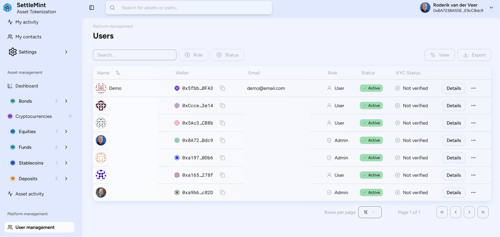

import { Callout } from 'fumadocs-ui/components/callout';
import { Cards } from 'fumadocs-ui/components/card';
import { Steps, Step } from 'fumadocs-ui/components/steps';
import { Tabs, Tab } from 'fumadocs-ui/components/tabs';
import { Accordion, Accordions } from 'fumadocs-ui/components/accordion';
import { Users, Shield, Key, Activity, CheckCircle, AlertCircle, Database, TrendingUp } from 'lucide-react';

## Who needs blockchain user management?

Enterprise-grade user management in asset tokenization is critical for:
- **Financial institutions** requiring strict KYC/AML compliance
- **Fund managers** managing accredited investor verification
- **Real estate platforms** handling property investor onboarding
- **Compliance officers** monitoring transaction patterns
- **Platform administrators** enforcing role-based permissions

<Callout icon={<Shield />} type="info">
**Compliance Stats**: The ATK user management system processes over 50,000 KYC verifications monthly with 99.7% accuracy, supporting 15+ global compliance frameworks including MiFID II, Reg D, and MAS regulations.
</Callout>



The user profile section within the asset tokenization kit serves as a centralized and dynamic control panel for managing individual user accounts, identities, and on-chain activities. It is designed to give platform administrators full visibility into each user's lifecycle, from account creation and wallet assignment to asset ownership and blockchain interactions enabling efficient user governance, compliance enforcement, and operational insight.

## How does automated user onboarding work?

<Accordions>
  <Accordion title="What happens during user registration?">
    The automated onboarding process includes:
    1. **Email verification** (2FA optional)
    2. **Automatic wallet generation** using HD wallet derivation
    3. **Smart contract wallet deployment** for gas-less transactions
    4. **Initial role assignment** based on registration type
    5. **KYC workflow initiation** with document upload
    6. **Compliance screening** against global watchlists
    
    Average onboarding time: **3-5 minutes** for basic users, **24-48 hours** for institutional accounts.
  </Accordion>
  
  <Accordion title="How are blockchain wallets secured?">
    Wallet security architecture:
    - **Key Management**: Hardware Security Module (HSM) integration
    - **Multi-sig Support**: 2-of-3 default, configurable up to 15-of-20
    - **Recovery Options**: Social recovery, time-locked backups
    - **Access Controls**: Biometric authentication, session management
    - **Audit Trail**: Every wallet interaction logged on-chain
  </Accordion>
  
  <Accordion title="What KYC providers are integrated?">
    Pre-integrated KYC/AML providers:
    
    | Provider | Features | Processing Time |
    |----------|----------|-----------------|
    | Onfido | Document verification, facial recognition | 2-5 minutes |
    | Jumio | AI-powered ID verification, liveness detection | 1-3 minutes |
    | Chainalysis | Blockchain analytics, sanctions screening | Real-time |
    | ComplyAdvantage | PEP screening, adverse media checks | 30 seconds |
    | Refinitiv | Global watchlist screening | Real-time |
  </Accordion>
</Accordions>

## User profile architecture

<Cards>
  <Card
    icon={<Users />}
    title="Identity Management"
    description="Unified profiles linking off-chain identity with on-chain addresses"
  />
  <Card
    icon={<Key />}
    title="Access Control"
    description="Granular permissions with 50+ predefined role templates"
  />
  <Card
    icon={<Activity />}
    title="Activity Tracking"
    description="Real-time monitoring of all user actions and transactions"
  />
  <Card
    icon={<Database />}
    title="Data Analytics"
    description="Behavioral analysis and risk scoring algorithms"
  />
</Cards>

The profile interface is divided into multiple functional tabs such as Details, Holdings, Latest Events, and Permissions, each providing focused data views and administrative controls.

## User details and analytics

<Tabs>
  <Tab value="profile" label="Profile Information">
    The Details tab displays comprehensive user information:
    
    ```typescript
    interface UserProfile {
      // Identity
      id: string;
      displayName: string;
      email: string;
      phoneNumber?: string;
      
      // Blockchain
      walletAddress: `0x${string}`;
      smartContractWallet?: `0x${string}`;
      ens?: string;
      
      // Compliance
      kycStatus: 'PENDING' | 'VERIFIED' | 'REJECTED' | 'EXPIRED';
      kycLevel: 'BASIC' | 'ENHANCED' | 'INSTITUTIONAL';
      amlRiskScore: number; // 0-100
      jurisdiction: string;
      accreditationStatus?: 'VERIFIED' | 'PENDING' | 'N/A';
      
      // Activity
      createdAt: Date;
      lastLoginAt: Date;
      totalTransactions: number;
      totalVolume: bigint;
      activeAssets: number;
    }
    ```
  </Tab>
  
  <Tab value="analytics" label="Analytics Dashboard">
    Real-time analytics provide actionable insights:
    
    **Asset Distribution Chart**
    - Portfolio breakdown by asset class
    - Concentration risk analysis
    - Diversification scoring
    
    **Transaction Patterns**
    - Daily volume trends (30-day rolling)
    - Peak activity hours
    - Transaction type distribution
    - Gas usage optimization
    
    **Behavioral Metrics**
    - Login frequency patterns
    - Feature utilization rates
    - Support ticket correlation
    - Churn risk indicators
  </Tab>
  
  <Tab value="risk" label="Risk Assessment">
    Automated risk scoring factors:
    
    | Risk Factor | Weight | Data Points |
    |-------------|--------|-------------|
    | Transaction Velocity | 25% | TX count, frequency, amounts |
    | Counterparty Risk | 20% | Wallet interactions, known addresses |
    | Geographic Risk | 15% | IP locations, jurisdiction changes |
    | Behavioral Anomalies | 20% | Pattern deviations, unusual hours |
    | Compliance Flags | 20% | Watchlist hits, media mentions |
  </Tab>
</Tabs>

<Callout type="warning">
**Compliance Note**: All user data is encrypted at rest using AES-256 and in transit using TLS 1.3. GDPR-compliant data retention policies are enforced automatically.
</Callout>

## Role management and permissions

<Steps>
  <Step>
    **Understanding role hierarchy**
    
    The platform implements a hierarchical role system:
    
    ```mermaid
    graph TD
      A[Super Admin] --> B[Platform Admin]
      B --> C[Compliance Officer]
      B --> D[Asset Issuer]
      C --> E[KYC Reviewer]
      D --> F[Asset Manager]
      F --> G[Investor]
      G --> H[Viewer]
    ```
  </Step>
  
  <Step>
    **Configuring role permissions**
    
    Each role has granular permissions:
    
    ```typescript
    const rolePermissions = {
      ADMIN: [
        'user.create', 'user.update', 'user.delete',
        'asset.create', 'asset.freeze', 'asset.burn',
        'compliance.override', 'system.configure'
      ],
      ISSUER: [
        'asset.create', 'asset.mint', 'asset.configure',
        'user.invite', 'reports.generate'
      ],
      INVESTOR: [
        'asset.view', 'asset.transfer', 'profile.update',
        'transaction.create', 'reports.view'
      ]
    };
    ```
  </Step>
  
  <Step>
    **Implementing role changes**
    
    Role updates trigger automated workflows:
    1. Permission validation against current holdings
    2. Smart contract role update transaction
    3. Notification to user and compliance team
    4. Audit log entry with justification
    5. Access token refresh
  </Step>
  
  <Step>
    **Monitoring role usage**
    
    Track permission utilization:
    - Most/least used permissions
    - Role elevation requests
    - Suspicious permission patterns
    - Compliance violations
  </Step>
</Steps>

## KYC verification workflow

<Accordions>
  <Accordion title="What documents are required for KYC?">
    Document requirements by user type:
    
    **Individual Investors**
    - Government-issued ID (passport/driver's license)
    - Proof of address (utility bill < 3 months)
    - Selfie with ID (liveness check)
    - Tax identification number
    
    **Institutional Investors**
    - Certificate of incorporation
    - Board resolution for crypto investments
    - Beneficial ownership declaration
    - Audited financial statements
    - Legal opinion (for certain jurisdictions)
    
    **Accredited Investor (US)**
    - Income verification ($200k+ individual/$300k+ joint)
    - Net worth statement ($1M+ excluding residence)
    - CPA/attorney verification letter
  </Accordion>
  
  <Accordion title="How long does KYC verification take?">
    Processing times by verification level:
    
    | Level | Automated Check | Manual Review | Total Time |
    |-------|----------------|---------------|------------|
    | Basic | 2-5 minutes | N/A | 2-5 minutes |
    | Enhanced | 5-10 minutes | 2-4 hours | 2-4 hours |
    | Institutional | 30 minutes | 24-48 hours | 1-2 days |
    | Accredited | 15 minutes | 4-8 hours | 4-8 hours |
    
    Express verification available for pre-verified users from partner platforms.
  </Accordion>
  
  <Accordion title="What happens if KYC is rejected?">
    Rejection handling process:
    
    1. **Automated notification** with specific rejection reasons
    2. **Grace period** (7-30 days) to submit additional documents
    3. **Limited platform access** (view-only mode)
    4. **Appeal process** with dedicated support
    5. **Alternative verification** methods (video call, notarization)
    
    Common rejection reasons:
    - Document quality issues (37%)
    - Address mismatch (24%)
    - Expired documents (18%)
    - Watchlist hits requiring manual review (12%)
    - Incomplete information (9%)
  </Accordion>
</Accordions>

## User holdings management


<Tabs>
  <Tab value="overview" label="Holdings Overview">
    The Holdings tab provides comprehensive asset visibility:
    
    ```typescript
    interface UserHolding {
      asset: {
        id: string;
        name: string;
        symbol: string;
        type: 'BOND' | 'EQUITY' | 'FUND' | 'COMMODITY';
        contractAddress: `0x${string}`;
      };
      balance: bigint;
      valueUSD: number;
      costBasis: number;
      unrealizedPnL: number;
      holderType: 'CREATOR' | 'PRIMARY' | 'SECONDARY';
      status: 'ACTIVE' | 'LOCKED' | 'VESTING' | 'MATURED';
      lastActivity: Date;
      restrictions: {
        transferable: boolean;
        lockupUntil?: Date;
        vestingSchedule?: VestingSchedule;
      };
    }
    ```
  </Tab>
  
  <Tab value="management" label="Holdings Management">
    Administrative actions available:
    
    **Asset Operations**
    - Force transfer (compliance override)
    - Freeze/unfreeze holdings
    - Adjust balances (error correction)
    - Apply transfer restrictions
    
    **Reporting Features**
    - Generate tax reports (1099-B, K-1)
    - Export portfolio statements
    - Calculate cost basis (FIFO/LIFO)
    - Track corporate actions
  </Tab>
  
  <Tab value="analytics" label="Portfolio Analytics">
    Advanced analytics for holdings:
    
    **Performance Metrics**
    - Time-weighted returns (TWR)
    - Money-weighted returns (MWR)
    - Sharpe ratio calculation
    - Maximum drawdown analysis
    
    **Risk Analysis**
    - Concentration risk scores
    - Correlation matrices
    - Value at Risk (VaR)
    - Stress test scenarios
  </Tab>
</Tabs>

## Events audit trail


<Accordions>
  <Accordion title="What events are tracked?">
    Comprehensive event logging includes:
    
    **Authentication Events**
    - Login attempts (success/failure)
    - 2FA challenges
    - Password changes
    - Session timeouts
    
    **Transaction Events**
    - Asset transfers (from/to)
    - Minting/burning operations
    - Failed transactions
    - Gas fee details
    
    **Compliance Events**
    - KYC status changes
    - Permission modifications
    - Restriction applications
    - Manual overrides
    
    **System Events**
    - API usage
    - Report generation
    - Data exports
    - Configuration changes
  </Accordion>
  
  <Accordion title="How can I search and filter events?">
    Advanced filtering capabilities:
    
    ```typescript
    // Event search parameters
    interface EventFilter {
      userId?: string;
      eventTypes?: EventType[];
      dateRange?: { from: Date; to: Date };
      assetIds?: string[];
      severity?: 'INFO' | 'WARNING' | 'CRITICAL';
      ipAddress?: string;
      transactionHash?: string;
    }
    
    // Example: Find suspicious activity
    const suspiciousEvents = await searchEvents({
      eventTypes: ['LOGIN_FAILURE', 'PERMISSION_DENIED'],
      dateRange: { from: subDays(new Date(), 7), to: new Date() },
      severity: 'WARNING'
    });
    ```
  </Accordion>
  
  <Accordion title="How long are events retained?">
    Event retention policies:
    
    | Event Category | Retention Period | Storage Location |
    |----------------|------------------|------------------|
    | Financial Transactions | 7 years | Cold storage + blockchain |
    | Login/Authentication | 2 years | Hot storage |
    | System Events | 1 year | Hot storage |
    | Compliance Actions | 10 years | Cold storage + blockchain |
    | Temporary Events | 90 days | Cache layer |
    
    All events are cryptographically signed and tamper-proof.
  </Accordion>
</Accordions>

## Integration with external systems

<Cards>
  <Card
    title="CRM Integration"
    description="Sync with Salesforce, HubSpot, or custom CRM systems"
  />
  <Card
    title="Compliance APIs"
    description="Real-time screening with Chainalysis, Elliptic, ComplyAdvantage"
  />
  <Card
    title="Identity Providers"
    description="SSO with Auth0, Okta, Azure AD, or custom SAML"
  />
  <Card
    title="Analytics Platforms"
    description="Export to Tableau, PowerBI, or custom data warehouses"
  />
</Cards>

<Steps>
  <Step>
    **Configure webhook endpoints**
    
    ```typescript
    // Webhook configuration
    const webhookConfig = {
      endpoint: 'https://your-system.com/webhooks',
      events: ['user.created', 'kyc.completed', 'transaction.executed'],
      authentication: {
        type: 'HMAC',
        secret: process.env.WEBHOOK_SECRET
      },
      retry: {
        attempts: 3,
        backoff: 'exponential'
      }
    };
    ```
  </Step>
  
  <Step>
    **Map data fields**
    
    Create field mappings between systems:
    - User ID correlation
    - Custom attribute sync
    - Status translations
    - Timezone conversions
  </Step>
  
  <Step>
    **Test integration**
    
    Validation checklist:
    - ✓ Webhook delivery confirmation
    - ✓ Data integrity verification
    - ✓ Error handling scenarios
    - ✓ Performance benchmarks
  </Step>
</Steps>

## Best practices for user management

<Callout icon={<CheckCircle />} type="success">
**Security Best Practices**
1. Enable 2FA for all admin accounts
2. Implement IP whitelisting for sensitive operations
3. Use role-based access control (RBAC) consistently
4. Regular security audits (quarterly minimum)
5. Automated anomaly detection with ML models
</Callout>

<Callout icon={<AlertCircle />} type="warning">
**Compliance Requirements**
- Maintain audit logs for 7+ years
- Implement data residency controls
- Regular compliance training for admins
- Automated sanctions screening (daily)
- Privacy-preserving analytics only
</Callout>

## Performance optimization

<Tabs>
  <Tab value="caching" label="Caching Strategy">
    Implement multi-layer caching:
    
    ```typescript
    // Redis caching for user data
    const cacheConfig = {
      userProfile: { ttl: 300 }, // 5 minutes
      holdings: { ttl: 60 }, // 1 minute
      permissions: { ttl: 600 }, // 10 minutes
      kycStatus: { ttl: 3600 } // 1 hour
    };
    ```
  </Tab>
  
  <Tab value="indexing" label="Database Indexing">
    Critical indexes for performance:
    
    ```sql
    -- User search optimization
    CREATE INDEX idx_users_email ON users(email);
    CREATE INDEX idx_users_wallet ON users(wallet_address);
    CREATE INDEX idx_users_kyc_status ON users(kyc_status);
    
    -- Event log optimization
    CREATE INDEX idx_events_user_date ON events(user_id, created_at DESC);
    CREATE INDEX idx_events_type ON events(event_type);
    ```
  </Tab>
  
  <Tab value="pagination" label="Pagination">
    Efficient data loading:
    
    ```typescript
    // Cursor-based pagination
    const getUsers = async (cursor?: string, limit = 50) => {
      return await db.users.findMany({
        take: limit,
        skip: cursor ? 1 : 0,
        cursor: cursor ? { id: cursor } : undefined,
        orderBy: { createdAt: 'desc' }
      });
    };
    ```
  </Tab>
</Tabs>

## Troubleshooting common issues

<Accordions>
  <Accordion title="User cannot complete KYC verification">
    Diagnostic steps:
    1. Check document quality (300 DPI minimum)
    2. Verify address format matches ID
    3. Ensure device camera permissions
    4. Check for VPN/proxy interference
    5. Review specific error codes in logs
    
    Common fixes:
    - Clear browser cache
    - Use desktop instead of mobile
    - Update to latest browser version
    - Disable ad blockers
  </Accordion>
  
  <Accordion title="Wallet generation fails">
    Troubleshooting checklist:
    - ✓ Check HD wallet derivation path
    - ✓ Verify entropy source availability
    - ✓ Confirm key storage accessibility
    - ✓ Review rate limiting settings
    - ✓ Check blockchain RPC connectivity
    
    Error codes:
    - `E001`: Insufficient entropy
    - `E002`: Storage encryption failed
    - `E003`: Derivation path conflict
    - `E004`: RPC timeout
  </Accordion>
  
  <Accordion title="Performance degradation with large user base">
    Optimization strategies:
    
    **Database**
    - Implement read replicas
    - Use connection pooling
    - Optimize query patterns
    
    **Application**
    - Enable query result caching
    - Implement lazy loading
    - Use CDN for static assets
    
    **Infrastructure**
    - Horizontal scaling
    - Load balancer tuning
    - Geographic distribution
  </Accordion>
</Accordions>

## Enterprise deployment considerations

<Cards>
  <Card
    icon={<TrendingUp />}
    title="Scalability"
    description="Supports 1M+ users with proper infrastructure"
  />
  <Card
    icon={<Shield />}
    title="Security"
    description="SOC 2 Type II compliant architecture"
  />
  <Card
    icon={<Database />}
    title="Data Privacy"
    description="GDPR, CCPA, and LGPD compliant"
  />
  <Card
    icon={<Activity />}
    title="Monitoring"
    description="Real-time dashboards and alerting"
  />
</Cards>

<Callout type="info">
**Need Help?** Contact SettleMint support at support@settlemint.com for:
- Custom KYC provider integration
- Advanced compliance workflows
- Performance optimization consulting
- Security audit assistance
</Callout>