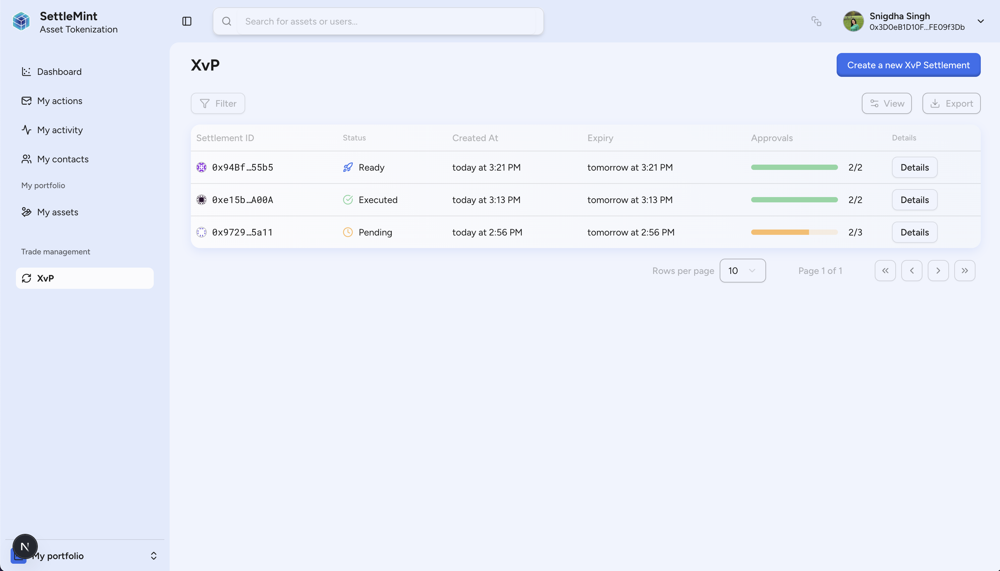
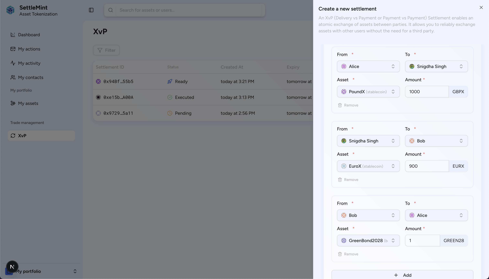
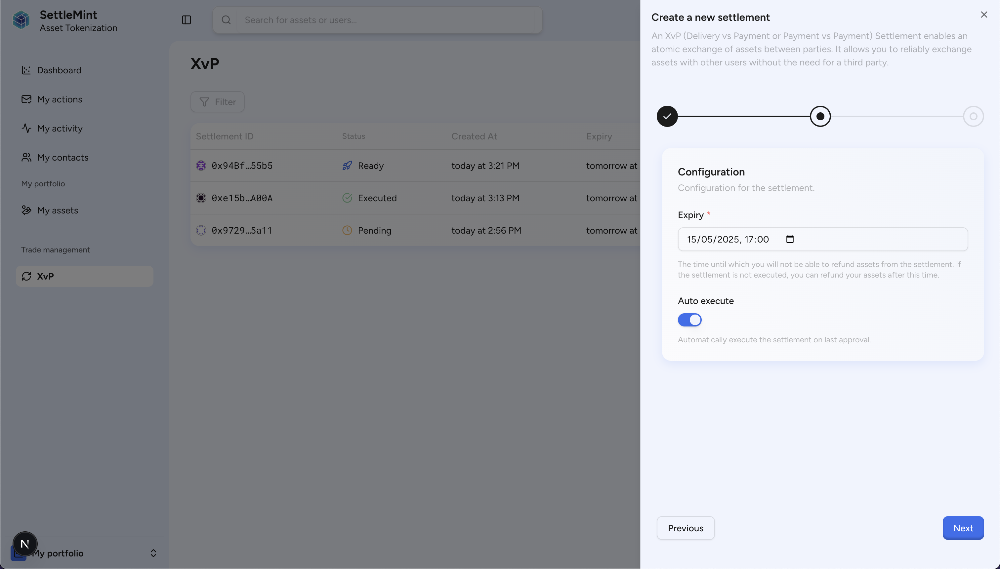
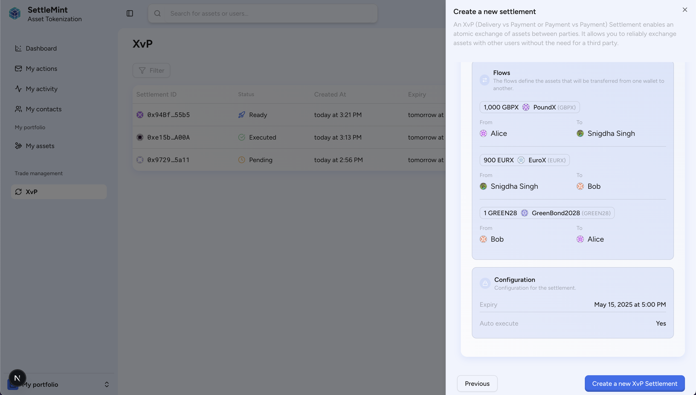
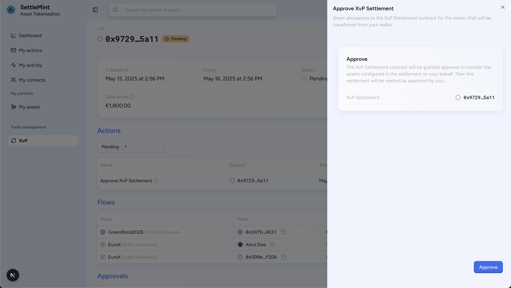
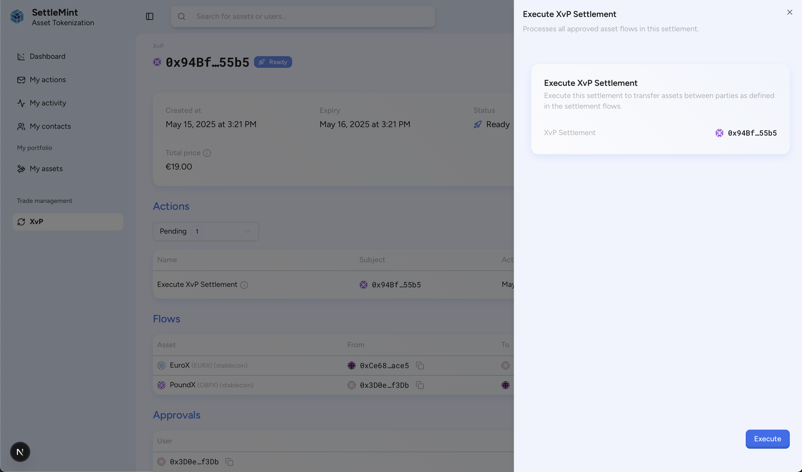
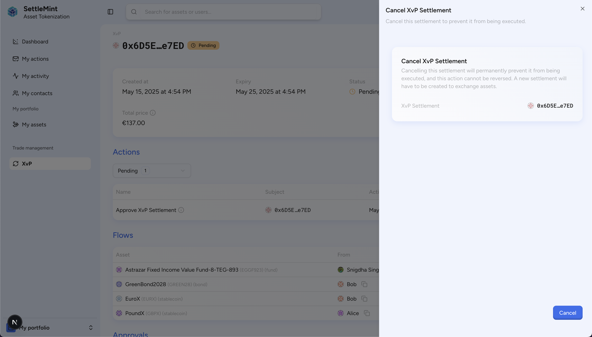

import { Callout } from "fumadocs-ui/components/callout";
import { Card } from "fumadocs-ui/components/card";
import {
  Clock,
  LayoutGrid,
  Workflow,
  ShieldCheck,
  FormInput,
  MonitorCheck,
  CalendarClock,
  FileCheck,
} from "lucide-react";

## What is X versus Payment Settlement?

The X versus Payment (XvP) Settlement is a solution enables atomic, trustless
settlements of digital assets between parties. This feature provides a mechanism
for executing delivery-versus-payment (DvP), payment-versus-payment (PvP), or
any asset-versus-asset exchange in a single, indivisible transaction.

### Key benefits

<Card
  icon={<LayoutGrid />}
  title="Multi-party transfers"
>
  Enable multiple participants to exchange various assets in a single atomic
  transaction.
</Card>

<Card icon={<Clock />} title="Conditional triggering">
  Execute settlements automatically when predefined conditions or time
  thresholds are met.
</Card>

<Card icon={<MonitorCheck />} title="Settlement monitoring">
  Track approvals, execution status, and transaction progress in real-time.
</Card>

<Card icon={<FileCheck />} title="Compliance integration">
  Enforce regulatory compliance across settlements through the upcoming SMART
  protocol.
</Card>

<Card icon={<CalendarClock />} title="Programmable settlement">
  Configure expiration dates and custom parameters to control settlement
  behavior.
</Card>

<Card icon={<Workflow />} title="Post-settlement actions">
  Configure automated notifications, emails, or workflows triggered upon
  settlement execution.
</Card>

## Creating an X versus Payment Settlement

To create a new X versus Payment Settlement, navigate to the XvP Settlement
section and click "Create new XvP Settlement." The creation interface allows you
to configure:

1. **Settlement flows**: Configure two or more flows, where each flow specifies:

   - **From**: The sending party's wallet address
   - **To**: The receiving party's wallet address
   - **Asset**: The digital asset to be transferred
   - **Amount**: The quantity of the asset to be transferred

   

2. **Expiry date**: The date after until which the settlement can be executed

3. **Auto-execute**: Whether to automatically execute the settlement on final
   approval

   

Lastly, review the settlement details and submit the transaction to deploy a new
XvP Settlement contract.

Compliance conditions for digital assets can be configured through the SMART
protocol (coming soon) directly on the assets themselves.

Once configured, submit the transaction to deploy a new XvP Settlement contract.
The newly created contract will appear in your settlement list for monitoring.

## Approving an X versus Payment Settlement

When you're involved in an X versus Payment Settlement as a sender, you'll need
to approve it before it can be executed. The approval process includes:

1. Granting the settlement contract an allowance to transfer the specified
   assets from your wallet
2. Then, sending your approval to the settlement contract itself

Once all involved parties have sent their approval, the settlement is ready to
be executed.

You can set up workflows for execution at a certain time or on other events.

## Execution phase of an X versus Payment Settlement

The execution phase is where the X versus Payment Settlement demonstrates its
value. During execution:

1. The settlement contract verifies all required approvals are in place
2. It checks that the settlement hasn't expired or been cancelled
3. It atomically transfers all assets between parties in a single transaction

If auto-execution is enabled during creation, the settlement contract will
automatically execute when the final party approves it. In this case, the last
approver pays the gas fees for the execution transaction.

## Cancelling an X versus Payment Settlement

Any involved party can cancel an X versus Payment Settlement before it has been
executed. This provides a safety mechanism if:

- Settlement parameters were incorrectly configured
- Market conditions changed before execution
- A party needs to withdraw from the agreement

Once a settlement is cancelled, it cannot be reactivated or executed.

## Settlement states

An X versus Payment Settlement can exist in one of the following states:

- **Pending**: Created but not yet fully approved by all parties
- **Ready**: Fully approved and ready for execution
- **Executed**: Successfully completed, with all assets transferred
- **Expired**: Past the cutoff date and no longer executable
- **Cancelled**: Explicitly cancelled by an involved party

These states help track the lifecycle of each settlement and provide clarity on
its current status.

## Technical implementation

The X versus Payment Settlement is powered by a secure smart contract that
follows best practices for atomic exchanges. The contract:

- Utilizes OpenZeppelin's security libraries
- Implements reentrancy protection
- Supports meta-transactions for gasless operations
- Includes comprehensive error handling
- Emits events for all key actions for auditability

Each settlement contract maintains its own state and manages the asset flows
between parties, ensuring settlement integrity and security.
