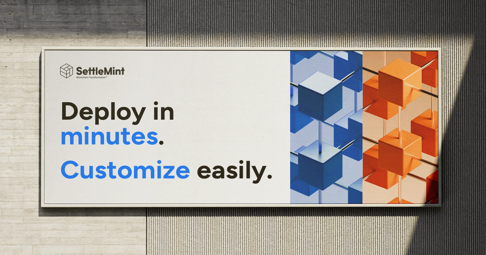

## SettleMint Application Kits

SettleMint Application Kits are designed to dramatically accelerate the
development of enterprise blockchain applications by providing pre-packaged,
full-stack solutions for common use cases. These kits bundle essential
components such as smart contract templates, pre-built decentralized application
(dApp) UIs, integration tools, and deployment configurations into ready-to-use
modules that can be launched in minutes and customized to fit specific business
needs.
  

Each Application Kit addresses a particular industry requirement or blockchain
pattern, such as asset tokenization, NFT issuance, supply chain traceability, or
secure data exchange. With built-in support for smart contract deployment,
on-chain/off-chain data flows, and secure API integrations, these kits reduce
the complexity of blockchain development while ensuring compliance, scalability,
and performance.
  

Developers benefit from low-code tooling, customizable open-source templates,
and real-time dashboards, while business users gain access to robust governance
features, analytics, and user management capabilities. Whether deployed in cloud
environments or on self-managed infrastructure, SettleMint’s Application Kits
offer a seamless path from idea to production, empowering teams to focus on
business innovation rather than technical implementation.
  

Read more about Asset Tokenization Kit here - [Asset Tokenization Kit](/application-kits/asset-tokenization/asset-tokenization-kit)