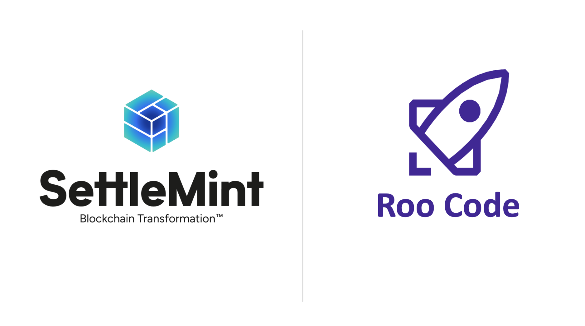
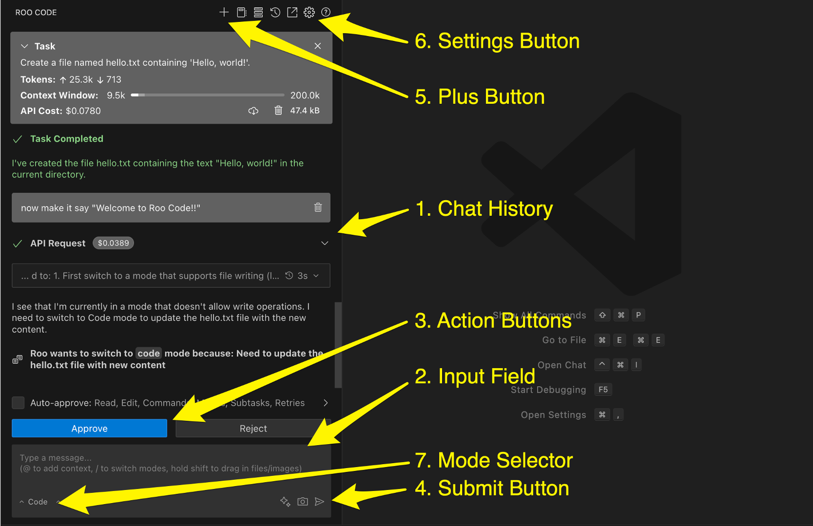

## AI code assistant

RooCode is an AI-powered coding assistant integrated into SettleMint's Code
Studio, replacing the former "AI Genie". It enhances Code Studio by introducing
a more versatile and powerful AI engine directly in your development
environment. With RooCode, you can generate and improve code using natural
language, leverage multiple AI models for different tasks, and even integrate
custom or local AI instances to meet your project's needs. This guide will walk
you through what RooCode is, how to set it up, and how to make the most of its
features.

### What is roocode and how does it enhance code studio?

RooCode is a next-generation AI assistant that lives in your Code Studio editor.
Think of it as your intelligent pair programmer: you can ask it to write code,
explain code, suggest improvements, or even create new project files – all
through simple prompts. Unlike the previous AI Genie (which was tied to a single
AI model), RooCode is built to be provider-agnostic and highly extensible. This
means it can connect to a range of AI models and services: • Multiple AI
Providers: Out of the box, RooCode supports popular AI providers like OpenAI
(GPT models), Anthropic (Claude), Google Vertex AI, AWS Bedrock, and more.
You're not limited to one AI engine; you can choose the model that best fits
your task for better results.

- Advanced Context Awareness: RooCode can handle larger context windows and
  smarter context management than before. It "remembers" more of your codebase
  and conversation history, which helps it generate responses that consider your
  entire project scope. In practice, you'll notice more coherent help even as
  your files grow or you switch between different parts of your project.
- Extensibility via MCP: RooCode supports the Model Context Protocol (MCP) , a
  framework that lets the AI assistant use external tools and services,
  including the [SettleMint MCP server](/platform-components/dev-tools/mcp).
  This is a big enhancement for Code Studio – it means the AI can potentially
  perform complex operations like looking up information in a knowledge base,
  running test suites, or controlling a web browser for web-related tasks, all
  from within the coding session. (By default, you'll only use these features if
  you choose to enable or add them, so the environment stays straightforward
  unless you need the extra power.)
- Seamless Code Studio Integration: RooCode is fully embedded in SettleMint's
  Code Studio interface. You can access it through the familiar chat or prompt
  interface. You can access it through the familiar chat or prompt panel. It
  works alongside your code in real-time – for example, you can highlight a
  piece of code and ask RooCode to explain or refactor it, and it will provide
  the answer or suggestion in seconds. This tight integration means your
  development workflow is smoother and more efficient, with AI help always at
  your fingertips.

In summary, RooCode enhances Code Studio by making the AI assistance more
powerful, flexible, and context-aware. Whether you're a developer looking for
quick code generation or an enterprise user needing compliance-friendly AI,
RooCode adapts to provide the best experience.

### Step-by-step setup and configuration

Getting started with RooCode in Code Studio is straightforward. Here's how to
set up and configure it for your needs:

1. Open Code Studio: Log in to the SettleMint Console and open your Code Studio
   environment. Ensure you have the latest version of the Code Studio where
   RooCode is available (if SettleMint releases updates, make sure your
   environment is updated). You should notice references to RooCode or AI
   Assistant in the IDE interface.
2. Access RooCode Settings: In Code Studio, locate the RooCode settings panel.
   This is accessible via an rocket icon the Code Studio toolbar. Click on that
   to open the configuration settings.
3. Choose an AI Provider: In the RooCode settings, you'll see an option to
   select your AI provider or model. RooCode supports many providers; common
   options include OpenAI, Anthropic, Google Vertex AI, AWS Bedrock, etc. Decide
   which AI service you want to use for generating suggestions. For instance, if
   you have an OpenAI API key and want to use GPT-4, select "OpenAI." If you
   prefer Anthropic's Claude, choose "Anthropic" from the dropdown. (You can
   change this later or even set up multiple profiles for different
   providers.) 4. Enter API Keys/Credentials: After selecting a provider, you'll
   need to provide the API key or credentials for that service:

   - For cloud providers like OpenAI or Anthropic: Enter your API key in the
     provided field. You might also need to specify any additional info (for
     example, an OpenAI Organization ID if applicable, or select the model
     variant from a list). RooCode's Anthropic integration, for example, will
     have a field for the Anthropic API Key and a dropdown to pick which Claude
     model to use.
   - If you choose OpenAI Compatible or custom endpoints (for instance, via a
     service like OpenRouter or Requesty that aggregates models), input the base
     URL or choose the service name, and then provide the corresponding API key.

   - For Azure OpenAI or enterprise-specific endpoints: you'll typically enter
     an endpoint URL and an API key (and possibly a deployment name) as required
     by that service. RooCode allows configuring a custom base URL for providers
     like Anthropic or OpenAI if needed, which is useful for enterprise proxies
     or Azure endpoints.

4. Configure Model and Settings: Once your key is in place, select the exact
   model or version you want to use. For example, choose "GPT-4" or a specific
   Claude variant from the model dropdown. You can also adjust any optional
   settings here:

   - Context Limit or Mode Settings: Some providers/models allow adjusting the
     maximum tokens or response length. RooCode might expose these or just
     manage them automatically. (By default, it optimizes context usage for
     you.)
   - MCP and Tools: If you plan to use advanced features, ensure that MCP
     servers are enabled in settings (this might be on by default). There may be
     an option like "Enable MCP Tools" or similar. If you don't need these, you
     can leave it as is. (Advanced users can add specific MCP server
     configurations later, this is optional and not required for basic usage.)
   - Profiles (Optional): RooCode supports multiple configuration profiles. You
     might see an option to create or switch "API Profiles." This is useful if
     you want to quickly switch between different providers or keys (say one
     profile for OpenAI, another for a local model). For now, using the default
     or a single profile is fine.

5. Save and Test: Save your settings (there might be a "Save" button or it may
   apply changes immediately). Now test RooCode to confirm it's working:
   - Look for the RooCode chat panel or command input in Code Studio. It might
     be a sidebar or bottom panel where you can type a prompt.
   - Try a simple prompt like: "Hello RooCode" or ask it to write a snippet,
     e.g., "// Prompt: write a Solidity function to add two numbers".
   - RooCode should respond with a code suggestion or answer. If it prompts for
     any permissions (like file access, since RooCode can write to files),
     approve it to allow the AI to assist with coding tasks.
   - If you get an error (e.g., unauthorized or no response), double-check your
     API key and internet connectivity, or see if the provider might have usage
     limits. Adjust keys or settings as needed.
   - With setup complete, you can now fully leverage RooCode in your development
     workflow. Use natural language to ask for code, explanations, or
     improvements. For example:
     - "Create a unit test for the above function." – RooCode will generate test
       code.
     - "I'm getting a validation error in this contract, can you help find the
       bug?" – RooCode can analyze your code and point out potential issues.
   - "Document this function." – RooCode will write documentation comments
     explaining the code.
   - You can interact with it as you code, and it will utilize the configured AI
     model to assist you. Feel free to adjust the provider or model as you see
     what works best for your project.

## Roo Code Interface

Components of the Chat Interface​ The chat interface consists of the following
main elements:

1. Chat History: This area displays the conversation history between you and Roo
   Code. It shows your requests, Roo Code's responses, and any actions taken
   (like file edits or command executions).
2. Input Field: This is where you type your tasks and questions for Roo Code.
   You can use plain English to communicate.
3. Action Buttons: These buttons appear below the input field and allow you to
   approve or reject Roo Code's proposed actions. The available buttons change
   depending on the context.
4. Send Button: This looks like a small plane and it's located to the far right
   of the input field. This sends messages to Roo after you've typed them.
5. Plus Button: The plus button is located at the top in the header, and it
   resets the current session.
6. Settings Button: The settings button is a gear, and it's used for opening the
   settings to customize features or behavior.
7. Mode Selector: The mode selector is a dropdown located to the left of the
   chat input field. It is used for selecting which mode Roo should use for your
   tasks.

### Key features and benefits of roocode

RooCode brings a rich set of features to improve your development experience in
Code Studio. Here are some of the highlights:

- Multiple AI Models & Providers: Connect RooCode to various AI backends. You're
  not locked into one AI engine – choose from OpenAI's GPT series, Anthropic's
  Claude, Google's PaLM/Gemini (via Vertex AI), or even open-source models
  through services like Ollama or LM Studio. This flexibility means you can
  leverage the strengths of different models (e.g., one might be better at
  Ollama or LM Studio. This flexibility means you can leverage the strengths of
  different models (e.g., one might be better at code completion, another at
  explaining concepts) as needed.
- 📚 Advanced Context Management: RooCode is designed to handle large codebases
  and lengthy conversations more gracefully. It uses intelligent context
  management to include relevant parts of your project when generating answers.
  For you, this means less time spent copy-pasting code to show the AI – RooCode
  will automatically consider the files you're working on and recent
  interactions. The result is more informed suggestions that truly understand
  your project's context.
- 🤖 MCP (Model Context Protocol) Support: One of the standout advanced features
  is RooCode's ability to use MCP. This allows the AI assistant to interface
  with external tools and services in a standardized way . For example, with an
  appropriate MCP server configured, RooCode could perform a task like searching
  your company's knowledge base, querying a database for a value, or running a
  custom script – all triggered by an AI command. This extends what the AI can
  do beyond text generation, turning it into a mini agent that can act on your
  behalf. (This is an optional power-user feature; you can use Code Studio and
  RooCode fully without ever touching MCP, but it's there for those who need to
  integrate with other systems.)
- 🛠 In-Editor Tools & Actions: RooCode comes with a variety of built-in
  capabilities accessible directly in the editor. It can read from and write to
  files in your project (with your permission), meaning it can create new code
  files or modify existing ones when you accept its suggestions. It can execute
  terminal commands in the Code Studio environment – useful for running tests or
  compiling code to verify solutions. It even has the ability to control a
  browser or other tools via MCP, as mentioned. These actions help automate
  routine tasks: imagine generating code and then automatically running your
  test suite to verify it, all through AI assistance.
- 🔒 Customization & Control: Despite its power, RooCode gives you control over
  the AI's behavior. You can set custom instructions (for example, telling the
  AI about project-specific guidelines or coding style preferences). You can
  also adjust approval settings – e.g., require manual approval every time
  RooCode tries to write to a file or run a command, or relax this for trusted
  actions to speed up your workflow. For enterprise scenarios, features like
  disabling MCP entirely or restricting certain actions are available for
  compliance (administrators can centrally manage these policies). This balance
  ensures you get helpful automation without sacrificing oversight.
- 🚀 Continuous Improvement: RooCode is regularly updated with performance
  improvements and new features. Being a part of the SettleMint platform means
  it's tested for our specific use cases (like blockchain and smart contract
  development) and tuned for reliability. Expect faster responses and new
  capabilities over time – for instance, support for the latest AI models as
  they become available, improved prompt handling, and more. All these benefits
  come to you automatically through platform updates.

Together, these features make RooCode a robust AI co-developer. You'll find that
repetitive tasks get easier, complex tasks become more approachable with AI
guidance, and your team's overall development speed and quality can increase.

### Integrating personal api keys and enterprise/local instances

One of the great advantages of RooCode is its flexibility in how it connects to
AI models. Depending on your needs, you can either use personal API keys for
public AI services, or leverage local/enterprise instances for more control.
Here's how to manage those scenarios:

- Using Your Own API Keys: If you have your own accounts with AI providers (such
  as an OpenAI API subscription or access to Anthropic's Claude), you can plug
  those credentials into RooCode. In the RooCode settings profile, select the
  provider and enter your API key (as described in the setup steps). This will
  make Code Studio use your allotment of that AI service for all AI completions
  and chats. The benefit is that you can tailor which model and version you use
  (and often get the newest models immediately), and you have full visibility
  into your usage via the provider's dashboard. For instance, you might use your
  OpenAI key to get GPT-4's latest features. RooCode will respect any rate
  limits or quotas on your key, and you'll be billed by the provider according
  to your plan with them (if applicable). This approach is ideal for individual
  power users or teams who want the best models and are okay managing their own
  API costs.

- Enterprise API Integrations: Enterprises often have special arrangements or
  requirements for AI usage – such as using Azure OpenAI Service, deploying
  models via AWS Bedrock, or using a private endpoint hosted in a secure
  environment. RooCode supports these cases. You can configure a custom base URL
  and API key to point RooCode to your enterprise's AI endpoint. For example, if
  your company uses Azure OpenAI, you'd select "OpenAI Compatible" and provide
  the Azure endpoint URI and key. Similarly, for AWS Bedrock, choose the Bedrock
  option and enter the necessary credentials. By doing so, all AI requests from
  Code Studio will route through those enterprise channels, ensuring compliance
  with your org's data policies (no data leaves your approved environment). This
  is crucial for sectors with strict data governance – you get the convenience
  of AI coding assistance while keeping data management in line with internal
  rules.

- Local Instances (Offline/On-Premises Use): RooCode can also work with local AI
  models running on your own hardware. This is a powerful feature if you need
  full offline capability or extra privacy. Using a tool like Ollama or LM
  Studio via AWS Bedrock, or using a private endpoint hosted in a secure
  environment. RooCode supports these cases. You can configure a custom base URL
  and API key to point RooCode to your enterprise's AI endpoint. For example, if
  your company uses Azure OpenAI, you'd select "OpenAI Compatible" and provide
  the Azure endpoint URI and key. Similarly, for AWS Bedrock, choose the Bedrock
  option and enter the necessary credentials. By doing so, all AI requests from
  Code Studio will route through those enterprise channels, ensuring compliance
  with your org's data policies (no data leaves your approved environment). This
  is crucial for sectors with strict data governance – you get the convenience
  of AI coding assistance while keeping data management in line with internal
  rules.

- Local Instances (Offline/On-Premises Use): RooCode can also work with local AI
  models running on your own hardware. This is a powerful feature if you need
  full offline capability or extra privacy. Using a tool like Ollama or LM
  Studio , you can host language models on a local server that mimics the
  OpenAI API. In RooCode's settings, you would choose a "Local" provider option
  (for instance, LM Studio appears as an option) and set the base URL to your
  local server (often something like http://localhost:PORT with no API key
  needed or a token if the local server requires one). Once configured, RooCode
  will send all requests to the local model, meaning your code and queries never
  leave your machine. Keep in mind, running local models may require a powerful
  computer, and the AI's performance depends on the model you use (some
  open-source models are smaller than the big cloud ones). Still, this option is
  fantastic for experimentation, working offline, or ensuring absolute
  confidentiality for sensitive code.

- Switching and Managing Configurations: Through RooCode's configuration
  profiles feature , you can maintain multiple setups. For instance, you might
  have one profile called "Personal-OpenAI" with your OpenAI key and GPT-4,
  another called "Enterprise-Internal" for your company's endpoint, and a third
  called "Local-LLM" for a model on your machine. In Code Studio, you can
  quickly switch between these depending on the project or context. This
  flexibility means you're never locked in – you can always choose the best
  route for AI assistance on a case-by-case basis.

> Tip: Always ensure that when using external API keys or services, you follow
> the provider's usage policies and secure your keys. Never commit API keys into
> your code repositories. Set them via the Code Studio interface or environment
> variables if supported. SettleMint's platform will store any keys you enter in
> a secure way, but it's good practice to manage and rotate keys periodically.
> For enterprise setups, work with your system administrators to obtain the
> correct endpoints and credentials.

By integrating your own keys or instances with RooCode, you essentially bring
your preferred AI brain into SettleMint's Code Studio. This empowers you to use
the AI on your terms – whether prioritizing cost, performance, or compliance.
It's all about giving you the choice.

### Conclusion and next steps

RooCode dramatically expands the AI capabilities of SettleMint Code Studio,
making it a versatile assistant for blockchain development and beyond. We've
covered what RooCode is, how to get it up and running, its key features, and how
to tailor it to your environment. As you start using RooCode, you may discover
new ways it can help in your daily coding tasks – don't hesitate to explore
features like custom modes or ask RooCode itself for tips on how it can assist
you best!

For more detailed technical information, troubleshooting, and advanced tips,
check out the (official RooCode documentation)[https://docs.roocode.com]. The
RooCode community is also active – you can find resources like FAQ pages or
community forums (e.g., RooCode's Discord or subreddit) via the documentation
site if you're interested in deep dives or sharing experiences.
