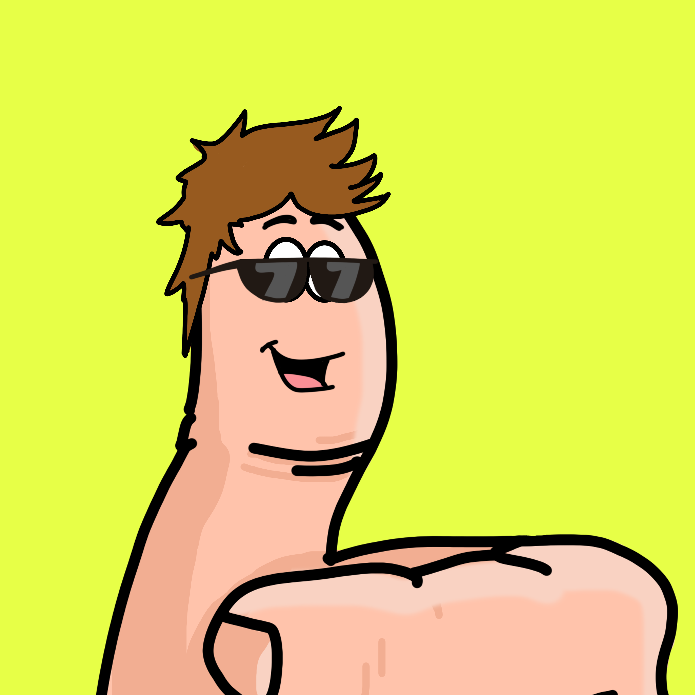

ERC-721 tokens are blockchain-based assets, issued on issued on all EVM compatible blockchain networks such as Arbitrum, that have value and can be sent and received. Contrary to the ERC-20 tokens, these ERC-721 tokens are non- fungible, meaning that two tokens from the same smart contract are not equivalent.

Non-fungible tokens, or NFTs, are digitally unique, no two NFTs are the same. For example, if Alice and Bob exchange their NFTs, one of them might feel unlucky as their new token is worth less than their previous ones. NFTs give the ability to assign or claim ownership of any unique piece of digital data, trackable on the blockchain. It can be created from digital objects, as a representation of digital or non-digital assets.

Examples of what an NFT can represent are real estate properties, collectibles, event tickets, music videos, and artwork.

The SettleMint platform comes with three ERC-721 contract sets.

- The first one, simply called **ERC-721 Token**, has all the functionalities to create the token, but it has no specific asset attached to it. It is up to you to create one. The optimised **ERC-721a Token** provides significant gas savings for minting multiple NFTs in a single transaction.
- The second set, called **ERC-721 trading cards**, show you how you can create trading cards with different scarcities.
- Finally, the third set, called **ERC-721 Generative Art**, demonstrates how you can automatically create images by combining several layers of assets. This is the process that was used to create famous NFT collections such as the Bored Ape Yacht Club or the Cryptopunks.

The trading cards and the generative art sets are extensions of the ERC-721 Token set. The specific features related to these two sets are presented in their respective sections.

## ERC-721 smart contract features

An ERC-721 smart contract is used to create non-fungible tokens and bring them to the blockchain.

The process of creating an ERC-721 has a few distinct phases. The smart contract sets define one such a process which is what we describe below. This is by no means the only way to run your ERC-721 project, if you plan not to follow the playbook below, you can use it to setup your own flow easily.

### Phase 0: Image generation

#### Generative Art

The image generation code for the generative art set is based on the [Hashlips Art Engine](https://github.com/HashLips/hashlips_art_engine), please check out the
README file in the `art_engine` folder on the usage instructions.

In short, replace the images in the `art_engine/layers` folder, change the settings in the `art_engine/src/config.js` file, and run `yarn artengine:build` to generate your images. Rinse and repeat until you are happy with the result. Note that the generated images are randomized
to prevent streaks of similar images, this can be configured in the `art_engine/src/config.js` file.

If you want to use the engine to generate a preview image run `yarn artengine:preview` for a static image and `yarn artengine:preview_gif` for a gif.

Using `yarn artengine:rarity` you can check the rarity of each generated image.

If you want to pixelate your images, use `yarn artengine:pixelate`, the settings are again in the `art_engine/src/config.js` file.

Not that the generated metadata does not have a real base uri set, after we have uploaded everything to IPFS, we can set it in the `art_engine/src/config.js` file and update all the metadata using `yarn artengine:update_info`.

The end result looks like this:


```json
{
  "name": "thumbzup #419",
  "image": "ipfs://bafybeihroeexeljv5yoyum2x4jz6riuqp6xwg6y7cg7jaumcdpyrjxg5zi",
  "attributes": [
    {
      "trait_type": "background",
      "value": "yellow"
    },
    {
      "trait_type": "body",
      "value": "thumb"
    },
    {
      "trait_type": "face",
      "value": "happy"
    },
    {
      "trait_type": "hair",
      "value": "long brown hair"
    },
    {
      "trait_type": "accessories",
      "value": "sunglasses"
    }
  ]
}
```

#### Trading Cards

The image generation code for Trading Cards is based on the a Hardhat task found in the `tasks` folder. This task is written especially for the
cards for this example project, but it should be fairly simple to adapt it to your needs.

In short, replace the images in the `assets/layers`