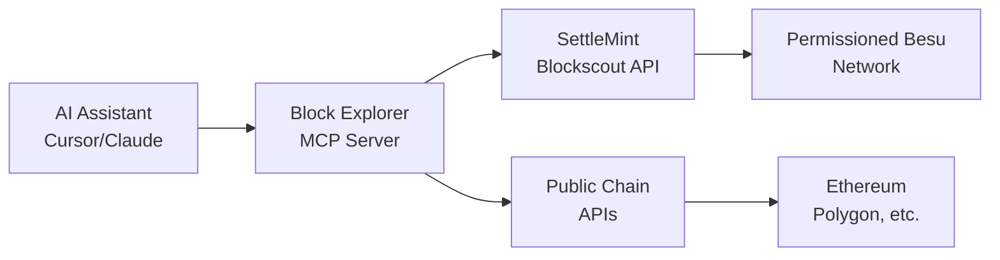

<Callout type="success" title="AI-Powered Blockchain Analysis">
**Who benefits:** Teams building or operating blockchain applications — developers, analysts, compliance, and operations — who need rapid, accurate on‑chain insights

**Technical breakthrough:** Query your permissioned SettleMint networks using natural language - no more complex API calls or block explorer clicking

**Business impact:** Faster, more reliable blockchain analysis, streamlined compliance reporting, and AI-assisted transaction pattern detection
</Callout>

## Transform Raw Blockchain Data Into Insights

Traditional block explorers require manual clicking, complex API calls, and technical knowledge. The Block Explorer MCP bridges this gap by enabling **natural language blockchain queries** through any MCP-compatible client (e.g., Cursor, Claude Desktop, Claude Code, Gemini clients with MCP, and others).

<Cards>
  <Card title="Natural Language Queries" description="Ask 'What tokens does address 0x... hold?' instead of navigating complex API documentation." />
  <Card title="Permissioned & Public Networks" description="Works seamlessly with your permissioned SettleMint Besu networks and public blockchains like Ethereum, Polygon, etc." />
  <Card title="Real-Time Analysis" description="Get instant answers about current blockchain state, not cached data from hours ago." />
  <Card title="AI-Powered Insights" description="The AI can identify patterns, suggest investigations, and provide context you might miss." />
</Cards>

## What Can You Ask Your Blockchain?

### 🔍 **Network Overview**
- *"What's happening on my SettleMint network?"*
- *"Show me the latest 5 blocks"*
- *"What's the current transaction volume?"*
- *"How many failed transactions occurred today?"*

### 📊 **Address Analysis**
- *"Get details for address 0x..."*
- *"What tokens does address 0x... hold?"*
- *"Show me all transactions for address 0x... today"*
- *"Is this address a smart contract or externally owned?"*

### 💰 **Transaction Investigation**
- *"Analyze transaction 0x..."*
- *"Show me large value transfers in the last 24 hours"*
- *"Find failed transactions and explain why they failed"*
- *"What smart contracts did this transaction interact with?"*

### 🪙 **Token & Contract Analysis**
- *"What ERC-20 tokens exist on my network?"*
- *"Show me NFT activity for the past week"*
- *"Get metadata for contract 0x..."*
- *"Find the most active smart contracts today"*

---

## Quick Start Guide

<Steps>

<Step>

### Install the Enhanced MCP Server

The SettleMint-enhanced version includes native support for permissioned networks with proper authentication.

```bash
# 1. Clone the SettleMint-enhanced MCP server
git clone https://github.com/settlemint/blockscout-mcp-server.git
cd blockscout-mcp-server

# 2. Install dependencies
pip install -e .

# 3. Verify installation
python3 -m blockscout_mcp_server --help
```

<Callout type="info" title="Automated Setup Available">
The MCP server includes a `setup.sh` script that automates the installation, configuration, and testing process. Run `./setup.sh` for guided setup.
</Callout>

</Step>

<Step>

### Configure Your SettleMint Network

**Create a `.env` file** with your SettleMint network details:

```bash
# Create from template
cp .env.example .env

# Edit with your favorite editor
nano .env
```

**Add your SettleMint configuration:**

```bash
# .env file (NEVER commit this to version control)
BLOCKSCOUT_SETTLEMINT_CHAIN_ID=YOUR_CHAIN_ID
BLOCKSCOUT_SETTLEMINT_BLOCKSCOUT_URL=https://your-explorer-url.settlemint.com/
BLOCKSCOUT_SETTLEMINT_APPLICATION_ACCESS_TOKEN=sm_aat_xxxxx
```

**📍 Where to find your values:**
- **Chain ID**: SettleMint Platform → [Network Manager](https://console.settlemint.com/documentation/platform-components/blockchain-infrastructure/network-manager) → Your Blockchain → Network Details
- **Blockscout URL**: SettleMint Platform → [Insights](https://console.settlemint.com/documentation/platform-components/blockchain-infrastructure/insights) → Block Explorer → Connect (copy URL without token)
- **Access Token**: SettleMint Platform → [Access tokens](https://console.settlemint.com/documentation/platform-components/security-and-authentication/application-access-tokens) → Create new token

</Step>

<Step>

### Configure Your AI Platform

<Tabs items={['Cursor IDE', 'Claude Desktop', 'Claude Code (VS Code)']}>
<Tab value="Cursor IDE">

**1. Create or edit `~/.cursor/mcp.json`:**

```json
{
  "mcpServers": {
    "settlemint-blockscout": {
      "command": "python3",
      "args": [
        "-m", "blockscout_mcp_server",
        "--http"
      ],
      "cwd": "/path/to/your/mcp-server"
    }
  }
}
```

<Callout type="warn" title="Important Cursor Configuration">
- The `--http` flag is **required** for Cursor integration
- Update the `"cwd"` path to your mcp-server directory
- **DO NOT** add environment variables here - they're loaded from `.env`
</Callout>

**2. Restart Cursor completely** (Cmd+Q on Mac, then reopen)

**3. Check for green MCP status indicator** in the bottom status bar

</Tab>
<Tab value="Claude Desktop">

**1. Create or edit `claude_desktop_config.json`:**
- Mac: `~/Library/Application Support/Claude/claude_desktop_config.json`
- Windows: `%APPDATA%\Claude\claude_desktop_config.json`

```json
{
  "mcpServers": {
    "settlemint-blockscout": {
      "command": "python3",
      "args": [
        "-m", "blockscout_mcp_server"
      ],
      "cwd": "/path/to/your/mcp-server"
    }
  }
}
```

**2. Update the `"cwd"` path** to your mcp-server directory

**3. Restart Claude Desktop** → Look for 🔌 connection indicator

</Tab>
<Tab value="Claude Code (VS Code)">

**1. Open VS Code → Settings → search "Claude MCP" → "Edit in settings.json"**

**2. Add to `settings.json`:**

```json
{
  "claude.mcpServers": {
    "settlemint-blockscout": {
      "command": "python3",
      "args": ["-m", "blockscout_mcp_server"],
      "cwd": "/path/to/your/mcp-server"
    }
  }
}
```

**3. Update the `"cwd"` path** to your mcp-server directory

**4. Reload Window** → Claude Code will auto-connect to the MCP server

</Tab>
</Tabs>

</Step>

<Step>

### Test Your Setup

**1. Run the connection test script:**
```bash
cd /path/to/your/mcp-server
python3 test_connection.py
```

You should see:
```
✅ Configuration Check
✅ Resolved URL
✅ Latest block: #[block_number]
✅ Connection Test Successful!
```

**2. Ask your AI assistant:**
```
"What's the latest block on chain 40319?"
```
(Replace 40319 with your actual chain ID)

You should see the MCP server automatically connect and return current blockchain data!

</Step>

</Steps>

---

## Advanced Use Cases

<Accordions>
<Accordion title="Smart Contract Monitoring & Analysis">

**Monitor contract activity and behavior patterns:**

```
"Show me all events from contract 0x... in the last 24 hours"
"What functions were called on contract 0x... today?"
"Find unusual transaction patterns for this smart contract"
"Compare gas usage patterns between different contract calls"
```

**AI-powered insights:**
- Detect anomalous contract behavior
- Identify gas optimization opportunities  
- Monitor contract upgrade patterns
- Track user interaction trends

</Accordion>

<Accordion title="Compliance & Regulatory Reporting">

**Generate compliance reports with natural language:**

```
"Find all transactions above $10,000 value equivalent this week"
"Show me cross-border transactions for compliance review"
"Generate a daily transaction summary for regulatory reporting"
"Identify potentially suspicious transaction patterns"
```

**Automated reporting benefits:**
- Instant compliance dashboard generation
- Pattern recognition for suspicious activity
- Automated regulatory filing preparation
- Real-time risk assessment

</Accordion>

<Accordion title="DeFi & Token Analysis">

**Analyze DeFi protocols and token movements:**

```
"What's the total volume of token X traded today?"
"Show me all DEX transactions in the last hour"
"Find arbitrage opportunities between different token pairs"
"Analyze liquidity provider activity"
```

**DeFi insights:**
- Real-time liquidity monitoring
- MEV (Maximal Extractable Value) detection
- Token price impact analysis
- Yield farming optimization

</Accordion>

<Accordion title="Network Health & Performance">

**Monitor your blockchain network performance:**

```
"What's the average block time over the last 100 blocks?"
"Show me transaction success rate trends"
"Find the most gas-intensive transactions today"
"Analyze network congestion patterns"
```

**Network optimization:**
- Performance bottleneck identification
- Gas price optimization strategies
- Transaction throughput analysis
- Network capacity planning

</Accordion>
</Accordions>

---

## Architecture Overview

The Block Explorer MCP creates a seamless bridge between AI assistants and your SettleMint blockchain infrastructure:



**Key Components:**

1. **AI Assistant Layer**: Natural language interface (Cursor IDE, Claude Desktop)
2. **MCP Protocol Bridge**: Translates AI requests into blockchain API calls
3. **SettleMint Authentication**: Token-based auth via query parameters (`?token=`)
4. **Security**: Credentials stored in `.env` file, never in configuration files
5. **Multi-Chain Support**: Works with both permissioned SettleMint and public networks

---

## Troubleshooting

### Common Issues & Solutions

<Accordions>
<Accordion title="MCP Server Not Starting">

**Symptoms:** AI assistant shows no blockchain tools available

**Solutions:**
1. **Check Python installation:** `python3 --version` (requires 3.11+)
2. **Verify MCP server install:** `python3 -m blockscout_mcp_server --help`
3. **For Cursor:** Ensure you included the `--http` flag in args
4. **Test configuration:** Validate JSON syntax in `~/.cursor/mcp.json`
5. **Completely quit and restart** your AI platform (not just reload)

</Accordion>

<Accordion title="Permissioned Network Connection Failed">

**Symptoms:** "Chain not found" or authentication errors

**Solutions:**
1. **Verify Chain ID:** Must match exactly (e.g., 40319)
2. **Check Access Token:** Ensure it's valid and not expired
   - Use Application tokens (`sm_aat_`) for production
   - Platform tokens (`sm_pat_`) work but have broader scope
3. **Confirm Blockscout URL:** Should NOT include the token in the URL
4. **Clear cache:** Restart the MCP server if you see cached "not found" errors
5. **Authentication method:** The server uses `?token=` query parameters, not headers

**Debug command:**
```bash
# Test with your actual values
curl "http://localhost:8000/v1/get_latest_block?chain_id=40319"
```

</Accordion>

<Accordion title="Slow Response Times">

**Symptoms:** Queries taking 30+ seconds to respond

**Solutions:**
1. **Check network latency:** Permissioned networks may have geographic delays
2. **Optimize query scope:** Ask for specific time ranges instead of "all time"
3. **Use pagination:** For large datasets, request smaller chunks
4. **Monitor API limits:** SettleMint may have rate limiting

</Accordion>

<Accordion title="Missing Transaction Data">

**Symptoms:** Recent transactions not appearing in results

**Solutions:**
1. **Check indexing delay:** Blockscout may take 1-2 minutes to index new blocks
2. **Verify block confirmations:** Very recent transactions might not be finalized
3. **Confirm transaction success:** Failed transactions may not appear in some queries
4. **Check address format:** Ensure proper checksum formatting for addresses

</Accordion>
</Accordions>

---

## What's Next?

Ready to supercharge your blockchain analysis? Here are some power-user tips:

### 🎯 **Combine with Other SettleMint Tools**
- Use alongside [SettleMint MCP](/docs/blockchain-and-ai/mcp) for infrastructure management
- Integrate with [AI Code Assistant](/docs/blockchain-and-ai/ai-code-assistant) for smart contract development
- Monitor with [Blockchain Insights](/docs/blockchain-and-ai/open-ai-nodes-and-pg-vector) for advanced analytics
- Deploy contracts using [Application Kits](/docs/application-kits) templates


<Callout type="info" title="Need Help?">
For assistance, please contact [SettleMint Support](mailto:support@settlemint.com) or visit the [Support Documentation](https://console.settlemint.com/documentation/support).
</Callout>
