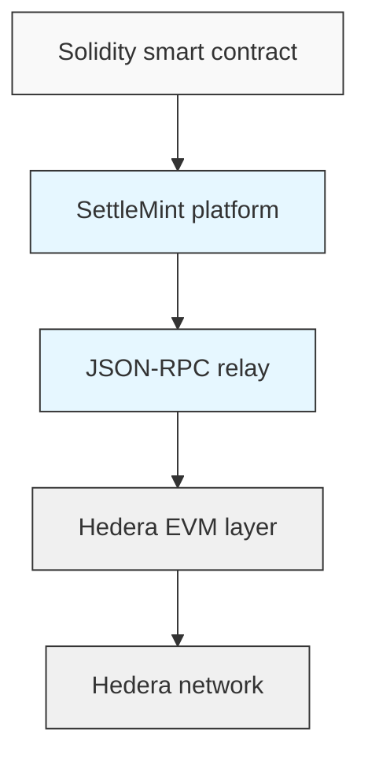
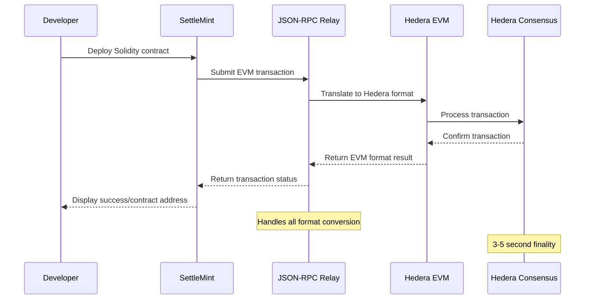

<Callout type="info">
  For a comprehensive overview of Hedera as a supported blockchain, visit our
  [Hedera network
  overview](/documentation/supported-blockchains/L1-public-networks/hedera).
</Callout>

## Using Hedera with EVM compatibility

When working with Hedera through SettleMint, you'll be using Hedera's EVM
compatibility layer. This means:

- Your smart contracts are written in **standard Solidity**
- Addresses follow the Ethereum **0x format** rather than Hedera's native 0.0.x
  format
- You can use **SettleMint's code studio IDE** and existing smart contract
  templates directly with Hedera
- Deploy using **SettleMint's built-in tools** (task manager, SDK, CLI) with the
  same workflow as other EVM chains

This EVM compatibility layer acts as a bridge between Ethereum's developer
experience and Hedera's performance advantages, allowing you to deploy the same
contracts you'd use on Ethereum while benefiting from Hedera's speed and lower
costs.

<Callout type="info">
  While working through the SettleMint platform, you don't need to worry about
  the complexities of Hedera's native format - all conversion between EVM and
  native Hedera formats is handled automatically.
</Callout>

## What is Hedera?

Hedera is an enterprise-grade public network that offers the security of
blockchain with significantly faster transaction speeds and lower costs. Built
on the hashgraph consensus algorithm, Hedera provides a foundation for
developers to create decentralized applications with predictable performance.

### Key features

- **High throughput**: Processes thousands of transactions per second
- **Fast finality**: Transactions finalize in 3-5 seconds
- **Low, predictable fees**: Transaction costs significantly lower than
  traditional blockchains
- **Enterprise governance**: Governed by a council of global organizations
- **Energy efficient**: Uses proof-of-stake with minimal environmental impact

For more information, please refer to the
[Hedera documentation](https://docs.hedera.com/hedera)

## Hedera's EVM compatibility

Hedera offers full Ethereum Virtual Machine (EVM) compatibility, enabling
developers to deploy and interact with smart contracts using familiar Solidity
code and Ethereum tools. This compatibility layer provides the best of both
worlds:

- **Ethereum developer experience**: Use standard Solidity and existing Ethereum
  tools
- **Hedera's performance benefits**: Leverage high throughput and low fees
- **No lock-in**: Your smart contracts work across EVM-compatible chains

## High-level differences: Hedera vs. Ethereum

The following table highlights foundational differences that may affect your
smart contract development workflow:

| **Feature**                      | **Hedera**                                                                                                                                                   | **Ethereum**                                                                        |
| -------------------------------- | ------------------------------------------------------------------------------------------------------------------------------------------------------------ | ----------------------------------------------------------------------------------- |
| **Consensus mechanism**          | Asynchronous Byzantine Fault Tolerance (aBFT), Proof of Stake (PoS)                                                                                          | Byzantine Fault Tolerance (BFT), Proof of Stake (PoS)                               |
| **Transaction fees**             | Low and predictable fees                                                                                                                                     | Variable gas fees; can be high during network congestion                            |
| **Governance model**             | Governed by the Hedera Governing Council, comprising leading global organizations                                                                            | Decentralized; governed by the Ethereum community                                   |
| **Native token**                 | HBAR                                                                                                                                                         | ETH                                                                                 |
| **Token standard**               | Supports ERC-20 and ERC-721 standards, with Hedera Token Service (HTS) for native token issuance and management without smart contracts                      | ERC-20 and ERC-721 standards for fungible and non-fungible tokens                   |
| **Network state data structure** | Virtual Merkle Tree                                                                                                                                          | Merkle Patricia Trie                                                                |
| **Historical data**              | Off-chain mirror nodes provide access to historical data and state queries                                                                                   | On-chain `stateRoot`; historical data can be accessed through the blockchain        |
| **Key management**               | Supports ED25519 (Hedera-native accounts), ECDSA (secp256k1), and complex keys (keylist and threshold)                                                       | Accounts are managed using ECDSA (secp256k1) keys                                   |
| **Network upgrades**             | Upgrades are proposed through Hedera Improvement Proposals (HIPs) and governed by the Hedera Governing Council. Upgrades are backward compatible, not forks. | Upgrades are proposed and implemented through Ethereum Improvement Proposals (EIPs) |

## SettleMint's Hedera integration

SettleMint has built a complete, managed infrastructure layer that makes
developing on Hedera's EVM as simple as developing on any other EVM chain:

- **Fully managed infrastructure**: No need to configure complex Hedera
  components
- **Zero-setup JSON-RPC relay**: Direct connection to Hedera through standard
  Ethereum interfaces
- **Built-in mirror nodes**: Query blockchain data through familiar APIs

<Callout type="info">
  SettleMint handles all the complexity of connecting to Hedera behind the
  scenes, allowing you to focus on your application's business logic rather than
  infrastructure.
</Callout>

## Transaction flow: how it works

When you deploy or interact with a smart contract on Hedera through SettleMint,
here's what happens:

This seamless flow enables you to use standard Web3 libraries, frameworks, and
tools while benefiting from Hedera's performance and security.

## Networks available in SettleMint

SettleMint provides access to both Hedera networks:

- **Hedera mainnet**: Production environment with real HBAR tokens
- **Hedera testnet**: Development environment with free test HBAR

<Callout type="tip">
  For development and testing, always start with testnet. You can get free test
  HBAR from the Hedera Portal at [portal.hedera.com](https://portal.hedera.com).
</Callout>

## Getting started with Hedera on SettleMint

To begin building on Hedera through SettleMint:

1. [Set up your SettleMint workspace and application](/documentation/building-with-settlemint/hedera-hashgraph-guide/create-an-application)
2. Configure your Hedera network connection
3. Add private keys and obtain HBAR
4. Deploy your smart contracts with familiar tools

The subsequent guides will walk you through each step in detail.

<Callout type="warning">
  When deploying your first contract to Hedera, you might experience slightly
  longer deployment times than on other EVM chains. This is normal due to the
  conversion between EVM and Hedera's native transaction format.
</Callout>
