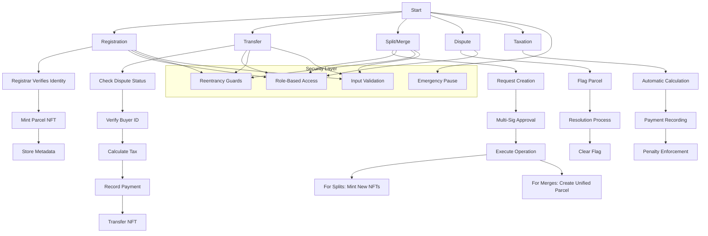

A land registry smart contract in Solidity can handle the registration,
transfer, split, and merge of land parcels, including details for land and
multistory buildings. It ensures security through role-based access control and
tracks essential information like area, GPS coordinates, and buyer/seller
details, while addressing privacy concerns by hashing sensitive data like
national IDs.

## Disclaimer

This smart contract implementation is provided for educational and illustrative
purposes only. It represents a conceptual framework for blockchain-based land
registry systems.

Key considerations before any production use:

- **Legal Compliance**: Land registration systems are highly regulated and vary
  significantly by jurisdiction. This implementation would require substantial
  modification to meet specific legal requirements in any given location.

- **Security Review**: The contract should undergo comprehensive security
  auditing by qualified blockchain security professionals before handling real
  property or financial transactions.

- **No Warranty**: The authors and contributors disclaim all liability for any
  use of this software. Users assume all risks associated with implementation
  and operation.

- **Consultation Required**: Any organization considering use of this technology
  should obtain advice from qualified legal counsel, real estate professionals,
  and blockchain security experts before deployment.


#### Contract Features

- **Registration and Ownership:** Only authorized registrars can register new
  land parcels, specifying area, GPS coordinates (as polygons), jurisdiction,
  and initial owner. Owners can transfer parcels, ensuring the new owner has
  verified details.
- **Transfer and Transactions:** Transfers record buyer and seller addresses,
  with transaction history logged on-chain, accessible via events for auditing.
- **Split and Merge:** Registrars manage splitting parcels into smaller ones or
  merging adjacent parcels, ensuring area consistency, which is crucial for land
  management.
- **Building Details:** Multistory buildings are tracked per parcel, including
  name, number of stories, and area, supporting comprehensive property records.
- **Security and Access:** Roles like registrar and dispute resolver control
  critical operations, with modifiers ensuring only authorized parties can act,
  enhancing security.
- **Dispute and Jurisdiction:** The contract flags disputes, managed by dispute
  resolvers, and records jurisdiction, aiding legal compliance.
- **Taxes:** The contract tracks tax payment status and history for each parcel,
  ensuring compliance with fiscal regulations.
- **Inheritance:** The contract supports ownership transfers via inheritance,
  enabling updates upon verified inheritance events, aligning with succession
  laws.

```solidity

// SPDX-License-Identifier: MIT
pragma solidity ^0.8.19;

import "@openzeppelin/contracts/token/ERC721/ERC721.sol";
import "@openzeppelin/contracts/token/ERC721/extensions/ERC721Enumerable.sol";
import "@openzeppelin/contracts/token/ERC721/extensions/ERC721URIStorage.sol";
import "@openzeppelin/contracts/access/AccessControl.sol";
import "@openzeppelin/contracts/security/ReentrancyGuard.sol";
import "@openzeppelin/contracts/security/Pausable.sol";
import "@openzeppelin/contracts/utils/Counters.sol";
import "@openzeppelin/contracts/utils/math/SafeMath.sol";
import "@openzeppelin/contracts/utils/cryptography/ECDSA.sol";
import "@openzeppelin/contracts/utils/cryptography/draft-EIP712.sol";

contract LandRegistry is
    ERC721,
    ERC721Enumerable,
    ERC721URIStorage,
    AccessControl,
    ReentrancyGuard,
    Pausable,
    EIP712
{
    using Counters for Counters.Counter;
    using SafeMath for uint256;
    using ECDSA for bytes32;

    // ========== CONSTANTS ==========
    bytes32 public constant REGISTRAR_ROLE = keccak256("REGISTRAR_ROLE");
    bytes32 public constant DISPUTE_RESOLVER_ROLE = keccak256("DISPUTE_RESOLVER_ROLE");
    bytes32 public constant TAX_AUTHORITY_ROLE = keccak256("TAX_AUTHORITY_ROLE");
    bytes32 public constant COURT_ROLE = keccak256("COURT_ROLE");

    // ========== STRUCTS ==========
    struct PaymentDetail {
        string paymentReference;
        string currency; // ISO 4217
        uint256 amount;
        bool isForeign;
        string sourceBank;
        string proofOfPayment;
        uint256 timestamp;
    }

    struct LandParcel {
        uint256 id;
        string parcelNumber;
        address owner;
        uint256 area; // sqm with 4 decimals
        string gpsPolygon; // GeoJSON
        string jurisdiction;
        string landUseType; // RESIDENTIAL/COMMERCIAL/AGRICULTURAL
        uint256 landRate; // Local currency per sqm
        bool hasDispute;
        uint256[] buildingIds;
        uint256[] parentParcels; // For merged/split parcels
        PaymentDetail[] paymentHistory;
        uint256 lastTaxPaid;
        string ipfsHash;
    }

    struct Building {
        uint256 id;
        string name;
        uint256 stories;
        uint256 builtArea;
        string constructionType;
    }

    struct SplitMergeRequest {
        uint256[] parcelIds;
        uint256[] newAreas;
        string[] newParcelNumbers;
        string[] newGpsPolygons;
        bool isMerge;
        bool approved;
        bytes[] approvalSignatures;
    }

    // ========== STATE VARIABLES ==========
    Counters.Counter private _parcelIdCounter;
    Counters.Counter private _buildingIdCounter;

    mapping(uint256 => LandParcel) private _parcels;
    mapping(uint256 => Building) private _buildings;
    mapping(string => bool) private _usedNationalIds;
    mapping(bytes32 => bool) private _usedSignatures;
    mapping(uint256 => SplitMergeRequest) private _splitMergeRequests;
    mapping(uint256 => uint256) private _parcelToRequest;

    uint256 public baseTaxRate = 100; // 1%
    uint256 public foreignTransferSurcharge = 200; // +2%
    uint256 public lateTaxPenalty = 50; // 0.5% per month
    uint256 public governanceApprovalThreshold = 2;

    // ========== EVENTS ==========
    event ParcelRegistered(uint256 indexed id, address owner);
    event ParcelTransferred(uint256 indexed id, address from, address to, uint256 taxPaid);
    event BuildingAdded(uint256 indexed parcelId, uint256 buildingId);
    event TaxPaid(uint256 indexed parcelId, uint256 amount, string currency);
    event DisputeFiled(uint256 indexed parcelId, string details);
    event DisputeResolved(uint256 indexed parcelId);
    event SplitRequested(uint256 indexed requestId, uint256 indexed originalParcelId);
    event MergeRequested(uint256 indexed requestId, uint256[] sourceParcelIds);
    event SplitCompleted(uint256 indexed requestId, uint256[] newParcelIds);
    event MergeCompleted(uint256 indexed requestId, uint256 newParcelId);

    // ========== MODIFIERS ==========
    modifier onlyRegistrar() {
        require(hasRole(REGISTRAR_ROLE, msg.sender), "Unauthorized: Registrar only");
        _;
    }

    modifier onlyTaxAuthority() {
        require(hasRole(TAX_AUTHORITY_ROLE, msg.sender), "Unauthorized: Tax authority only");
        _;
    }

    modifier noActiveRequest(uint256 parcelId) {
        require(_parcelToRequest[parcelId] == 0, "Parcel has active request");
        _;
    }

    // ========== CONSTRUCTOR ==========
    constructor()
        ERC721("NationalLandToken", "NLT")
        EIP712("LandRegistry", "1")
    {
        _setupRole(DEFAULT_ADMIN_ROLE, msg.sender);
        _setupRole(REGISTRAR_ROLE, msg.sender);
    }

    // ========== PAUSE/UNPAUSE FUNCTIONS ==========
    function pause() external onlyRole(DEFAULT_ADMIN_ROLE) {
        _pause();
    }

    function unpause() external onlyRole(DEFAULT_ADMIN_ROLE) {
        _unpause();
    }

    // ========== CORE FUNCTIONS ==========

    function registerParcel(
        address owner,
        string memory parcelNumber,
        uint256 area,
        string memory gpsPolygon,
        string memory jurisdiction,
        string memory landUseType,
        uint256 landRate,
        string memory nationalId,
        string memory ipfsHash,
        bytes memory kycSignature
    ) external onlyRegistrar nonReentrant returns (uint256) {
        require(!_usedNationalIds[nationalId], "National ID already registered");
        require(_verifyKYC(owner, nationalId, kycSignature), "KYC verification failed");

        uint256 parcelId = _parcelIdCounter.current();
        _parcelIdCounter.increment();

        _parcels[parcelId] = LandParcel({
            id: parcelId,
            parcelNumber: parcelNumber,
            owner: owner,
            area: area,
            gpsPolygon: gpsPolygon,
            jurisdiction: jurisdiction,
            landUseType: landUseType,
            landRate: landRate,
            hasDispute: false,
            buildingIds: new uint256[](0),
            parentParcels: new uint256[](0),
            paymentHistory: new PaymentDetail[](0),
            lastTaxPaid: 0,
            ipfsHash: ipfsHash
        });

        _mint(owner, parcelId);
        _setTokenURI(parcelId, ipfsHash);
        _usedNationalIds[nationalId] = true;

        emit ParcelRegistered(parcelId, owner);
        return parcelId;
    }

    // ========== PARCEL TRANSFER & TAXATION ==========
    function transferParcel(
        uint256 parcelId,
        address buyer,
        string memory buyerNationalId,
        PaymentDetail memory payment
    ) external onlyRegistrar nonReentrant noActiveRequest(parcelId) {
        require(!_parcels[parcelId].hasDispute, "Parcel has active dispute");
        require(!_usedNationalIds[buyerNationalId], "Buyer ID already registered");

        address seller = _parcels[parcelId].owner;

        // Calculate tax
        uint256 taxRate = payment.isForeign ?
            baseTaxRate.add(foreignTransferSurcharge) : baseTaxRate;
        uint256 taxAmount = payment.amount.mul(taxRate).div(10000);

        // Record payment and tax
        _parcels[parcelId].paymentHistory.push(payment);
        _parcels[parcelId].paymentHistory.push(PaymentDetail({
            paymentReference: string(abi.encodePacked("TAX-", payment.paymentReference)),
            currency: payment.currency,
            amount: taxAmount,
            isForeign: payment.isForeign,
            sourceBank: "National Treasury",
            proofOfPayment: string(abi.encodePacked("TAX-RECEIPT-", payment.paymentReference)),
            timestamp: block.timestamp
        }));
        _parcels[parcelId].lastTaxPaid = block.timestamp;

        // Execute transfer
        _transfer(seller, buyer, parcelId);
        _parcels[parcelId].owner = buyer;
        _usedNationalIds[buyerNationalId] = true;

        emit ParcelTransferred(parcelId, seller, buyer, taxAmount);
        emit TaxPaid(parcelId, taxAmount, payment.currency);
    }

    // ========== BUILDING MANAGEMENT ==========
    function addBuilding(
        uint256 parcelId,
        string memory name,
        uint256 stories,
        uint256 builtArea,
        string memory constructionType
    ) external onlyRegistrar returns (uint256) {
        uint256 buildingId = _buildingIdCounter.current();
        _buildingIdCounter.increment();

        _buildings[buildingId] = Building({
            id: buildingId,
            name: name,
            stories: stories,
            builtArea: builtArea,
            constructionType: constructionType
        });

        _parcels[parcelId].buildingIds.push(buildingId);
        emit BuildingAdded(parcelId, buildingId);
        return buildingId;
    }

    // ========== PARCEL SPLIT/MERGE ==========
    function requestSplit(
        uint256 parcelId,
        uint256[] memory newAreas,
        string[] memory newParcelNumbers,
        string[] memory newGpsPolygons
    ) external onlyRegistrar noActiveRequest(parcelId) {
        require(newAreas.length > 1, "Must split into at least 2 parcels");
        require(newAreas.length == newParcelNumbers.length, "Mismatched arrays");
        require(newAreas.length == newGpsPolygons.length, "Mismatched polygons");
        require(!_parcels[parcelId].hasDispute, "Parcel has dispute");

        uint256 requestId = uint256(keccak256(abi.encodePacked(parcelId, block.timestamp)));

        _splitMergeRequests[requestId] = SplitMergeRequest({
            parcelIds: _asSingletonArray(parcelId),
            newAreas: newAreas,
            newParcelNumbers: newParcelNumbers,
            newGpsPolygons: newGpsPolygons,
            isMerge: false,
            approved: false,
            approvalSignatures: new bytes[](0)
        });

        _parcelToRequest[parcelId] = requestId;
        emit SplitRequested(requestId, parcelId);
    }

    function requestMerge(
        uint256[] memory parcelIds,
        string memory newParcelNumber
    ) external onlyRegistrar {
        require(parcelIds.length > 1, "Need multiple parcels to merge");

        uint256 requestId = uint256(keccak256(abi.encodePacked(parcelIds[0], block.timestamp)));

        _splitMergeRequests[requestId] = SplitMergeRequest({
            parcelIds: parcelIds,
            newAreas: new uint256[](0),
            newParcelNumbers: _asSingletonArray(newParcelNumber),
            newGpsPolygons: new string[](0),
            isMerge: true,
            approved: false,
            approvalSignatures: new bytes[](0)
        });

        for (uint i = 0; i < parcelIds.length; i++) {
            require(_parcelToRequest[parcelIds[i]] == 0, "Parcel has active request");
            _parcelToRequest[parcelIds[i]] = requestId;
        }

        emit MergeRequested(requestId, parcelIds);
    }

    function approveRequest(
        uint256 requestId,
        bytes memory signature
    ) external onlyRegistrar {
        SplitMergeRequest storage request = _splitMergeRequests[requestId];
        require(!request.approved, "Already approved");

        bytes32 digest = _hashTypedDataV4(keccak256(abi.encode(
            keccak256("SplitMergeApproval(uint256 requestId,bool isMerge)"),
            requestId,
            request.isMerge
        )));
        require(!_usedSignatures[digest], "Signature already used");
        address signer = digest.recover(signature);
        require(hasRole(REGISTRAR_ROLE, signer), "Invalid signer");
        _usedSignatures[digest] = true;
        request.approvalSignatures.push(signature);

        if (request.approvalSignatures.length >= governanceApprovalThreshold) {
            _executeRequest(requestId);
        }
    }

    // ========== DISPUTE RESOLUTION ==========
    function fileDispute(uint256 parcelId, string memory details)
        external
        onlyRole(DISPUTE_RESOLVER_ROLE)
        noActiveRequest(parcelId)
    {
        _parcels[parcelId].hasDispute = true;
        emit DisputeFiled(parcelId, details);
    }

    function resolveDispute(uint256 parcelId)
        external
        onlyRole(DISPUTE_RESOLVER_ROLE)
    {
        _parcels[parcelId].hasDispute = false;
        emit DisputeResolved(parcelId);
    }

    // ========== TAX ADMINISTRATION ==========
    function setTaxRate(uint256 newRate) external onlyTaxAuthority {
        require(newRate <= 1000, "Exceeds maximum 10% tax rate");
        baseTaxRate = newRate;
    }

    function collectDelayedTax(uint256 parcelId, uint256 monthsDelayed)
        external
        onlyTaxAuthority
    {
        uint256 penalty = _parcels[parcelId].landRate
            .mul(_parcels[parcelId].area)
            .mul(lateTaxPenalty)
            .mul(monthsDelayed)
            .div(10000);

        _parcels[parcelId].paymentHistory.push(PaymentDetail({
            paymentReference: string(abi.encodePacked("PENALTY-", parcelId)),
            currency: "LOCAL",
            amount: penalty,
            isForeign: false,
            sourceBank: "Tax Authority",
            proofOfPayment: string(abi.encodePacked("PENALTY-INVOICE-", parcelId)),
            timestamp: block.timestamp
        }));

        emit TaxPaid(parcelId, penalty, "LOCAL");
    }

    // ========== VIEW FUNCTIONS ==========
    function getParcelDetails(uint256 parcelId) public view returns (
        LandParcel memory parcel,
        Building[] memory buildings,
        PaymentDetail[] memory payments
    ) {
        parcel = _parcels[parcelId];
        buildings = new Building[](parcel.buildingIds.length);

        for (uint256 i = 0; i < parcel.buildingIds.length; i++) {
            buildings[i] = _buildings[parcel.buildingIds[i]];
        }

        return (parcel, buildings, parcel.paymentHistory);
    }

    function getRequestDetails(uint256 requestId) public view returns (
        SplitMergeRequest memory request,
        LandParcel[] memory parcels
    ) {
        request = _splitMergeRequests[requestId];
        parcels = new LandParcel[](request.parcelIds.length);

        for (uint i = 0; i < request.parcelIds.length; i++) {
            parcels[i] = _parcels[request.parcelIds[i]];
        }
    }

    // ========== PRIVATE FUNCTIONS ==========
    function _executeRequest(uint256 requestId) private {
        SplitMergeRequest storage request = _splitMergeRequests[requestId];

        if (request.isMerge) {
            _executeMerge(requestId);
        } else {
            _executeSplit(requestId);
        }

        request.approved = true;
    }

    function _executeSplit(uint256 requestId) private {
        SplitMergeRequest storage request = _splitMergeRequests[requestId];
        uint256 originalParcelId = request.parcelIds[0];
        LandParcel storage original = _parcels[originalParcelId];

        uint256[] memory newParcelIds = new uint256[](request.newAreas.length);
        uint256 totalArea = 0;

        for (uint i = 0; i < request.newAreas.length; i++) {
            totalArea = totalArea.add(request.newAreas[i]);

            uint256 newParcelId = _parcelIdCounter.current();
            _parcelIdCounter.increment();

            _parcels[newParcelId] = LandParcel({
                id: newParcelId,
                parcelNumber: request.newParcelNumbers[i],
                owner: original.owner,
                area: request.newAreas[i],
                gpsPolygon: request.newGpsPolygons[i],
                jurisdiction: original.jurisdiction,
                landUseType: original.landUseType,
                landRate: original.landRate,
                hasDispute: false,
                buildingIds: new uint256[](0),
                parentParcels: _asSingletonArray(originalParcelId),
                paymentHistory: original.paymentHistory,
                lastTaxPaid: original.lastTaxPaid,
                ipfsHash: original.ipfsHash // Default to original IPFS hash; update off-chain if necessary
            });

            _mint(original.owner, newParcelId);
            _setTokenURI(newParcelId, original.ipfsHash);
            newParcelIds[i] = newParcelId;
        }

        require(totalArea == original.area, "Area mismatch in split");
        _burn(originalParcelId);
        emit SplitCompleted(requestId, newParcelIds);
    }

    function _executeMerge(uint256 requestId) private {
        SplitMergeRequest storage request = _splitMergeRequests[requestId];

        // Verify parcels can be merged
        uint256 totalArea = 0;
        address commonOwner = _parcels[request.parcelIds[0]].owner;
        string memory commonJurisdiction = _parcels[request.parcelIds[0]].jurisdiction;

        for (uint i = 0; i < request.parcelIds.length; i++) {
            LandParcel storage parcel = _parcels[request.parcelIds[i]];
            require(parcel.owner == commonOwner, "Different owners");
            require(keccak256(bytes(parcel.jurisdiction)) == keccak256(bytes(commonJurisdiction)), "Different jurisdictions");
            require(!parcel.hasDispute, "Parcel has dispute");

            totalArea = totalArea.add(parcel.area);
        }

        // Create merged parcel
        uint256 newParcelId = _parcelIdCounter.current();
        _parcelIdCounter.increment();

        _parcels[newParcelId] = LandParcel({
            id: newParcelId,
            parcelNumber: request.newParcelNumbers[0],
            owner: commonOwner,
            area: totalArea,
            gpsPolygon: "", // To be set by off-chain service
            jurisdiction: commonJurisdiction,
            landUseType: _parcels[request.parcelIds[0]].landUseType,
            landRate: _calculateAverageRate(request.parcelIds),
            hasDispute: false,
            buildingIds: _combineBuildingIds(request.parcelIds),
            parentParcels: request.parcelIds,
            paymentHistory: _combinePaymentHistories(request.parcelIds),
            lastTaxPaid: block.timestamp,
            ipfsHash: "" // To be updated off-chain
        });

        _mint(commonOwner, newParcelId);
        // Optionally, set token URI when IPFS hash is available
        _setTokenURI(newParcelId, "");

        // Burn original parcels
        for (uint i = 0; i < request.parcelIds.length; i++) {
            _burn(request.parcelIds[i]);
            _parcelToRequest[request.parcelIds[i]] = 0;
        }

        emit MergeCompleted(requestId, newParcelId);
    }

    function _calculateAverageRate(uint256[] memory parcelIds) private view returns (uint256) {
        uint256 total = 0;
        for (uint i = 0; i < parcelIds.length; i++) {
            total = total.add(_parcels[parcelIds[i]].landRate);
        }
        return total.div(parcelIds.length);
    }

    function _combineBuildingIds(uint256[] memory parcelIds) private view returns (uint256[] memory) {
        uint256 totalBuildings = 0;
        for (uint i = 0; i < parcelIds.length; i++) {
            totalBuildings = totalBuildings.add(_parcels[parcelIds[i]].buildingIds.length);
        }

        uint256[] memory combined = new uint256[](totalBuildings);
        uint256 counter = 0;

        for (uint i = 0; i < parcelIds.length; i++) {
            for (uint j = 0; j < _parcels[parcelIds[i]].buildingIds.length; j++) {
                combined[counter] = _parcels[parcelIds[i]].buildingIds[j];
                counter++;
            }
        }

        return combined;
    }

    function _combinePaymentHistories(uint256[] memory parcelIds) private view returns (PaymentDetail[] memory) {
        uint256 totalPayments = 0;
        for (uint i = 0; i < parcelIds.length; i++) {
            totalPayments = totalPayments.add(_parcels[parcelIds[i]].paymentHistory.length);
        }

        PaymentDetail[] memory combined = new PaymentDetail[](totalPayments);
        uint256 counter = 0;

        for (uint i = 0; i < parcelIds.length; i++) {
            for (uint j = 0; j < _parcels[parcelIds[i]].paymentHistory.length; j++) {
                combined[counter] = _parcels[parcelIds[i]].paymentHistory[j];
                counter++;
            }
        }

        return combined;
    }

    function _asSingletonArray(uint256 element) private pure returns (uint256[] memory) {
        uint256[] memory array = new uint256[](1);
        array[0] = element;
        return array;
    }

    function _verifyKYC(address, string memory, bytes memory) private pure returns (bool) {
        return true; // Integration with KYC provider should be implemented
    }

    // ========== OVERRIDES ==========
    function _beforeTokenTransfer(
        address from,
        address to,
        uint256 tokenId,
        uint256 batchSize
    ) internal override(ERC721, ERC721Enumerable) {
        super._beforeTokenTransfer(from, to, tokenId, batchSize);
        require(!paused(), "Transfers paused");
        require(!_parcels[tokenId].hasDispute, "Parcel has dispute");
        require(_parcelToRequest[tokenId] == 0, "Parcel in split/merge process");
    }

    function _burn(uint256 tokenId) internal override(ERC721, ERC721URIStorage) {
        super._burn(tokenId);
    }

    function tokenURI(uint256 tokenId)
        public
        view
        override(ERC721, ERC721URIStorage)
        returns (string memory)
    {
        return super.tokenURI(tokenId);
    }

    function supportsInterface(bytes4 interfaceId)
        public
        view
        override(ERC721, ERC721Enumerable, AccessControl)
        returns (bool)
    {
        return super.supportsInterface(interfaceId);
    }
}
```

## 1. Introduction

### 1.1 Purpose and Context

This smart contract represents a decentralized land registry system built on
Ethereum blockchain technology. It serves as a tamper-proof solution for
recording, transferring, and managing ownership of land parcels and associated
buildings. The system transforms traditional paper-based land records into
non-fungible tokens (NFTs), providing immutable proof of ownership while
maintaining all critical property information on-chain.

The contract addresses several pain points in conventional land registry systems
including bureaucratic delays, fraudulent transactions, lack of transparency in
ownership history, and inefficient dispute resolution processes. By leveraging
blockchain technology, it creates a single source of truth for property
ownership that is accessible to all authorized parties while maintaining
necessary privacy controls.

## 2. Core Features

### 2.1 Parcel Lifecycle Management

The contract provides comprehensive tools for managing the entire lifecycle of
land parcels:

**Registration**: Each new land parcel is minted as an NFT containing all
relevant metadata including geographic boundaries (as GeoJSON polygons),
jurisdictional information, land use classification, and current valuation. The
registration process requires verification of both the property details and the
owner's identity through a KYC process.

**Transfers**: Ownership transfers are executed through a secure process that
automatically calculates and records applicable taxes. Each transfer maintains a
complete audit trail including payment details, tax calculations, and
participant information.

**Splitting and Merging**: The contract supports complex parcel modifications
through formal split and merge operations. When a parcel is split, the new
smaller parcels maintain references to their parent parcel. Merged parcels
inherit characteristics from their source parcels while creating a new unified
property record.

### 2.2 Financial Compliance

The built-in taxation system handles:

**Automated Tax Calculations**: Transfers are subject to configurable tax rates
that can vary based on property type, location, and transaction type (domestic
vs. foreign). The system automatically calculates the tax due and creates
permanent records of payments.

**Penalty Enforcement**: For overdue tax payments, the system calculates and
applies penalties based on the duration of delinquency. These penalties are
recorded as separate transactions in the property's payment history.

**Payment Tracking**: Every financial transaction related to a property is
permanently recorded including payment references, bank details, currency
information, and timestamps. This creates a complete financial history for audit
and compliance purposes.

## 3. Technical Architecture

### 3.1 Inheritance Structure

The contract utilizes several OpenZeppelin base contracts:

```
ERC721 - For NFT-based land title representation
ERC721Enumerable - For efficient parcel indexing and listing
ERC721URIStorage - For decentralized metadata storage
AccessControl - For role-based permissions
ReentrancyGuard - For protection against reentrancy attacks
Pausable - For emergency circuit breaker functionality
EIP712 - For structured data signing
```

### 3.2 Role Definitions

| Role                  | Responsibilities                         | Key Functions                    |
| --------------------- | ---------------------------------------- | -------------------------------- |
| REGISTRAR_ROLE        | Property registration, transfer approval | registerParcel, approveTransfer  |
| DISPUTE_RESOLVER_ROLE | Dispute management                       | fileDispute, resolveDispute      |
| TAX_AUTHORITY_ROLE    | Tax configuration and collection         | setTaxRate, collectDelayedTax    |
| COURT_ROLE            | Legal oversight                          | verifyInheritance, enforceOrders |
| DEFAULT_ADMIN_ROLE    | System administration                    | grantRoles, pauseContract        |

## 4. Detailed Functionality



### 4.1 Parcel Registration Process

The registration workflow involves multiple verification steps:

1. **Data Submission**: A registrar submits the complete property details
   including geographic coordinates, legal description, and owner information.
   The coordinates must be provided as a valid GeoJSON polygon defining the
   parcel boundaries.

2. **Identity Verification**: The owner's national ID is checked against
   existing records to prevent duplicate registrations. A cryptographic
   signature verifies the owner's consent to the registration.

3. **Document Storage**: All supporting legal documents are stored on IPFS, with
   only the content hash recorded on-chain. This balances transparency with
   storage efficiency.

4. **NFT Minting**: Upon successful verification, a new NFT is minted to
   represent the property. This NFT contains all metadata and serves as the
   immutable ownership record.

### 4.2 Ownership Transfers

The transfer process ensures secure and compliant property transactions:

**Initiation**: Either the current owner or an authorized registrar initiates
the transfer by specifying the recipient and transaction details. For private
sales, this typically follows an off-chain agreement between parties.

**Verification**: The system confirms the property has no active disputes or
restrictions. The buyer's identity is verified through their national ID to
prevent fraudulent transactions.

**Tax Calculation**: The system automatically computes the applicable transfer
tax based on the property value and transaction type. Foreign transactions incur
an additional surcharge.

**Payment Recording**: All payment details are recorded including the
transaction reference, amount, currency, and participating financial
institutions. This creates an auditable money trail.

**NFT Transfer**: Only after all checks are completed and taxes recorded does
the actual NFT transfer occur, officially changing the property ownership.

## 5. Advanced Operations

### 5.1 Parcel Subdivision

The parcel splitting functionality enables:

**Geometric Division**: A single parcel can be divided into multiple smaller
parcels with custom boundaries. Each new parcel receives its own GeoJSON polygon
definition.

**Inherited Attributes**: New parcels maintain references to their parent parcel
and inherit key characteristics like jurisdiction and land use type unless
explicitly overridden.

**Tax Treatment**: The system automatically prorates any outstanding tax
obligations across the new parcels based on their relative sizes.

### 5.2 Parcel Consolidation

Merging adjacent parcels involves:

**Pre-Merge Validation**: The system verifies all parcels share common
ownership, are in the same jurisdiction, and have no active disputes or
restrictions.

**Combined Metadata**: The new merged parcel combines characteristics from its
source parcels. The area becomes the sum of all components, while the land use
type defaults to the most restrictive classification among the sources.

**Historical Preservation**: Even after merging, the complete lineage of the
property remains available through the parent parcel references.

## 6. Security Considerations

### 6.1 Protection Mechanisms

**Multi-Signature Controls**: Critical operations like parcel splits and merges
require approval from multiple authorized registrars. This prevents unilateral
actions that could affect property records.

**Dispute Locking**: Properties under legal dispute are automatically locked
against transfers or modifications until the dispute is formally resolved.

**Emergency Pausing**: The contract includes a circuit breaker that allows
authorized administrators to temporarily halt all operations in case of detected
vulnerabilities or system compromises.

### 6.2 Audit Capabilities

**Comprehensive History**: Every property maintains a complete chronological
record of all ownership changes, modifications, and financial transactions.

**Immutable Records**: Once recorded, no party can alter or delete historical
data, ensuring the integrity of the land registry.

**Transparent Access**: Authorized auditors can access the complete transaction
history of any property for verification and compliance purposes.

## 7. Integration and Deployment

### 7.1 System Requirements

**Blockchain Network**: Designed for Ethereum-compatible networks with support
for ERC-721 tokens and EIP-712 signatures.

**Off-Chain Components**: Requires integration with:

- IPFS for document storage
- KYC provider for identity verification
- Geographic information system for boundary validation

### 7.2 Deployment Process

1. **Contract Compilation**: Verify the contract compiles without errors in the
   target environment.

2. **Initial Deployment**: Deploy the contract to the chosen network with the
   appropriate constructor parameters.

3. **Role Configuration**: Establish the initial set of administrators and
   assign operational roles to authorized entities.

4. **Tax Configuration**: Set the initial tax rates and penalties according to
   jurisdictional requirements.

5. **Integration Testing**: Thoroughly test all functions in a controlled
   environment before processing live transactions.

