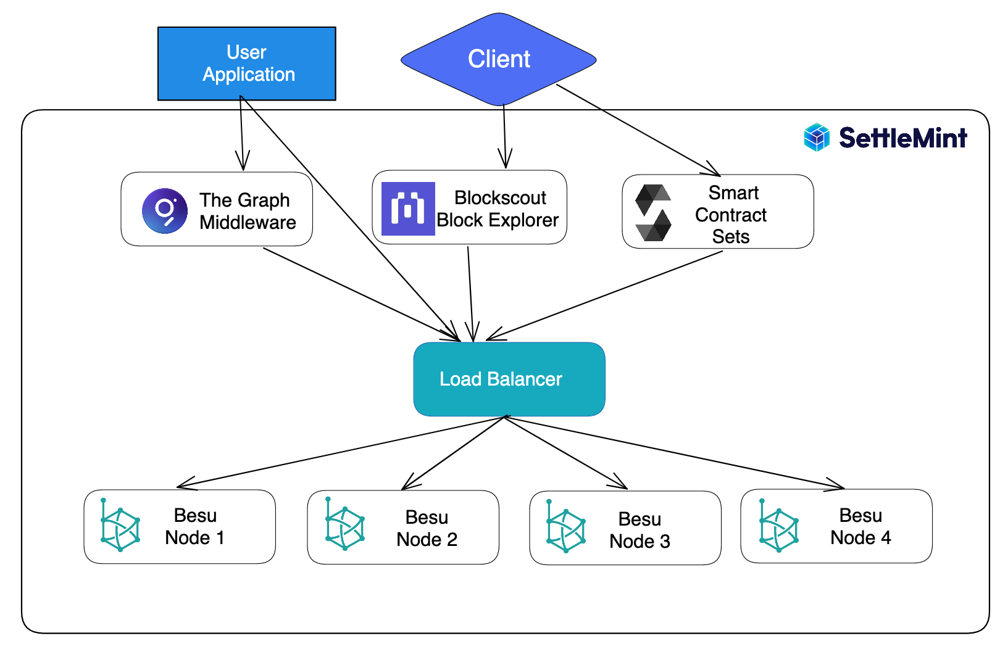
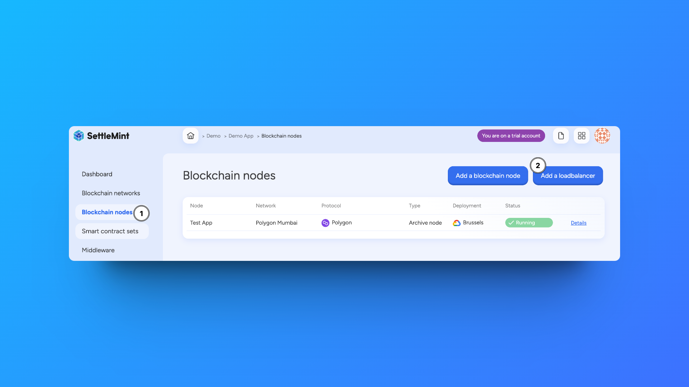

import { Tabs, Tab } from "fumadocs-ui/components/tabs";
import { Callout } from "fumadocs-ui/components/callout";
import { Steps } from "fumadocs-ui/components/steps";
import { Card } from "fumadocs-ui/components/card";

<Callout type="info">
  Load balancers are a new feature to SettleMint. We plan to add more management
  capabilities and interface additions.
</Callout>

After deploying nodes to your blockchain network, you can add a load balancer to
the network. Like traditional network load balancers, these distribute traffic
among your deployed nodes.

  

  <Card>
    ### Key Features
    - High availability
    - Request distribution
    - Health monitoring
    - Failover support
  </Card>

  <Card>
    ### Benefits
    - Improved performance
    - Better reliability
    - Scalable access
    - Traffic management
  </Card>

## Why Use A Load Balancer

The benefits of adding a load balancer to your network include:

- **Performance** - Load balancers enable you to spread JSON-RPC traffic over
  multiple nodes which ensures maximum throughput and high availability.
- **Monitoring** - Load balancers are application-aware which gives you the
  ability to monitor the status of underlying nodes and prevents wrong or stale
  data.
- **Stability** - Load balancers give you the option to change and move nodes
  around without changing your application by using a stable URL form.

## How to Add a Load Balancer

  

<Steps>
  ### Navigate to Nodes Click on **Blockchain Node** in the left navigation ###
  Add Load Balancer Click the **Add Load Balancer** button ### Configure Load
  Balancer 1. Choose the **Blockchain Network** 2. Select the **Blockchain
  Nodes** to include under the load balancer 3. Configure any additional
  settings 4. Confirm the deployment configuration
</Steps>

<Callout type="warning">
  Adding Validator nodes to your load balancer is not advised. This could
  disrupt your network operations if a Validator node becomes overloaded from an
  increase of traffic.
</Callout>

Once you confirm the deployment configuration, your load balancers will appear
under the list of deployed nodes.

## Managing a Load Balancer

You can select the load balancer to view the number of deployed nodes under it
and access logs. More information including the ability to add or remove nodes
are in development.

When deploying services including **The Graph Middleware** or **Blockscout
Explorer**, you will now have the option to deploy to the load balancer.
