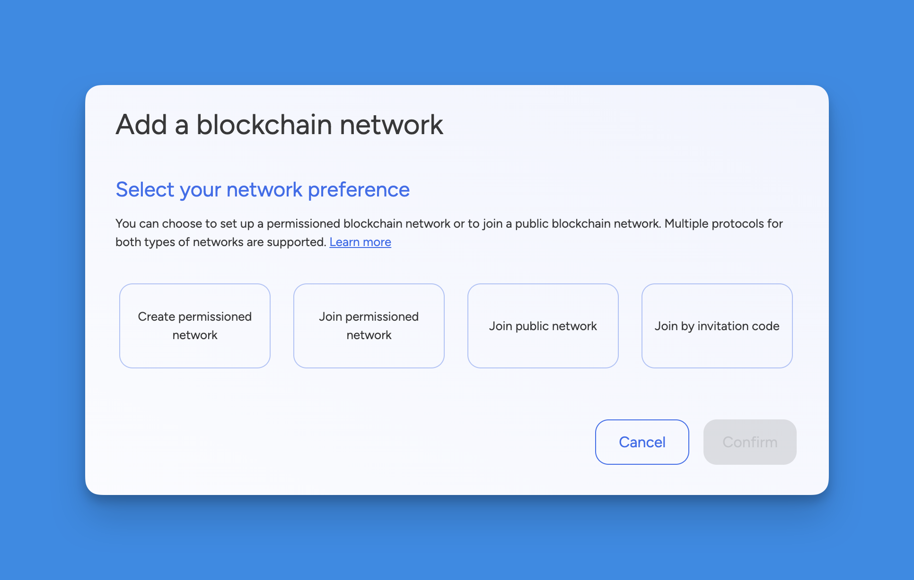
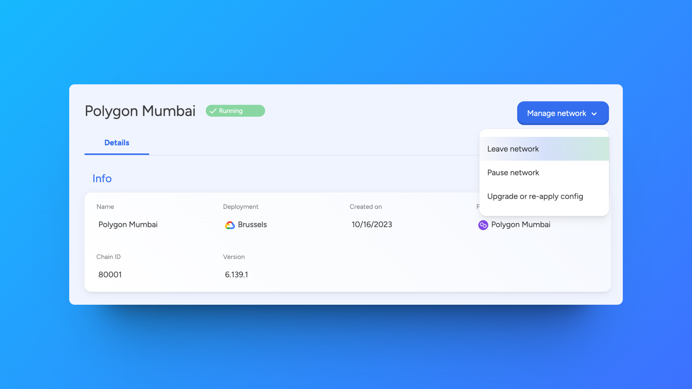

import { Tabs, Tab } from "fumadocs-ui/components/tabs";
import { Callout } from "fumadocs-ui/components/callout";
import { Steps } from "fumadocs-ui/components/steps";
import { Card } from "fumadocs-ui/components/card";

## Prerequisites

Before setting up a blockchain network, you need to have an application created
in your workspace. Applications provide the organizational context for all your
blockchain resources including networks, nodes, and development tools.

If you haven't created an application yet, follow our
[Create an Application](../building-with-settlemint/create-an-application) guide
first.

## How to Add a Blockchain Network

<Tabs items={['Platform UI', 'SDK CLI', 'SDK JS']}>
  <Tab value="Platform UI">
    <div style={{width: '70%', margin: '0 auto', display: 'block'}}>
      
    </div>

    <Steps>
      ### Navigate to Application
      Navigate to the **application** where you will create the network.

      ### Add Network
      Click **Add blockchain network** to open a form.

      ### Configure Network
      1. **Select the protocol** of your choice and click **Continue**.
      2. Choose a **network name** and a **node name**.
      3. Configure your deployment settings and network parameters.
      4. Click **Confirm** to add the network.
    </Steps>

  </Tab>

  <Tab value="SDK CLI">
    First ensure you're authenticated:
    ```bash
    settlemint login
    ```

    Create a blockchain network:
    ```bash
    settlemint platform create blockchain-network besu <network-name> \
      --node-name <node-name>

    # Get information about the command and all available options
    settlemint platform create blockchain-network besu --help
    ```

  </Tab>

  <Tab value="SDK JS">
    ```typescript
    import { createSettleMintClient } from '@settlemint/sdk-js';

    const client = createSettleMintClient({
      accessToken: 'your_access_token',
      instance: 'https://console.settlemint.com'
    });

    // Create network
    const createNetwork = async () => {
      const result = await client.blockchainNetwork.create({
        applicationUniqueName: "your-app",
        name: "my-network",
        nodeName: "validator-1",
        consensusAlgorithm: "BESU_QBFT",
        provider: "GKE", // GKE, EKS, AKS
        region: "EUROPE"
      });
      console.log('Network created:', result);
    };

    // List networks
    const listNetworks = async () => {
      const networks = await client.blockchainNetwork.list("your-app");
      console.log('Networks:', networks);
    };

    // Get network details
    const getNetwork = async () => {
      const network = await client.blockchainNetwork.read("network-unique-name");
      console.log('Network details:', network);
    };

    // Delete network
    const deleteNetwork = async () => {
      await client.blockchainNetwork.delete("network-unique-name");
    };

    // Restart network
    const restartNetwork = async () => {
      await client.blockchainNetwork.restart("network-unique-name");
    };
    ```

    <Callout type="tip">
    Get your access token from the Platform UI under User Settings → API Tokens.
    </Callout>

  </Tab>
</Tabs>

## Manage a Network

<Tabs items={['Platform UI', 'SDK CLI', 'SDK JS']}>
  <Tab value="Platform UI">
    <div style={{width: '70%', margin: '0 auto', display: 'block'}}>
      
    </div>

    Navigate to your network and click **Manage network** to see available actions:
    - View network details and status
    - Monitor network health
    - Restart network operations

  </Tab>

  <Tab value="SDK CLI">
    ```bash
    # List networks
    settlemint platform list blockchain-networks --application <app-name>

    # Get network details
    settlemint platform read blockchain-network <network-name>

    # Delete network
    settlemint platform delete blockchain-network <network-name>

    # Restart network
    settlemint platform restart blockchain-network <network-name>
    ```

  </Tab>

  <Tab value="SDK JS">
    ```typescript
    // List networks
    await client.blockchainNetwork.list("your-app");

    // Get network details
    await client.blockchainNetwork.read("network-unique-name");

    // Delete network
    await client.blockchainNetwork.delete("network-unique-name");

    // Restart network
    await client.blockchainNetwork.restart("network-unique-name");
    ```

  </Tab>
</Tabs>

<Callout type="info">
  All operations require appropriate permissions in your workspace.
</Callout>
