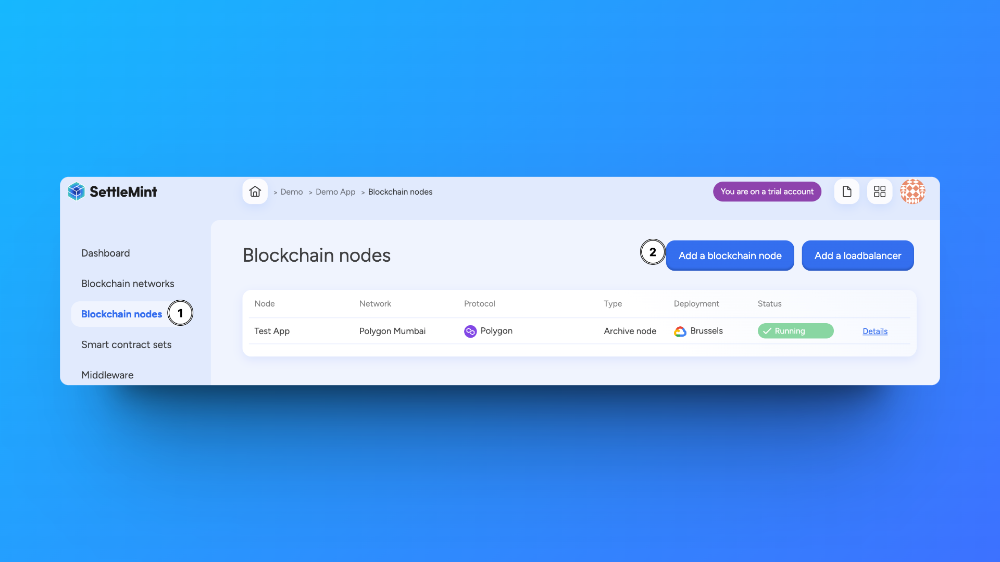

import { Tabs, Tab } from "fumadocs-ui/components/tabs";
import { Callout } from "fumadocs-ui/components/callout";
import { Steps } from "fumadocs-ui/components/steps";
import { Card } from "fumadocs-ui/components/card";

Once you have deployed a permissioned network or joined a public network, you
can add more nodes to it. The number of nodes needed depends on your network's
protocol.

<div className="grid grid-cols-1 md:grid-cols-2 gap-6 mb-8">
  <Card>
    ### Node Types
    - Validator nodes
    - Non-validator nodes
    - Archive nodes
    - Light nodes
  </Card>

  <Card>
    ### Key Features
    - Custom configurations
    - Resource management
    - Performance monitoring
    - Health checks
  </Card>
</div>

## Add Node

<Tabs items={['Platform UI', 'SDK CLI', 'SDK JS']}>
  <Tab value="Platform UI">
    <div style={{width: '70%', margin: '0 auto', display: 'block'}}>
      
    </div>

    <Steps>
      ### Navigate to Application
      Go to the application containing your network

      ### Access Nodes
      Click **Blockchain nodes** in the left navigation

      ### Configure Node
      1. Click **Add a blockchain node**
      2. Select the blockchain network to add this node to
      3. Choose node name and type (VALIDATOR/NON_VALIDATOR for permissioned networks)
      4. Configure deployment settings
      5. Click **Confirm**
    </Steps>

  </Tab>

  <Tab value="SDK CLI">
    First ensure you're authenticated:
    ```bash
    settlemint login
    ```

    Create a blockchain node:
    ```bash
    settlemint platform create blockchain-node besu <node-name> \
      --blockchain-network <network-name> \
      --node-type <VALIDATOR|NON_VALIDATOR> \
      --provider <provider> \
      --region <region>

    # Get help
    settlemint platform create blockchain-node --help
    ```

  </Tab>

  <Tab value="SDK JS">
    ```typescript
    import { createSettleMintClient } from '@settlemint/sdk-js';

    const client = createSettleMintClient({
      accessToken: 'your_access_token',
      instance: 'https://console.settlemint.com'
    });

    const createNode = async () => {
      const result = await client.blockchainNode.create({
        applicationUniqueName: "your-application",
        blockchainNetworkUniqueName: "your-network",
        name: "my-node",
        nodeType: "VALIDATOR",
        provider: "provider",
        region: "region"
      });
      console.log('Node created:', result);
    };
    ```

    <Callout type="tip">
    Get your access token from the Platform UI under User Settings → API Tokens.
    </Callout>

  </Tab>
</Tabs>

## Manage Node

<Tabs items={['Platform UI', 'SDK CLI', 'SDK JS']}>
  <Tab value="Platform UI">
    Navigate to your node and click **Manage node** to see available actions:
    - View node details and status
    - Monitor node health
    - Restart node operations
  </Tab>

  <Tab value="SDK CLI">
    ```bash
    # List nodes
    settlemint platform list services --application <application-name>

    # Restart node
    settlemint platform restart blockchain-node <node-name>
    ```

  </Tab>

  <Tab value="SDK JS">
    ```typescript
    // List nodes
    await client.blockchainNode.list("your-application");

    // Get node details
    await client.blockchainNode.read("node-unique-name");

    // Restart node
    await client.blockchainNode.restart("node-unique-name");
    ```

  </Tab>
</Tabs>

<Callout type="info">
  All operations require appropriate permissions in your workspace.
</Callout>
