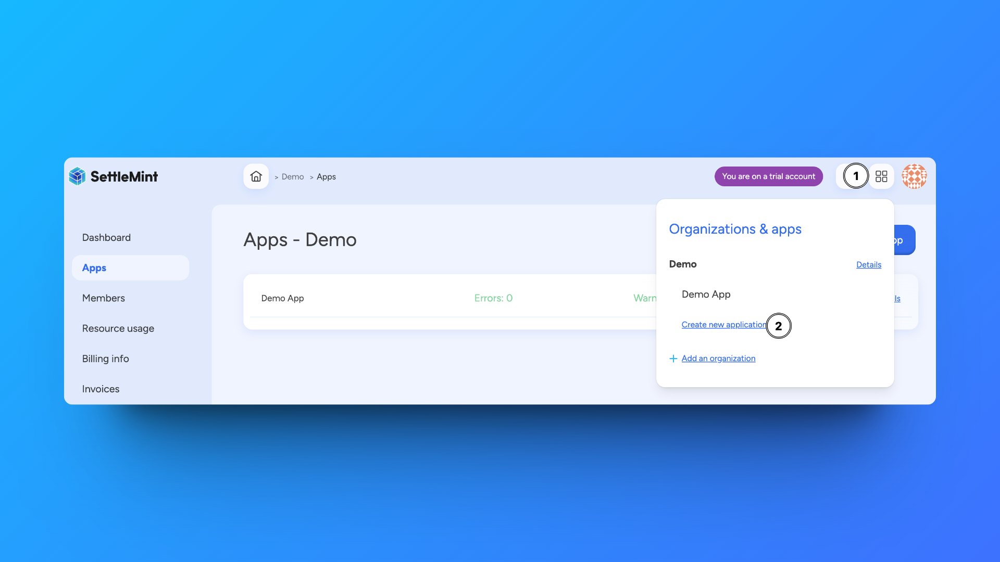

import { Tabs, Tab } from "fumadocs-ui/components/tabs";
import { Callout } from "fumadocs-ui/components/callout";
import { Steps } from "fumadocs-ui/components/steps";
import { Card } from "fumadocs-ui/components/card";

An application is the context in which you organize your networks, nodes, smart
contract sets and any other related blockchain resource.

<Callout type="info">
  You will always need to create an application before you can deploy or join
  networks, and add nodes.
</Callout>

## How to create a new application

<Tabs items={['Platform UI', 'SDK CLI', 'SDK JS']}>
  <Tab value="Platform UI">
    

    <Steps>
      ### Access Application Creation
      In the upper right corner of any page, click the **grid icon**

      ### Navigate & Create
      - Navigate to your workspace
      - Click **Create new application**

      ### Configure Application
      - Choose a **name** for your application
      - Click **Confirm** to create the application
    </Steps>

  </Tab>

  <Tab value="SDK CLI">
    First, install the [SDK CLI](https://github.com/settlemint/sdk/blob/main/sdk/cli/README.md#usage) as a global dependency.

    Then, ensure you're authenticated. For more information on authentication, see the [SDK CLI documentation](https://github.com/settlemint/sdk/blob/main/sdk/cli/README.md#login-to-the-platform).
    ```bash
    settlemint login
    ```

    Create an application:
    ```bash
    settlemint platform create application <name>
    ```

  </Tab>

  <Tab value="SDK JS">
    ```typescript
    import { createSettleMintClient } from '@settlemint/sdk-js';

    const client = createSettleMintClient({
      accessToken: 'your_access_token',
      instance: 'https://console.settlemint.com'
    });

    // Create application
    const createApp = async () => {
      const result = await client.application.create({
        workspaceUniqueName: "your-workspace",
        name: "myApp"
      });
      console.log('Application created:', result);
    };

    // List applications
    const listApps = async () => {
      const apps = await client.application.list("your-workspace");
      console.log('Applications:', apps);
    };

    // Read application details
    const readApp = async () => {
      const app = await client.application.read("app-unique-name");
      console.log('Application details:', app);
    };

    // Delete application
    const deleteApp = async () => {
      await client.application.delete("application-unique-name");
    };
    ```

    <Callout type="info">
    Get your access token from the Platform UI under User Settings → API Tokens.
    </Callout>

  </Tab>
</Tabs>

## Manage an application

<Tabs items={['Platform UI', 'SDK CLI', 'SDK JS']}>
  <Tab value="Platform UI">
    Navigate to your application and click **Manage app** to see available actions:
    - View application details
    - Update application name
    - Delete application
  </Tab>

  <Tab value="SDK CLI">
    ```bash
    # List applications
    settlemint platform list applications

    # Delete application
    settlemint platform delete application <name>
    ```

  </Tab>

  <Tab value="SDK JS">
    ```typescript
    // List applications
    await client.application.list("your-workspace");

    // Read application
    await client.application.read("app-unique-name");

    // Delete application
    await client.application.delete("app-unique-name");
    ```

  </Tab>
</Tabs>

<Callout type="info">
  All operations require appropriate permissions in your workspace.
</Callout>
