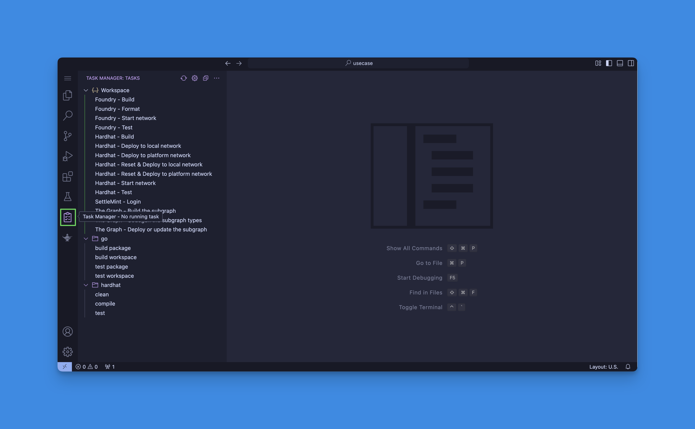

import { Callout } from "fumadocs-ui/components/callout";
import { Card } from "fumadocs-ui/components/card";
import { Steps } from "fumadocs-ui/components/steps";
import { Tab, Tabs } from "fumadocs-ui/components/tabs";

You can deploy your contracts to a network in the platform or a local
development network. This guide covers both Platform UI and SDK CLI approaches.

<Tabs items={['Platform UI', 'SDK CLI']}>
  <Tab value="Platform UI">
    Follow these steps to deploy your smart contract through the Platform UI:

    1. Open the IDE by clicking on your smart contract set.

       

    2. Click on the **Task Manager** button.

       

    3. First compile your contract by running either:
       - **Hardhat - Build** task
         
       - **Foundry - Build** task
         

    4. To deploy to a platform network:
       - Run the **SettleMint - Login** task
         
       - Run the **Hardhat - Deploy to platform network** task
         
       - Select your node and private key when prompted
         

    5. To deploy locally:
       - Run the **Hardhat - Start local network** task
         
       - Run the **Hardhat - Deploy to local network** task
         

  </Tab>

  <Tab value="SDK CLI">
    ## Prerequisites

    First, authenticate yourself and connect to your application:

    ```bash
    # Login to the platform
    settlemint login

    # Connect to your application
    settlemint connect
    ```

    ## Using Hardhat

    Hardhat provides a complete development environment. Here's how to use it:

    ```bash
    # Step 1: Build your smart contracts
    settlemint scs hardhat build

    # Step 2: Choose your deployment target
    # For local development:
    settlemint scs hardhat network     # Start a local network
    settlemint scs hardhat deploy local  # Deploy to local network

    # For production:
    settlemint scs hardhat deploy remote  # Deploy to platform network

    # Development tools:
    settlemint scs hardhat test    # Run your test suite
    settlemint scs hardhat script  # Execute deployment scripts
    ```

    ## Using Foundry

    Foundry offers fast compilation and testing. Here's how to use it:

    ```bash
    # Step 1: Build your smart contracts
    settlemint scs foundry build

    # Step 2: Test and format
    settlemint scs foundry test    # Run your test suite
    settlemint scs foundry format  # Format your contract code

    # Step 3: Local development
    settlemint scs foundry network  # Start a local network for testing
    ```

    ## Working with Subgraphs

    If you need to index your smart contract data:

    ```bash
    # Step 1: Generate TypeScript types from your schema
    settlemint scs subgraph codegen

    # Step 2: Build the subgraph
    settlemint scs subgraph build

    # Step 3: Deploy to the Graph node
    settlemint scs subgraph deploy [subgraph-name]
    ```

    <Callout type="info">
    Before deployment, ensure:
    - You're authenticated (`settlemint login`)
    - You're connected to your application (`settlemint connect`)
    - Your smart contracts are compiled
    - For remote deployment: you have a running node and sufficient funds
    </Callout>

    ### Environment Configuration

    When using `settlemint connect`, you'll be prompted to configure:
    - Workspace selection
    - Application selection
    - Blockchain node selection
    - The Graph instance selection
    - HD Private Key selection
    - Application access token creation

    This configuration is stored locally and used for subsequent commands.

  </Tab>
</Tabs>

## Project Structure

The typical folder structure of a SettleMint smart contract set includes:

- **`contracts/`**: Contains the Solidity smart contracts
- **`test/`**: Contains both Hardhat (TypeScript) and Foundry (Solidity) tests
- **`script/`**: Deployment and interaction scripts
- **`lib/`**: Optional Solidity libraries
- **`ignitions/`**: Hardhat deployment configurations
- **`out/`**: Compilation artifacts
- **`foundry.toml`**: Foundry configuration
- **`hardhat.config`**: Hardhat configuration
- **`subgraphs/`**: The Graph indexing configurations

## Customize smart contracts

You can customize your smart contracts using the built-in IDE. The smart
contract sets include a Generative AI plugin to assist with development.
[Learn more about the AI plugin here.](./ai-plugin)
