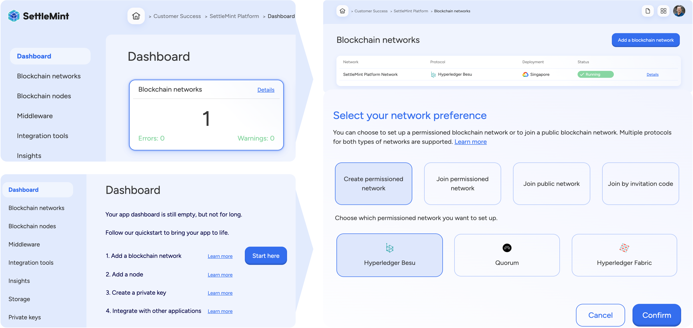

import { Tabs, Tab } from "fumadocs-ui/components/tabs";
import { Callout } from "fumadocs-ui/components/callout";
import { Steps } from "fumadocs-ui/components/steps";
import { Card } from "fumadocs-ui/components/card";
import React from "react";

<Callout type="info">
**Quick Network Setup**: Deploy your first blockchain network in under 5 minutes. Choose from Ethereum mainnet/testnets, Polygon, Arbitrum, or private Hyperledger Besu networks. Perfect for enterprise dApps requiring gas optimization and multi-chain deployment.
</Callout>

<Callout type="question">
**Common Question**: "Which blockchain network should I choose for my enterprise dApp? How do I optimize for gas costs and transaction speed?"
</Callout>

**Answer**: 
- **Public networks** (Ethereum, Polygon, Arbitrum) = Lower setup cost, proven security, existing liquidity
- **Private networks** (Hyperledger Besu/Quorum) = Full control, zero gas fees, enterprise compliance
- **Hybrid approach** = Develop on private, deploy to public for maximum flexibility

## Who needs blockchain network setup for EVM development?

<div className="grid grid-cols-1 md:grid-cols-2 gap-6 mt-6">
  <Card className="p-4">
    <h4 className="font-semibold mb-3">Enterprise Teams</h4>
    <ul className="space-y-2 text-sm">
      <li>• **Supply chain** - Asset tracking and provenance</li>
      <li>• **Finance** - Payment rails and tokenization</li>
      <li>• **Identity** - Credential verification systems</li>
      <li>• **Real estate** - Property tokenization platforms</li>
    </ul>
  </Card>
  <Card className="p-4">
    <h4 className="font-semibold mb-3">Development Teams</h4>
    <ul className="space-y-2 text-sm">
      <li>• **dApp builders** - Frontend-to-blockchain integration</li>
      <li>• **Protocol teams** - Custom consensus mechanisms</li>
      <li>• **DeFi projects** - AMMs, lending, derivatives</li>
      <li>• **NFT platforms** - Marketplaces and gaming</li>
    </ul>
  </Card>
</div>

### Prerequisites

Before setting up a blockchain network, you need an application created in your workspace. Applications provide organizational context for all blockchain resources including networks, nodes, and development tools.

<Callout type="warning">
**Required First Step**: Create an application before adding networks. Follow our [create application guide](/building-with-settlemint/evm-chains-guide/create-an-application) if you haven't done this yet.
</Callout>

## How do I choose the right blockchain network for my use case?

<Tabs items={['Public Networks', 'Private Networks', 'Network Comparison']}>
  <Tab value="Public Networks">
    <div className="space-y-4">
      <h4 className="font-semibold">Best for: DeFi, NFTs, public dApps</h4>
      
      **Ethereum Mainnet/Testnets**
      - **Gas cost**: High ($5-50+ per transaction)
      - **Speed**: 15 transactions/second
      - **Best for**: High-value transactions, established DeFi
      
      **Polygon PoS**
      - **Gas cost**: Low ($0.01-0.10 per transaction)
      - **Speed**: 65+ transactions/second
      - **Best for**: Gaming, NFTs, micro-payments
      
      **Arbitrum One**
      - **Gas cost**: Medium ($0.50-2.00 per transaction)
      - **Speed**: 40+ transactions/second
      - **Best for**: DeFi with Ethereum compatibility
    </div>
  </Tab>
  
  <Tab value="Private Networks">
    <div className="space-y-4">
      <h4 className="font-semibold">Best for: Enterprise, compliance, testing</h4>
      
      **Hyperledger Besu**
      - **Gas cost**: Zero (configurable)
      - **Speed**: 1000+ transactions/second
      - **Best for**: Supply chain, enterprise consortiums
      
      **GoQuorum**
      - **Gas cost**: Zero (configurable)
      - **Speed**: 500+ transactions/second
      - **Best for**: Financial services, private contracts
    </div>
  </Tab>
  
  <Tab value="Network Comparison">
    | Network | TPS | Gas Cost | Finality | Use Case |
    |---------|-----|----------|----------|----------|
    | Ethereum | 15 | High | 12-15 min | DeFi, governance |
    | Polygon | 65+ | Low | 2-3 sec | Gaming, NFTs |
    | Arbitrum | 40+ | Medium | 1-2 min | DeFi scaling |
    | Besu Private | 1000+ | Zero | Instant | Enterprise |
  </Tab>
</Tabs>

For the complete list of supported networks, see [supported networks](/platform-components/blockchain-infrastructure/network-manager#supported-blockchain-network-protocols).



You can perform the same action via the SettleMint SDK CLI as well -

<Tabs items={['SDK CLI', 'Platform UI','SDK JS']}>

  <Tab value="SDK CLI">
    First ensure you're authenticated:
    ```bash
    settlemint login
    ```

    Create a blockchain network:
    ```bash
    settlemint platform create blockchain-network besu <network-name> \
      --node-name <node-name>

    # Get information about the command and all available options
    settlemint platform create blockchain-network besu --help
    ```

  </Tab>

    <Tab value="Platform UI">
    <div className="leading-tight">
      <h3 className="mb-1">Navigate to application</h3>
      <p>Go to the application containing your network.</p>

      <h3 className="mb-1">Add network</h3>
      <p>Click <strong>Add blockchain network</strong> to open a form.</p>

      <h3 className="mb-1">Configure network</h3>
      <ol className="list-decimal list-inside leading-tight">
        <li>Select the <strong>protocol</strong> of your choice and click <strong>Continue</strong>.</li>
        <li>Choose a <strong>network name</strong> and a <strong>node name</strong>.</li>
        <li>Configure your deployment settings and network parameters.</li>
        <li>Click <strong>Confirm</strong> to add the network.</li>
      </ol>
    </div>

  </Tab>

  <Tab value="SDK JS">
    ```typescript
    import { createSettleMintClient } from '@settlemint/sdk-js';

    const client = createSettleMintClient({
      accessToken: 'your_access_token',
      instance: 'https://console.settlemint.com'
    });

    // Create network
    const createNetwork = async () => {
      const result = await client.blockchainNetwork.create({
        applicationUniqueName: "your-app",
        name: "my-network",
        nodeName: "validator-1",
        consensusAlgorithm: "BESU_QBFT",
        provider: "GKE", // GKE, EKS, AKS
        region: "EUROPE"
      });
      console.log('Network created:', result);
    };

    // List networks
    const listNetworks = async () => {
      const networks = await client.blockchainNetwork.list("your-app");
      console.log('Networks:', networks);
    };

    // Get network details
    const getNetwork = async () => {
      const network = await client.blockchainNetwork.read("network-unique-name");
      console.log('Network details:', network);
    };

    // Restart network
    const restartNetwork = async () => {
      await client.blockchainNetwork.restart("network-unique-name");
    };
    ```

    <Callout type="tip">
    Get your access token from the Platform UI under User Settings → API Tokens.
    </Callout>

  </Tab>

</Tabs>

<div className="grid grid-cols-2 gap-4 items-start">
  {/* Left Column - Text Content */}
  <div className="flex flex-col justify-start pt-2">
  <p>While deploying a network, you can tune various parameters to optimize performance and execution. The Chain ID serves as a unique identifier for your blockchain network, ensuring proper differentiation from others. The Seconds per block setting controls the block time interval, impacting transaction finality speed. Gas price defines the transaction cost per unit of gas, influencing network fees, while the Gas limit determines the maximum gas allowed per block, affecting computational capacity.</p>
  </div>

{/* Right Column - Image */}

  <div>
    
  </div>
</div>
The EVM stack size configures the stack depth for smart contract execution, and the Contract size limit sets the maximum contract code size to manage deployment constraints. Adjusting these settings allows for greater scalability, efficiency, and cost control based on your specific use case.
For EVM Chains, SettleMint allows you to set key genesis file paramters for a custom network configuration.

## How do I optimize my blockchain network for gas efficiency?

<Accordion>
  <Accordion.Item value="gas-optimization">
    <Accordion.Trigger>Gas Optimization Strategies</Accordion.Trigger>
    <Accordion.Content>
      <div className="space-y-4">
        **Network-Level Optimizations:**
        - **Block time**: Shorter blocks = faster confirmation, higher overhead
        - **Gas limit**: Higher limits = more complex transactions per block
        - **Gas price**: Lower prices = cheaper transactions, slower processing
        
        **Development Optimizations:**
        - Use Layer 2 networks (Polygon, Arbitrum) for 90%+ gas savings
        - Batch multiple operations in single transactions
        - Optimize smart contract code for minimal gas consumption
        - Use events instead of storage for non-critical data
      </div>
    </Accordion.Content>
  </Accordion.Item>
  
  <Accordion.Item value="multi-chain">
    <Accordion.Trigger>Multi-Chain Deployment Strategy</Accordion.Trigger>
    <Accordion.Content>
      <div className="space-y-4">
        **Recommended Deployment Pattern:**
        1. **Development**: Private Besu network (free, fast testing)
        2. **Staging**: Public testnet (realistic gas estimation)
        3. **Production**: Mainnet deployment (real user adoption)
        
        **Cross-Chain Considerations:**
        - Use same smart contract addresses across networks
        - Implement chain ID validation in frontend
        - Test bridge functionality between L1/L2 networks
      </div>
    </Accordion.Content>
  </Accordion.Item>
</Accordion>

## How do I manage my blockchain network after deployment?

Network management can be done via SettleMint SDK CLI using these commands:

<Tabs items={['SDK CLI','Platform UI','SDK JS']}>
 <Tab value="SDK CLI">
    ```bash
    # List networks
    settlemint platform list blockchain-networks --application <app-name>

    # Get network details
    settlemint platform read blockchain-network <network-name>

    # Restart network
    settlemint platform restart blockchain-network <network-name>
    ```

  </Tab>

    <Tab value="Platform UI">

    Navigate to your network and click **Manage network** to see available actions:
    - View network details and status
    - Monitor network health
    - Restart network operations

  </Tab>

  <Tab value="SDK JS">
    ```typescript
    // List networks
    await client.blockchainNetwork.list("your-app");

    // Get network details
    await client.blockchainNetwork.read("network-unique-name");

    // Restart network
    await client.blockchainNetwork.restart("network-unique-name");
    ```

  </Tab>
</Tabs>

When we deploy a network, first node is automatically deployed with it and is a
validator node. Once you have deployed a permissioned network or joined a public
network, you can add more nodes to it.

## How many blockchain nodes do I need for fault tolerance?

<Callout type="question">
**Common Question**: "My blockchain network is running on a single node. How do I ensure it stays online and secure for production use?"
</Callout>

**Answer**: Single nodes create single points of failure. For production systems, you need multiple nodes to ensure Byzantine Fault Tolerance (BFT) and high availability.

<Steps>
  ### Navigate to node management
  Click the **Blockchain Nodes** tile on your dashboard or use the **Blockchain Nodes** link in the left menu.
  
  
  
  ### Understand node requirements
  We recommend the following node configurations for enterprise-grade reliability:
</Steps>

<Tabs items={['Production Setup', 'Development Setup', 'High Availability']}>
  <Tab value="Production Setup">
    | Network | Validator Nodes | Non-Validator Nodes | Why? |
    |---------|----------------|---------------------|------|
    | **Hyperledger Besu** | 4 minimum | 2 minimum | BFT consensus requires 3f+1 nodes to tolerate f failures |
    | **GoQuorum** | 4 minimum | 2 minimum | Istanbul BFT provides immediate finality with 4+ validators |
    | **Public Networks** | N/A (external) | 2-3 archive nodes | Multiple nodes prevent single point of failure |
    
    <Callout type="info">
    **Byzantine Fault Tolerance**: With 4 validator nodes, your network can continue operating even if 1 node fails or becomes malicious.
    </Callout>
  </Tab>
  
  <Tab value="Development Setup">
    | Environment | Nodes Needed | Cost Optimization |
    |-------------|--------------|-------------------|
    | **Local Testing** | 1 validator | Use Hardhat network for fastest iteration |
    | **Integration Testing** | 2 validators | Minimal setup for CI/CD pipelines |
    | **Staging** | 3 validators | Close to production for final testing |
    
    <Callout type="tip">
    **Development Tip**: Start with 1 node for rapid development, then scale to 4+ nodes before production deployment.
    </Callout>
  </Tab>
  
  <Tab value="High Availability">
    **Enterprise High Availability Setup:**
    
    - **Geographic Distribution**: Deploy nodes across multiple regions
    - **Load Balancing**: Distribute RPC calls across multiple non-validator nodes
    - **Monitoring**: Set up alerts for node health and synchronization
    - **Backup Strategy**: Regular snapshots and disaster recovery procedures
    
    **Recommended Architecture:**
    ```
    Region A: 2 Validators + 1 Non-Validator + Load Balancer
    Region B: 2 Validators + 1 Non-Validator + Load Balancer
    ```
  </Tab>
</Tabs>

Nodes can also be added using SettleMint SDK CLI using the following commands-

<Tabs items={['SDK CLI', 'Platform UI','SDK JS']}>

  <Tab value="Platform UI">
    <div className="leading-tight">
      <h3 className="mb-1">Navigate to application</h3>
      <p>Go to the application containing your network.</p>

      <h3 className="mb-1">Access nodes</h3>
      <p>Click <strong>Blockchain nodes</strong> in the left navigation.</p>

      <h3 className="mb-1">Configure node</h3>
      <ol className="list-decimal list-inside leading-tight">
        <li>Click <strong>Add a blockchain node</strong>.</li>
        <li>Select the blockchain network to add this node to.</li>
        <li>Choose a <strong>node name</strong> and <strong>node type</strong> (Validator/Non-Validator).</li>
        <li>Configure deployment settings.</li>
        <li>Click <strong>Confirm</strong>.</li>
      </ol>
    </div>

  </Tab>

  <Tab value="SDK CLI">
    First ensure you're authenticated:
    ```bash
    settlemint login
    ```

    Create a blockchain node:
    ```bash
    settlemint platform create blockchain-node besu <node-name> \
      --blockchain-network <network-name> \
      --node-type <VALIDATOR|NON_VALIDATOR> \
      --provider <provider> \
      --region <region>

    # Get help
    settlemint platform create blockchain-node --help
    ```

  </Tab>

  <Tab value="SDK JS">
    ```typescript
    import { createSettleMintClient } from '@settlemint/sdk-js';

    const client = createSettleMintClient({
      accessToken: 'your_access_token',
      instance: 'https://console.settlemint.com'
    });

    const createNode = async () => {
      const result = await client.blockchainNode.create({
        applicationUniqueName: "your-application",
        blockchainNetworkUniqueName: "your-network",
        name: "my-node",
        nodeType: "VALIDATOR",
        provider: "provider",
        region: "region"
      });
      console.log('Node created:', result);
    };
    ```

    <Callout type="tip">
    Get your access token from the Platform UI in left menu bar > Access Tokens.
    </Callout>

  </Tab>

</Tabs>

## Manage node

You can view node details and status, can monitor node health, pause and
restart, or upgrade the node via the SDK CLI or the Platform UI.

<Tabs items={['SDK CLI', 'Platform UI', 'SDK JS']}>
  <Tab value="Platform UI">
    Navigate to your node and click **Manage node** to see available actions:
    - View node details and status
    - Monitor node health
    - Restart node operations
  </Tab>

  <Tab value="SDK CLI">
    ```bash
    # List nodes
    settlemint platform list services --application <application-name>

    # Restart node
    settlemint platform restart blockchain-node <node-name>
    ```

  </Tab>

  <Tab value="SDK JS">
    ```typescript
    // List nodes
    await client.blockchainNode.list("your-application");

    // Get node details
    await client.blockchainNode.read("node-unique-name");

    // Restart node
    await client.blockchainNode.restart("node-unique-name");
    ```

  </Tab>
</Tabs>

<Callout type="info">
  All operations require appropriate permissions in your workspace.
</Callout>

## How do I scale my blockchain network for high transaction throughput?

<Callout type="question">
**Common Question**: "My dApp is getting 1000s of requests per minute. How do I prevent my blockchain nodes from becoming overwhelmed?"
</Callout>

**Answer**: Load balancers distribute incoming RPC requests across multiple nodes, preventing any single node from becoming a bottleneck.

<Steps>
  ### Add load balancer
  Navigate to **Blockchain nodes** → Select your network → Click "Add load balancer"
  
  ### Configure distribution
  Choose region, provider, and resource configuration based on your traffic patterns
  
  ### Connect nodes
  Include **at least 2 non-validator nodes** for optimal redundancy and performance
</Steps>

<Card className="p-4 mt-4">
  <h4 className="font-semibold mb-3">Load Balancer Benefits</h4>
  <ul className="space-y-2 text-sm">
    <li>• **Traffic Distribution**: Prevents node overload during high usage</li>
    <li>• **Automatic Failover**: Routes around unhealthy nodes</li>
    <li>• **Geographic Routing**: Connects users to nearest node for lower latency</li>
    <li>• **Rate Limiting**: Protects against DDoS attacks and spam</li>
  </ul>
</Card>


## How do I monitor transactions and debug smart contract interactions?

<Callout type="question">
**Common Question**: "How can I see what's happening on my blockchain? I need to debug failed transactions and monitor contract interactions."
</Callout>

**Answer**: Blockchain explorers provide transaction monitoring, contract verification, and debugging capabilities essential for dApp development.

<Tabs items={['Private Networks', 'Public Networks']}>
  <Tab value="Private Networks">
    **For Hyperledger Besu/Quorum Networks:**
    
    <Steps>
      ### Add Blockscout explorer
      Navigate to **Insights** → Click "Add blockchain explorer"
      
      ### Configure explorer
      Choose deployment region and resource pack based on expected usage
      
      ### Access monitoring
      Use the explorer to view transactions, verify contracts, and debug issues
    </Steps>
    
    
    
    
    **Blockscout Features:**
    - Real-time transaction monitoring
    - Smart contract verification and interaction
    - Address balance tracking
    - Network statistics and health metrics
  </Tab>
  
  <Tab value="Public Networks">
    **Use these established blockchain explorers:**
  </Tab>
</Tabs>


### Public Network Blockchain Explorers

<div className="grid grid-cols-1 md:grid-cols-2 gap-4">
  <Card className="p-4">
    <h4 className="font-semibold mb-3">Layer 1 Networks</h4>
    
    **Ethereum**
    - Mainnet: [Etherscan](https://etherscan.io/)
    - Testnets: [Sepolia](https://sepolia.etherscan.io/) / [Holesky](https://holesky.etherscan.io/)
    
    **Avalanche**
    - Mainnet: [SnowTrace](https://snowtrace.io/)
    - Testnet: [Fuji](https://testnet.snowtrace.io/)
    
    **Hedera Hashgraph**
    - Mainnet: [HashScan](https://hashscan.io/mainnet)
    - Testnet: [HashScan Testnet](https://hashscan.io/testnet)
  </Card>
  
  <Card className="p-4">
    <h4 className="font-semibold mb-3">Layer 2 Networks</h4>
    
    **Polygon PoS**
    - Mainnet: [PolygonScan](https://polygonscan.com/)
    - Testnet: [Amoy](https://amoy.polygonscan.com/)
    
    **Polygon zkEVM**
    - Mainnet: [zkEVM Explorer](https://zkevm.polygonscan.com/)
    - Testnet: [zkEVM Testnet](https://testnet-zkevm.polygonscan.com/)
    
    **Arbitrum**
    - Mainnet: [Arbiscan](https://arbiscan.io/)
    - Testnet: [Arbitrum Goerli](https://goerli.arbiscan.io/)
    
    **Optimism**
    - Mainnet: [Optimistic Etherscan](https://optimistic.etherscan.io/)
    - Testnet: [Optimism Goerli](https://goerli-optimism.etherscan.io/)
  </Card>
</div>

## What's the typical timeline for blockchain network deployment?

<Steps>
  ### Network Creation (2-5 minutes)
  Basic network deployment with first validator node
  
  ### Node Addition (5-10 minutes per node)
  Adding additional validator and non-validator nodes for fault tolerance
  
  ### Load Balancer Setup (3-5 minutes)
  Configuring traffic distribution across nodes
  
  ### Explorer Integration (5-10 minutes)
  Setting up transaction monitoring and debugging tools
</Steps>

<Callout type="success">
**🎉 Congratulations!**

You have successfully built the blockchain infrastructure layer for your application. Your network is now ready for:
- Smart contract deployment
- dApp integration
- Enterprise-grade transaction processing

**Next Step**: Set up [private keys and wallets](/building-with-settlemint/evm-chains-guide/add-private-keys) for transaction signing and user management.
</Callout>
