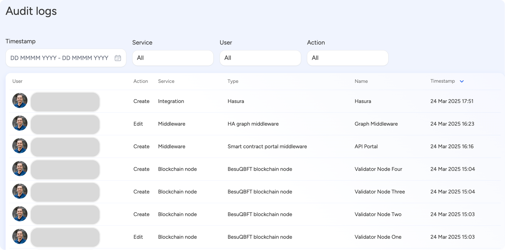

import { Tabs, Tab } from "fumadocs-ui/components/tabs";
import { Callout } from "fumadocs-ui/components/callout";
import { Steps } from "fumadocs-ui/components/steps";
import { Card } from "fumadocs-ui/components/card";

The audit log keeps a detailed record of user actions across the system, helping teams monitor activity, track changes, and stay compliant with internal and external requirements. Each entry includes a timestamp, showing exactly when something was done, which makes it easier to follow the flow of events and spot any irregularities.

It also records the user who performed the action, adding a layer of accountability by linking every change to a specific individual or system role. This is especially useful when reviewing changes or troubleshooting unexpected behavior.

The service field highlights which part of the platform was involved—whether it’s an integration, middleware component, or another system area. Alongside that, the action field captures what was done, like creating, editing, or deleting something. Together, these fields give teams a clear snapshot of what happened, where, and by whom.

