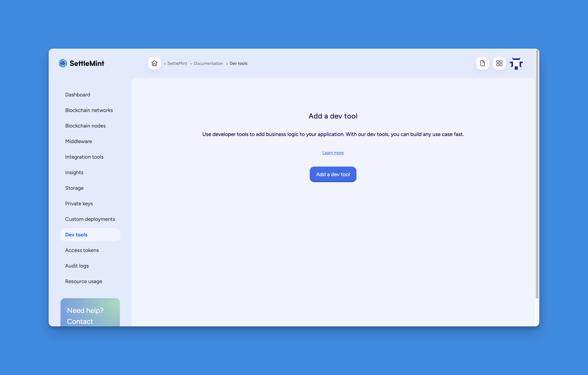
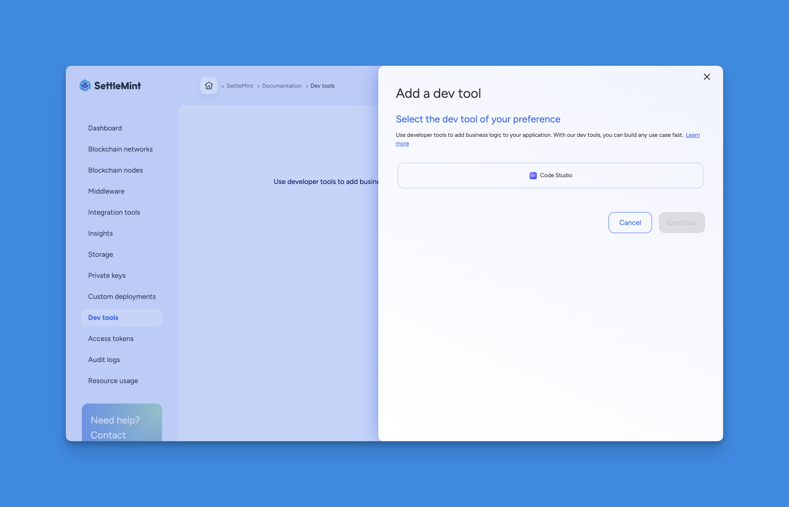
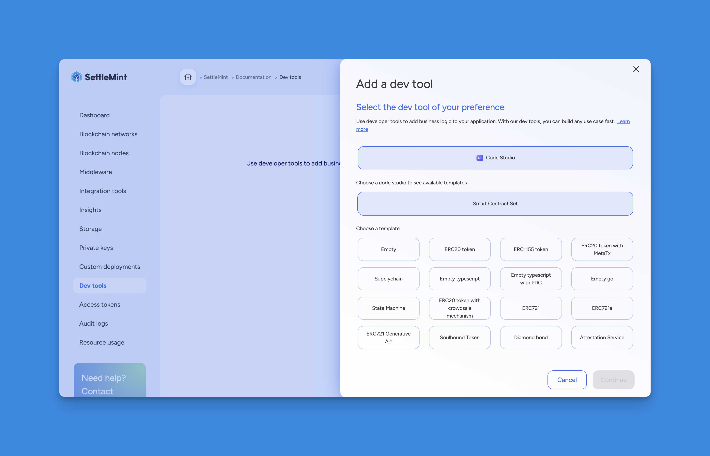
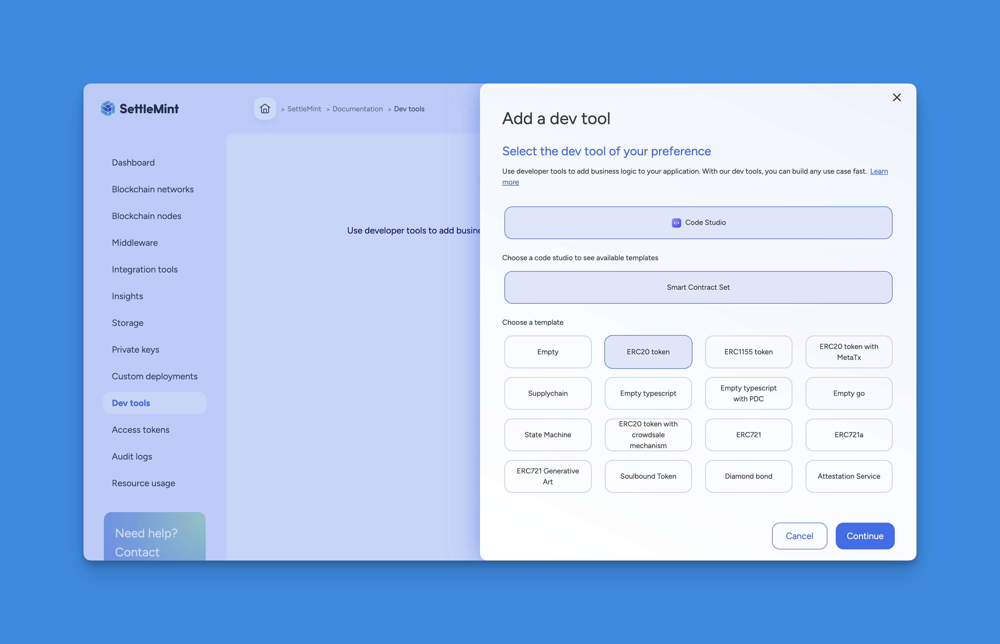

import { Tabs, Tab } from "fumadocs-ui/components/tabs";
import { Callout } from "fumadocs-ui/components/callout";
import { Steps } from "fumadocs-ui/components/steps";
import { Card } from "fumadocs-ui/components/card";

<div style={{
  backgroundColor: "#e1eafd", 
  color: "#356fee", 
  padding: "0.5px 10px 10px 10px",
  borderRadius: "10px", 
  fontSize: "18px", 
  fontWeight: "bold",
  lineHeight: "1.5",
  textAlign: "left"
}}>
  Summary  
  <div style={{ fontSize: "16px", fontWeight: "normal", marginTop: "5px" }}>

To start developing and deploying smart contracts on the SettleMint platform,
you’ll first need to add Code Studio to your application. This provides you with
a full-featured web-based IDE, pre-configured for blockchain development using
tools like Hardhat, Foundry, and The Graph. Once added, you can use built-in
tasks to build, test, deploy, and index your smart contracts and subgraphs, all
within the same environment.

You can add Code Studio through the Platform UI by selecting it as a dev tool
and linking it with a smart contract set and a template. Alternatively, you can
use the SDK CLI or SDK JS to programmatically create and manage smart contract
sets. These interfaces give you flexibility depending on whether you’re working
from the console or integrating via scripts or automation.

After setup, you’ll be able to customize your smart contracts directly within
the IDE. A task manager will guide you through building and deploying them to
local or SettleMint-hosted blockchain networks. You can also integrate subgraphs
for indexing and querying contract data using The Graph.

To speed up development, SettleMint offers a rich library of open-source smart
contract templates, from ERC standards to more complex business use cases. These
templates can be modified, extended, or used as-is, and you also have the option
to create and manage custom templates within your consortium for reuse across
projects.

</div>
</div>

## How to setup code studio and deploy smart contracts on SettleMint platform

Code Studio is SettleMint’s fully integrated, web-based IDE built specifically
for blockchain development. It provides developers with a familiar Visual Studio
Code experience directly in the browser, pre-configured with essential tools
like Hardhat, Foundry, and The Graph. Code Studio enables seamless development,
testing, deployment, and indexing of smart contracts and subgraphs, all within a
unified environment.

It eliminates the need for complex local setups, simplifies DevOps workflows,
and reduces time-to-market by combining infrastructure, templates, and
automation under one interface. By offering pre-built tasks, contract templates,
and GitHub integration, it solves the traditional challenges of fragmented
tooling, inconsistent environments, and steep setup requirements for web3
development.


Despite offering full configurability, Code Studio includes all essential
dependencies pre-installed, saving time and avoiding setup friction. It supports
extensions for formatting, linting, testing, and AI-assisted development,
mirroring the convenience of a local VS Code setup. Every component—from
contracts to testing and subgraph development is wired into a well-structured,
maintainable codebase that is continuously updated and thoroughly tested to
align with the latest development standards. This makes it ideal for both rapid
prototyping and production-grade blockchain applications.


Smart contract sets allow you to incorporate **business logic** into your
application by deploying smart contracts that run on the blockchain. You can add
a smart contract set via different methods as part of your development workflow.

## EVM IDE Project Structure

The EVM IDE project structure in Code Studio is thoughtfully organized to
support efficient smart contract development, testing, and deployment. Each
folder serves a specific purpose in the dApp development lifecycle, aligning
with industry-standard tools like Hardhat, Foundry, and The Graph.

| Folder          | Description                                                                                       |
| --------------- | ------------------------------------------------------------------------------------------------- |
| `contracts/`    | Contains Solidity smart contracts that define the core logic and business rules of the dApp.      |
| `test/`         | Holds test files. These can be written in **TypeScript** for Hardhat or **Solidity** for Foundry. |
| `script/`       | Stores deployment and interaction scripts, often used to automate tasks like contract deployment. |
| `lib/`          | Optional directory for external Solidity libraries or reusable modules to avoid code repetition.  |
| `ignitions/`    | Contains **Hardhat Ignition** configuration for defining declarative deployment plans.            |
| `out/`          | Output folder used by **Foundry**, containing compiled contract artifacts like ABIs and bytecode. |
| `artifacts/`    | Output folder used by **Hardhat**, similar to `out/`, containing build artifacts and metadata.    |
| `subgraphs/`    | Contains files for **The Graph** integration—schema, mappings, and manifest for data indexing.    |
| `cache/`        | Caching directory for Hardhat to improve build performance by avoiding redundant compilation.     |
| `cache_forge/`  | Caching directory for Foundry to speed up compilation and reuse outputs.                          |
| `node_modules/` | Contains installed npm packages and dependencies used in Hardhat or other JS-based tools.         |

## Code Studio IDE Task Manager

The Code Studio IDE Task Manager acts as a centralized hub for running all
essential development scripts, giving developers a streamlined way to manage the
entire smart contract lifecycle. It also includes integrated SettleMint CLI
tasks for logging in and managing authenticated platform interactions, ensuring
that everything needed for blockchain development is accessible and executable
directly from within the IDE.

Below is a categorized table of tasks or scripts available with concise
explanations.

| Task                                         | Tool           | Description                                                              |
| -------------------------------------------- | -------------- | ------------------------------------------------------------------------ |
| SettleMint - Login                           | SettleMint CLI | Logs into the SettleMint platform via CLI for authenticated deployments. |
| Foundry - Build                              | Foundry        | Compiles the smart contracts using Foundry.                              |
| Hardhat - Build                              | Hardhat        | Compiles the smart contracts using Hardhat.                              |
| Foundry - Test                               | Foundry        | Runs tests using Foundry’s native testing framework.                     |
| Hardhat - Test                               | Hardhat        | Executes tests using Hardhat's JavaScript-based test suite.              |
| Foundry - Format                             | Foundry        | Formats smart contract code for readability (optional).                  |
| Foundry - Start network                      | Foundry        | Starts a local Foundry testnet environment.                              |
| Hardhat - Start network                      | Hardhat        | Starts a local Hardhat network for JS-based testing.                     |
| Hardhat - Deploy to local network            | Hardhat        | Deploys compiled contracts to the local Hardhat network.                 |
| Hardhat - Reset & Deploy to local network    | Hardhat        | Resets the local chain state and redeploys contracts.                    |
| Hardhat - Deploy to platform network         | Hardhat        | Deploys contracts to a blockchain network hosted on SettleMint.          |
| Hardhat - Reset & Deploy to platform network | Hardhat        | Resets the platform network state and redeploys contracts.               |
| The Graph - Codegen the subgraph types       | The Graph CLI  | Generates TypeScript types based on subgraph GraphQL schema.             |
| The Graph - Build the subgraph               | The Graph CLI  | Compiles the subgraph for deployment to The Graph.                       |
| The Graph - Deploy or update the subgraph    | The Graph CLI  | Deploys or updates the subgraph on The Graph's hosted service.           |

When using Hardhat Ignition for deploying smart contracts, the deployed contract
addresses are stored in the file
ignition/deployments/chain-CHAIN_ID/deployed_addresses.json. This file serves as
a reliable reference for all contracts deployed on a specific network. It maps
contract names to their respective blockchain addresses, making it easy to
retrieve addresses later for interactions, frontend integrations, or upgrades.

<Callout type="info">
  You must have an existing application before you add a smart contract set.
</Callout>

## How to add code studio

<Tabs items={['SDK CLI', 'Platform UI', 'SDK JS']}>
  <Tab value="Platform UI">
    <Steps>
      ### Navigate to Application
      Navigate to the **application** where you want to add the smart contract set.

      ### Open Dev Tools
      Open **Dev tools** and click on **Add a Dev tool**.

      

      ### Select Code Studio
      Select **Code Studio** as the Dev tool type.

      

      ### Choose Smart Contract Set
      Then choose **Smart Contract Set**.

      

      ### Pick a Template
      Pick a **template**; the Code Studio will load with your chosen smart contract template.

      

      ### Enter Details
      Click **Continue** to enter details such as the Dev tool name, user, and deployment plan.

      

      ### Confirm
      Confirm the resource cost and click **Confirm** to add the smart contract set.
    </Steps>

    You can now further configure and eventually deploy your smart contracts.

  </Tab>

  <Tab value="SDK CLI">
    First, ensure you are authenticated:

    ```bash
    settlemint login
    ```

    You can create a smart contract set either on the platform or locally:

    ### Create on Platform

    Then create a smart contract set with the following command (refer to the
    [CLI docs](/building-with-settlemint/15_dev-tools/1_SDK.md) for more details):

    ```bash
    settlemint platform create smart-contract-set <tool-name> \
      --application <application-name> \
      --template <template-name> \
      --deployment-plan <deployment-plan>
    ```

    For example:

    ```bash
    settlemint platform create smart-contract-set my-scset \
      --application my-app \
      --template default \
      --deployment-plan starter
    ```

    ### Working with Smart Contract Sets Locally

    You can also work with smart contract sets in your local development environment. This is useful for development and testing before deploying to the platform.

    To create a smart contract set locally:

    ```bash
    # Create a new smart contract set
    settlemint scs create

    # You'll see the SettleMint ASCII art and then be prompted:
    ✔ What is the name of your new SettleMint project? my awesome project

    # Choose from available templates:
    ❯ ERC20 token
      Empty typescript
      Empty typescript with PDC
      ERC1155 token
      ERC20 token with crowdsale mechanism
      ERC20 token with MetaTx
      ERC721
      # ... and more
    ```

    Once created, you can use these commands to work with your local smart contract set:

    ```bash
    settlemint scs -h  # Show all available commands

    # Main commands:
    settlemint scs create        # Create a new smart contract set
    settlemint scs foundry      # Foundry commands for building and testing
    settlemint scs hardhat      # Hardhat commands for building, testing and deploying
    settlemint scs subgraph    # Commands for managing TheGraph subgraphs
    ```

    The scaffolded project includes everything you need to start developing smart contracts:
    - Contract templates
    - Testing framework
    - Deployment scripts
    - Development tools configuration

    ### Managing Platform Smart Contract Sets

    Manage your platform smart contract sets with:

    ```bash
    # List smart contract sets
    settlemint platform list smart-contract-sets --application <application-name>

    # Read smart contract set details
    settlemint platform read smart-contract-set <smart-contract-set-name>

    # Delete a smart contract set
    settlemint platform delete smart-contract-set <smart-contract-set-name>
    ```

  </Tab>

  <Tab value="SDK JS">
    You can also add a smart contract set programmatically using the JS SDK. The API follows the same pattern as for applications and blockchain networks:

    ```typescript
    import { createSettleMintClient } from '@settlemint/sdk-js';

    const client = createSettleMintClient({
      accessToken: process.env.SETTLEMENT_ACCESS_TOKEN!,
      instance: 'https://console.settlemint.com'
    });

    // Create a Smart Contract Set
    const createSmartContractSet = async () => {
      const result = await client.smartContractSet.create({
        applicationUniqueName: "your-app",        // Your application unique name
        name: "my-smart-contract-set",            // The smart contract set name
        template: "default"                       // Template to use (choose from available templates)
      });
      console.log('Smart Contract Set created:', result);
    };

    // List Smart Contract Sets
    const listSmartContractSets = async () => {
      const sets = await client.smartContractSet.list("your-app");
      console.log('Smart Contract Sets:', sets);
    };

    // Read Smart Contract Set details
    const readSmartContractSet = async () => {
      const details = await client.smartContractSet.read("smart-contract-set-unique-name");
      console.log('Smart Contract Set details:', details);
    };

    // Delete a Smart Contract Set
    const deleteSmartContractSet = async () => {
      await client.smartContractSet.delete("smart-contract-set-unique-name");
      console.log('Smart Contract Set deleted');
    };
    ```

    <Callout type="tip">
    Get your access token from the Platform UI under **User Settings → API Tokens**.
    </Callout>

  </Tab>
</Tabs>

<Callout type="info">
  All operations require that you have the necessary permissions in your
  workspace.
</Callout>

## Customize smart contracts

You can customize your smart contracts using the built-in IDE. The smart
contract sets include a Generative AI plugin to assist with development.
[Learn more about the AI plugin here.](./ai-plugin)

## Smart contract template library

SettleMint's smart contract templates serve as open-source, ready-to-use
foundations for blockchain application development, significantly accelerating
the deployment process. These templates enable users to quickly customize and
extend their blockchain applications, leveraging tested and community-enhanced
frameworks to reduce development time and accelerate market entry.

## Open-Source Smart Contract Templates under the MIT License

Benefit from the expertise of the blockchain community and trust in the
reliability of your smart contracts. These templates are vetted and used by
major enterprises and institutions, ensuring enhanced security and confidence in
your deployments.

## Smart Contract Template Library

The programming language used depends on the target protocol:

- **Solidity** for EVM-compatible networks


| Template                                                                                             | Description                                                                                   |
| ---------------------------------------------------------------------------------------------------- | --------------------------------------------------------------------------------------------- |
| [Empty](https://github.com/settlemint/solidity-empty)                                                | Basic Solidity project scaffold with no predefined logic. Ideal for starting from scratch.    |
| [ERC20 token](https://github.com/settlemint/solidity-token-erc20)                                    | Standard ERC20 token implementation for fungible tokens.                                      |
| [ERC1155 token](https://github.com/settlemint/solidity-token-erc1155)                                | Multi-token standard supporting both fungible and non-fungible tokens in a single contract.   |
| [ERC20 token with MetaTx](https://github.com/settlemint/solidity-token-erc20-metatx)                 | ERC20 token with meta-transaction support to enable gasless transfers.                        |
| [Supplychain](https://github.com/settlemint/solidity-supplychain)                                    | Token-based supply chain logic for tracking assets and ownership across stages.               |
| [State Machine](https://github.com/settlemint/solidity-statemachine)                                 | Contract template for building stateful workflows and processes using a finite state machine. |
| [ERC20 token with crowdsale mechanism](https://github.com/settlemint/solidity-token-erc20-crowdsale) | ERC20 token with built-in crowdsale logic for fundraising campaigns.                          |
| [ERC721](https://github.com/settlemint/solidity-token-erc721)                                        | Standard implementation of ERC721 non-fungible tokens (NFTs).                                 |
| [ERC721a](https://github.com/settlemint/solidity-token-erc721a)                                      | Gas-optimized ERC721 implementation for efficient batch minting.                              |
| [ERC721 Generative Art](https://github.com/settlemint/solidity-token-erc721-generative-art)          | NFT template for generating on-chain artwork using ERC721 standard.                           |
| [Soulbound Token](https://github.com/settlemint/solidity-token-soulbound)                            | Non-transferable token (SBT) representing identity or credentials.                            |
| [Diamond bond](https://github.com/settlemint/solidity-diamond-bond)                                  | Example of a tokenized bond using modular smart contracts (Diamond pattern).                  |
| [Attestation Service](https://github.com/settlemint/solidity-attestation-service)                    | Service template for managing on-chain verifiable claims and attestations.                    |

## Create Your Own Smart Contract Templates for Your Consortium

Within the self-managed Blockchain Transformation Platform (BTP), you can create
and add your own templates for use within your consortium. This fosters a
collaborative environment where templates can be reused and built upon,
promoting innovation and efficiency within your network.

To get started, visit:
[SettleMint GitHub Repository](https://github.com/settlemint/solidity-empty)

<div style={{
  backgroundColor: "#D1E5E8", 
  color: "#000000", 
  padding: "0.5px 10px 10px 10px",
  borderRadius: "10px", 
  fontSize: "18px", 
  fontWeight: "light",
  lineHeight: "1.5",
  textAlign: "left"
}}>
Congratulations.!!

You have succesfully deployed the code studio. From here you can proceed for
development and deployment of smart contracts and indexing sub-graphs.

</div>

```
Keywords: code studio, smart contract development, settlemint, web ide, smart contract set, code studio ide, deploy smart contracts, hardhat, foundry, the graph, subgraph development, ethereum development, evm compatible, solidity, vs code ide, low-code blockchain, blockchain ide, settlemint sdk, smart contract templates, contract deployment, ignition scripts, code studio tasks, hardhat test, foundry test, subgraph codegen, graphql indexing, visual studio code, smart contract automation, code studio cli, sdk js, smart contract management, web3 development, settlemint platform, blockchain application development, evm tools, contract template library, blockchain ide setup, smart contract customization, contract compilation, ethereum smart contracts, subgraph deployment, contract set creation, code studio setup, github integration, blockchain workflows, devtools integration, dapp development, contract lifecycle management, erc20 template, erc721 template, ai plugin smart contract, blockchain code templates, platform network deployment
```
