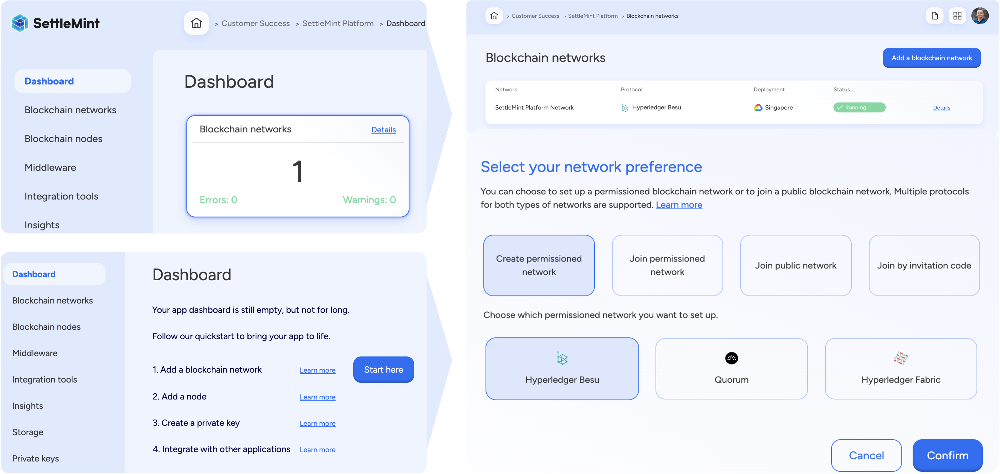
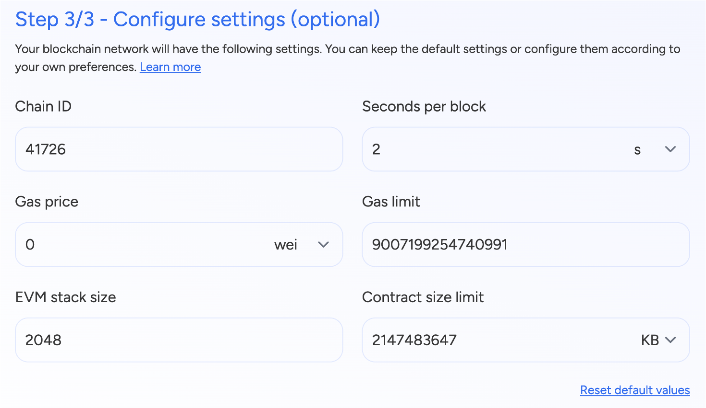
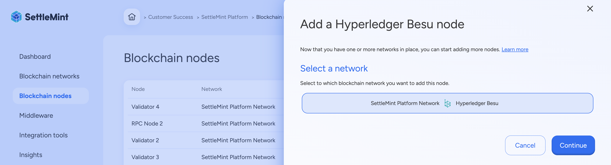
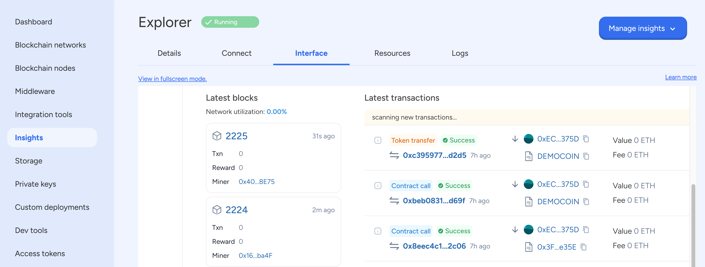

import { Tabs, Tab } from "fumadocs-ui/components/tabs";
import { Callout } from "fumadocs-ui/components/callout";
import { Steps } from "fumadocs-ui/components/steps";
import { Card } from "fumadocs-ui/components/card";
import React from "react";


<div style={{
  backgroundColor: "#e1eafd", 
  color: "#356fee", 
  padding: "0.5px 10px 10px 10px",
  borderRadius: "10px", 
  fontSize: "18px", 
  fontWeight: "bold",
  lineHeight: "1.5",
  textAlign: "left"
}}>
  Summary  
  <div style={{ fontSize: "16px", fontWeight: "normal", marginTop: "5px" }}>
To build a blockchain application, the first step is setting up a blockchain network with the correct number of validating and non-validating nodes. You can either deploy a permissioned network such as Hyperledger Besu or GoQuorum, or connect to an L1 or L2 Public Network like Ethereum, Polygon PoS, Hedera, Polygon zkEVM, Avalanche, Arbitrum, or Optimism. Both mainnet and testnet versions are available for public networks.

When creating an application on SettleMint, you will be prompted to select a network and assign it a name. By default, a first validating node is deployed along with the network, and you must assign a name to it as well. You may optionally provide an EC DSA P256 private key to use as custom key material for the node identity. If no key is provided, SettleMint will generate one automatically and save it in your private keys.

In SettleMint-managed (SaaS) mode, you will need to choose between a shared or dedicated cluster for deployment. You can also select a cloud provider and a data center of your choice. Additionally, you will have the option to select from small, medium, or large resource packs, which can be scaled up or down later as needed.

Before deploying the network, you will have the option to configure network settings and customize the genesis file. For most use cases, it is recommended to keep the default settings. Once configured, you can proceed with deployment. After a few minutes, your network manager and first node will be fully operational.

To enhance reliability, you should add more nodes to your network for fault tolerance. The best practice is to deploy four validator nodes and two non-validator nodes. Once the nodes are set up, adding a load balancer will help distribute network traffic efficiently and improve performance.

Once your network, nodes, and load balancer are running, you can access the Insights tab to integrate monitoring tools. For permissioned networks, you can add Blockscout Blockchain Explorer to track transactions and network activity. If you are using public EVM networks, publicly available blockchain explorers can be used instead.

</div>
</div>

## Prerequisites
Before setting up a blockchain network, you need to have an application created
in your workspace. Applications provide the organizational context for all your
blockchain resources including networks, nodes, and development tools. If you haven't created an application yet, follow our
[Create Application](/building-with-settlemint/evm-chains-guide/create-an-organization-and-application) guide
first.

## 1. Add Blockchain Network

For EVM Chains, SettleMint offers Hyperledger Besu and Quorum for permissioned networks and a bunch of public networks to choose from. 
For the list of supported networks please refer - [Supported Networks](/platform-components/blockchain-infrastructure/network-manager#supported-blockchain-network-protocols)



You can perform the same action via the SettleMint SDK CLI as well - 

<Tabs items={['SDK CLI', 'Platform UI','SDK JS']}>

  <Tab value="SDK CLI">
    First ensure you're authenticated:
    ```bash
    settlemint login
    ```

    Create a blockchain network:
    ```bash
    settlemint platform create blockchain-network besu <network-name> \
      --node-name <node-name>

    # Get information about the command and all available options
    settlemint platform create blockchain-network besu --help
    ```
  </Tab>

    <Tab value="Platform UI">
    <div className="leading-tight">
      <h3 className="mb-1">Navigate to Application</h3>
      <p>Navigate to the <strong>application</strong> where you will create the network.</p>

      <h3 className="mb-1">Add Network</h3>
      <p>Click <strong>Add blockchain network</strong> to open a form.</p>

      <h3 className="mb-1">Configure Network</h3>
      <ol className="list-decimal list-inside leading-tight">
        <li><strong>Select the protocol</strong> of your choice and click <strong>Continue</strong>.</li>
        <li>Choose a <strong>network name</strong> and a <strong>node name</strong>.</li>
        <li>Configure your deployment settings and network parameters.</li>
        <li>Click <strong>Confirm</strong> to add the network.</li>
      </ol>
    </div>
  </Tab>

  <Tab value="SDK JS">
    ```typescript
    import { createSettleMintClient } from '@settlemint/sdk-js';

    const client = createSettleMintClient({
      accessToken: 'your_access_token',
      instance: 'https://console.settlemint.com'
    });

    // Create network
    const createNetwork = async () => {
      const result = await client.blockchainNetwork.create({
        applicationUniqueName: "your-app",
        name: "my-network",
        nodeName: "validator-1",
        consensusAlgorithm: "BESU_QBFT",
        provider: "GKE", // GKE, EKS, AKS
        region: "EUROPE"
      });
      console.log('Network created:', result);
    };

    // List networks
    const listNetworks = async () => {
      const networks = await client.blockchainNetwork.list("your-app");
      console.log('Networks:', networks);
    };

    // Get network details
    const getNetwork = async () => {
      const network = await client.blockchainNetwork.read("network-unique-name");
      console.log('Network details:', network);
    };

    // Delete network
    const deleteNetwork = async () => {
      await client.blockchainNetwork.delete("network-unique-name");
    };

    // Restart network
    const restartNetwork = async () => {
      await client.blockchainNetwork.restart("network-unique-name");
    };
    ```

    <Callout type="tip">
    Get your access token from the Platform UI under User Settings → API Tokens.
    </Callout>

  </Tab>

</Tabs>


<div className="grid grid-cols-2 gap-4 items-start">
  {/* Left Column - Text Content */}
  <div className="flex flex-col justify-start pt-2">
  <p>While deploying a network, you can tune various parameters to optimize performance and execution. The Chain ID serves as a unique identifier for your blockchain network, ensuring proper differentiation from others. The Seconds per block setting controls the block time interval, impacting transaction finality speed. Gas price defines the transaction cost per unit of gas, influencing network fees, while the Gas limit determines the maximum gas allowed per block, affecting computational capacity.</p>
  </div>

  {/* Right Column - Image */}
  <div>
    
  </div>
</div>
The EVM stack size configures the stack depth for smart contract execution, and the Contract size limit sets the maximum contract code size to manage deployment constraints. Adjusting these settings allows for greater scalability, efficiency, and cost control based on your specific use case.
For EVM Chains, SettleMint allows you to set key genesis file paramters for a custom network configuration.


## Manage a Network

Network management can be done via SettleMint SDK CLI using these commands - 

<Tabs items={['SDK CLI','Platform UI','SDK JS']}>
 <Tab value="SDK CLI">
    ```bash
    # List networks
    settlemint platform list blockchain-networks --application <app-name>

    # Get network details
    settlemint platform read blockchain-network <network-name>

    # Delete network
    settlemint platform delete blockchain-network <network-name>

    # Restart network
    settlemint platform restart blockchain-network <network-name>
    ```

  </Tab>

    <Tab value="Platform UI">

    Navigate to your network and click **Manage network** to see available actions:
    - View network details and status
    - Monitor network health
    - Restart network operations

  </Tab>

  <Tab value="SDK JS">
    ```typescript
    // List networks
    await client.blockchainNetwork.list("your-app");

    // Get network details
    await client.blockchainNetwork.read("network-unique-name");

    // Delete network
    await client.blockchainNetwork.delete("network-unique-name");

    // Restart network
    await client.blockchainNetwork.restart("network-unique-name");
    ```

  </Tab>
</Tabs>


When we deploy a network, first node is automatically deployed with it and is a validator node. Once you have deployed a permissioned network or joined a public network, you
can add more nodes to it. 


## 2. Add Blockchain Nodes

To see and add nodes, please click on **Blockchain Nodes** tile on the dashboard or use the **Blockchain Nodes** link in the left menu.

 

We recommend the following number of nodes for each envrionment:

| Blockchain Network   | Node Type           | Minimum Nodes for Fault Tolerance |
|----------------------|---------------------|-----------------------------------|
| **Hyperledger Besu** | Validator Nodes     | 4 (Byzantine Fault Tolerant BFT)  |
| **Hyperledger Besu** | Non-Validator Nodes | 2 (for redundancy)                |
| **GoQuorum**         | Validator Nodes     | 4 (Istanbul BFT)                  |
| **GoQuorum**         | Non-Validator Nodes | 2 (for redundancy)                |


Nodes can also be added using SettleMint SDK CLI using the following commands-

<Tabs items={['SDK CLI', 'Platform UI','SDK JS']}>

  <Tab value="Platform UI">
    <div className="leading-tight">
      <h3 className="mb-1">Navigate to Application</h3>
      <p>Go to the application containing your network.</p>

      <h3 className="mb-1">Access Nodes</h3>
      <p>Click <strong>Blockchain nodes</strong> in the left navigation.</p>

      <h3 className="mb-1">Configure Node</h3>
      <ol className="list-decimal list-inside leading-tight">
        <li>Click <strong>Add a blockchain node</strong>.</li>
        <li>Select the blockchain network to add this node to.</li>
        <li>Choose a <strong>node name</strong> and <strong>node type</strong> (Validator/Non-Validator).</li>
        <li>Configure deployment settings.</li>
        <li>Click <strong>Confirm</strong>.</li>
      </ol>
    </div>
  </Tab>

  <Tab value="SDK CLI">
    First ensure you're authenticated:
    ```bash
    settlemint login
    ```

    Create a blockchain node:
    ```bash
    settlemint platform create blockchain-node besu <node-name> \
      --blockchain-network <network-name> \
      --node-type <VALIDATOR|NON_VALIDATOR> \
      --provider <provider> \
      --region <region>

    # Get help
    settlemint platform create blockchain-node --help
    ```
  </Tab>

  <Tab value="SDK JS">
    ```typescript
    import { createSettleMintClient } from '@settlemint/sdk-js';

    const client = createSettleMintClient({
      accessToken: 'your_access_token',
      instance: 'https://console.settlemint.com'
    });

    const createNode = async () => {
      const result = await client.blockchainNode.create({
        applicationUniqueName: "your-application",
        blockchainNetworkUniqueName: "your-network",
        name: "my-node",
        nodeType: "VALIDATOR",
        provider: "provider",
        region: "region"
      });
      console.log('Node created:', result);
    };
    ```

    <Callout type="tip">
    Get your access token from the Platform UI in left menu bar > Access Tokens.
    </Callout>

  </Tab>

</Tabs>

## Manage Node

You can view node details and status, can monitor node health, pause and restart, or upgrade the node via the SDK CLI or the Platform UI. 

<Tabs items={['SDK CLI', 'Platform UI', 'SDK JS']}>
  <Tab value="Platform UI">
    Navigate to your node and click **Manage node** to see available actions:
    - View node details and status
    - Monitor node health
    - Restart node operations
  </Tab>

  <Tab value="SDK CLI">
    ```bash
    # List nodes
    settlemint platform list services --application <application-name>

    # Restart node
    settlemint platform restart blockchain-node <node-name>
    ```

  </Tab>

  <Tab value="SDK JS">
    ```typescript
    // List nodes
    await client.blockchainNode.list("your-application");

    // Get node details
    await client.blockchainNode.read("node-unique-name");

    // Restart node
    await client.blockchainNode.restart("node-unique-name");
    ```

  </Tab>
</Tabs>

<Callout type="info">
  All operations require appropriate permissions in your workspace.
</Callout>

## 3. Add Load Balancer

To add a load balancer, navigate to the **Blockchain Nodes** section in the SettleMint platform and select your deployed network. Click “Add Load Balancer”, choose the region, provider, and desired resource configuration. Once deployed, the load balancer helps distribute traffic efficiently, improving network reliability and performance.

When selecting nodes to connect to the load balancer, ensure you include at least two non-validator nodes for optimal redundancy. The load balancer can be configured to route requests to specific nodes based on workload distribution, ensuring high availability and fault tolerance in your blockchain network.


## 4. Add Blockchain Explorer

To add blockscout blockchain explorer for EVM based permissioned networks, navigate to **Insights** via the left menu or the dashboard tile.
For public networks, you may use publicly available blockchain explorers for the respective network. 




### For public networks, please use the following blockchain explorers- 

| **Network**          | **Mainnet Explorer** | **Testnet Explorer** |
|----------------------|---------------------|----------------------|
| **Ethereum**        | [Etherscan](https://etherscan.io/) | [Sepolia](https://sepolia.etherscan.io/) / [Holesky](https://holesky.etherscan.io/) |
| **Avalanche**       | [SnowTrace](https://snowtrace.io/) | [Fuji](https://testnet.snowtrace.io/) |
| **Hedera Hashgraph**| [HashScan](https://hashscan.io/mainnet) | [HashScan Testnet](https://hashscan.io/testnet) |
| **Polygon PoS**     | [PolygonScan](https://polygonscan.com/) | [Amoy](https://amoy.polygonscan.com//) |
| **Polygon zkEVM**   | [zkEVM Explorer](https://zkevm.polygonscan.com/) | [zkEVM Testnet](https://testnet-zkevm.polygonscan.com/) |
| **Optimism**        | [Optimistic Etherscan](https://optimistic.etherscan.io/) | [Optimism Goerli](https://goerli-optimism.etherscan.io/) |
| **Arbitrum**        | [Arbiscan](https://arbiscan.io/) | [Arbitrum Goerli](https://goerli.arbiscan.io/) |


<div style={{
  backgroundColor: "#D1E5E8", 
  color: "#000000", 
  padding: "0.5px 10px 10px 10px",
  borderRadius: "10px", 
  fontSize: "18px", 
  fontWeight: "light",
  lineHeight: "1.5",
  textAlign: "left"
}}>
Congratulations.!!

You have succesfully built the blockchain infrastructure layer for you application. 
From here you can proceed for creating or setting up private keys for transaction signer and user wallets.

</div>


```
Keywords
Blockchain Network, Nodes, Explorer, Hyperledger Besu, Quorum, Ethereum, Polygon PoS, Hedera, Polygon zkEVM, Avalanche, Arbitrum, Optimism, Public Network, Permissioned Network, Validator Node, Non-Validator Node, Archive Node, Light Node, Load Balancer, Insights, Blockscout, Blockchain Explorer, Mainnet, Testnet, SDK CLI, SDK JS, Platform UI, SettleMint, Cloud Provider, Data Center, Resource Packs, Deployment, Genesis File, Smart Contracts, EVM, Gas Price, Gas Limit, Chain ID, Block Time, Fault Tolerance, SaaS, API Tokens, Network Manager, Node Management, Scaling, High Availability, Byzantine Fault Tolerance, Istanbul BFT, Public EVM Networks, Custom Configurations, Performance Monitoring, Health Checks, Network Parameters, Blockchain Infrastructure, Secure Transactions, Distributed Ledger, Tokenization, Digital Assets, Smart Contract Execution, Ethereum Virtual Machine, Consensus Algorithm, Custom Subnets, Interoperability, Finality, Transaction Fees, Scalability, Governance, Security, Compliance, Decentralized Applications, Decentralized Finance, NFT Marketplaces, Institutional DeFi, Supply Chain, Digital Identity, Voting Systems, Cloud Deployment, Kubernetes, GKE, EKS, AKS, API Integration, SDK Authentication, Cluster Management, Network Automation, Deployment Configuration, SettleMint SDK, API Tokens, Blockchain Insights, Monitoring, Optimization, Blockchain Nodes, Blockchain Health, Network Operations, Blockchain Setup, Blockchain Tools, Developer Guide, Blockchain Onboarding, Smart Contract Deployment, Blockchain Performance, Blockchain Services, Permissioned Blockchain, Blockchain Frameworks, Blockchain Governance, Blockchain Hosting, Blockchain Transactions, Blockchain Networks, Blockchain Development, Blockchain Security, Blockchain Auditing, Blockchain Consensus, Blockchain Use Cases, Blockchain Adoption, Blockchain Trends, Blockchain Scalability, Blockchain Integration, Blockchain Platforms, Blockchain Architecture, Blockchain Data, Blockchain Compliance, Blockchain Standardization, Blockchain API, Blockchain UI, Blockchain Analytics, Blockchain Cost, Blockchain Performance Optimization.
```