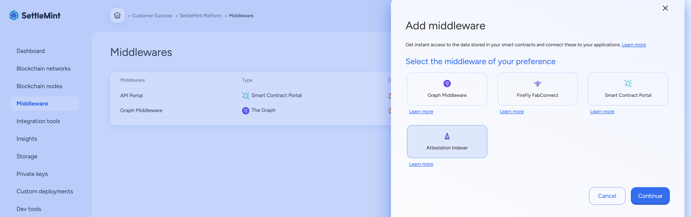
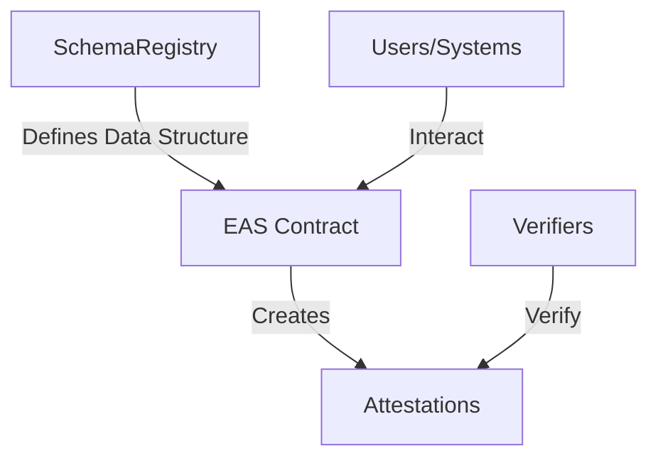

import { Tabs, Tab } from "fumadocs-ui/components/tabs";
import { Callout } from "fumadocs-ui/components/callout";
import { Steps } from "fumadocs-ui/components/steps";
import { Card } from "fumadocs-ui/components/card";

<div style={{
  backgroundColor: "#e1eafd", 
  color: "#356fee", 
  padding: "0.5px 10px 10px 10px",
  borderRadius: "10px", 
  fontSize: "18px", 
  fontWeight: "bold",
  lineHeight: "1.5",
  textAlign: "left"
}}>
  Summary  
  <div style={{ fontSize: "16px", fontWeight: "normal", marginTop: "5px" }}>

The Ethereum Attestation Indexer is a tool that allows you to track, store, and query verifiable claims (attestations) made using the Ethereum Attestation Service (EAS). It provides a GraphQL API to easily fetch attestation data based on schemas you define.

To use it, you’ll first deploy the necessary EAS smart contracts (Schema Registry and EAS) on your blockchain network using SettleMint’s Code Studio and Task Manager. Once deployed, you can register custom schemas and create attestations that follow those schema structures.

After setup, the Attestation Indexer can be added via the Middleware section of your application. Once connected to your contract addresses, it will index attestation events, and you can use the built-in GraphQL UI or API access to query them in real time.

</div>
</div>

## 1. Introduction to EAS

### What is EAS?

Ethereum Attestation Service (EAS) is a decentralized protocol that allows users
to create, verify, and manage attestations (verifiable claims) on the Ethereum
blockchain. It provides a standardized way to make claims about data,
identities, or events that can be independently verified by others.



### Why Use EAS?

- **Decentralization**: No central authority is needed to verify claims.
- **Interoperability**: Standardized schemas allow for cross-platform
  compatibility.
- **Security**: Attestations are secured by the Ethereum blockchain.
- **Transparency**: All attestations are publicly verifiable.

<iframe
  width="100%"
  height="400"
  src="https://www.youtube.com/embed/DMGj5GNll0k"
  title="Understanding Ethereum Attestation Service (EAS)"
  frameBorder="0"
  allow="accelerometer; autoplay; clipboard-write; encrypted-media; gyroscope; picture-in-picture"
  allowFullScreen
></iframe>

---

## 2. Key Concepts

### Core Components

1. **SchemaRegistry**:

   - A smart contract that stores and manages schemas.
   - Schemas define the structure and data types of attestations, ensuring that
     all attestations conform to a predefined format.

2. **EAS Contract**:

   - The main contract that handles the creation and management of attestations.
   - It interacts with the `SchemaRegistry` to ensure that attestations adhere
     to the defined schemas.


3. **Attestations**:

   - Verifiable claims stored on the blockchain.
   - Created and managed by the `EAS Contract`.

4. **Resolvers**:
   - Optional contracts that provide additional validation logic for
     attestations.

---

## 3. How EAS Works



### Workflow

1. **Schema Definition**: Start by defining a schema using the
   **SchemaRegistry** contract.
2. **Attestation Creation**: Use the **EAS Contract** to create attestations
   based on the schema.
3. **Optional Validation**: Resolvers can be used for further validation logic.
4. **On-chain Storage**: Attestations are securely stored and retrievable
   on-chain.

---

## 4. Contract Deployment

Before deploying the EAS contracts, you must add the smart contract set to your
project.

### Adding the Smart Contract Set

1. **Navigate to the Dev tools Section**: Go to the application dashboard of the
   application where you want to deploy the EAS contracts, then navigate to the
   **Dev tools** section in the left sidebar.
2. **Select the Attestation Service Set**: From there, click on **Add a dev
   tool**, choose **Code Studio** and then **Smart Contract Set**. Choose the
   **Attestation Service** template.
3. **Customize**: Modify the set as needed for your specific project.
4. **Save**: Save the configuration.

For detailed instructions, visit the
[Smart Contract Sets Documentation](/platfrom-components/dev-tools/code-studio/smart-contract-sets/smart-contract-sets).

---

### Deploying the Contracts

Once the contract set is ready, you can deploy it using either the **Task Menu**
in the SettleMint IDE or via the **Terminal**.

<Tabs>
<Tab value="task-menu" label="Task Menu">

#### Deploy Using the Task Menu

1. **Open the Task Menu**:

   - In the SettleMint Integrated IDE, access the **Task Menu** from the
     sidebar.

2. **Select Deployment Task**:

   - Choose the task corresponding to the **Hardhat- Reset & Deploy to platform
     network** module.

3. **Monitor Deployment Logs**:
   - The terminal output will display the deployment progress and contract
     addresses.

</Tab>
<Tab value="terminal" label="Terminal">

#### Deploy Using the Terminal

1. **Prepare the Deployment Module**:  
   Ensure the module is defined in `ignition/modules/main.ts`:

   ```typescript
   import { buildModule } from "@nomicfoundation/hardhat-ignition/modules";

   const CustomEASModule = buildModule("EASDeployment", (m) => {
     const schemaRegistry = m.contract("SchemaRegistry", [], {});
     const EAS = m.contract("EAS", [schemaRegistry], {});

     return { schemaRegistry, EAS };
   });

   export default CustomEASModule;
   ```

2. **Run the Deployment Command**:  
   Execute the following command in your terminal:

   ```bash
   scs-btp hardhat deploy --module ignition/modules/main.ts
   ```

3. **Monitor Deployment Logs**:
   - The terminal output will display the deployment progress and contract
     addresses.

</Tab>
</Tabs>

---

## 5. Registering a Schema

### Example Use Case

Imagine building a service where users prove ownership of their social media
profiles. The schema might include:

- **Username**: A unique identifier for the user.
- **Platform**: The social media platform name (e.g., Twitter).
- **Handle**: The user's handle on that platform (e.g., `@coolcoder123`).

### Example

```javascript
const { ethers } = require("ethers");

// Configuration object for network and contract details
const config = {
  rpcUrl: "YOUR_RPC_URL_HERE", // The network endpoint (e.g., Ethereum mainnet/testnet)
  registryAddress: "YOUR_SCHEMA_REGISTRY_ADDRESS_HERE", // Where the SchemaRegistry contract lives
  privateKey: "YOUR_PRIVATE_KEY_HERE", // Your wallet's private key (keep this secret!)
};

// Create connection to blockchain and setup contract interaction
const provider = new ethers.JsonRpcProvider(config.rpcUrl);
const signer = new ethers.Wallet(config.privateKey, provider);
const schemaRegistry = new ethers.Contract(
  config.registryAddress,
  [
    // This event helps us track when new schemas are registered
    "event Registered(bytes32 indexed uid, address indexed owner, string schema, address resolver, bool revocable)",
    // This function lets us register new schemas
    "function register(string calldata schema, address resolver, bool revocable) external returns (bytes32)",
  ],
  signer
);

async function registerSchema() {
  try {
    // Define what data fields our attestations will contain
    const schema = "string username, string platform, string handle";
    const resolverAddress = ethers.ZeroAddress; // No special validation needed
    const revocable = true; // Attestations can be revoked if needed

    console.log("🚀 Registering schema for social media ownership...");
    // Send the transaction to create our schema
    const tx = await schemaRegistry.register(
      schema,
      resolverAddress,
      revocable
    );
    const receipt = await tx.wait(); // Wait for blockchain confirmation

    // Get our schema's unique ID from the transaction
    const schemaUID = receipt.logs[0].topics[1];
    console.log("✅ Schema registered successfully! UID:", schemaUID);
  } catch (error) {
    console.error("❌ Error registering schema:", error.message);
  }
}

registerSchema();
```

---

## 6. Creating Attestations

### Example Use Case

Let's create an attestation that proves:

- **Username**: `awesome_developer`
- **Platform**: `GitHub`
- **Handle**: `@devmaster`

### Example

```javascript
const { EAS, SchemaEncoder } = require("@ethereum-attestation-service/eas-sdk");
const { ethers } = require("ethers");

// Setup our connection details
const config = {
  rpcUrl: "YOUR_RPC_URL_HERE", // Network endpoint
  easAddress: "YOUR_EAS_CONTRACT_ADDRESS_HERE", // Main EAS contract address
  privateKey: "YOUR_PRIVATE_KEY_HERE", // Your wallet's private key
  schemaUID: "YOUR_SCHEMA_UID_HERE", // The UID from when we registered our schema
};

// Connect to the blockchain
const provider = new ethers.JsonRpcProvider(config.rpcUrl);
const signer = new ethers.Wallet(config.privateKey, provider);
const eas = new EAS(config.easAddress);
eas.connect(signer);

// Create an encoder that matches our schema structure
const schemaEncoder = new SchemaEncoder(
  "string username, string platform, string handle"
);

// The actual data we want to attest to
const attestationData = [
  { name: "username", value: "awesome_developer", type: "string" },
  { name: "platform", value: "GitHub", type: "string" },
  { name: "handle", value: "@devmaster", type: "string" },
];

async function createAttestation() {
  try {
    // Convert our data into the format EAS expects
    const encodedData = schemaEncoder.encodeData(attestationData);

    // Create the attestation
    const tx = await eas.attest({
      schema: config.schemaUID,
      data: {
        recipient: ethers.ZeroAddress, // Public attestation (no specific recipient)
        expirationTime: 0, // Never expires
        revocable: true, // Can be revoked later if needed
        data: encodedData, // Our encoded attestation data
      },
    });

    // Wait for confirmation and get the result
    const receipt = await tx.wait();
    console.log(
      "✅ Attestation created successfully! UID:",
      receipt.attestationUID
    );
  } catch (error) {
    console.error("❌ Error creating attestation:", error.message);
  }
}

createAttestation();
```

## 7. Verifying Attestations

Verification is essential to ensure the integrity and authenticity of
attestations. You can verify attestations using one of the following methods:

1. **Using the EAS SDK**: Perform lightweight, off-chain verification
   programmatically.
2. **Using a Custom Smart Contract Resolver**: Add custom on-chain validation
   logic for attestations.

### Choose Your Verification Method

<Tabs>
<Tab value="eas-sdk" label="Using the EAS SDK">

#### Verification Using the EAS SDK

The EAS SDK provides an easy way to verify attestations programmatically, making
it ideal for off-chain use cases.

##### Example

```javascript
const { ethers } = require("ethers");
const { EAS } = require("@ethereum-attestation-service/eas-sdk");

// Basic configuration for connecting to the network
const config = {
  rpcUrl: "YOUR_RPC_URL_HERE", // Network endpoint
  easAddress: "YOUR_EAS_CONTRACT_ADDRESS_HERE", // Main EAS contract
};

async function verifyAttestation(attestationUID) {
  // Setup our blockchain connection
  const provider = new ethers.JsonRpcProvider(config.rpcUrl);
  const eas = new EAS(config.easAddress);
  eas.connect(provider);

  console.log("🔍 Verifying attestation:", attestationUID);

  // Try to find the attestation on the blockchain
  const attestation = await eas.getAttestation(attestationUID);

  // Check if we found anything
  if (!attestation) {
    console.error("❌ Attestation not found");
    return;
  }

  // Show the attestation details
  console.log("✅ Attestation Details:");
  console.log("Attester:", attestation.attester); // Who created this attestation
  console.log("Data:", attestation.data); // The actual attested data
  console.log("Revoked:", attestation.revoked ? "Yes" : "No"); // Is it still valid?
}

// Replace with your attestation UID
verifyAttestation("YOUR_ATTESTATION_UID_HERE");
```

##### Key Points

- **Lightweight**: Suitable for most off-chain verifications.
- **No Custom Logic**: Fetches and verifies data stored in EAS.

</Tab>
<Tab value="custom-resolver" label="Using a Custom Smart Contract Resolver">

#### Verification Using a Custom Smart Contract Resolver

Custom resolvers enable on-chain validation with additional business rules or
logic.

##### Example: Trusted Attester Verification

The following smart contract resolver ensures that attestations are valid only
if made by trusted attesters.

###### Smart Contract Code

```solidity
// SPDX-License-Identifier: MIT
pragma solidity ^0.8.0;

// This contract checks if attestations come from trusted sources
contract CustomResolver {
    // Keep track of which addresses we trust to make attestations
    mapping(address => bool) public trustedAttesters;

    // When deploying, we set up our initial list of trusted attesters
    constructor(address[] memory initialAttesters) {
        for (uint256 i = 0; i < initialAttesters.length; i++) {
            trustedAttesters[initialAttesters[i]] = true;
        }
    }

    // EAS calls this function before accepting an attestation
    function validate(
        bytes32 attestationUID,    // Unique ID of the attestation
        address attester,          // Who's trying to create the attestation
        bytes memory data          // The attestation data (unused in this example)
    ) external view returns (bool) {
        // Only allow attestations from addresses we trust
        if (!trustedAttesters[attester]) {
            return false;
        }
        return true;
    }
}
```

###### Deploying the Resolver with Hardhat Ignition

Deploy this custom resolver using the Hardhat Ignition framework.

```typescript
import { buildModule } from "@nomicfoundation/hardhat-ignition/modules";

const CustomResolverDeployment = buildModule("CustomResolver", (m) => {
  const initialAttesters = ["0xTrustedAddress1", "0xTrustedAddress2"];
  const resolver = m.contract("CustomResolver", [initialAttesters], {});

  return { resolver };
});

export default CustomResolverDeployment;
```

Run the following command in your terminal to deploy:

```bash
npx hardhat deploy --module ignition/modules/main.ts
```

###### Linking the Resolver to a Schema

When registering a schema, include the resolver's address for on-chain
validation.

```javascript
const resolverAddress = "YOUR_DEPLOYED_RESOLVER_ADDRESS";
const schema = "string username, string platform, string handle";
const schemaUID = await schemaRegistry.register(schema, resolverAddress, true);

console.log("✅ Schema with resolver registered! UID:", schemaUID);
```

###### Validating Attestations with the Resolver

To validate an attestation, call the `validate` function of your deployed
resolver contract.

```javascript
const resolver = new ethers.Contract(
  "YOUR_RESOLVER_ADDRESS",
  ["function validate(bytes32, address, bytes) external view returns (bool)"],
  provider
);

const isValid = await resolver.validate(
  "YOUR_ATTESTATION_UID",
  "ATTESTER_ADDRESS",
  "ATTESTATION_DATA"
);

console.log("✅ Is the attestation valid?", isValid);
```

##### Key Points

- **Customizable Rules**: Add your own validation logic to the resolver.
- **On-Chain Validation**: Ensures attestations meet specific conditions before
  they are considered valid.

</Tab>
</Tabs>

---

### When to Use Each Method?

- **EAS SDK**: Best for off-chain applications where simple validation suffices.
- **Custom Resolver**: Use for on-chain validation with additional rules, such
  as verifying trusted attesters or specific data formats.

## 8. Using the Attestation Indexer

### Setup Attestation Indexer

1. Go to your application's **Middleware** section
2. Click "Add a middleware"
3. Select "Attestation Indexer"
4. Configure with your contract addresses:
   - EAS Contract: `EAS contract address`
   - Schema Registry: `Schema Registry contract address`

### Querying Attestations

#### Connection Details

After deployment:

1. Go to your Attestation Indexer
2. Click "Connections" tab
3. You'll find your GraphQL endpoint URL
4. Create an Application Access Token (Settings → Application Access Tokens)

#### Using the GraphQL UI

The indexer provides a built-in GraphQL UI where you can test queries. Click
"GraphQL UI" in your indexer to access it.

#### Example Query Implementation

```javascript
// Example fetch request to query attestations
async function queryAttestations(schemaId) {
  const response = await fetch("YOUR_INDEXER_URL", {
    method: "POST",
    headers: {
      "Content-Type": "application/json",
      Authorization: "Bearer YOUR_APP_TOKEN",
    },
    body: JSON.stringify({
      query: `{
        attestations(
          where: {
            schemaId: {
              equals: "${schemaId}"
            }
          }
        ) {
          id
          attester
          recipient
          revoked
          data
        }
      }`,
    }),
  });

  const data = await response.json();
  return data.data.attestations;
}

// Usage example:
const schemaId = "YOUR_SCHEMA_ID"; // From the registration step
const attestations = await queryAttestations(schemaId);
console.log("Attestations:", attestations);
```

## 9. Integration Studio Implementation

For those using integration studio, we've created a complete flow implementation
of the EAS interactions. This flow automates the entire process we covered in
this guide.

### Flow Overview

The flow includes:

- EAS Configuration Setup
- Schema Registration
- Attestation Creation
- Attestation Verification
- Debug nodes for monitoring results

### Installation

1. In Integration Studio, go to Import → Clipboard
2. Paste the flow JSON below
3. Click Import

<details>
<summary>Click to view/copy the complete Node-RED flow JSON</summary>

```json
[
  {
    "id": "eas_flow",
    "type": "tab",
    "label": "EAS Attestation Flow",
    "disabled": false,
    "info": ""
  },
  {
    "id": "setup_inject",
    "type": "inject",
    "z": "eas_flow",
    "name": "Inputs: RpcUrl, Registry address,Eas address, Private key",
    "props": [
      {
        "p": "rpcUrl",
        "v": "RPC-URL/API-KEY",
        "vt": "str"
      },
      {
        "p": "registryAddress",
        "v": "REGISTERY-ADDRESS",
        "vt": "str"
      },
      {
        "p": "easAddress",
        "v": "EAS-ADDRESS",
        "vt": "str"
      },
      {
        "p": "privateKey",
        "v": "PRIVATE-KEY",
        "vt": "str"
      }
    ],
    "repeat": "",
    "crontab": "",
    "once": false,
    "onceDelay": "",
    "topic": "",
    "x": 250,
    "y": 120,
    "wires": [["setup_function"]]
  },
  {
    "id": "setup_function",
    "type": "function",
    "z": "eas_flow",
    "name": "Setup Global Variables",
    "func": "// Initialize provider with specific network parameters\nconst provider = new ethers.JsonRpcProvider(msg.rpcUrl)\n\nconst signer = new ethers.Wallet(msg.privateKey, provider);\n\n// Initialize EAS with specific gas settings\nconst eas = new eassdk.EAS(msg.easAddress);\neas.connect(signer);\n\n// Store in global context\nglobal.set('provider', provider);\nglobal.set('signer', signer);\nglobal.set('eas', eas);\nglobal.set('registryAddress', msg.registryAddress);\n\nmsg.payload = 'EAS Configuration Initialized';\nreturn msg;",
    "outputs": 1,
    "timeout": "",
    "noerr": 0,
    "initialize": "",
    "finalize": "",
    "libs": [
      {
        "var": "ethers",
        "module": "ethers"
      },
      {
        "var": "eassdk",
        "module": "@ethereum-attestation-service/eas-sdk"
      }
    ],
    "x": 580,
    "y": 120,
    "wires": [["setup_debug"]]
  },
  {
    "id": "register_inject",
    "type": "inject",
    "z": "eas_flow",
    "name": "Register Schema",
    "props": [],
    "repeat": "",
    "crontab": "",
    "once": false,
    "onceDelay": "",
    "topic": "",
    "x": 120,
    "y": 260,
    "wires": [["register_function"]]
  },
  {
    "id": "register_function",
    "type": "function",
    "z": "eas_flow",
    "name": "Register Schema",
    "func": "// Get global variables set in init\nconst signer = global.get('signer');\nconst registryAddress = global.get('registryAddress');\n\n// Initialize SchemaRegistry contract\nconst schemaRegistry = new ethers.Contract(\n    registryAddress,\n    [\n        \"event Registered(bytes32 indexed uid, address indexed owner, string schema, address resolver, bool revocable)\",\n        \"function register(string calldata schema, address resolver, bool revocable) external returns (bytes32)\"\n    ],\n    signer\n);\n\n// Define what data fields our attestations will contain\nconst schema = \"string username, string platform, string handle\";\nconst resolverAddress = \"0x0000000000000000000000000000000000000000\";  // No special validation needed\nconst revocable = true;  // Attestations can be revoked if needed\n\ntry {\n    const tx = await schemaRegistry.register(schema, resolverAddress, revocable);\n    const receipt = await tx.wait();\n\n    const schemaUID = receipt.logs[0].topics[1];\n    // Store schemaUID in global context for later use\n    global.set('schemaUID', schemaUID);\n\n    msg.payload = {\n        success: true,\n        schemaUID: schemaUID,\n        message: \"Schema registered successfully!\"\n    };\n} catch (error) {\n    msg.payload = {\n        success: false,\n        error: error.message\n    };\n}\n\nreturn msg;",
    "outputs": 1,
    "timeout": "",
    "noerr": 0,
    "initialize": "",
    "finalize": "",
    "libs": [
      {
        "var": "ethers",
        "module": "ethers"
      }
    ],
    "x": 310,
    "y": 260,
    "wires": [["register_debug"]]
  },
  {
    "id": "create_inject",
    "type": "inject",
    "z": "eas_flow",
    "name": "Input: Schema uid",
    "props": [
      {
        "p": "schemaUID",
        "v": "SCHEMA-UID",
        "vt": "str"
      }
    ],
    "repeat": "",
    "crontab": "",
    "once": false,
    "onceDelay": "",
    "topic": "",
    "x": 130,
    "y": 400,
    "wires": [["create_function"]]
  },
  {
    "id": "create_function",
    "type": "function",
    "z": "eas_flow",
    "name": "Create Attestation",
    "func": "// Get global variables\nconst eas = global.get('eas');\nconst schemaUID = msg.schemaUID;\n\n// Create an encoder that matches our schema structure\nconst schemaEncoder = new eassdk.SchemaEncoder(\"string username, string platform, string handle\");\n\n// The actual data we want to attest to\nconst attestationData = [\n    { name: \"username\", value: \"awesome_developer\", type: \"string\" },\n    { name: \"platform\", value: \"GitHub\", type: \"string\" },\n    { name: \"handle\", value: \"@devmaster\", type: \"string\" }\n];\n\ntry {\n    // Convert our data into the format EAS expects\n    const encodedData = schemaEncoder.encodeData(attestationData);\n\n    // Create the attestation\n    const tx = await eas.attest({\n        schema: schemaUID,\n        data: {\n            recipient: \"0x0000000000000000000000000000000000000000\",  // Public attestation\n            expirationTime: 0,              // Never expires\n            revocable: true,                // Can be revoked later if needed\n            data: encodedData              // Our encoded attestation data\n        }\n    });\n\n    // Wait for confirmation and get the result\n    const receipt = await tx.wait();\n\n    // Store attestation UID for later verification\n    global.set('attestationUID', receipt.attestationUID);\n\n    msg.payload = {\n        success: true,\n        attestationUID: receipt,\n        message: \"Attestation created successfully!\"\n    };\n} catch (error) {\n    msg.payload = {\n        success: false,\n        error: error.message\n    };\n}\n\nreturn msg;",
    "outputs": 1,
    "timeout": "",
    "noerr": 0,
    "initialize": "",
    "finalize": "",
    "libs": [
      {
        "var": "eassdk",
        "module": "@ethereum-attestation-service/eas-sdk"
      },
      {
        "var": "ethers",
        "module": "ethers"
      }
    ],
    "x": 330,
    "y": 400,
    "wires": [["create_debug"]]
  },
  {
    "id": "verify_inject",
    "type": "inject",
    "z": "eas_flow",
    "name": "Input: Attestation UID",
    "props": [
      {
        "p": "attestationUID",
        "v": "Attestation UID",
        "vt": "str"
      }
    ],
    "repeat": "",
    "crontab": "",
    "once": false,
    "onceDelay": "",
    "topic": "",
    "x": 140,
    "y": 540,
    "wires": [["verify_function"]]
  },
  {
    "id": "verify_function",
    "type": "function",
    "z": "eas_flow",
    "name": "Verify Attestation",
    "func": "const eas = global.get('eas');\nconst attestationUID = msg.attestationUID;\n\ntry {\n    const attestation = await eas.getAttestation(attestationUID);\n    const schemaEncoder = new eassdk.SchemaEncoder(\"string pshandle, string socialMedia, string socialMediaHandle\");\n    const decodedData = schemaEncoder.decodeData(attestation.data);\n\n    msg.payload = {\n        isValid: !attestation.revoked,\n        attestation: {\n            attester: attestation.attester,\n            time: new Date(Number(attestation.time) * 1000).toLocaleString(),\n            expirationTime: attestation.expirationTime > 0 \n                ? new Date(Number(attestation.expirationTime) * 1000).toLocaleString()\n                : 'Never',\n            revoked: attestation.revoked\n        },\n        data: {\n            psHandle: decodedData[0].value.toString(),\n            socialMedia: decodedData[1].value.toString(),\n            socialMediaHandle: decodedData[2].value.toString()\n        }\n    };\n} catch (error) {\n    msg.payload = { \n        success: false, \n        error: error.message,\n        details: JSON.stringify(error, Object.getOwnPropertyNames(error))\n    };\n}\n\nreturn msg;",
    "outputs": 1,
    "timeout": "",
    "noerr": 0,
    "initialize": "",
    "finalize": "",
    "libs": [
      {
        "var": "eassdk",
        "module": "@ethereum-attestation-service/eas-sdk"
      },
      {
        "var": "ethers",
        "module": "ethers"
      }
    ],
    "x": 350,
    "y": 540,
    "wires": [["verify_debug"]]
  },
  {
    "id": "setup_debug",
    "type": "debug",
    "z": "eas_flow",
    "name": "Setup Result",
    "active": true,
    "tosidebar": true,
    "console": false,
    "tostatus": false,
    "complete": "payload",
    "targetType": "msg",
    "x": 770,
    "y": 120,
    "wires": []
  },
  {
    "id": "register_debug",
    "type": "debug",
    "z": "eas_flow",
    "name": "Register Result",
    "active": true,
    "tosidebar": true,
    "console": false,
    "tostatus": false,
    "complete": "payload",
    "targetType": "msg",
    "x": 500,
    "y": 260,
    "wires": []
  },
  {
    "id": "create_debug",
    "type": "debug",
    "z": "eas_flow",
    "name": "Create Result",
    "active": true,
    "tosidebar": true,
    "console": false,
    "tostatus": false,
    "complete": "payload",
    "targetType": "msg",
    "x": 520,
    "y": 400,
    "wires": []
  },
  {
    "id": "verify_debug",
    "type": "debug",
    "z": "eas_flow",
    "name": "Verify Result",
    "active": true,
    "tosidebar": true,
    "console": false,
    "tostatus": false,
    "complete": "payload",
    "targetType": "msg",
    "x": 530,
    "y": 540,
    "wires": []
  },
  {
    "id": "1322bb7438d96baf",
    "type": "comment",
    "z": "eas_flow",
    "name": "Initialize EAS Config",
    "info": "",
    "x": 110,
    "y": 60,
    "wires": []
  },
  {
    "id": "e5e3294119a80c1b",
    "type": "comment",
    "z": "eas_flow",
    "name": "Register a new schema",
    "info": "/* SCHEMA GUIDE\nEdit the schema variable to define your attestation fields.\nFormat: \"type name, type name, type name\"\n\nAvailable Types:\n- string (text)\n- bool (true/false)\n- address (wallet address)\n- uint256 (number)\n- bytes32 (hash)\n\nExamples:\n\"string name, string email, bool isVerified\"\n\"string twitter, address wallet, uint256 age\"\n\"string discord, string github, string telegram\"\n*/\n\nconst schema = \"string pshandle, string socialMedia, string socialMediaHandle\";",
    "x": 120,
    "y": 200,
    "wires": []
  },
  {
    "id": "2be090c17b5e4fce",
    "type": "comment",
    "z": "eas_flow",
    "name": "Create Attestation",
    "info": "",
    "x": 110,
    "y": 340,
    "wires": []
  },
  {
    "id": "3d99f76c5c0bdaf0",
    "type": "comment",
    "z": "eas_flow",
    "name": "Verify Attestation",
    "info": "",
    "x": 110,
    "y": 480,
    "wires": []
  }
]
```

</details>

### Configuration Steps:

1. Update the setup inject node with your:
   - RPC URL
   - Registry Address
   - EAS Address
   - Private Key
2. Customize the schema in the register function
3. Deploy the flow
4. Test each step sequentially using the inject nodes

The flow provides debug outputs at each step to monitor the process.


```
Keywords: ethereum attestation indexer, ethereum attestation service, eas indexer, attestation subgraph, on-chain attestations, decode eas data, verify attestations, fetch attestation by id, schema-based attestation index, ethereum attestations sdk, eas mainnet, polygon attestation index, subgraph eas, graphql ethereum attestations, reading attestations blockchain, ethereum identity attestations, structured attestation data, eas frontend integration, eas read api, attestation query builder, verifiable claims blockchain, decentralized identity ethereum, indexing attestation registry, attestations smart contract, ethereum attestation events, ethereum attestation json, parse attestation calldata, ethereum data attestation index, attest registry indexer, eth attest subgraph graphql, onchain trust signals, attestations explorer eas, fetch user attestations eas, eas typescript sdk, eas attestation uid, encode decode attestation data, ethereum digital credentials, eas api query, trust infrastructure on ethereum, public verifiable attestations, zk attestations indexing, verify issuer of attestation, open attestations graphql, eas ipfs data link, zk identity graph index, ethereum data integrity protocol, open attestation resolver
```