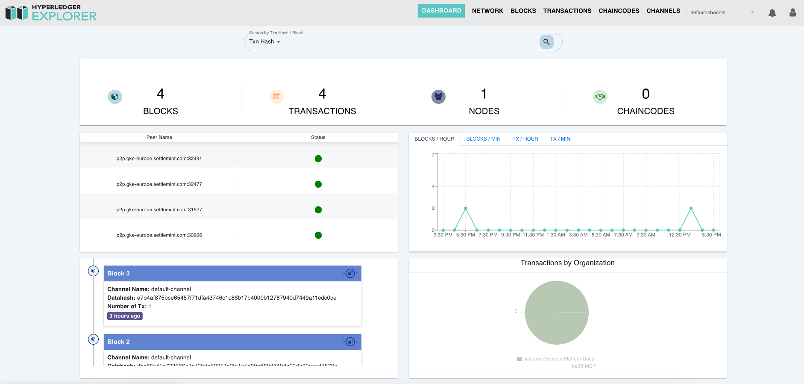

import { Tabs, Tab } from "fumadocs-ui/components/tabs";
import { Callout } from "fumadocs-ui/components/callout";
import { Steps } from "fumadocs-ui/components/steps";
import { Card } from "fumadocs-ui/components/card";
import React from "react";

<div style={{
  backgroundColor: "#e1eafd", 
  color: "#356fee", 
  padding: "0.5px 10px 10px 10px",
  borderRadius: "10px", 
  fontSize: "18px", 
  fontWeight: "bold",
  lineHeight: "1.5",
  textAlign: "left"
}}>
  Summary  
  <div style={{ fontSize: "16px", fontWeight: "normal", marginTop: "5px" }}>
To build a blockchain application, the first step is setting up a blockchain network with the correct number of validating and non-validating nodes. You can either deploy a permissioned network such as Hyperledger Besu or GoQuorum, or connect to an L1 or L2 Public Network like Ethereum, Polygon PoS, Hedera, Polygon zkEVM, Avalanche, Arbitrum, or Optimism. Both mainnet and testnet versions are available for public networks.

When creating an application on SettleMint, you will be prompted to select a
network and assign it a name. By default, a first validating node is deployed
along with the network, and you must assign a name to it as well. You may
optionally provide an EC DSA P256 private key to use as custom key material for
the node identity. If no key is provided, SettleMint will generate one
automatically and save it in your private keys.

In SettleMint-managed (SaaS) mode, you will need to choose between a shared or
dedicated cluster for deployment. You can also select a cloud provider and a
data center of your choice. Additionally, you will have the option to select
from small, medium, or large resource packs, which can be scaled up or down
later as needed.

Before deploying the network, you will have the option to configure network
settings and customize the genesis file. For most use cases, it is recommended
to keep the default settings. Once configured, you can proceed with deployment.
After a few minutes, your network manager and first node will be fully
operational.

To enhance reliability, you should add more nodes to your network for fault
tolerance. The best practice is to deploy four validator nodes and two
non-validator nodes. Once the nodes are set up, adding a load balancer will help
distribute network traffic efficiently and improve performance.

Once your network, nodes, and load balancer are running, you can access the
Insights tab to integrate monitoring tools. For permissioned networks, you can
add Blockscout Blockchain Explorer to track transactions and network activity.
If you are using public EVM networks, publicly available blockchain explorers
can be used instead.

</div>
</div>

## Prerequisites

Before setting up a blockchain network, you need to have an application created
in your workspace. Applications provide the organizational context for all your
blockchain resources including networks, nodes, and development tools. If you
haven't created an application yet, follow our
[Create Application](/building-with-settlemint/evm-chains-guide/create-an-organization-and-application)
guide first.

## 1. Add Blockchain Network

For EVM Chains, SettleMint offers Hyperledger Besu and Quorum for permissioned
networks and a bunch of public networks to choose from. For the list of
supported networks please refer -
[Supported Networks](/platform-components/blockchain-infrastructure/network-manager#supported-blockchain-network-protocols)


When we deploy a network, first node is automatically deployed with it and is an
orderer node. Once you have deployed a permissioned network or joined a public
network, you can add more nodes to it.

## 2. Add Blockchain Nodes

To see and add nodes, please click on **Blockchain Nodes** tile on the dashboard
or use the **Blockchain Nodes** link in the left menu.


Users can configure the following settings before deploying a **Fabric
network**:

| Parameter                    | Description                                                                              |
| ---------------------------- | ---------------------------------------------------------------------------------------- |
| Endorsement Policy           | Defines transaction endorsement requirements ("By all peers" or "By majority of peers"). |
| Batch Timeout                | Time before transactions are grouped into a block.                                       |
| Max Messages in Batch        | Maximum number of messages in a batch.                                                   |
| Absolute Max Bytes in Batch  | Upper limit on batch size in megabytes (MB).                                             |
| Preferred Max Bytes in Batch | Preferred batch size in megabytes (MB).                                                  |

#### Channel Configuration and Policies

Hyperledger Fabric networks use a `configtx.json` file to define network
channels, membership rules, and policies. Key components include:

- **Application Group**: Defines policies for participating organizations,
  specifying details such as:
  - **Organization Name**
  - **Policies**:
    - **Admin**: Roles allow users to modify configurations.
    - **Endorsement**: Policies require transaction approvals from specific
      peers.
    - **Readers and Writers**: Policies define access to channel data.
- **Orderer Group**: Configures the ordering service responsible for transaction
  finalization. Settings include:
  - **Batch Timeout**: Determines the time before transactions are grouped into
    a block.
  - **Max Messages Per Batch**: Controls block size.
- **Consensus Type**: Typically `etcdraft`, a Raft-based ordering service.

#### Network Governance and Security

Hyperledger Fabric networks require robust security and governance mechanisms:

- **Membership Service Provider (MSP)**: Controls identity verification and
  authentication, ensuring only authorized participants can access the network.
- **Root Certificates and TLS Certificates**: Define trusted entities for secure
  communication.
- **Endorsement Policies**: Determine how transactions are validated across
  organizations, enforcing compliance and preventing unauthorized modifications.
- **Block Validation Policies**: Ensure the integrity and security of the
  distributed ledger, maintaining network trustworthiness.

---

### Hyperledger Fabric Networks


The **dashboard** offers comprehensive network monitoring, including:

- **Network Overview**: Name, deployment location, creation date, blockchain
  version, protocol type, channel ID, MSP ID.
- **Channel Configuration JSON File Access**.
- **Batch Processing Settings**:
  - Timeout
  - Maximum messages
  - Batch size

#### Real-Time Performance Monitoring


- Number and location of nodes.
- Active consensus nodes and cluster size.
- Latest block committed.
- Real-time transaction monitoring, allowing users to keep track of all
  blockchain activities.
- Health status of orderer and peer nodes.
- Performance analytics, including block generation times, to help organizations
  optimize their blockchain operations.
- Endorsement policy compliance tracking to ensure transactions adhere to
  predefined security and governance policies.

#### System Recommendations

> **Recommendation**  
> Alerts for **fault tolerance** and **orderer node requirements** are provided
> in the system.

#### Key Benefits

- Simplifies the deployment process for Hyperledger Fabric networks through a
  guided setup approach.
- Efficiently configures access control, consensus models, and governance
  settings, ensuring a seamless blockchain deployment experience.
- Designed for scalability, supporting multi-organization setups with secure
  identity management.
- Integrated monitoring provides organizations with real-time insights into
  network performance and compliance adherence.

---

# Hyperledger Fabric Explorer

Hyperledger Explorer is a web-based tool designed to provide a **comprehensive
and real-time** view of blockchain operations within **Hyperledger Fabric**
networks. It enables users to monitor and analyze blockchain activities,
including **blocks, transactions, and chaincodes**, while maintaining privacy
and security. With its feature-rich dashboard, Hyperledger Explorer allows users
to **navigate through blocks, transactions, peers, and channels** with ease. The
tool provides advanced search and filtering capabilities, real-time
notifications for new blocks, and interactive metrics for visualizing blockchain
trends. By offering deep insights into ledger data and enabling efficient
network management, Hyperledger Explorer becomes an essential solution for
organizations leveraging **Hyperledger Fabric**.



- **Real-time Monitoring**: Displays network activity as it happens, providing
  immediate visibility into new blocks and transactions.
- **Comprehensive Dashboard**: A central hub for monitoring network health,
  including metrics such as the number of blocks, transactions, nodes, and
  chaincodes.
- **Detailed Block & Transaction Views**:
  - Block list with metadata such as block hash, transaction count, and
    timestamps.
  - Transaction explorer for tracking transaction details, types, and associated
    metadata.
- **Search & Filtering**:
  - Filter transactions and blocks by **date range, channel, or organization**.
  - Advanced sorting capabilities for customized data views.
- **Channel & Chaincode Management**:
  - View and manage available channels.
  - Display installed chaincodes with versioning details.
- **Interactive Metrics & Analytics**:
  - Graphical visualizations of blockchain activity.
  - Hover-based insights for precise data analysis.

## Dashboard Overview

The **Dashboard** serves as the main interface, providing an overview of the
blockchain network. It includes various panels such as **Peer Lists, Network
Metrics, and Recent Transactions by Organization**. Users can dynamically switch
channels via a dropdown to customize their view. Additionally, a **Latest Blocks
Notification Panel** presents key block details, including:

- Block number
- Channel name
- Data hash
- Transaction count

Each block link redirects to an in-depth **Block Details** view, offering
insights into timestamps, hashes, and transaction summaries.

## Network & Channel Management

The **Network View** presents details on configured properties for each channel.
Users can analyze peer statuses, their roles, and network configurations,
including **ledger height and Membership Service Provider (MSP) identity**.

The **Channel List** section provides an overview of available channels,
enabling users to navigate different segments of the blockchain network
effortlessly.

## Exploring Blocks & Transactions

Hyperledger Explorer provides powerful tools for tracking blockchain activities:

- **Block List**: A sortable, filterable table displaying block metadata like
  block hash, transaction count, and creation timestamps.
- **Transaction List**: Supports up to **100 rows per page** with pagination and
  allows users to drill down into transaction specifics.
- **JSON Transaction Views**: Enables structured previews with fold/unfold
  options for easy data inspection.

## Chaincodes & Smart Contracts

The **Chaincode List** presents installed chaincodes across the network,
allowing filtering and sorting by:

- Chaincode name
- Version
- Deployment status
- Associated transactions

This section helps users manage smart contracts efficiently and track changes
over time.

## Analytics & Metrics

A dedicated **Metrics Panel** delivers real-time statistics, such as:

- Number of blocks and transactions processed per hour or minute
- Network activity trends over time
- Interactive charts for monitoring blockchain operations

These visual analytics tools enhance user insights and ensure efficient
blockchain monitoring.

<div style={{
  backgroundColor: "#D1E5E8", 
  color: "#000000", 
  padding: "0.5px 10px 10px 10px",
  borderRadius: "10px", 
  fontSize: "18px", 
  fontWeight: "light",
  lineHeight: "1.5",
  textAlign: "left"
}}>
Congratulations.!!

You have succesfully built the blockchain infrastructure layer for you
application.

From here you can proceed for sevelopment and deploymnet of chaincodes.

</div>

```

```
