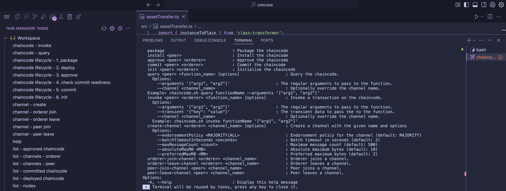

import { Tabs, Tab } from "fumadocs-ui/components/tabs";
import { Callout } from "fumadocs-ui/components/callout";
import { Steps } from "fumadocs-ui/components/steps";
import { Card } from "fumadocs-ui/components/card";

<div
  style={{
    backgroundColor: "#e1eafd",
    color: "#356fee",
    padding: "0.5px 10px 10px 10px",
    borderRadius: "10px",
    fontSize: "18px",
    fontWeight: "bold",
    lineHeight: "1.5",
    textAlign: "left",
  }}
>
  Summary
  <div style={{ fontSize: "16px", fontWeight: "normal", marginTop: "5px" }}>
    
The process starts by defining a clean and structured chaincode using TypeScript. Transaction functions are added to handle common operations—creating new entries, reading existing ones, updating data, and deleting records. These functions follow familiar CRUD patterns but are designed to work within the immutable environment of a blockchain. Events are emitted during each transaction to make state changes observable by off-chain systems or external services.

Once the code is ready, it's compiled and packaged into a deployable archive. The chaincode is then installed on peers, approved by organizations, and committed to a Fabric channel using a lifecycle management script. If needed, an init function can be invoked to populate default data or configure initial state.

After deployment, functions can be tested directly by invoking or querying them through the provided CLI. This end-to-end workflow—from writing the chaincode to interacting with it on-chain—follows a consistent and repeatable pattern, making it easier to manage chaincode across different stages of development and deployment.

</div>
</div>

## Learning with a **Asset Transfer** chaincode example

The goal of this tutorial is to design and build a simple Asset Transfer chaincode
using typescript. While the visible use case is centered around managing user data
(such as name, email, age, etc.), the hidden objective is to demonstrate the
core thought process behind building a chaincode that can store, update,
read, and soft delete data on the blockchain.

This example is intentionally kept simple and non-technical in terms of
blockchain identity (no wallets or signatures involved) to help beginners focus
on the fundamentals of: - Designing chaincode data structures (structs and
mappings) - Writing public and restricted functions to interact with data -
Emitting and responding to events - Handling update and soft delete logic to
mimic realistic scenarios (Understand that transaction data is never deleted,
just a more recent entry is added about that record in a newer block on
blockchain)

By the end of this tutorial, you’ll not only learn the foundational patterns
that apply to many real-world blockchain applications but also understand how to
develop and deploy chaincodes on SettleMint platform.

## 1. Let's start with the solidity chaincode code

A chaincode is a self-executing program deployed on the blockchain that defines rules and logic for how data or assets are managed without relying on intermediaries. In this tutorial, we are writing our chaincode using Solidity, the most widely adopted programming language for Ethereum and EVM-compatible blockchains. Solidity is a statically typed, contract-oriented language designed specifically for writing chaincodes that run on the Ethereum Virtual Machine (EVM).

If you’re new to Solidity or want to deepen your understanding, here are some helpful resources:
	-	Official Solidity Documentation: https://soliditylang.org/
	- Solidity by Example (interactive guide): https://solidity-by-example.org
	-	CryptoZombies (gamified Solidity learning): https://cryptozombies.io/en/solidity

These resources provide both foundational knowledge and hands-on coding exercises to help you become comfortable with writing and deploying chaincodes.

In your learning phase, you can also use ChatGPT: https://chatgpt.com/ or any of your go to AI tools for generation of basic solidity chaincodes.

### Example Asset Transfer chaincode typescript code

**index.ts**

```ts
import type { Contract } from 'fabric-contract-api';
import { AssetTransferContract } from './assetTransfer';

export { AssetTransferContract } from './assetTransfer';

export const contracts: Array<typeof Contract> = [AssetTransferContract];
```

**asset.ts**

```ts
import { Object, Property } from 'fabric-contract-api';

@Object()
export class Asset {
  @Property()
  public docType?: string;

  @Property()
  public ID: string;

  @Property()
  public Color: string;

  @Property()
  public Size: number;

  @Property()
  public Owner: string;

  @Property()
  public AppraisedValue: number;

  constructor(ID: string, Color: string, Size: number, Owner: string, AppraisedValue: number) {
    this.ID = ID;
    this.Color = Color;
    this.Size = Size;
    this.Owner = Owner;
    this.AppraisedValue = AppraisedValue;
  }
}
```


```ts
import { instanceToPlain } from 'class-transformer';
import { Context, Contract, Info, Returns, Transaction } from 'fabric-contract-api';
import stringify from 'json-stringify-deterministic';
import sortKeysRecursive from 'sort-keys-recursive';
import { Asset } from './asset';

@Info({ title: 'AssetTransfer', description: 'Smart contract for trading assets' })
export class AssetTransferContract extends Contract {
  @Transaction()
  public async InitLedger(ctx: Context): Promise<void> {
    const assets: Asset[] = [
      new Asset('asset1', 'blue', 5, 'Tomoko', 300),
      new Asset('asset2', 'red', 5, 'Brad', 400),
      new Asset('asset3', 'green', 10, 'Jin Soo', 500),
      new Asset('asset4', 'yellow', 10, 'Max', 600),
      new Asset('asset5', 'black', 15, 'Adriana', 700),
      new Asset('asset6', 'white', 15, 'Michel', 800),
    ];

    for (const asset of assets) {
      asset.docType = 'asset';
      await ctx.stub.putState(asset.ID, Buffer.from(stringify(sortKeysRecursive(instanceToPlain(asset)))));
      console.info(`Asset ${asset.ID} initialized`);
    }
  }

  // CreateAsset issues a new asset to the world state with given details.
  @Transaction()
  public async CreateAsset(
    ctx: Context,
    id: string,
    color: string,
    size: number,
    owner: string,
    appraisedValue: number
  ): Promise<void> {
    const exists = await this.AssetExists(ctx, id);
    if (exists) {
      throw new Error(`The asset ${id} already exists`);
    }

    const asset = new Asset(id, color, size, owner, appraisedValue);
    asset.docType = 'asset';
    const assetBuffer = Buffer.from(stringify(sortKeysRecursive(instanceToPlain(asset))));

    // Publish event
    ctx.stub.setEvent('CreateAsset', assetBuffer);
    // we insert data in alphabetic order using 'json-stringify-deterministic' and 'sort-keys-recursive'
    await ctx.stub.putState(id, assetBuffer);
  }

  // ReadAsset returns the asset stored in the world state with given id.
  @Transaction(false)
  public async ReadAsset(ctx: Context, id: string): Promise<string> {
    const assetJSON = await ctx.stub.getState(id); // get the asset from chaincode state
    if (!assetJSON || assetJSON.length === 0) {
      throw new Error(`The asset ${id} does not exist`);
    }
    return assetJSON.toString();
  }

  // UpdateAsset updates an existing asset in the world state with provided parameters.
  @Transaction()
  public async UpdateAsset(
    ctx: Context,
    id: string,
    color: string,
    size: number,
    owner: string,
    appraisedValue: number
  ): Promise<void> {
    const exists = await this.AssetExists(ctx, id);
    if (!exists) {
      throw new Error(`The asset ${id} does not exist`);
    }

    // overwriting original asset with new asset
    const updatedAsset = new Asset(id, color, size, owner, appraisedValue);
    updatedAsset.docType = 'asset';

    const assetBuffer = Buffer.from(stringify(sortKeysRecursive(instanceToPlain(updatedAsset))));

    // Publish event
    ctx.stub.setEvent('UpdateAsset', assetBuffer);

    // we insert data in alphabetic order using 'json-stringify-deterministic' and 'sort-keys-recursive'
    await ctx.stub.putState(id, assetBuffer);
  }

  // DeleteAsset deletes an given asset from the world state.
  @Transaction()
  public async DeleteAsset(ctx: Context, id: string): Promise<void> {
    const assetString = await this.ReadAsset(ctx, id);

    const assetBuffer = Buffer.from(stringify(sortKeysRecursive(instanceToPlain(assetString))));

    // Publish event
    ctx.stub.setEvent('DeleteAsset', assetBuffer);

    await ctx.stub.deleteState(id);
  }

  // AssetExists returns true when asset with given ID exists in world state.
  @Transaction(false)
  @Returns('boolean')
  public async AssetExists(ctx: Context, id: string): Promise<boolean> {
    const assetJSON = await ctx.stub.getState(id);
    return assetJSON && assetJSON.length > 0;
  }

  // TransferAsset updates the owner field of asset with given id in the world state, and returns the old owner.
  @Transaction()
  public async TransferAsset(ctx: Context, id: string, newOwner: string): Promise<string> {
    const assetString = await this.ReadAsset(ctx, id);
    const asset: Asset = JSON.parse(assetString);
    const oldOwner = asset.Owner;
    asset.Owner = newOwner;

    const assetBuffer = Buffer.from(stringify(sortKeysRecursive(asset)));

    // Publish event
    ctx.stub.setEvent('TransferAsset', assetBuffer);

    // we insert data in alphabetic order using 'json-stringify-deterministic' and 'sort-keys-recursive'
    await ctx.stub.putState(id, assetBuffer);
    return oldOwner;
  }

  // GetAllAssets returns all assets found in the world state.
  @Transaction(false)
  @Returns('string')
  public async GetAllAssets(ctx: Context): Promise<string> {
    const allResults = [];
    // range query with empty string for startKey and endKey does an open-ended query of all assets in the chaincode namespace.
    const iterator = await ctx.stub.getStateByRange('', '');
    let result = await iterator.next();

    while (!result.done) {
      const strValue = Buffer.from(result.value.value.toString()).toString('utf8');
      let record;
      try {
        record = JSON.parse(strValue);
      } catch (err) {
        console.log(err);
        record = strValue;
      }
      allResults.push(record);
      result = await iterator.next();
    }
    return JSON.stringify(allResults);
  }
}

```


## Chaincode components

In this Hyperledger Fabric chaincode, we define a clear set of events and transaction functions that manage the lifecycle of assets. These components provide a complete interface for interacting with on-chain asset data—supporting creation, updates, transfers, deletions, and querying—while also ensuring visibility through event emissions.

Events play a crucial role in enabling off-chain services to listen for changes in the blockchain state, while the transaction functions serve as the core API for modifying and reading asset data stored in the ledger.

Below is a structured overview of the key events and functions defined in the contract:

### Events

| Event Name       | Parameters                                                                                       | Description                                |
|------------------|--------------------------------------------------------------------------------------------------|--------------------------------------------|
| `CreateAsset`    | `string id`, `string color`, `number size`, `string owner`, `number appraisedValue`             | Emitted when a new asset is created        |
| `UpdateAsset`    | `string id`, `string color`, `number size`, `string owner`, `number appraisedValue`             | Emitted when an asset is updated           |
| `DeleteAsset`    | `string id`                                                                                      | Emitted when an asset is deleted           |
| `TransferAsset`  | `string id`, `string newOwner`                                                                   | Emitted when ownership of an asset changes |

###  Functions

| Function Name     | Parameters                                                                                       | Returns             | Description                                              |
|-------------------|--------------------------------------------------------------------------------------------------|---------------------|----------------------------------------------------------|
| `InitLedger`      | –                                                                                                | `void`              | Initializes the ledger with default sample assets        |
| `CreateAsset`     | `string id`, `string color`, `number size`, `string owner`, `number appraisedValue`             | `void`              | Creates and stores a new asset in the ledger             |
| `ReadAsset`       | `string id`                                                                                      | `string`            | Retrieves asset details by ID                            |
| `UpdateAsset`     | `string id`, `string color`, `number size`, `string owner`, `number appraisedValue`             | `void`              | Updates asset data in the ledger                         |
| `DeleteAsset`     | `string id`                                                                                      | `void`              | Deletes an asset from the ledger                         |
| `AssetExists`     | `string id`                                                                                      | `boolean`           | Checks if an asset with the given ID exists              |
| `TransferAsset`   | `string id`, `string newOwner`                                                                   | `string`            | Transfers asset ownership, returns previous owner name   |
| `GetAllAssets`    | –                                                                                                | `string` (JSON)     | Retrieves all assets stored in the ledger                |


## CRUD Mapping for the Chaincode

This table maps traditional Web2-style CRUD operations to the equivalent transaction functions in the Fabric chaincode:

| **CRUD**   | **Chaincode Function** | **Explanation**                                                                                                                                                                                                                                                |
|------------|------------------------|------------------------------------------------------------------------------------------------------------------------------------------------------------------------------------------------------------------------------------------------------------------|
| **Create** | `CreateAsset()`        | Adds a new asset to the world state with a unique `ID`. Similar to an `INSERT` in databases. It first checks if the asset already exists, and if not, creates it. Emits a `CreateAsset` event to support off-chain indexing or listeners.                        |
| **Read**   | `ReadAsset()`          | Retrieves a specific asset by its `ID`. This acts like a `SELECT` query. It reads the raw asset from the ledger state and returns it as a stringified JSON. This function does not modify state and is marked `@Transaction(false)`.                             |
| **Update** | `UpdateAsset()`        | Replaces all fields of an existing asset with new values. This is equivalent to a full `UPDATE` operation in traditional databases. The function ensures the asset exists before applying changes. Emits `UpdateAsset` for monitoring and traceability.           |
| **Delete** | `DeleteAsset()`        | Removes the asset from the ledger entirely, performing a **hard delete**. Unlike soft deletes, this operation erases the state key from the ledger. The original state is lost, but the deletion is tracked via the `DeleteAsset` event for audit purposes.       |


## Packaging and deploying chaincode 




## Chaincode Lifecycle Management on SettleMint (Fabric)

This guide explains the process to **compile**, **package**, **install**, **approve**, **commit**, **initialize**, **query**, and **invoke** Hyperledger Fabric chaincode using `chaincode.sh` provided in the BTP platform IDE.

## Prerequisites

Ensure the following environment variables are set before you begin:

- `CC_NAME`: Chaincode name
- `CC_VERSION`: Chaincode version (e.g., `1.0`)
- `CC_SEQUENCE`: Lifecycle sequence number (e.g., `1`)
- `CC_SRC_PATH`: Path to built chaincode files (`./dist`)
- `CC_RUNTIME_LANGUAGE`: Language used (`node`)
- Optional:  
  - `CC_INIT_FCN`: Init function name (e.g., `InitLedger`)
  - `CC_INIT_ARGS`: JSON arguments for init
  - `CC_CHANNEL`: Channel name (default: `default-channel`)
  - `CC_COLLECTIONS_CONFIG_PATH`: For private data collections
  - `CC_SIGNATURE_POLICY`: Signature policy, if any

---

## 1. Compile and Package Chaincode

**Step:** Compile TypeScript into JavaScript (if runtime is Node.js) and create the chaincode `.tar.gz` package.

**Command:**  
**`./chaincode.sh package`**

- Transpiles and bundles code under `dist/`.
- Runs `peer lifecycle chaincode package`.
- Outputs a tarball `chaincodeName.tar.gz`.

---

## 2. Install Chaincode on Peer

**Step:** Uploads the packaged chaincode file to a specified peer.

**Command:**  
**`./chaincode.sh install <peer>`**

- Uses the `BTP_SERVICE_TOKEN` to authenticate with the SettleMint backend.
- Automatically polls until the chaincode is detected as installed.

---

## 3. Approve Chaincode for Org

**Step:** Approves the chaincode definition using the provided peer and orderer.

**Command:**  
**`./chaincode.sh approve <peer> <orderer>`**

- Sends the chaincode metadata and version to the orderer.
- Can include private data configs and signature policies if required.

---

## 4. Check Commit Readiness (Optional)

**Step:** Validates whether enough orgs have approved the chaincode.

**Command:**  
**`./chaincode.sh commit-readiness <peer>`**

- Useful for multi-org setups to confirm endorsement policy compliance.

---

## 5. Commit Chaincode

**Step:** Commits the approved chaincode definition to the channel.

**Command:**  
**`./chaincode.sh commit <peer> <orderer>`**

- Requires a majority of orgs to have approved the chaincode.
- Confirms commit status by polling continuously.

---

## 6. Initialize Chaincode (Optional)

**Step:** Calls the init function (e.g., `InitLedger`) if defined.

**Command:**  
**`./chaincode.sh init <peer> <orderer>`**

- Only needed when `initRequired` was set to `true` during approval.

---

## 7. Query Chaincode

**Step:** Read data from ledger via chaincode function.

**Command:**  
**`./chaincode.sh query <peer> <function_name> --arguments '["arg1"]'`**

- No state change is made.
- Supports channel override via `--channel`.

---

## 8. Invoke Chaincode

**Step:** Write/update ledger state via chaincode.

**Command:**  
**`./chaincode.sh invoke <peer> <orderer> <function_name> --arguments '["arg1"]'`**

- Supports `--transient` for sensitive/private inputs.
- Supports channel override.

---

## 9. Test Build Locally

Optional workspace tasks like `build package`, `test workspace` are available in Code Studio’s **Task Manager** panel to automate test builds.

---

## Helpful Queries

| Command                                | Description                                      |
|----------------------------------------|--------------------------------------------------|
| **`./chaincode.sh peers`**             | List available peers                             |
| **`./chaincode.sh orderers`**          | List available orderers                          |
| **`./chaincode.sh nodes`**             | List all nodes in the application                |
| **`./chaincode.sh installed <peer>`**  | View installed chaincodes                        |
| **`./chaincode.sh approved <peer>`**   | Check approved definition of chaincode           |
| **`./chaincode.sh committed <peer>`**  | Check committed chaincode                        |

---

## Channel Management

| Command                                                  | Purpose                          |
|-----------------------------------------------------------|----------------------------------|
| **`./chaincode.sh create-channel <orderer> <channel>`**   | Create a new channel             |
| **`./chaincode.sh orderer-join-channel <o> <channel>`**   | Add orderer to channel           |
| **`./chaincode.sh peer-join-channel <p> <channel>`**      | Add peer to channel              |
| **`./chaincode.sh orderer-leave-channel <o> <channel>`**  | Remove orderer from channel      |
| **`./chaincode.sh peer-leave-channel <p> <channel>`**     | Remove peer from channel         |


The `chaincode.sh` utility acts as a full-featured DevOps toolkit for Fabric chaincode lifecycle management. It integrates with SettleMint APIs to orchestrate everything from packaging to deployment to post-deployment operations across multiple peers and orderers.


<div style={{
  backgroundColor: "#D1E5E8", 
  color: "#000000", 
  padding: "0.5px 10px 10px 10px",
  borderRadius: "10px", 
  fontSize: "18px", 
  fontWeight: "light",
  lineHeight: "1.5",
  textAlign: "left"
}}>
Congratulations.!!

You have successfully packaged and deployed your chaincode on blockchain network.

Now you can proceed to middlewares for getting APIs to do chaincode
transactions, write data to chain and read data in a structured format.

</div>

```
Keywords: Solidity, chaincodes, Ethereum, SettleMint, Hardhat, Foundry, Ignition, deployment, contract testing, user profile manager, CRUD operations, soft delete, ABI, EVM, struct, mapping, events, contract compilation, sub-graphs, blockchain development, test automation, forge-std, viem, chai, JavaScript, TypeScript, contract address, deployment script, chaincode storage, blockchain identity, dApp backend, on-chain data, revert handling, metadata, contract artifacts, local network, private key, gas fees, node selection, build process
```
