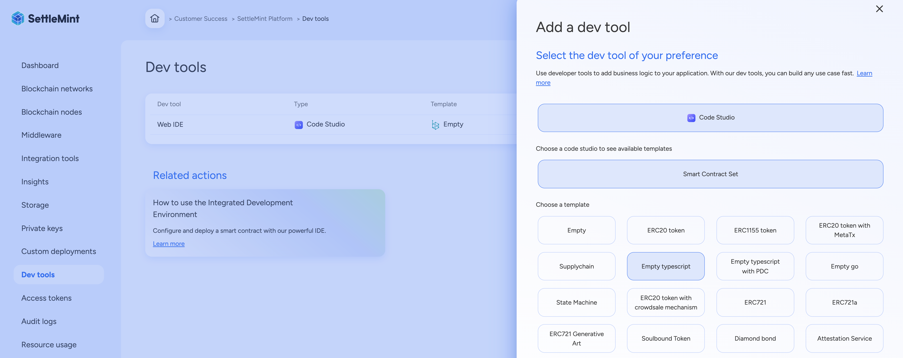
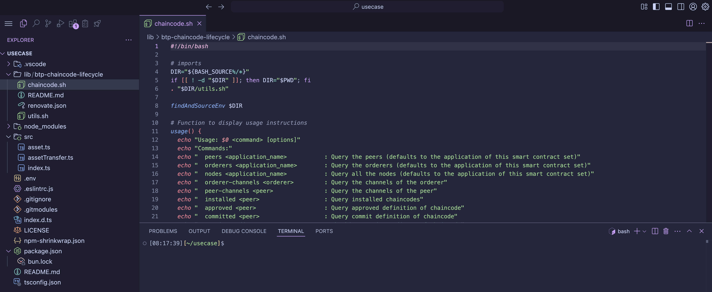

import { Tabs, Tab } from "fumadocs-ui/components/tabs";
import { Callout } from "fumadocs-ui/components/callout";
import { Steps } from "fumadocs-ui/components/steps";
import { Card } from "fumadocs-ui/components/card";

<div style={{
  backgroundColor: "#e1eafd", 
  color: "#356fee", 
  padding: "0.5px 10px 10px 10px",
  borderRadius: "10px", 
  fontSize: "18px", 
  fontWeight: "bold",
  lineHeight: "1.5",
  textAlign: "left"
}}>
  Summary  
  <div style={{ fontSize: "16px", fontWeight: "normal", marginTop: "5px" }}>

To start developing and deploying chaincodes on the SettleMint platform, you’ll first need to add Code Studio to your application. This provides you with a full-featured web-based IDE, pre-configured for blockchain development using tools like Hardhat, Foundry, and The Graph. Once added, you can use built-in tasks to build, test and deploy chaincodes, all within the same environment.

You can add Code Studio through the Platform UI by selecting it as a dev tool and linking it with a chaincode set and a template. Alternatively, you can use the SDK CLI or SDK JS to programmatically create and manage chaincode sets. These interfaces give you flexibility depending on whether you’re working from the console or integrating via scripts or automation.

After setup, you’ll be able to customize your chaincodes directly within the IDE. A task manager will guide you through building and deploying them to local or SettleMint-hosted blockchain networks. 

To speed up development, SettleMint offers a rich library of open-source chaincode templates. These templates can be modified, extended, or used as-is, and you also have the option to create and manage custom templates within your consortium for reuse across projects.

</div>
</div>


## How to setup code studio and deploy chaincode on SettleMint platform

Code Studio is SettleMint’s fully integrated, web-based IDE built specifically for blockchain development. It provides developers with a familiar Visual Studio Code experience directly in the browser, pre-configured with essential tools like Hardhat, Foundry, and The Graph. Code Studio enables seamless development, testing, deployment, and indexing of chaincodes and subgraphs, all within a unified environment. 

It eliminates the need for complex local setups, simplifies DevOps workflows, and reduces time-to-market by combining infrastructure, templates, and automation under one interface. By offering pre-built tasks, contract templates, and GitHub integration, it solves the traditional challenges of fragmented tooling, inconsistent environments, and steep setup requirements for web3 development.



Despite offering full configurability, Code Studio includes all essential dependencies pre-installed, saving time and avoiding setup friction. It supports extensions for formatting, linting, testing, and AI-assisted development, mirroring the convenience of a local VS Code setup. 
Every component—from contracts to testing and subgraph development is wired into a well-structured, maintainable codebase that is continuously updated and thoroughly tested to align with the latest development standards. This makes it ideal for both rapid prototyping and production-grade blockchain applications.




Smart contract sets allow you to incorporate **business logic** into your
application by deploying chaincodes that run on the blockchain. You can add
a chaincode set via different methods as part of your development workflow.

## Fabric IDE Project Structure

The Fabric IDE project structure in Code Studio is tailored to support robust development and lifecycle management of Hyperledger Fabric chaincode. It includes all necessary files for building, deploying, and managing chaincode with automation support, organized in a modular and maintainable layout.

| Folder / File                        | Description |
|--------------------------------------|-------------|
| `lib/btp-chaincode-lifecycle/`       | Contains shell scripts and helper logic to automate the Fabric chaincode lifecycle (e.g., install, approve, commit). |
| ├─ `chaincode.sh`                    | Shell script to execute full chaincode lifecycle steps such as packaging, installing, and committing. |
| ├─ `utils.sh`                        | Utility shell functions used within lifecycle scripts for reusability and simplification. |
| ├─ `README.md`                       | Documentation for using the lifecycle management tools provided in this library. |
| `src/`                               | Contains the TypeScript source code for your chaincode logic. Each file typically represents a chaincode or asset handler. |
| ├─ `asset.ts`                        | Defines the asset structure and related helper functions. |
| ├─ `assetTransfer.ts`                | Implements the core logic for asset transfer operations (e.g., create, read, update, delete). |
| ├─ `index.ts`                        | Entry point of the chaincode; registers the contracts to be used by the Fabric runtime. |
| `.env`                               | Environment configuration file for local or platform-specific variables (e.g., peer addresses, identities). |
| `.eslintrc.js`                       | Linting configuration for enforcing code quality and style in the TypeScript codebase. |
| `.gitignore`                         | Specifies intentionally untracked files to ignore in version control. |
| `.gitmodules`                        | References Git submodules (if any) used in the project. |
| `index.d.ts`                         | Type declaration file for shared interfaces or types used across the project. |
| `LICENSE`                            | Open-source license governing use and distribution of the project. |
| `npm-shrinkwrap.json`                | Locked npm dependency versions to ensure deterministic builds. |
| `package.json`                       | Declares project metadata, dependencies, and npm scripts (e.g., lint, test, build). |
| `bun.lock`                           | Lock file used by Bun (alternative JavaScript runtime) to freeze dependency versions. |
| `README.md`                          | Project-level documentation outlining setup, commands, and usage for developers. |
| `tsconfig.json`                      | TypeScript compiler configuration, defining how the chaincode is transpiled to JavaScript. |
| `node_modules/`                      | Automatically generated directory containing all installed npm dependencies. |

---

## Code Studio IDE Task Manager for Fabric

The **Code Studio Task Manager** for Hyperledger Fabric provides a curated set of tasks to manage the full chaincode lifecycle, perform channel operations, and view network configuration — all without needing to manually run CLI commands. These tasks are pre-wired into the Fabric project template and are executable from within the IDE interface.

### Chaincode Lifecycle Tasks

| Task Name                                | Description |
|------------------------------------------|-------------|
| `chaincode lifecycle - 1. package`       | Packages the chaincode source into a compressed archive for deployment. |
| `chaincode lifecycle - 2. deploy`        | Installs the packaged chaincode on the target peer. |
| `chaincode lifecycle - 3. approve`       | Approves the chaincode definition for the organization. |
| `chaincode lifecycle - 4. check commit readiness` | Checks if all required organizations have approved the chaincode. |
| `chaincode lifecycle - 5. commit`        | Commits the chaincode definition to the channel. |
| `chaincode lifecycle - 6. init`          | Initializes the chaincode after commit (if required). |

### Chaincode Interactions

| Task Name       | Description |
|------------------|-------------|
| `chaincode - invoke` | Executes a transaction on the deployed chaincode. |
| `chaincode - query`  | Reads data from the ledger using the chaincode query function. |

### Channel Operations

| Task Name              | Description |
|------------------------|-------------|
| `channel - create`         | Creates a new Fabric channel. |
| `channel - orderer join`   | Adds an orderer to the specified channel. |
| `channel - orderer leave`  | Removes an orderer from the channel. |
| `channel - peer join`      | Adds a peer node to the specified channel. |
| `channel - peer leave`     | Removes a peer node from the channel. |

### Listing & Query Utilities

| Task Name                        | Description |
|----------------------------------|-------------|
| `list - approved chaincode`      | Lists chaincode definitions approved by the organization. |
| `list - committed chaincode`     | Lists chaincodes that have been committed to the channel. |
| `list - deployed chaincode`      | Lists deployed chaincode instances on the network. |
| `list - channels - orderer`      | Lists channels associated with the orderer. |
| `list - channels - peer`         | Lists channels associated with a specific peer. |
| `list - nodes`                   | Displays all nodes in the current environment. |
| `list - orderers`                | Lists all orderer nodes available. |
| `list - peers`                   | Lists all peer nodes available in the network. |

### Build & Test Tasks

| Task Name            | Description |
|----------------------|-------------|
| `build package`       | Compiles the chaincode package. |
| `build workspace`     | Builds the full workspace and all its dependencies. |
| `test package`        | Executes tests for the chaincode package. |
| `test workspace`      | Runs all available tests in the workspace. |


## Customize chaincodes

You can customize your chaincodes using the built-in IDE. The smart
contract sets include a Generative AI plugin to assist with development.
[Learn more about the AI plugin here.](./ai-plugin)

## Chaincode template library

SettleMint's chaincode templates serve as open-source, ready-to-use
foundations for blockchain application development, significantly accelerating
the deployment process. These templates enable users to quickly customize and
extend their blockchain applications, leveraging tested and community-enhanced
frameworks to reduce development time and accelerate market entry.

## Open-Source Chaincode Templates under the MIT License

Benefit from the expertise of the blockchain community and trust in the
reliability of your chaincodes. These templates are vetted and used by
major enterprises and institutions, ensuring enhanced security and confidence in
your deployments.

## Chaincode Template Library

The programming language used depends on the target protocol:

- **TypeScript** or **Go** for Hyperledger Fabric

| Template | Description |
|----------|-------------|
| [Empty typescript](https://github.com/settlemint/chaincode-typescript-empty) | Basic TypeScript chaincode for Hyperledger Fabric with no business logic. |
| [Empty typescript with PDC](https://github.com/settlemint/chaincode-typescript-empty-pdc) | Empty TypeScript template with support for private data collections in Fabric. |
| [Empty go](https://github.com/settlemint/chaincode-go-empty) | Minimal Go chaincode scaffold for Hyperledger Fabric. |

## Create Your Own Chaincode Templates for Your Consortium

Within the self-managed Blockchain Transformation Platform (BTP), you can create
and add your own templates for use within your consortium. This fosters a
collaborative environment where templates can be reused and built upon,
promoting innovation and efficiency within your network.

To get started, visit:
[SettleMint GitHub Repository](https://github.com/settlemint/solidity-empty)


<div style={{
  backgroundColor: "#D1E5E8", 
  color: "#000000", 
  padding: "0.5px 10px 10px 10px",
  borderRadius: "10px", 
  fontSize: "18px", 
  fontWeight: "light",
  lineHeight: "1.5",
  textAlign: "left"
}}>
Congratulations.!!

You have succesfully deployed the code studio. 
From here you can proceed for development and deployment of chaincodes.

</div>

```
Keywords: code studio, chaincode development, settlemint, web ide, chaincode set, code studio ide, deploy chaincodes, hardhat, foundry, the graph, subgraph development, ethereum development, evm compatible, solidity, vs code ide, low-code blockchain, blockchain ide, settlemint sdk, chaincode templates, contract deployment, ignition scripts, code studio tasks, hardhat test, foundry test, subgraph codegen, graphql indexing, visual studio code, chaincode automation, code studio cli, sdk js, chaincode management, web3 development, settlemint platform, blockchain application development, evm tools, contract template library, blockchain ide setup, chaincode customization, contract compilation, ethereum chaincodes, subgraph deployment, contract set creation, code studio setup, github integration, blockchain workflows, devtools integration, dapp development, contract lifecycle management, erc20 template, erc721 template, ai plugin chaincode, blockchain code templates, platform network deployment
```