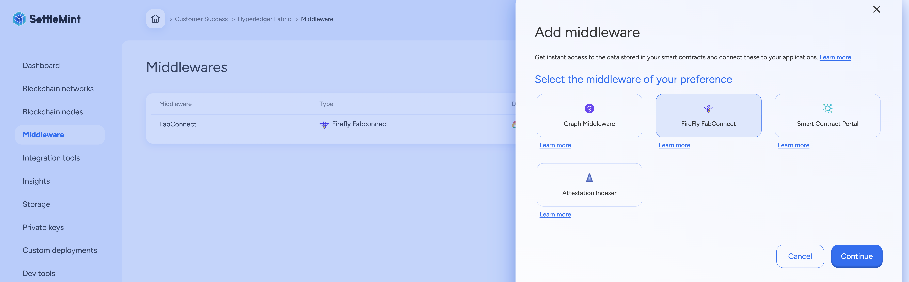
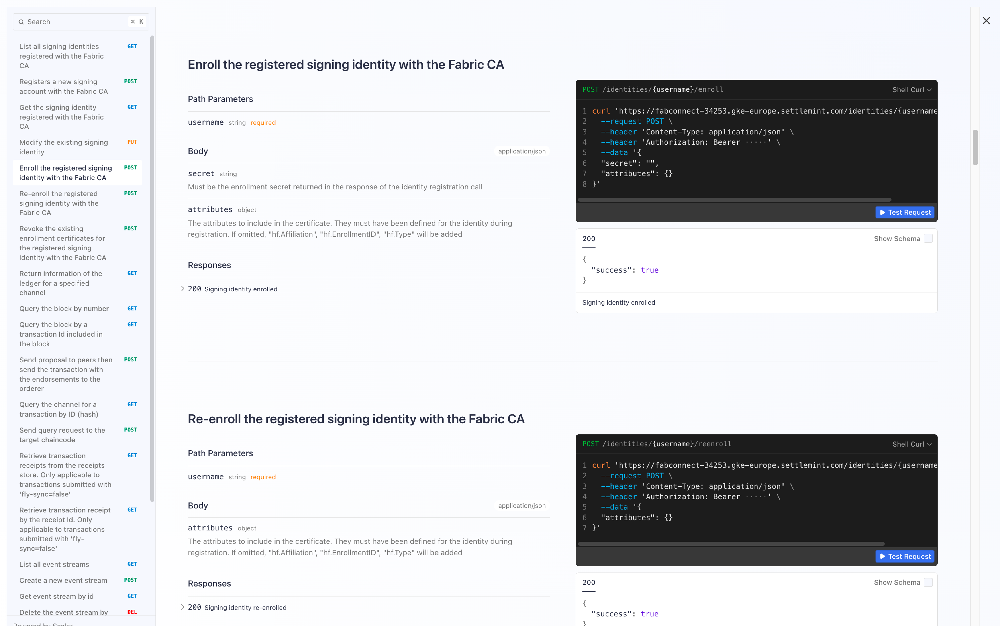

import { Tabs, Tab } from "fumadocs-ui/components/tabs";
import { Callout } from "fumadocs-ui/components/callout";
import { Steps } from "fumadocs-ui/components/steps";
import { Card } from "fumadocs-ui/components/card";

  Summary  
  

## How to setup Graph Middleware and API Portal in SettleMint platform

Middleware acts as a bridge between your blockchain network and applications,
providing essential services like data indexing, API access, and event
monitoring. Before adding middleware, ensure you have an application and
blockchain node in place.

## How to Add Middleware

## FireFly FabConnect API Reference Overview

This reference outlines the key API endpoints exposed by **Hyperledger FireFly
FabConnect**, a REST and WebSocket gateway that enables interaction with
Hyperledger Fabric networks via structured HTTP requests and event
subscriptions.

## 

## Authentication & Setup

| Field         | Description                                          |
| ------------- | ---------------------------------------------------- |
| **Auth Type** | Bearer Token (JWT)                                   |
| **Header**    | `Authorization: Bearer <your_token>`                 |
| **Base URL**  | `https://fabconnect-34253.gke-europe.settlemint.com` |

---

## Identity Management

Manage user identities through Fabric CA:

| Endpoint                          | Method | Description                                  |
| --------------------------------- | ------ | -------------------------------------------- |
| `/identities`                     | GET    | List all registered identities               |
| `/identities`                     | POST   | Register a new identity with the CA          |
| `/identities/{username}`          | GET    | Get details of a specific identity           |
| `/identities/{username}`          | PUT    | Modify existing identity’s attributes        |
| `/identities/{username}/enroll`   | POST   | Enroll the identity to receive certificates  |
| `/identities/{username}/reenroll` | POST   | Re-enroll the identity to renew certificates |
| `/identities/{username}/revoke`   | POST   | Revoke the identity’s certificates           |

---

## Ledger & Block Info

Fetch metadata and raw data from the Fabric blockchain:

| Endpoint                      | Method | Description                                         |
| ----------------------------- | ------ | --------------------------------------------------- |
| `/chaininfo`                  | GET    | Get current block height and hashes for a channel   |
| `/blocks/{blockNumberOrHash}` | GET    | Retrieve block by number or hash                    |
| `/blockByTxId/{txId}`         | GET    | Retrieve block that contains a specific transaction |

---

## Transaction Handling

Submit transactions or check transaction state:

| Endpoint               | Method | Description                                           |
| ---------------------- | ------ | ----------------------------------------------------- |
| `/transactions`        | POST   | Submit a transaction (sync or async)                  |
| `/transactions/{txId}` | GET    | Fetch transaction details using transaction ID (hash) |

---

## Chaincode Queries

Execute read-only chaincode function calls:

| Endpoint | Method | Description                       |
| -------- | ------ | --------------------------------- |
| `/query` | POST   | Send a query request to chaincode |

---

## Transaction Receipts (for async mode)

Access receipts from async transaction submissions (`fly-sync=false`):

| Endpoint                | Method | Description                         |
| ----------------------- | ------ | ----------------------------------- |
| `/receipts`             | GET    | List available transaction receipts |
| `/receipts/{receiptId}` | GET    | Get a specific receipt by ID        |

---

## Event Streams

Create and manage WebSocket or Webhook-based event delivery pipelines:

| Endpoint                        | Method | Description                      |
| ------------------------------- | ------ | -------------------------------- |
| `/eventstreams`                 | GET    | List all existing event streams  |
| `/eventstreams`                 | POST   | Create a new event stream        |
| `/eventstreams/{eventstreamId}` | GET    | Retrieve a specific event stream |
| `/eventstreams/{eventstreamId}` | DELETE | Delete a specific event stream   |

---

## Event Subscriptions

Configure event listening rules on chaincode or block events:

| Endpoint                          | Method | Description                       |
| --------------------------------- | ------ | --------------------------------- |
| `/subscriptions`                  | GET    | List all subscriptions            |
| `/subscriptions`                  | POST   | Create a new subscription         |
| `/subscriptions/{subscriptionId}` | GET    | Get a specific subscription by ID |
| `/subscriptions/{subscriptionId}` | DELETE | Remove a subscription by ID       |

---

## Advanced Controls

| Feature                    | Details                                                             |
| -------------------------- | ------------------------------------------------------------------- |
| **Sync Mode (`fly-sync`)** | Use `true` for synchronous (wait for commit), `false` for async     |
| **Custom Channel**         | Override with `fly-channel` parameter in query                      |
| **Signer Identity**        | Use `fly-signer` to choose which identity signs the request         |
| **Schema Support**         | Structured mode supports input validation using JSON schema headers |

---

Congratulations.!!

You have succesfully configured Fabconncet middleware and have API access on
your chaincode.

From here we will proceed to adding off-chain database and storage options to
enable us to have a holistic backend and storage layer for our application.

