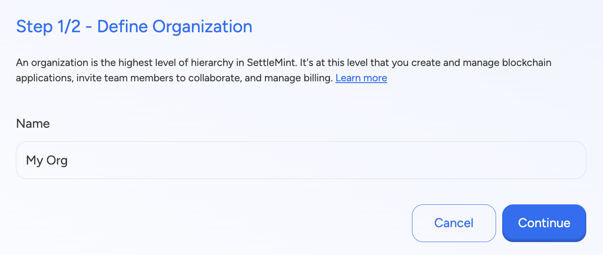

import { Tabs, Tab } from "fumadocs-ui/components/tabs";
import { Callout } from "fumadocs-ui/components/callout";
import { Steps } from "fumadocs-ui/components/steps";
import { Card } from "fumadocs-ui/components/card";

## Account Creation

  {/* Left Column - Text Content */}
  

    <h3>
      Navigate to <a href="https://console.settlemint.com/" target="_blank" rel="noopener noreferrer">SettleMint Console</a>
    </h3>

    
To get started, enter your work email. No password is required! Simply enter your email, and you'll receive a magic link that allows you to sign up instantly without needing to create a password. After entering your email, click the <strong>"Send Magic Link"</strong> button. A secure link will be sent to your inbox, allowing you to log in effortlessly.

    
If you prefer, you can sign up using Google, GitHub or Auth0 as well. A 250 Euro credit is available for first time users enabling them to try out the platform.

  

  {/* Right Column - Image */}
  

    
  

## Setup billing info

  {/* Left Column - Text Content */}
  

  
Enter a name for your organization to serve as the primary identifier for managing projects and collaboration within SettleMint. At a later stage, users can invite members to the organization for better collaboration.

  

  {/* Right Column - Image */}
  

    
  

  {/* Left Column - Text Content */}
  

  
Provide your billing details securely via Stripe, with support for Visa, Mastercard, and Amex, to activate your organization. Follow the prompts to complete the setup and gain full access to SettleMint’s blockchain development tools. Ensure all details are accurate to enable a smooth onboarding experience. Your organization is billed monthly, with the invoice dates set for 1st of every month.

  

  {/* Right Column - Image */}
  

    
  

