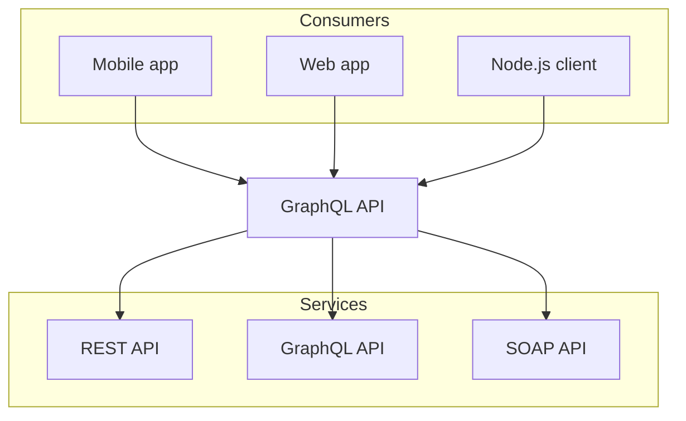
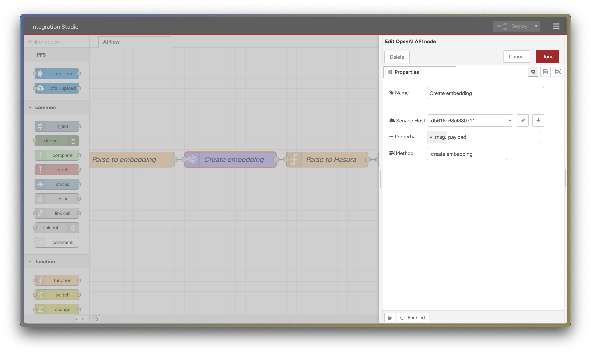

This guide will demonstrate how to use the **SettleMint Integration Studio** to create a flow that incorporates OpenAI nodes for vectorization and utilizes the `pgvector` plugin in Hasura for similarity searches. If you are new to SettleMint, check out the [Getting Started Guide](../about-settlemint/0_intro.mdx).

```package-install
my-package
```

```ts twoslash
console.log('Hello World');
```




In this guide, you will learn to create workflows that:

- Use **OpenAI nodes** to vectorize data.
- Store vectorized data in **Hasura** using `pgvector`.
- Conduct similarity searches to find relevant matches for new queries.

### Prerequisites

- A SettleMint Platform account with **Integration Studio** and **Hasura** deployed
- Access to the Integration Studio and Hasura consoles in your SettleMint environment
- An OpenAI API key for using the OpenAI nodes
- A data source to vectorize (e.g., Graph Node, Attestation Indexer, or external API endpoint)

### Example Flow Available

The Integration Studio includes a pre-built AI example flow that demonstrates these concepts. The flow uses the SettleMint Platform's attestation indexer as a data source, showing how to:

- Fetch attestation data via HTTP endpoint
- Process and vectorize the attestation content
- Store vectors in Hasura
- Perform similarity searches

You can use this flow as a reference while building your own implementation. Each step described in this guide can be found in the example flow.

---

## Part 1: Creating a Workflow to Fetch, Vectorize, and Store Data

### Step 1: Set Up Vector Storage in Hasura

1. Access your SettleMint's Hasura instance through the admin console.

2. Create a new table called `document_embeddings` with the following columns:
   - `id` (type: UUID, primary key)
   - `embedding` (type: vector(1536)) - For storing OpenAI embeddings

### Step 2: Set Up the Integration Studio Flow

1. **Open Integration Studio** in SettleMint and click on **Create Flow** to start a new workflow.

### Step 3: Fetch Data from an External API

1. **Add an HTTP Request Node** to retrieve data from an external API, such as a document or product listing service.
2. Configure the **API endpoint** and any necessary authentication settings.
3. **Add a JSON Node** to parse the response data, focusing on fields like `id` and `content` for further processing.

### Step 4: Vectorize Data with OpenAI Node

1. **Insert an OpenAI Node** in the workflow:
   - Use this node to generate vector embeddings for the text data using OpenAI's Embedding API.
   - Configure the OpenAI node to use the appropriate model and input data, such as `text-embedding-ada-002`.



### Step 5: Store Vectors in Hasura with pgvector

1. **Add a GraphQL Node** to save the vector embeddings and data `id` in Hasura.
2. Set up a **GraphQL Mutation** to store the vectors and associated IDs in a table enabled with `pgvector`.

Example Mutation:

```graphql
mutation insertVector($id: uuid!, $vector: [Float!]!) {
  insert_vectors(objects: { id: $id, vector: $vector }) {
    affected_rows
  }
}
```

3. Ensure correct data mapping from the fetched data and vectorized output.

### Step 6: Deploy and Test the Workflow

1. **Deploy the Flow** within Integration Studio and **run it** to confirm that data is fetched, vectorized, and stored in Hasura.
2. **Verify Hasura Data** by checking the table to ensure vectorized entries and corresponding IDs are stored correctly.

---

## Part 2: Setting Up a Similarity Search Endpoint

### Step 1: Create a POST Endpoint

1. **Add an HTTP POST Node** to accept a JSON payload with a `query` string to be vectorized and compared to stored data.

Payload Example:

```json
{
  "query": "input string for similarity search"
}
```

2. **Parse the Request** by adding a JSON node to extract the `query` field from the incoming POST request.

### Step 2: Vectorize the Input Query

1. **Add an OpenAI Node** to convert the incoming `query` string into a vector representation.

Example Configuration:

```text
Model: text-embedding-ada-002
Input: {{msg.payload.query}}
```

### Step 3: Perform a Similarity Search with Hasura

1. **Add a GraphQL Node** to perform a vector similarity search within Hasura using the `pgvector` plugin.
2. Use a **GraphQL Query** to order results by similarity, returning the top 5 most similar records.

Example Query:

```graphql
query searchVectors($vector: [Float!]!) {
  vectors(order_by: { vector: { _vector_distance: $vector } }, limit: 5) {
    id
    vector
  }
}
```

3. Map the vector from the OpenAI node output as the `vector` input for the Hasura query.

### Step 4: Format and Return the Results

1. **Add a Function Node** to format the response, listing the top 5 matches in a structured JSON format.

### Step 5: Test the Flow

1. **Deploy the Flow** and send a POST request to confirm the similarity search functionality.
2. **Verify Response** to ensure that the flow accurately returns the top 5 matches from the vectorized data in Hasura.

---

## Next Steps

Now that you have built an AI-powered workflow, here are some blockchain-specific applications you can explore:

### Vectorize On-Chain Data

- Index and vectorize smart contract events for similarity-based event monitoring
- Create embeddings from transaction data to detect patterns or anomalies
- Vectorize NFT metadata for content-based recommendations
- Build semantic search for on-chain attestations

### Advanced Use Cases

- Combine transaction data with natural language descriptions for enhanced search
- Create AI-powered analytics dashboards using vectorized blockchain metrics
- Implement fraud detection by vectorizing transaction patterns
- Build a semantic search engine for smart contract code and documentation

### Integration Ideas

- Connect to multiple blockchain indexers to vectorize data across networks
- Combine off-chain and on-chain data vectors for comprehensive analysis
- Set up automated alerts based on similarity to known patterns
- Create a knowledge base from vectorized blockchain documentation

For further resources, check out:

- [SettleMint Integration Studio Documentation](https://console.settlemint.com/documentation/docs/using-platform/integration-studio/)
- [Node-RED Documentation](https://nodered.org/docs/)
- [OpenAI API Documentation](https://beta.openai.com/docs/)
- [Hasura pgvector Documentation](https://hasura.io/docs/3.0/connectors/postgresql/native-operations/vector-search/)

---

This guide should enable you to build AI-powered workflows with SettleMint's new OpenAI nodes and `pgvector` support in Hasura for efficient similarity searches.
