This guide will show you how to build an asset tokenization application using
SettleMint.

In this guide, you will learn:

- What Asset Tokenizaton Is
- The Benefits of using Asset Tokenization
- Asset Tokenization Use-Cases
- How to build and deploy an Asset Tokenization Application

## What Is Asset Tokenization?

Asset tokenization is the process of representing ownership rights to an asset
through digital tokens on a blockchain. These tokens serve as a digital
representation of the asset and are recorded and managed on the blockchain
network, enabling secure ownership transfer and efficient trading.

## Benefits of Asset Tokenization

- **Increased Liquidity:** Tokenizing assets enables fractional ownership,
  allowing investors to buy and sell smaller units, thereby increasing liquidity
  for traditionally illiquid assets.
- **Accessibility:** Tokenization removes barriers to entry by enabling
  participation in asset ownership, allowing investors of all sizes to access
  previously exclusive investment opportunities.
- **Efficiency:** Digital tokens can be traded 24/7, reducing settlement times,
  and eliminating intermediaries, thereby streamlining the process and reducing
  costs.
- **Transparency:** Blockchain provides a transparent and immutable ledger,
  offering a clear audit trail for asset ownership, transfers, and transactions.

## Asset Tokenization Use-Cases

- **Real Estate:** Tokenizing real estate assets enables fractional ownership,
  making it more accessible to a broader investor base and facilitating
  efficient trading.
- **Supply Chain:** Tokenizing supply chain assets such as goods, inventory, or
  documents can enhance traceability, provenance, and efficient transfer of
  ownership.
- **Art and Collectibles:** Tokenizing artwork and collectibles allows for easy
  ownership transfer, provenance verification, and fractional ownership, making
  it more inclusive and liquid.
- **Investment Funds:** Tokenizing investment funds allows for fractional
  ownership, streamlined distribution, and automated compliance with regulatory
  requirements.

## Building an Asset Tokenization Application

## Part 1: Resource Setup

### 1. Create an Application

To start, you need to create an application on SettleMint. An application is a
collection of the different components on SettleMint that will help run your
solution.


To create an application on SettleMint, select the application launcher in the
top right of the dashboard (four boxes). Click `Add an application`.

You will now be able to create a blockchain application and give it a name.

### 2. Deploy a Network and Node

After creating an application, you can now deploy a network and node. We will
use both of these resources to deploy our Asset Tokenization Smart Contract.


To create a network and node, click on the `Start Here` button. Then Select
`Add a Blockchain Network`. This will show all the supported blockchains on
SettleMint.

For this guide, select `Hyperledger Besu`.

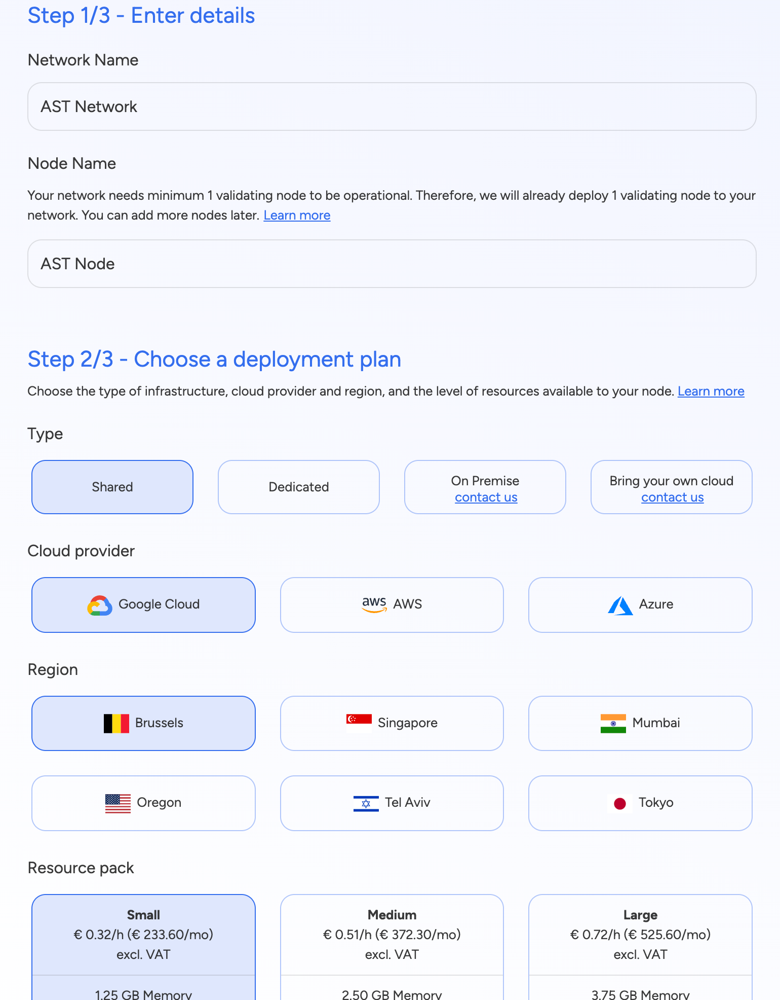

After selecting `Hyperledger Besu`, you now have the option to select our
deployment plan.

For this guide, you can use the following settings:

**Type**: Shared

**Cloud Provider**: Google Cloud

**Region**: Location closest to you

**Resouce Pack**: Small


After clicking confirm, the node and network will start deploying at the same
time. You will see the status as `Running` once both have been successfully
deployed.

### 3. Create IPFS Storage

This guide uses a simple image as the tokenized asset. This image will be pinned
on IPFS, so the next step is to deploy a storage service.

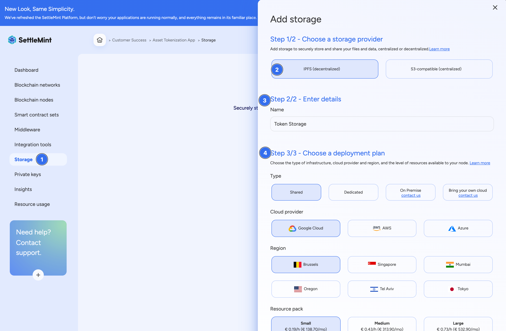

Click on `Storage` and then select `Add storage`. Then select `IPFS` and create
an instance called `Token Storage`. You can choose the same deployment plan that
you did earlier with the network and node.

### 4. Deploy a Private Key

To get access to the node you deployed, you will need to generate a private key.

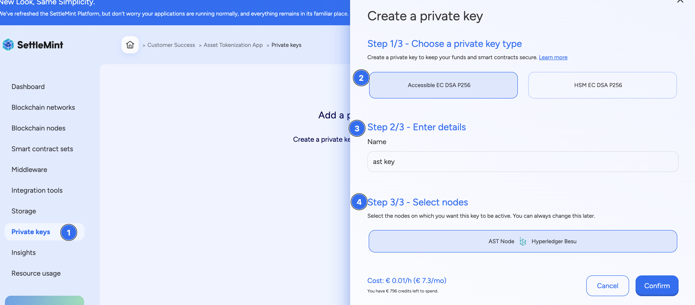

To create a key, click on the `Private Keys` option, then select the
`Accessible EC DSA P256` option. Create a name and select the node that you
deployed in the earlier step.

## Part 2: The Smart Contract

Now that you have deployed the needed resources, you can create and deploy the
Asset Tokenization smart contract.

### 1. Create a Smart Contract Set

To create a Smart contract set, navigate to the `Dev tools` section in the left
sidebar. From there, click on `Add a dev tool`, choose `Code Studio` and then
`Smart Contract Set`.

You will now be given the option to select a template. Choose the `Empty`
option. Create a name and select the same deployment plan as you did earlier.
For more information on how to add a smart contract set,
[see our Smart Contract Sets section](/building-with-settlemint/dev-tools/code-studio/smart-contract-sets/add-smart-contract-set)

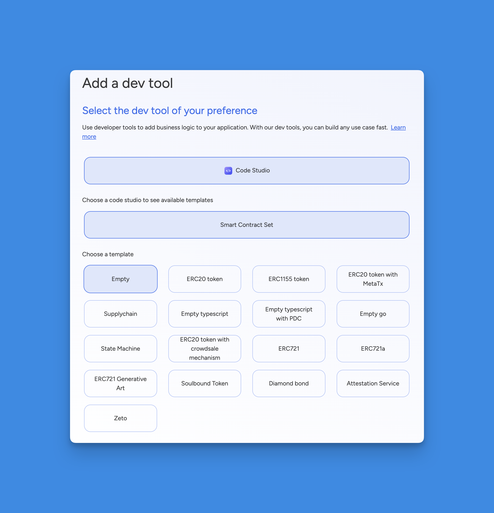

### 2. Opening the Integrated Development Environment (IDE)

To add and edit the smart contract code, you will use the IDE.

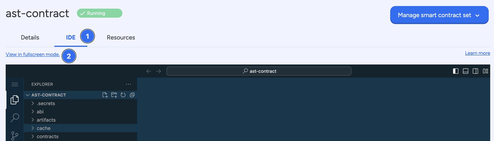

Once the resource has been deployed, select the `IDE` tab and then
`View in fullscreen mode`.

### 3. Adding the Smart Contract Code

With the IDE open in fullscreen, create a new file for your Asset Tokenization
smart contract.

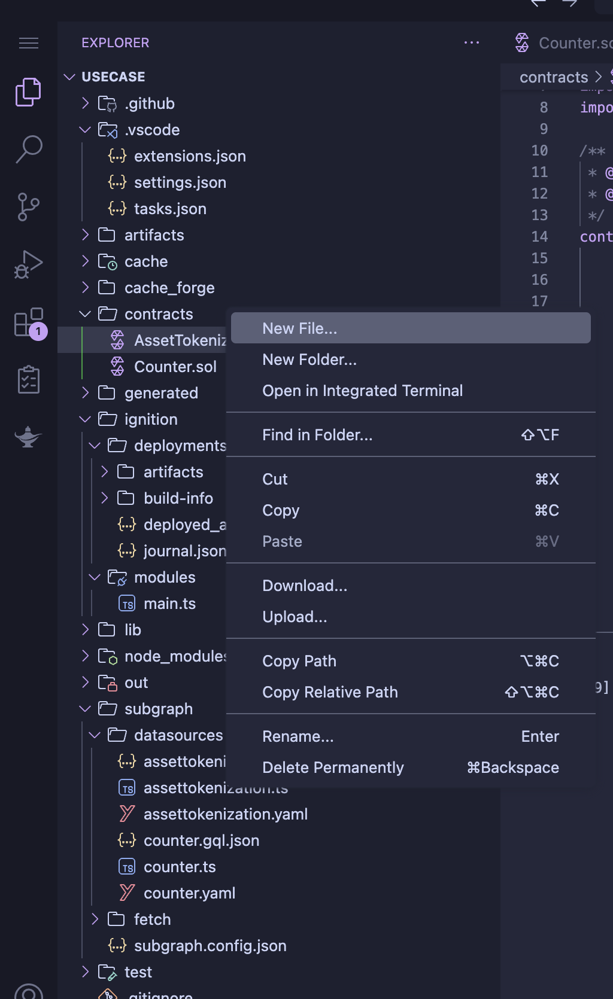

1. On the File Explorer on the left side, select the `Contracts` option.
2. Right Click and select `New File...`
3. Create a new file called `AssetTokenization.sol`

Before adding the contract code, you'll need to install the OpenZeppelin
contracts dependency. This provides the base contracts we'll inherit from for
features like upgradability and access control.

Open the terminal in the IDE and run:

```bash
npm install @openzeppelin/contracts-upgradeable
```

This package provides the base contracts we'll use like `UUPSUpgradeable`,
`OwnableUpgradeable`, and `ERC1155SupplyUpgradeable`.

After installing the dependency, copy and paste the Solidity code below:

<details>
    <summary>Solidity Code</summary>

```solidity
// SPDX-License-Identifier: MIT
// SettleMint.com

pragma solidity ^0.8.13;

import "@openzeppelin/contracts-upgradeable/proxy/utils/UUPSUpgradeable.sol";
import "@openzeppelin/contracts-upgradeable/access/OwnableUpgradeable.sol";
import "@openzeppelin/contracts-upgradeable/token/ERC1155/extensions/ERC1155SupplyUpgradeable.sol";

/**
 * @title AssetTokenization
 * @dev A contract for tokenizing assets using ERC1155 standard with upgradeable functionality.
 */
contract AssetTokenization is Initializable, UUPSUpgradeable, ERC1155SupplyUpgradeable, OwnableUpgradeable {
    /**
     * @dev Struct representing an asset.
     * @param assetId Unique identifier number.
     * @param name Name of the asset.
     * @param symbol Symbol of the asset.
     * @param maxSupply Maximum number of tokens for the asset.
     * @param faceValue Initial value of the asset.
     * @param maturityTimestamp Maturity date in the value of a unix timestamp.
     * @param assetUri URI for the asset metadata.
     */
    struct Asset {
        uint256 assetId;
        string name;
        string symbol;
        uint256 maxSupply;
        uint256 faceValue;
        uint256 maturityTimestamp;
        string assetUri;
    }

    /// @notice Mapping from asset ID to asset details.
    mapping(uint256 => Asset) public assetToDetails;

    /**
     * @dev Event emitted on asset transfer.
     * @param from Address from which the asset is transferred.
     * @param to Address to which the asset is transferred.
     * @param assetIds Array of asset IDs being transferred.
     * @param amounts Array of amounts of each asset being transferred.
     */
    event AssetTransferEvent(address indexed from, address indexed to, uint256[] assetIds, uint256[] amounts);

    /**
     * @dev Initializes the contract.
     */
    function initialize() external initializer {
        __ERC1155_init("");
        __Ownable_init(msg.sender);
        __UUPSUpgradeable_init();
    }

    /**
     * @dev Creates a new asset.
     * @param assetId Unique identifier for the asset.
     * @param name Name of the asset.
     * @param symbol Symbol of the asset.
     * @param maxSupply Maximum supply of the asset.
     * @param faceValue Initial value of the asset.
     * @param maturityTimestamp Maturity date of the asset in unix timestamp.
     * @param assetUri URI for the asset metadata.
     */
    function createAsset(
        uint256 assetId,
        string memory name,
        string memory symbol,
        uint256 maxSupply,
        uint256 faceValue,
        uint256 maturityTimestamp,
        string memory assetUri
    ) external onlyOwner {
        require(assetToDetails[assetId].assetId != assetId, "Asset already exists");
        Asset memory asset = Asset(assetId, name, symbol, maxSupply, faceValue, maturityTimestamp, assetUri);
        assetToDetails[assetId] = asset;
    }

    /**
     * @dev Mints a specified amount of an asset to a recipient.
     * @param assetId ID of the asset to mint.
     * @param amounts Amount of the asset to mint.
     * @param recipient Address to receive the minted assets.
     */
    function mint(uint256 assetId, uint256 amounts, address recipient) external onlyOwner {
        require(assetToDetails[assetId].assetId == assetId, "Asset does not exist");
        require(totalSupply(assetId) + amounts <= assetToDetails[assetId].maxSupply, "Max supply exceeded");
        require(assetToDetails[assetId].maturityTimestamp > block.timestamp, "Asset is already matured");
        _mint(recipient, assetId, amounts, "");
    }

    /**
     * @dev Mints multiple assets in a batch to a recipient.
     * @param assetIds Array of asset IDs to mint.
     * @param amounts Array of amounts for each asset to mint.
     * @param recipient Address to receive the minted assets.
     */
    function mintBatch(uint256[] memory assetIds, uint256[] memory amounts, address recipient) public onlyOwner {
        uint256 length = assetIds.length;
        for (uint256 i = 0; i < length; i++) {
            require(assetToDetails[assetIds[i]].assetId == assetIds[i], "Asset does not exist");
            require(
                totalSupply(assetIds[i]) + amounts[i] <= assetToDetails[assetIds[i]].maxSupply, "Max supply exceeded"
            );
            require(assetToDetails[assetIds[i]].maturityTimestamp > block.timestamp, "Asset is already matured");
        }
        _mintBatch(recipient, assetIds, amounts, "");
    }

    /**
     * @dev Burns a specified amount of an asset from the sender.
     * @param assetId ID of the asset to burn.
     * @param amounts Amount of the asset to burn.
     */
    function burn(uint256 assetId, uint256 amounts) external {
        require(assetToDetails[assetId].assetId == assetId, "Asset does not exist");
        _burn(msg.sender, assetId, amounts);
    }

    /**
     * @dev Burns multiple assets in a batch from the sender.
     * @param assetIds Array of asset IDs to burn.
     * @param amounts Array of amounts for each asset to burn.
     */
    function burnBatch(uint256[] memory assetIds, uint256[] memory amounts) external {
        uint256 length = assetIds.length;
        for (uint256 i = 0; i < length; i++) {
            require(assetToDetails[assetIds[i]].assetId == assetIds[i], "Asset does not exist");
        }
        _burnBatch(msg.sender, assetIds, amounts);
    }

    /**
     * @dev Returns the URI for a specific asset ID.
     * @param id Asset ID to query the URI for.
     * @return URI of the specified asset ID.
     */
    function uri(uint256 id) public view override returns (string memory) {
        return assetToDetails[id].assetUri;
    }

    /**
     * @dev Updates the state on asset transfer and emits the transfer event.
     * @param from Address from which the asset is transferred.
     * @param to Address to which the asset is transferred.
     * @param assetIds Array of asset IDs being transferred.
     * @param amounts Array of amounts of each asset being transferred.
     */
    function _update(address from, address to, uint256[] memory assetIds, uint256[] memory amounts)
        internal
        override(ERC1155SupplyUpgradeable)
    {
        super._update(from, to, assetIds, amounts);
        emit AssetTransferEvent(from, to, assetIds, amounts);
    }

    /**
     * @dev Authorizes the upgrade of the contract to a new implementation.
     * @param newImplementation Address of the new implementation.
     */
    function _authorizeUpgrade(address newImplementation) internal override onlyOwner {}
}

```

</details>

### 4. Change the Deployment Configuration

With the code pasted in the IDE, you now need to change the deployment settings
to include the smart contract you have just created.

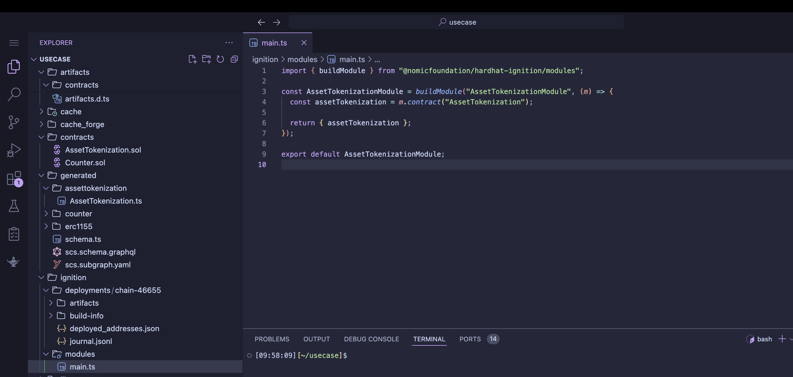

In the file explorer on the left, select the `ignition` folder. Then open the
`main.ts` file under `modules`.

Replace the content of `main.ts` with the code below:

<details>
    <summary> Ignition Module Code </summary>

```javascript
// SPDX-License-Identifier: MIT
// SettleMint.com
import { buildModule } from "@nomicfoundation/hardhat-ignition/modules";

const AssetTokenizationModule = buildModule("AssetTokenizationModule", (m) => {
  const assetTokenization = m.contract("AssetTokenization");

  return { assetTokenization };
});

export default AssetTokenizationModule;
```

</details>

### 5. Deploy the Contract

With those settings changed, you are now ready to compile and deploy your smart
contract.

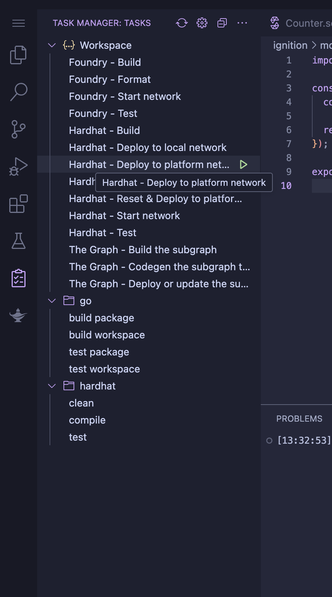

To compile the smart contract:

1. Select the `Task Manager` on the left menu
2. Click `Foundry - Build` or `Hardhat - Build` to compile the contract
3. A terminal window below will show the status of the compiling contract

To deploy your smart contract:

1. Select the `Hardhat - Deploy to platform network` option
2. The terminal will open to show the status of deploying your contract
3. The terminal will show the contract address of your smart contract

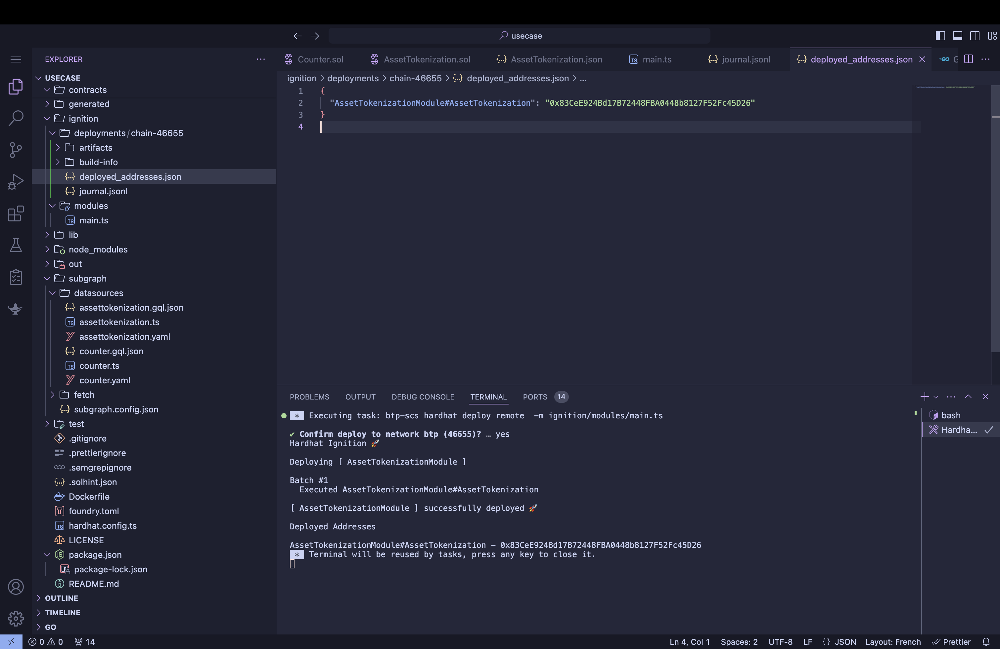

<Callout type="info">
  The contract address can also be found in `deployed_addresses.json` in the
  `deployments`folder created when deploying the smart contract code. You will
  need it later for the integration.
</Callout>

## Part 3: Connect the Resources

### 1. Upload an Image to IPFS

You will now upload the image to the IPFS storage service you deployed earlier.

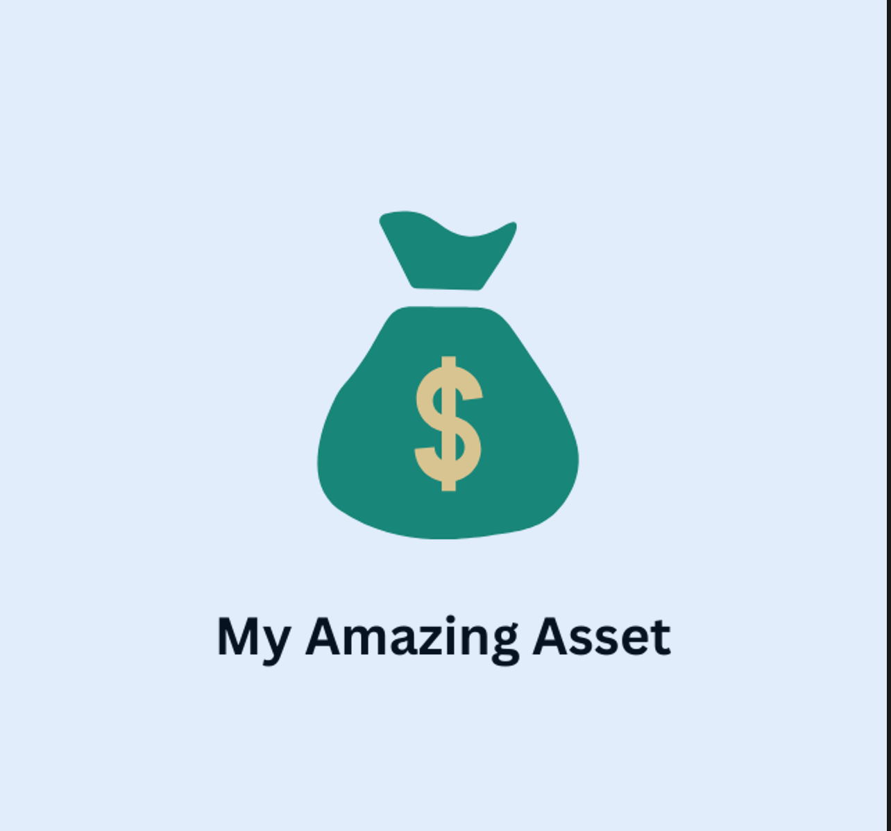

Save the image above to your computer. It is what you will use to represent your
asset.

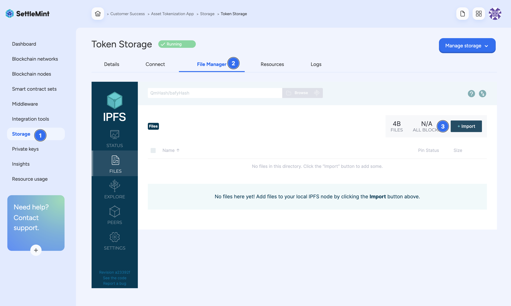

To upload this image to IPFS:

1. Click on Storage
2. Select File Manager
3. Select the `Import` option

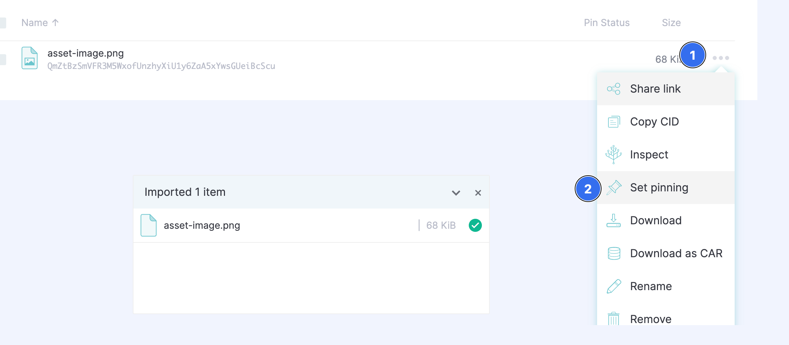

After the image has been imported, select the `Share Link` option by clicking on
the 3 dots next to the file size.

:::info Save this URL as you will use it later in this guide when building the
integration. :::

Select the `Set pinning` option. This will make sure your file remains on IPFS.

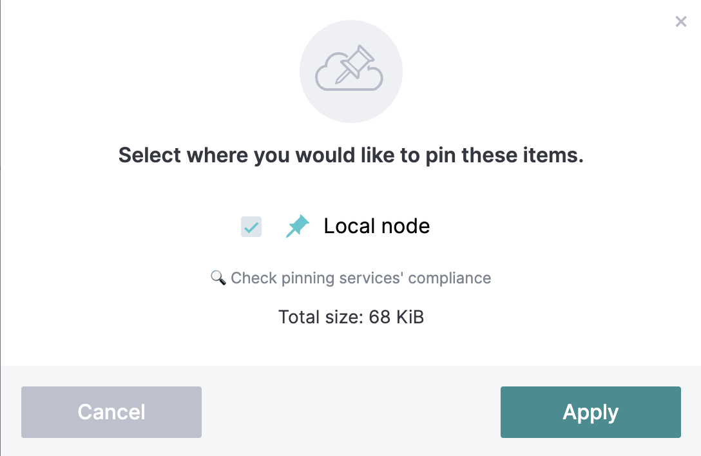

Choose the local node option and click `Apply`.

### 2. Get the JSON-RPC Endpoint

To connect to the network that you have created, you need to get your JSON-RPC
connection URL.

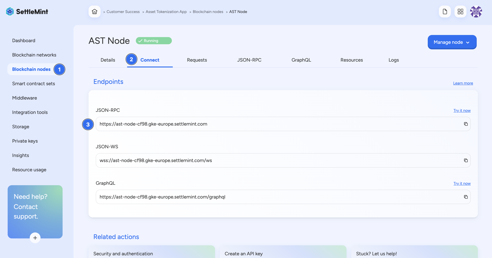

The URL can be found by:

1. Selecting `Blockchain nodes`
2. Clicking on the `Connect` tab
3. Copy the `JSON-RPC` URL

<Callout type="info">
  Save this URL as you will use it later in this guide when building the
  integration.
</Callout>

### 3. Creating an access token

To connect to your node and storage, you will need an access token. We recommend
you use an application access token.

You can create an application access token by navigating to the application
dashboard, and then clicking on the `Access Tokens` section in the left sidebar.

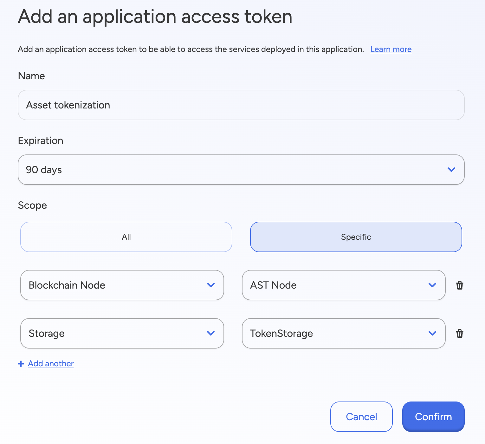

You can now create an application access token with an expiration and the scopes
you want to use. For this guide, we recommend you create an access token scoped
to your node and storage.

You will now see your access token. Copy the token since you cannot see it
again! For more information on how to use access tokens,
[see our Access Tokens section](/building-with-settlemint/application-access-tokens).

### 4. Setup Integration Studio Deployment

The final step is to create a deployment of the `Integration Studio`.

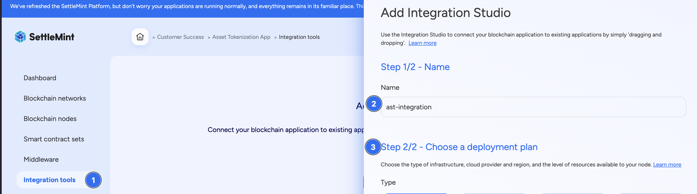

To create an integration studio deployment:

1. Click on `Integration Tools` on the left menu
2. Name the Integration Studio
3. Choose the same deployment plan you have used in this guide

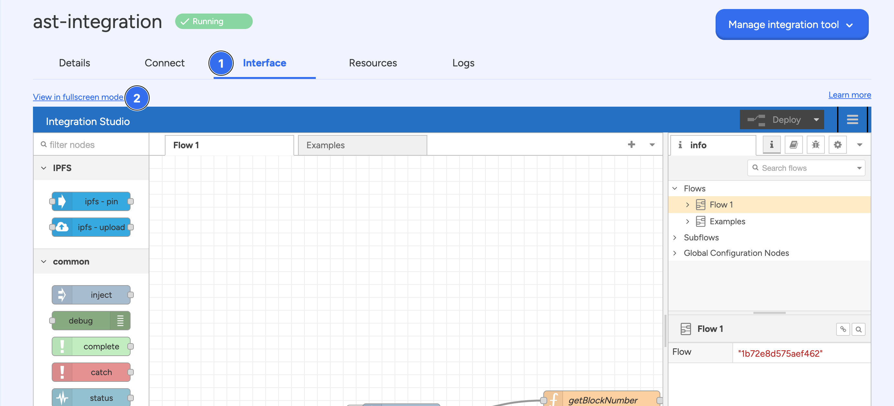

Open your Integration Studio by selecting the `Interface` tab and then opening
it in fullscreen mode.

For this guide, import the template below into the Integration Studio.

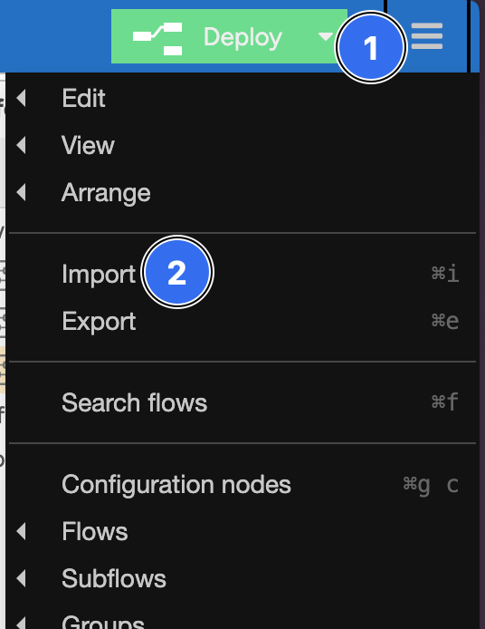

To import the below JSON file:

1. Click on the hamburger icon in the top right next to the `Deploy` button.
2. Select the import option
3. Paste the below JSON code into the window

<details>
    <summary>JSON Code</summary>
```json

[ { "id": "8154b1dd0912e484", "type": "function", "z": "a781da6f697711d2",
"name": "Set Global Variables", "func": "const glbVar = {\n privateKey:
\"PRIVATE_KEY\",\n privateKeyAddress: \"ADDRESS\",\n smartContract:
\"ADDRESS\",\n accessToken: \"ACCESS_TOKEN\",\n rpcEndpoint: \"RCP_ENDPOINT\",\n
abi: [\n {\n \"inputs\": [\n {\n \"internalType\": \"address\",\n \"name\":
\"target\",\n \"type\": \"address\"\n }\n ],\n \"name\": \"AddressEmptyCode\",\n
\"type\": \"error\"\n },\n {\n \"inputs\": [\n {\n \"internalType\":
\"address\",\n \"name\": \"sender\",\n \"type\": \"address\"\n },\n {\n
\"internalType\": \"uint256\",\n \"name\": \"balance\",\n \"type\":
\"uint256\"\n },\n {\n \"internalType\": \"uint256\",\n \"name\": \"needed\",\n
\"type\": \"uint256\"\n },\n {\n \"internalType\": \"uint256\",\n \"name\":
\"tokenId\",\n \"type\": \"uint256\"\n }\n ],\n \"name\":
\"ERC1155InsufficientBalance\",\n \"type\": \"error\"\n },\n {\n \"inputs\": [\n
{\n \"internalType\": \"address\",\n \"name\": \"approver\",\n \"type\":
\"address\"\n }\n ],\n \"name\": \"ERC1155InvalidApprover\",\n \"type\":
\"error\"\n },\n {\n \"inputs\": [\n {\n \"internalType\": \"uint256\",\n
\"name\": \"idsLength\",\n \"type\": \"uint256\"\n },\n {\n \"internalType\":
\"uint256\",\n \"name\": \"valuesLength\",\n \"type\": \"uint256\"\n }\n ],\n
\"name\": \"ERC1155InvalidArrayLength\",\n \"type\": \"error\"\n },\n {\n
\"inputs\": [\n {\n \"internalType\": \"address\",\n \"name\": \"operator\",\n
\"type\": \"address\"\n }\n ],\n \"name\": \"ERC1155InvalidOperator\",\n
\"type\": \"error\"\n },\n {\n \"inputs\": [\n {\n \"internalType\":
\"address\",\n \"name\": \"receiver\",\n \"type\": \"address\"\n }\n ],\n
\"name\": \"ERC1155InvalidReceiver\",\n \"type\": \"error\"\n },\n {\n
\"inputs\": [\n {\n \"internalType\": \"address\",\n \"name\": \"sender\",\n
\"type\": \"address\"\n }\n ],\n \"name\": \"ERC1155InvalidSender\",\n \"type\":
\"error\"\n },\n {\n \"inputs\": [\n {\n \"internalType\": \"address\",\n
\"name\": \"operator\",\n \"type\": \"address\"\n },\n {\n \"internalType\":
\"address\",\n \"name\": \"owner\",\n \"type\": \"address\"\n }\n ],\n \"name\":
\"ERC1155MissingApprovalForAll\",\n \"type\": \"error\"\n },\n {\n \"inputs\":
[\n {\n \"internalType\": \"address\",\n \"name\": \"implementation\",\n
\"type\": \"address\"\n }\n ],\n \"name\": \"ERC1967InvalidImplementation\",\n
\"type\": \"error\"\n },\n {\n \"inputs\": [],\n \"name\":
\"ERC1967NonPayable\",\n \"type\": \"error\"\n },\n {\n \"inputs\": [],\n
\"name\": \"FailedInnerCall\",\n \"type\": \"error\"\n },\n {\n \"inputs\":
[],\n \"name\": \"InvalidInitialization\",\n \"type\": \"error\"\n },\n {\n
\"inputs\": [],\n \"name\": \"NotInitializing\",\n \"type\": \"error\"\n },\n
{\n \"inputs\": [\n {\n \"internalType\": \"address\",\n \"name\": \"owner\",\n
\"type\": \"address\"\n }\n ],\n \"name\": \"OwnableInvalidOwner\",\n \"type\":
\"error\"\n },\n {\n \"inputs\": [\n {\n \"internalType\": \"address\",\n
\"name\": \"account\",\n \"type\": \"address\"\n }\n ],\n \"name\":
\"OwnableUnauthorizedAccount\",\n \"type\": \"error\"\n },\n {\n \"inputs\":
[],\n \"name\": \"UUPSUnauthorizedCallContext\",\n \"type\": \"error\"\n },\n
{\n \"inputs\": [\n {\n \"internalType\": \"bytes32\",\n \"name\": \"slot\",\n
\"type\": \"bytes32\"\n }\n ],\n \"name\": \"UUPSUnsupportedProxiableUUID\",\n
\"type\": \"error\"\n },\n {\n \"anonymous\": false,\n \"inputs\": [\n {\n
\"indexed\": true,\n \"internalType\": \"address\",\n \"name\": \"account\",\n
\"type\": \"address\"\n },\n {\n \"indexed\": true,\n \"internalType\":
\"address\",\n \"name\": \"operator\",\n \"type\": \"address\"\n },\n {\n
\"indexed\": false,\n \"internalType\": \"bool\",\n \"name\": \"approved\",\n
\"type\": \"bool\"\n }\n ],\n \"name\": \"ApprovalForAll\",\n \"type\":
\"event\"\n },\n {\n \"anonymous\": false,\n \"inputs\": [\n {\n \"indexed\":
true,\n \"internalType\": \"address\",\n \"name\": \"from\",\n \"type\":
\"address\"\n },\n {\n \"indexed\": true,\n \"internalType\": \"address\",\n
\"name\": \"to\",\n \"type\": \"address\"\n },\n {\n \"indexed\": false,\n
\"internalType\": \"uint256[]\",\n \"name\": \"assetIds\",\n \"type\":
\"uint256[]\"\n },\n {\n \"indexed\": false,\n \"internalType\":
\"uint256[]\",\n \"name\": \"amounts\",\n \"type\": \"uint256[]\"\n }\n ],\n
\"name\": \"AssetTransferEvent\",\n \"type\": \"event\"\n },\n {\n
\"anonymous\": false,\n \"inputs\": [\n {\n \"indexed\": false,\n
\"internalType\": \"uint64\",\n \"name\": \"version\",\n \"type\": \"uint64\"\n
}\n ],\n \"name\": \"Initialized\",\n \"type\": \"event\"\n },\n {\n
\"anonymous\": false,\n \"inputs\": [\n {\n \"indexed\": true,\n
\"internalType\": \"address\",\n \"name\": \"previousOwner\",\n \"type\":
\"address\"\n },\n {\n \"indexed\": true,\n \"internalType\": \"address\",\n
\"name\": \"newOwner\",\n \"type\": \"address\"\n }\n ],\n \"name\":
\"OwnershipTransferred\",\n \"type\": \"event\"\n },\n {\n \"anonymous\":
false,\n \"inputs\": [\n {\n \"indexed\": true,\n \"internalType\":
\"address\",\n \"name\": \"operator\",\n \"type\": \"address\"\n },\n {\n
\"indexed\": true,\n \"internalType\": \"address\",\n \"name\": \"from\",\n
\"type\": \"address\"\n },\n {\n \"indexed\": true,\n \"internalType\":
\"address\",\n \"name\": \"to\",\n \"type\": \"address\"\n },\n {\n \"indexed\":
false,\n \"internalType\": \"uint256[]\",\n \"name\": \"ids\",\n \"type\":
\"uint256[]\"\n },\n {\n \"indexed\": false,\n \"internalType\":
\"uint256[]\",\n \"name\": \"values\",\n \"type\": \"uint256[]\"\n }\n ],\n
\"name\": \"TransferBatch\",\n \"type\": \"event\"\n },\n {\n \"anonymous\":
false,\n \"inputs\": [\n {\n \"indexed\": true,\n \"internalType\":
\"address\",\n \"name\": \"operator\",\n \"type\": \"address\"\n },\n {\n
\"indexed\": true,\n \"internalType\": \"address\",\n \"name\": \"from\",\n
\"type\": \"address\"\n },\n {\n \"indexed\": true,\n \"internalType\":
\"address\",\n \"name\": \"to\",\n \"type\": \"address\"\n },\n {\n \"indexed\":
false,\n \"internalType\": \"uint256\",\n \"name\": \"id\",\n \"type\":
\"uint256\"\n },\n {\n \"indexed\": false,\n \"internalType\": \"uint256\",\n
\"name\": \"value\",\n \"type\": \"uint256\"\n }\n ],\n \"name\":
\"TransferSingle\",\n \"type\": \"event\"\n },\n {\n \"anonymous\": false,\n
\"inputs\": [\n {\n \"indexed\": false,\n \"internalType\": \"string\",\n
\"name\": \"value\",\n \"type\": \"string\"\n },\n {\n \"indexed\": true,\n
\"internalType\": \"uint256\",\n \"name\": \"id\",\n \"type\": \"uint256\"\n }\n
],\n \"name\": \"URI\",\n \"type\": \"event\"\n },\n {\n \"anonymous\": false,\n
\"inputs\": [\n {\n \"indexed\": true,\n \"internalType\": \"address\",\n
\"name\": \"implementation\",\n \"type\": \"address\"\n }\n ],\n \"name\":
\"Upgraded\",\n \"type\": \"event\"\n },\n {\n \"inputs\": [],\n \"name\":
\"UPGRADE_INTERFACE_VERSION\",\n \"outputs\": [\n {\n \"internalType\":
\"string\",\n \"name\": \"\",\n \"type\": \"string\"\n }\n ],\n
\"stateMutability\": \"view\",\n \"type\": \"function\"\n },\n {\n \"inputs\":
[\n {\n \"internalType\": \"uint256\",\n \"name\": \"\",\n \"type\":
\"uint256\"\n }\n ],\n \"name\": \"assetToDetails\",\n \"outputs\": [\n {\n
\"internalType\": \"uint256\",\n \"name\": \"assetId\",\n \"type\":
\"uint256\"\n },\n {\n \"internalType\": \"string\",\n \"name\": \"name\",\n
\"type\": \"string\"\n },\n {\n \"internalType\": \"string\",\n \"name\":
\"symbol\",\n \"type\": \"string\"\n },\n {\n \"internalType\": \"uint256\",\n
\"name\": \"maxSupply\",\n \"type\": \"uint256\"\n },\n {\n \"internalType\":
\"uint256\",\n \"name\": \"faceValue\",\n \"type\": \"uint256\"\n },\n {\n
\"internalType\": \"uint256\",\n \"name\": \"maturityTimestamp\",\n \"type\":
\"uint256\"\n },\n {\n \"internalType\": \"string\",\n \"name\": \"assetUri\",\n
\"type\": \"string\"\n }\n ],\n \"stateMutability\": \"view\",\n \"type\":
\"function\"\n },\n {\n \"inputs\": [\n {\n \"internalType\": \"address\",\n
\"name\": \"account\",\n \"type\": \"address\"\n },\n {\n \"internalType\":
\"uint256\",\n \"name\": \"id\",\n \"type\": \"uint256\"\n }\n ],\n \"name\":
\"balanceOf\",\n \"outputs\": [\n {\n \"internalType\": \"uint256\",\n \"name\":
\"\",\n \"type\": \"uint256\"\n }\n ],\n \"stateMutability\": \"view\",\n
\"type\": \"function\"\n },\n {\n \"inputs\": [\n {\n \"internalType\":
\"address[]\",\n \"name\": \"accounts\",\n \"type\": \"address[]\"\n },\n {\n
\"internalType\": \"uint256[]\",\n \"name\": \"ids\",\n \"type\":
\"uint256[]\"\n }\n ],\n \"name\": \"balanceOfBatch\",\n \"outputs\": [\n {\n
\"internalType\": \"uint256[]\",\n \"name\": \"\",\n \"type\": \"uint256[]\"\n
}\n ],\n \"stateMutability\": \"view\",\n \"type\": \"function\"\n },\n {\n
\"inputs\": [\n {\n \"internalType\": \"uint256\",\n \"name\": \"assetId\",\n
\"type\": \"uint256\"\n },\n {\n \"internalType\": \"uint256\",\n \"name\":
\"amounts\",\n \"type\": \"uint256\"\n }\n ],\n \"name\": \"burn\",\n
\"outputs\": [],\n \"stateMutability\": \"nonpayable\",\n \"type\":
\"function\"\n },\n {\n \"inputs\": [\n {\n \"internalType\": \"uint256[]\",\n
\"name\": \"assetIds\",\n \"type\": \"uint256[]\"\n },\n {\n \"internalType\":
\"uint256[]\",\n \"name\": \"amounts\",\n \"type\": \"uint256[]\"\n }\n ],\n
\"name\": \"burnBatch\",\n \"outputs\": [],\n \"stateMutability\":
\"nonpayable\",\n \"type\": \"function\"\n },\n {\n \"inputs\": [\n {\n
\"internalType\": \"uint256\",\n \"name\": \"assetId\",\n \"type\":
\"uint256\"\n },\n {\n \"internalType\": \"string\",\n \"name\": \"name\",\n
\"type\": \"string\"\n },\n {\n \"internalType\": \"string\",\n \"name\":
\"symbol\",\n \"type\": \"string\"\n },\n {\n \"internalType\": \"uint256\",\n
\"name\": \"maxSupply\",\n \"type\": \"uint256\"\n },\n {\n \"internalType\":
\"uint256\",\n \"name\": \"faceValue\",\n \"type\": \"uint256\"\n },\n {\n
\"internalType\": \"uint256\",\n \"name\": \"maturityTimestamp\",\n \"type\":
\"uint256\"\n },\n {\n \"internalType\": \"string\",\n \"name\": \"assetUri\",\n
\"type\": \"string\"\n }\n ],\n \"name\": \"createAsset\",\n \"outputs\": [],\n
\"stateMutability\": \"nonpayable\",\n \"type\": \"function\"\n },\n {\n
\"inputs\": [\n {\n \"internalType\": \"uint256\",\n \"name\": \"id\",\n
\"type\": \"uint256\"\n }\n ],\n \"name\": \"exists\",\n \"outputs\": [\n {\n
\"internalType\": \"bool\",\n \"name\": \"\",\n \"type\": \"bool\"\n }\n ],\n
\"stateMutability\": \"view\",\n \"type\": \"function\"\n },\n {\n \"inputs\":
[],\n \"name\": \"initialize\",\n \"outputs\": [],\n \"stateMutability\":
\"nonpayable\",\n \"type\": \"function\"\n },\n {\n \"inputs\": [\n {\n
\"internalType\": \"address\",\n \"name\": \"account\",\n \"type\":
\"address\"\n },\n {\n \"internalType\": \"address\",\n \"name\":
\"operator\",\n \"type\": \"address\"\n }\n ],\n \"name\":
\"isApprovedForAll\",\n \"outputs\": [\n {\n \"internalType\": \"bool\",\n
\"name\": \"\",\n \"type\": \"bool\"\n }\n ],\n \"stateMutability\": \"view\",\n
\"type\": \"function\"\n },\n {\n \"inputs\": [\n {\n \"internalType\":
\"uint256\",\n \"name\": \"assetId\",\n \"type\": \"uint256\"\n },\n {\n
\"internalType\": \"uint256\",\n \"name\": \"amounts\",\n \"type\":
\"uint256\"\n },\n {\n \"internalType\": \"address\",\n \"name\":
\"recipient\",\n \"type\": \"address\"\n }\n ],\n \"name\": \"mint\",\n
\"outputs\": [],\n \"stateMutability\": \"nonpayable\",\n \"type\":
\"function\"\n },\n {\n \"inputs\": [\n {\n \"internalType\": \"uint256[]\",\n
\"name\": \"assetIds\",\n \"type\": \"uint256[]\"\n },\n {\n \"internalType\":
\"uint256[]\",\n \"name\": \"amounts\",\n \"type\": \"uint256[]\"\n },\n {\n
\"internalType\": \"address\",\n \"name\": \"recipient\",\n \"type\":
\"address\"\n }\n ],\n \"name\": \"mintBatch\",\n \"outputs\": [],\n
\"stateMutability\": \"nonpayable\",\n \"type\": \"function\"\n },\n {\n
\"inputs\": [],\n \"name\": \"owner\",\n \"outputs\": [\n {\n \"internalType\":
\"address\",\n \"name\": \"\",\n \"type\": \"address\"\n }\n ],\n
\"stateMutability\": \"view\",\n \"type\": \"function\"\n },\n {\n \"inputs\":
[],\n \"name\": \"proxiableUUID\",\n \"outputs\": [\n {\n \"internalType\":
\"bytes32\",\n \"name\": \"\",\n \"type\": \"bytes32\"\n }\n ],\n
\"stateMutability\": \"view\",\n \"type\": \"function\"\n },\n {\n \"inputs\":
[],\n \"name\": \"renounceOwnership\",\n \"outputs\": [],\n \"stateMutability\":
\"nonpayable\",\n \"type\": \"function\"\n },\n {\n \"inputs\": [\n {\n
\"internalType\": \"address\",\n \"name\": \"from\",\n \"type\": \"address\"\n
},\n {\n \"internalType\": \"address\",\n \"name\": \"to\",\n \"type\":
\"address\"\n },\n {\n \"internalType\": \"uint256[]\",\n \"name\": \"ids\",\n
\"type\": \"uint256[]\"\n },\n {\n \"internalType\": \"uint256[]\",\n \"name\":
\"values\",\n \"type\": \"uint256[]\"\n },\n {\n \"internalType\": \"bytes\",\n
\"name\": \"data\",\n \"type\": \"bytes\"\n }\n ],\n \"name\":
\"safeBatchTransferFrom\",\n \"outputs\": [],\n \"stateMutability\":
\"nonpayable\",\n \"type\": \"function\"\n },\n {\n \"inputs\": [\n {\n
\"internalType\": \"address\",\n \"name\": \"from\",\n \"type\": \"address\"\n
},\n {\n \"internalType\": \"address\",\n \"name\": \"to\",\n \"type\":
\"address\"\n },\n {\n \"internalType\": \"uint256\",\n \"name\": \"id\",\n
\"type\": \"uint256\"\n },\n {\n \"internalType\": \"uint256\",\n \"name\":
\"value\",\n \"type\": \"uint256\"\n },\n {\n \"internalType\": \"bytes\",\n
\"name\": \"data\",\n \"type\": \"bytes\"\n }\n ],\n \"name\":
\"safeTransferFrom\",\n \"outputs\": [],\n \"stateMutability\":
\"nonpayable\",\n \"type\": \"function\"\n },\n {\n \"inputs\": [\n {\n
\"internalType\": \"address\",\n \"name\": \"operator\",\n \"type\":
\"address\"\n },\n {\n \"internalType\": \"bool\",\n \"name\": \"approved\",\n
\"type\": \"bool\"\n }\n ],\n \"name\": \"setApprovalForAll\",\n \"outputs\":
[],\n \"stateMutability\": \"nonpayable\",\n \"type\": \"function\"\n },\n {\n
\"inputs\": [\n {\n \"internalType\": \"bytes4\",\n \"name\": \"interfaceId\",\n
\"type\": \"bytes4\"\n }\n ],\n \"name\": \"supportsInterface\",\n \"outputs\":
[\n {\n \"internalType\": \"bool\",\n \"name\": \"\",\n \"type\": \"bool\"\n }\n
],\n \"stateMutability\": \"view\",\n \"type\": \"function\"\n },\n {\n
\"inputs\": [],\n \"name\": \"totalSupply\",\n \"outputs\": [\n {\n
\"internalType\": \"uint256\",\n \"name\": \"\",\n \"type\": \"uint256\"\n }\n
],\n \"stateMutability\": \"view\",\n \"type\": \"function\"\n },\n {\n
\"inputs\": [\n {\n \"internalType\": \"uint256\",\n \"name\": \"id\",\n
\"type\": \"uint256\"\n }\n ],\n \"name\": \"totalSupply\",\n \"outputs\": [\n
{\n \"internalType\": \"uint256\",\n \"name\": \"\",\n \"type\": \"uint256\"\n
}\n ],\n \"stateMutability\": \"view\",\n \"type\": \"function\"\n },\n {\n
\"inputs\": [\n {\n \"internalType\": \"address\",\n \"name\": \"newOwner\",\n
\"type\": \"address\"\n }\n ],\n \"name\": \"transferOwnership\",\n \"outputs\":
[],\n \"stateMutability\": \"nonpayable\",\n \"type\": \"function\"\n },\n {\n
\"inputs\": [\n {\n \"internalType\": \"address\",\n \"name\":
\"newImplementation\",\n \"type\": \"address\"\n },\n {\n \"internalType\":
\"bytes\",\n \"name\": \"data\",\n \"type\": \"bytes\"\n }\n ],\n \"name\":
\"upgradeToAndCall\",\n \"outputs\": [],\n \"stateMutability\": \"payable\",\n
\"type\": \"function\"\n },\n {\n \"inputs\": [\n {\n \"internalType\":
\"uint256\",\n \"name\": \"id\",\n \"type\": \"uint256\"\n }\n ],\n \"name\":
\"uri\",\n \"outputs\": [\n {\n \"internalType\": \"string\",\n \"name\":
\"\",\n \"type\": \"string\"\n }\n ],\n \"stateMutability\": \"view\",\n
\"type\": \"function\"\n }\n ]\n\n}\n\nglobal.set('privateKey',
glbVar.privateKey);\nglobal.set('privateKeyAddress',glbVar.privateKeyAddress)\nglobal.set('contract',
glbVar.smartContract);\nglobal.set('accessToken',
glbVar.accessToken);\nglobal.set('rpcEndpoint',
glbVar.rpcEndpoint);\nglobal.set('abi',glbVar.abi)\n\nreturn msg;", "outputs":
1, "timeout": "", "noerr": 0, "initialize": "", "finalize": "", "libs": [], "x":
460, "y": 80, "wires": [ [ "a7c63a0fd0d1a779" ] ] } ]

```
</details>

### 5. Interact with the Smart Contract

The Integration Studio allows you to interact with your smart contract and add business logic.
Go to the newly created `Asset Tokenisation` tab in the Integration Studio.

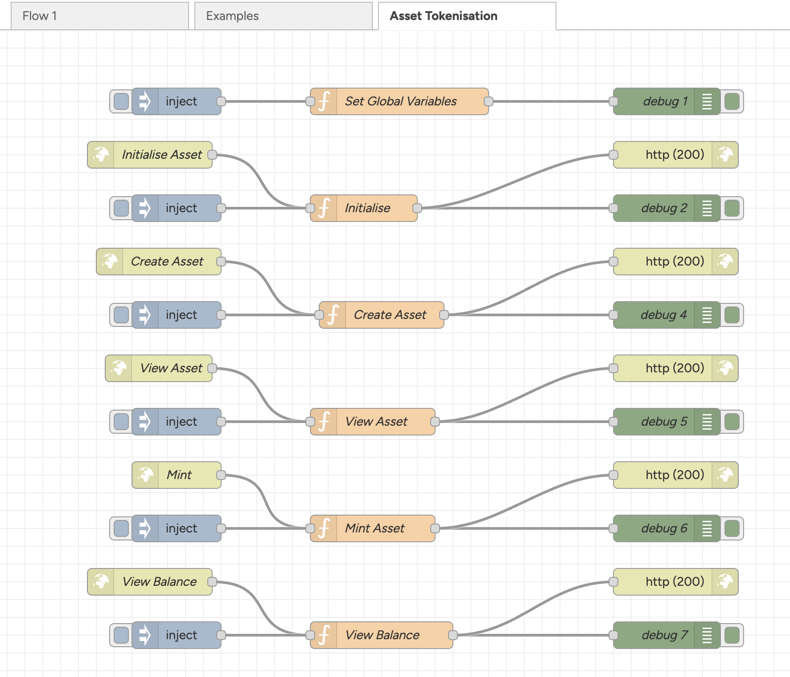

The first function you need to complete is to set the global variables of the integration.


To do this, click on the middle item in the diagram labeled `Set Global Variables`. There you will you a variable called `glbVar`. Here is where you will enter the information to start interacting with your smart contract.

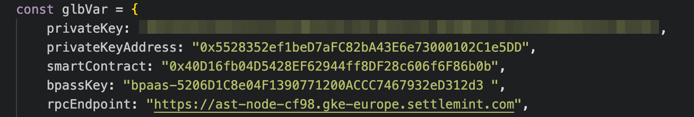

1. **privateKey** - Enter your private key that you created in [Part 1 / Step 4](#4-deploy-a-private-key)
2. **privateKeyAdress** - The address created after completing [Part 1 / Step 4](#4-deploy-a-private-key)
3. **smartContract** - The address of your deployed smart contract after completing [Part 2 / Step 5](#5-deploy-the-contract)
4. **accessToken** - The API key created when completing [Part 3 / Step 3](#3-creating-an-access-token)
5. **rpcEndpoint** - The JSON RPC URL that was shown when completing [Part 3 / Step 2](#2-get-the-json-rpc-endpoint)

With this information entered, click on the blue square next to the `Inject` item.

Now you need to create an asset by creating an asset name, asset symbol and assetUri.


To create an asset, double click on the `Inject` option next to the `Initialise Asset` item.

In this window you can set:
**msg.assetName** - Bond
**msg.assetSymbol** - BND
**msg.assetUri** - The IPFS URL of the asset you created after completing [Part 3 / Step 1](#1-upload-an-image-to-ipfs)

From here you can now click on the other `inject` options to:

1. Create an Asset
2. View the Asset
3. Mint the Asset
4. View the Balance

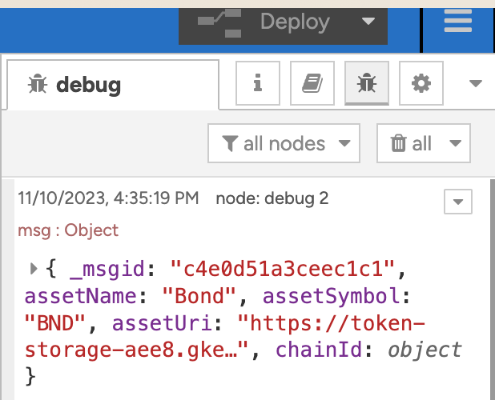

To see how the interactions with your smart contract, choose the `Debug` option under the deploy button.

## Great job

You have now created and deployed an Asset Tokenization smart contract using SettleMint!

Find other guides in our [Guide Library](/developer-guides/guide-library) to help you build with SettleMint.

```
