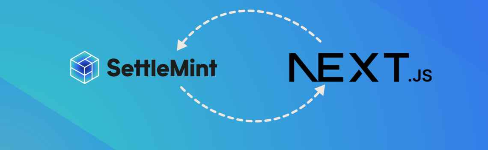
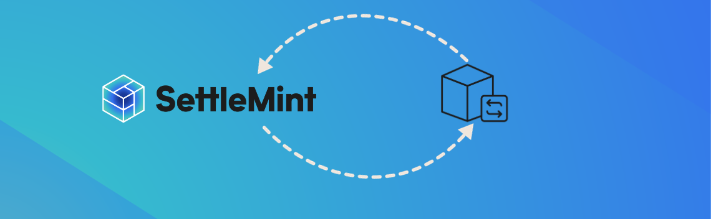

import { Card, Cards } from 'fumadocs-ui/components/card'

# Guide Library

## Application Development

These guides will help you in your blockchain application development process.

<Cards>
  <Card
    title="Connecting A Frontend - NextJS"
    href="../developer-guides/connect-frontend"
  >
    

    This connects a frontend to your blockchain application using NextJS, wagmi and web3auth.
    
  </Card>
</Cards>

## Blockchain Use-Cases

These guides will show you how to build blockchain applications for popular use-cases.

<Cards>
  <Card
    title="Asset Tokenization"
    href="../asset-tokenization"
  >

    
    This guide explains how to build an asset tokenization application using SettleMint
  </Card>
</Cards>
