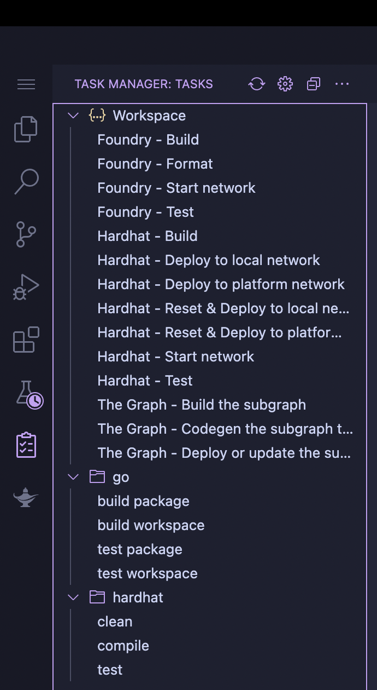
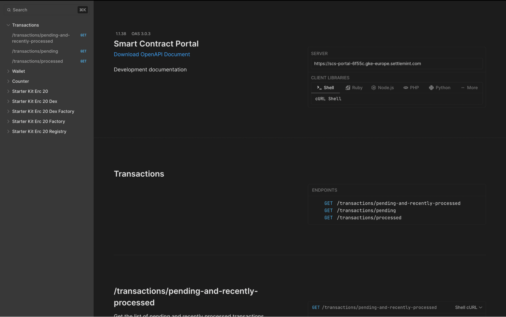

In this document, we will guide you through the creation of user wallets using the smart contract portal on the SettleMint platform. We will also show how you can send transactions to your contracts and sign them with one of the wallets in the portal.

## Required platform deployments:
- Blockchain network (e.g. besu)
- An HD ECDSA private key
- An empty smart contract set
- A smart contract portal

### Blockchain network
For the purpose of this guide, you can set up a Besu network with one validator node and the default parameters in the region of your choice.

### HD ECDSA
Create the user wallet deployment along with one user wallet. For detailed instructions, see:
- [User Wallet Guide](https://console.settlemint.com/documentation/building-with-settlemint/user-wallet)
- [Private Keys Guide](https://console.settlemint.com/documentation/building-with-settlemint/private-keys)

Make sure to enable the address on your node.

### Empty smart contract
Deploy an empty smart contract set on your network and from the IDE, run the Hardhat - Deploy to platform network task.

Keep the address of the smart contract, you will need it to send a transaction in the portal.





You will also need the contract ABI. You can find it in **out/counter.sol/counter.json**

### Smart contract portal
Deploy the portal on your blockchain network and use the contract that you copied from the IDE. This will create a custom API automatically.


## Create a new wallet using the portal
To create a new wallet go to the REST tab of your portal and enter full screen mode. You should see this screen



Next, expand the Wallet section on the left and select `/wallets`.


You can test the request directly from the portal by clicking on **Test Request**. This opens a form in which you can enter the **keyVaultId** of your wallet and the user name of your choice:


After you've sent the request, you can check your HD ECDSA wallet in the private key section. You should see a new account in the account section:


Alternatively, you can also send the request using cURL:

```bash
curl https://scs-portal-url/wallets \
  --request POST \
  --header 'Content-Type: application/json' \
  --header 'x-auth-token: application-access-token' \
  --data '{
  "keyVaultId": "user-wallets-03a52",
  "walletInfo": {
    "name": "support@settlemint.com"
  }
}'
```

Other wallets methods are currently not supported.

## Send a transaction through the portal
You are now going to send a transaction to the counter contract deployed earlier. To do so, expand the **Counter** section on the left and select `/api/counter/{address}/set-number`.


Click on **Test Request** to open the details. To successfully send a transaction, you must enter the smart contract address in **Path Variables**. Then, in the body, enter the address of one of the user accounts. You can get it from the **Users** tab of the deployment. Set the **gasLimit**, the **gasPrice**, the **input** and click on **Send**. You should get a transactionHash back.


