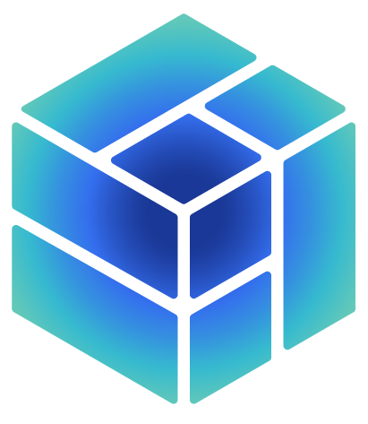

import Link from "next/link";

  

    
  

  

    <ul>
      <li>Available as a SaaS platfrom or deploy anywhere - on cloud or on-prem. .</li>
      <li>Full-stack, comprehensive suite of tools, services and guides.</li>
      <li>Learning academy, detailed documentation, customer success team</li>

    </ul>

  

<a
  href="/documentation/building-with-settlemint/getting-started"
  className="block no-underline rounded-xl px-3 py-0 shadow-sm bg-gradient-to-br from-cyan-200 to-blue-100 text-slate-900 hover:shadow-md transition"
>
  <h3 className="text-lg font-semibold m-0 leading-normal mt-3">
    Protocol Guides
  </h3>
  

    Find supported protocols and explore various protocol specific developer
    guides.
  

</a>

<a
  href="/documentation/platform-components/blockchain-infrastructure/network-manager"
  className="block no-underline rounded-xl px-3 py-0 shadow-sm bg-gradient-to-br from-green-200 to-green-100 text-slate-900 hover:shadow-md transition"
>
  <h3 className="text-lg font-semibold m-0 leading-normal mt-3">
    Platform Components
  </h3>
  

    Learn about SettleMint Platform components and their role in application
    development journey.
  

</a>

<a
  href="/documentation/launching-the-platform/self-hosted-onprem/introduction"
  className="block no-underline rounded-xl px-3 py-0 shadow-sm bg-gradient-to-br from-indigo-100 to-blue-200 text-slate-900 hover:shadow-md transition"
>
  <h3 className="text-lg font-semibold m-0 leading-normal mt-3">
    Deployment Options
  </h3>
  

    Learn how you can deploy SettleMint platform in cloud environment or on-prem
    data center of your choice.
  

</a>

<a
  href="/documentation/knowledge-bank/blockchain-introduction"
  className="block no-underline rounded-xl px-3 py-0 shadow-sm bg-gradient-to-br from-sky-100 to-cyan-100 text-slate-900 hover:shadow-md transition"
>
  <h3 className="text-lg font-semibold m-0 leading-normal mt-3">
    Knowledge Bank
  </h3>
  

    Understand fundamentals of blockchain, various use-cases, latest happenings
    and stay current with the technology.
  

</a>

## Building on SettleMint

<table className="table-auto text-sm leading-none w-full">
  <tbody>
    <tr>
      <td
        colSpan="3"
        className="bg-blue-100 text-center py-[0.2px] pl-3 text-[15px] font-semibold"
      >
        EVM Chains Development Guide
      </td>
    </tr>
    <tr className="align-top">
      <td className="py-[0.2px] pl-3">
        <Link
          href="/building-with-settlemint/evm-chains-guide/create-an-application"
          className="no-underline text-blue-600 hover:underline"
        >
          Create An Application
        </Link>
      </td>
      <td className="py-[0.2px] pl-3">
        <Link
          href="/building-with-settlemint/evm-chains-guide/add-network-and-nodes"
          className="no-underline text-blue-600 hover:underline"
        >
          Add Network And Nodes
        </Link>
      </td>
      <td className="py-[0.2px] pl-3">
        <Link
          href="/building-with-settlemint/evm-chains-guide/add-private-keys"
          className="no-underline text-blue-600 hover:underline"
        >
          Add Private Keys
        </Link>
      </td>
    </tr>
    <tr className="align-top">
      <td className="py-[0.2px] pl-3">
        <Link
          href="/building-with-settlemint/evm-chains-guide/setup-code-studio"
          className="no-underline text-blue-600 hover:underline"
        >
          Setup Code Studio
        </Link>
      </td>
      <td className="py-[0.2px] pl-3">
        <Link
          href="/building-with-settlemint/evm-chains-guide/deploy-smart-contracts"
          className="no-underline text-blue-600 hover:underline"
        >
          Deploy Smart Contracts
        </Link>
      </td>
      <td className="py-[0.2px] pl-3">
        <Link
          href="/building-with-settlemint/evm-chains-guide/setup-api-portal"
          className="no-underline text-blue-600 hover:underline"
        >
          Setup API Portal
        </Link>
      </td>
    </tr>
    <tr className="align-top">
      <td className="py-[0.2px] pl-3">
        <Link
          href="/building-with-settlemint/evm-chains-guide/setup-graph-middleware"
          className="no-underline text-blue-600 hover:underline"
        >
          Setup Graph Middleware
        </Link>
      </td>
      <td className="py-[0.2px] pl-3">
        <Link
          href="/building-with-settlemint/evm-chains-guide/setup-offchain-database"
          className="no-underline text-blue-600 hover:underline"
        >
          Setup Offchain Database
        </Link>
      </td>
      <td className="py-[0.2px] pl-3">
        <Link
          href="/building-with-settlemint/evm-chains-guide/setup-storage"
          className="no-underline text-blue-600 hover:underline"
        >
          Setup Storage
        </Link>
      </td>
    </tr>
    <tr className="align-top">
      <td className="py-[0.2px] pl-3">
        <Link
          href="/building-with-settlemint/evm-chains-guide/deploy-custom-services"
          className="no-underline text-blue-600 hover:underline"
        >
          Deploy Custom Services
        </Link>
      </td>
      <td className="py-[0.2px] pl-3">
        <Link
          href="/building-with-settlemint/evm-chains-guide/integration-studio"
          className="no-underline text-blue-600 hover:underline"
        >
          Integration Studio
        </Link>
      </td>
      <td className="py-[0.2px] pl-3">
        <Link
          href="/building-with-settlemint/evm-chains-guide/attestation-indexer"
          className="no-underline text-blue-600 hover:underline"
        >
          Attestation Indexer
        </Link>
      </td>
    </tr>
    <tr className="align-top">
      <td colSpan="3" className="py-[0.2px] pl-3">
        <Link
          href="/building-with-settlemint/evm-chains-guide/audit-logs"
          className="no-underline text-blue-600 hover:underline"
        >
          Audit Logs
        </Link>
      </td>
    </tr>
  </tbody>
</table>

<table className="table-auto text-sm leading-none w-full">
  <tbody>
    <tr>
      <td
        colSpan="3"
        className="bg-blue-100 text-center py-[0.2px] pl-3 text-[15px] font-semibold"
      >
        Hyperledger Fabric Development Guide
      </td>
    </tr>
    <tr className="align-top">
      <td className="py-[0.2px] pl-3">
        <Link
          href="/building-with-settlemint/hyperledger-fabric-guide/create-an-application"
          className="no-underline text-blue-600 hover:underline"
        >
          Create An Application
        </Link>
      </td>
      <td className="py-[0.2px] pl-3">
        <Link
          href="/building-with-settlemint/hyperledger-fabric-guide/add-network-and-nodes"
          className="no-underline text-blue-600 hover:underline"
        >
          Add Network And Nodes
        </Link>
      </td>
      <td className="py-[0.2px] pl-3">
        <Link
          href="/building-with-settlemint/hyperledger-fabric-guide/add-private-keys"
          className="no-underline text-blue-600 hover:underline"
        >
          Add Private Keys
        </Link>
      </td>
    </tr>
    <tr className="align-top">
      <td className="py-[0.2px] pl-3">
        <Link
          href="/building-with-settlemint/hyperledger-fabric-guide/setup-code-studio"
          className="no-underline text-blue-600 hover:underline"
        >
          Setup Code Studio
        </Link>
      </td>
      <td className="py-[0.2px] pl-3">
        <Link
          href="/building-with-settlemint/hyperledger-fabric-guide/deploy-chain-code"
          className="no-underline text-blue-600 hover:underline"
        >
          Deploy Chain Code
        </Link>
      </td>
      <td className="py-[0.2px] pl-3">
        <Link
          href="/building-with-settlemint/hyperledger-fabric-guide/setup-api-portal"
          className="no-underline text-blue-600 hover:underline"
        >
          Setup API Portal
        </Link>
      </td>
    </tr>
    <tr className="align-top">
      <td className="py-[0.2px] pl-3">
        <Link
          href="/building-with-settlemint/hyperledger-fabric-guide/setup-fabconnect-middleware"
          className="no-underline text-blue-600 hover:underline"
        >
          Setup Fabconnect Middleware
        </Link>
      </td>
      <td className="py-[0.2px] pl-3">
        <Link
          href="/building-with-settlemint/hyperledger-fabric-guide/setup-offchain-database"
          className="no-underline text-blue-600 hover:underline"
        >
          Setup Offchain Database
        </Link>
      </td>
      <td className="py-[0.2px] pl-3">
        <Link
          href="/building-with-settlemint/hyperledger-fabric-guide/setup-storage"
          className="no-underline text-blue-600 hover:underline"
        >
          Setup Storage
        </Link>
      </td>
    </tr>
    <tr className="align-top">
      <td className="py-[0.2px] pl-3">
        <Link
          href="/building-with-settlemint/hyperledger-fabric-guide/deploy-custom-services"
          className="no-underline text-blue-600 hover:underline"
        >
          Deploy Custom Services
        </Link>
      </td>
      <td className="py-[0.2px] pl-3">
        <Link
          href="/building-with-settlemint/hyperledger-fabric-guide/integration-studio"
          className="no-underline text-blue-600 hover:underline"
        >
          Integration Studio
        </Link>
      </td>
      <td className="py-[0.2px] pl-3">
        <Link
          href="/building-with-settlemint/hyperledger-fabric-guide/audit-logs"
          className="no-underline text-blue-600 hover:underline"
        >
          Audit Logs
        </Link>
      </td>
    </tr>
  </tbody>
</table>

## Platform Components

<table className="table-auto text-sm leading-none w-full">
  <tbody>
    <tr>
      <td
        colSpan="3"
        className="bg-blue-100 text-center py-[0.2px] pl-3 text-[15px] font-semibold"
      >
        Blockchain Infrastructure
      </td>
    </tr>
    <tr className="align-top">
      <td className="py-[0.2px] pl-3">
        <Link
          href="/platform-components/blockchain-infrastructure/network-manager"
          className="no-underline text-blue-600 hover:underline"
        >
          Network Manager
        </Link>
      </td>
      <td className="py-[0.2px] pl-3">
        <Link
          href="/platform-components/blockchain-infrastructure/blockchain-nodes"
          className="no-underline text-blue-600 hover:underline"
        >
          Blockchain Nodes
        </Link>
      </td>
      <td className="py-[0.2px] pl-3">
        <Link
          href="/platform-components/blockchain-infrastructure/consortium-manager"
          className="no-underline text-blue-600 hover:underline"
        >
          Consortium Manager
        </Link>
      </td>
    </tr>
    <tr className="align-top">
      <td className="py-[0.2px] pl-3">
        <Link
          href="/platform-components/blockchain-infrastructure/transaction-signer"
          className="no-underline text-blue-600 hover:underline"
        >
          Transaction Signer
        </Link>
      </td>
      <td className="py-[0.2px] pl-3">
        <Link
          href="/platform-components/blockchain-infrastructure/load-balancer"
          className="no-underline text-blue-600 hover:underline"
        >
          Load Balancer
        </Link>
      </td>
      <td className="py-[0.2px] pl-3">
        <Link
          href="/platform-components/blockchain-infrastructure/insights"
          className="no-underline text-blue-600 hover:underline"
        >
          Insights
        </Link>
      </td>
    </tr>
    <tr className="align-top">
      <td className="py-[0.2px] pl-3">
        <Link
          href="/platform-components/blockchain-infrastructure/health-monitoring-tools"
          className="no-underline text-blue-600 hover:underline"
        >
          Health Monitoring Tools
        </Link>
      </td>
      <td colSpan="2" className="py-[0.2px] pl-3">
        <Link
          href="/platform-components/blockchain-infrastructure/resource-usage"
          className="no-underline text-blue-600 hover:underline"
        >
          Resource Usage
        </Link>
      </td>
    </tr>
  </tbody>
</table>

<table className="table-auto text-sm leading-none w-full">
  <tbody>
    <tr>
      <td
        colSpan="3"
        className="bg-blue-100 text-center py-[0.2px] pl-3 text-[15px] font-semibold"
      >
        Dev Tools, Middlewares and APIs
      </td>
    </tr>

    <tr className="align-top">
      <td className="py-[0.2px] pl-3">
        <Link
          href="/platform-components/dev-tools/code-studio"
          className="no-underline text-blue-600 hover:underline"
        >
          Code Studio
        </Link>
      </td>
      <td className="py-[0.2px] pl-3">
        <Link
          href="/platform-components/dev-tools/ai-code-assistant"
          className="no-underline text-blue-600 hover:underline"
        >
          AI Code Assistant
        </Link>
      </td>
      <td className="py-[0.2px] pl-3">
        <Link
          href="/platform-components/dev-tools/sdk"
          className="no-underline text-blue-600 hover:underline"
        >
          SDK
        </Link>
      </td>
    </tr>
    <tr className="align-top">
      <td className="py-[0.2px] pl-3">
        <Link
          href="/platform-components/dev-tools/cli"
          className="no-underline text-blue-600 hover:underline"
        >
          CLI
        </Link>
      </td>
      <td colSpan="2" className="py-[0.2px] pl-3">
        <Link
          href="/platform-components/dev-tools/mcp"
          className="no-underline text-blue-600 hover:underline"
        >
          MCP
        </Link>
      </td>
    </tr>
    <tr className="align-top">
      <td className="py-[0.2px] pl-3">
        <Link
          href="/platform-components/middleware-and-api-layer/graph-middleware"
          className="no-underline text-blue-600 hover:underline"
        >
          Graph Middleware
        </Link>
      </td>
      <td className="py-[0.2px] pl-3">
        <Link
          href="/platform-components/middleware-and-api-layer/smart-contract-api-portal"
          className="no-underline text-blue-600 hover:underline"
        >
          Smart Contract API Portal
        </Link>
      </td>
      <td className="py-[0.2px] pl-3">
        <Link
          href="/platform-components/middleware-and-api-layer/attestation-indexer"
          className="no-underline text-blue-600 hover:underline"
        >
          Attestation Indexer
        </Link>
      </td>
    </tr>
    <tr className="align-top">
      <td className="py-[0.2px] pl-3">
        <Link
          href="/platform-components/middleware-and-api-layer/fabconnect"
          className="no-underline text-blue-600 hover:underline"
        >
          Fabconnect
        </Link>
      </td>
      <td colSpan="2" className="py-[0.2px] pl-3">
        <Link
          href="/platform-components/middleware-and-api-layer/integration-studio"
          className="no-underline text-blue-600 hover:underline"
        >
          Integration Studio
        </Link>
      </td>
    </tr>

  </tbody>
</table>

<table className="table-auto text-sm leading-none w-full">
  <tbody>
    <tr>
      <td
        colSpan="3"
        className="bg-blue-100 text-center py-[0.2px] pl-3 text-[15px] font-semibold"
      >
        Storage, Database, Security and Auth
      </td>
    </tr>
    <tr className="align-top">
      <td className="py-[0.2px] pl-3">
        <Link
          href="/platform-components/database-and-storage/hasura-backend-as-a-service"
          className="no-underline text-blue-600 hover:underline"
        >
          Hasura Backend As A Service
        </Link>
      </td>
      <td className="py-[0.2px] pl-3">
        <Link
          href="/platform-components/database-and-storage/ipfs-storage"
          className="no-underline text-blue-600 hover:underline"
        >
          IPFS Storage
        </Link>
      </td>
      <td className="py-[0.2px] pl-3">
        <Link
          href="/platform-components/database-and-storage/s3-storage"
          className="no-underline text-blue-600 hover:underline"
        >
          S3 Storage
        </Link>
      </td>
    </tr>
    <tr className="align-top">
      <td className="py-[0.2px] pl-3">
        <Link
          href="/platform-components/seecurity-and-authentication/private-keys"
          className="no-underline text-blue-600 hover:underline"
        >
          Private Keys
        </Link>
      </td>
      <td className="py-[0.2px] pl-3">
        <Link
          href="/platform-components/seecurity-and-authentication/user-wallets"
          className="no-underline text-blue-600 hover:underline"
        >
          User Wallets
        </Link>
      </td>
      <td className="py-[0.2px] pl-3">
        <Link
          href="/platform-components/seecurity-and-authentication/personal-access-tokens"
          className="no-underline text-blue-600 hover:underline"
        >
          Personal Access Tokens
        </Link>
      </td>
    </tr>
    <tr className="align-top">
      <td colSpan="3" className="py-[0.2px] pl-3">
        <Link
          href="/platform-components/seecurity-and-authentication/application-access-tokens"
          className="no-underline text-blue-600 hover:underline"
        >
          Application Access Tokens
        </Link>
      </td>
    </tr>
  </tbody>
</table>

## Learning Material

<table className="table-auto text-sm leading-none w-full">
  <tbody>
    <tr>
      <td
        colSpan="3"
        className="bg-blue-100 text-center py-[0.2px] pl-3 text-[15px] font-semibold"
      >
        Knowledge Bank
      </td>
    </tr>
    <tr className="align-top">
      <td className="py-[0.2px] pl-3">
        <Link
          href="/knowledge-bank/blockchain-introduction"
          className="no-underline text-blue-600 hover:underline"
        >
          Blockchain Introduction
        </Link>
      </td>
      <td className="py-[0.2px] pl-3">
        <Link
          href="/knowledge-bank/public-blockchains"
          className="no-underline text-blue-600 hover:underline"
        >
          Public Blockchains
        </Link>
      </td>
      <td className="py-[0.2px] pl-3">
        <Link
          href="/knowledge-bank/private-blockchains"
          className="no-underline text-blue-600 hover:underline"
        >
          Private Blockchains
        </Link>
      </td>
    </tr>
    <tr className="align-top">
      <td className="py-[0.2px] pl-3">
        <Link
          href="/knowledge-bank/blockchain-app-design"
          className="no-underline text-blue-600 hover:underline"
        >
          Blockchain App Design
        </Link>
      </td>
      <td className="py-[0.2px] pl-3">
        <Link
          href="/knowledge-bank/smart-contracts"
          className="no-underline text-blue-600 hover:underline"
        >
          Smart Contracts
        </Link>
      </td>
      <td className="py-[0.2px] pl-3">
        <Link
          href="/knowledge-bank/solidity"
          className="no-underline text-blue-600 hover:underline"
        >
          Solidity
        </Link>
      </td>
    </tr>
    <tr className="align-top">
      <td className="py-[0.2px] pl-3">
        <Link
          href="/knowledge-bank/subgraphs"
          className="no-underline text-blue-600 hover:underline"
        >
          Subgraphs
        </Link>
      </td>
      <td className="py-[0.2px] pl-3">
        <Link
          href="/knowledge-bank/chaincode"
          className="no-underline text-blue-600 hover:underline"
        >
          Chaincode
        </Link>
      </td>
      <td className="py-[0.2px] pl-3">
        <Link
          href="/knowledge-bank/keys-and-security"
          className="no-underline text-blue-600 hover:underline"
        >
          Keys And Security
        </Link>
      </td>
    </tr>
    <tr className="align-top">
      <td className="py-[0.2px] pl-3">
        <Link
          href="/knowledge-bank/bfsi-usecases"
          className="no-underline text-blue-600 hover:underline"
        >
          BFSI Usecases
        </Link>
      </td>
      <td className="py-[0.2px] pl-3">
        <Link
          href="/knowledge-bank/public-sector-usecases"
          className="no-underline text-blue-600 hover:underline"
        >
          Public Sector Usecases
        </Link>
      </td>
      <td className="py-[0.2px] pl-3">
        <Link
          href="/knowledge-bank/industrial-usecases"
          className="no-underline text-blue-600 hover:underline"
        >
          Industrial Usecases
        </Link>
      </td>
    </tr>
  </tbody>
</table>
