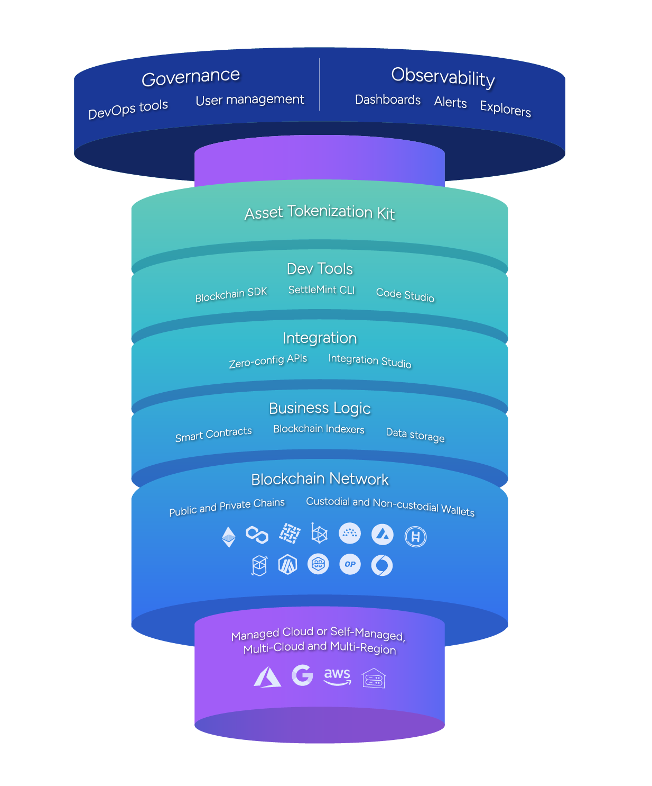

import Link from "next/link";
import { Callout } from 'fumadocs-ui/components/callout';
import { Tabs, Tab } from 'fumadocs-ui/components/tabs';
import { Steps } from 'fumadocs-ui/components/steps';
import { Accordion, Accordions } from 'fumadocs-ui/components/accordion';

## What is SettleMint? Your complete platform for enterprise blockchain development

**Who needs this documentation:** Blockchain developers, DevOps engineers, solution architects, and technical leaders building production-ready blockchain applications.

**What problems does it solve:**

<Callout type="info" title="Common blockchain development challenges">
- **"How do I build blockchain applications quickly?"** - Step-by-step guides from zero to production
- **"Which blockchain should I use?"** - Comprehensive comparisons of all supported networks
- **"How do I integrate blockchain with existing systems?"** - Complete integration patterns and tools
- **"What's the best way to deploy blockchain infrastructure?"** - Cloud and on-premise deployment guides
</Callout>

  

    
  

  

    **Why developers choose SettleMint:**
    <ul>
      <li>**Deployment flexibility:** Available as managed SaaS or self-hosted (cloud/on-premise)</li>
      <li>**Complete toolkit:** Full-stack platform with everything needed for blockchain development</li>
      <li>**Expert support:** Comprehensive documentation, learning academy, and dedicated customer success team</li>
      <li>**Production-proven:** Used by 50+ enterprises including banks, governments, and Fortune 500 companies</li>
    </ul>
  

## Quick start: What do you want to build today?

  <a
    href="/documentation/building-with-settlemint/getting-started"
    className="block no-underline rounded-xl py-0 shadow-sm bg-blue-200 dark:bg-blue-950 text-slate-800 dark:text-white hover:shadow-md transition"
  >
    <Card>
      <h3 className="text-lg font-semibold m-0 leading-normal mt-3">
        🚀 Development guides
      </h3>
      

        **"How do I start building?"** Step-by-step guides for EVM chains (Ethereum, Polygon) and Hyperledger Fabric. Perfect starting point for new developers.
      

    </Card>
  </a>

<a
  href="/documentation/platform-components/blockchain-infrastructure/network-manager"
  className="block no-underline rounded-xl py-0 shadow-sm bg-blue-200 dark:bg-blue-950 text-slate-800 dark:text-white hover:shadow-md transition"
>
  <Card>
    <h3 className="text-lg font-semibold m-0 leading-normal mt-3">
      🔧 Platform components
    </h3>
    

      **"What tools are available?"** Deep dive into every SettleMint component - from blockchain nodes to smart contract APIs. Learn how each tool accelerates development.
    

  </Card>
</a>

  <a
    href="/documentation/launching-the-platform/self-hosted-onprem/introduction"
    className="block no-underline rounded-xl py-0 shadow-sm text-slate-800 dark:text-white hover:shadow-md transition"
  >
    <Card>
      <h3 className="text-lg font-semibold m-0 leading-normal mt-3">
        ☁️ Deployment options
      </h3>

      

        **"How do I deploy SettleMint?"** Choose between managed SaaS or self-hosted deployment. Supports AWS, Azure, Google Cloud, and on-premise data centers.
      

    </Card>

  </a>

  <a
     href="/documentation/knowledge-bank/blockchain-introduction"
    className="block no-underline rounded-xl py-0 shadow-sm bg-blue-200 dark:bg-blue-950 text-slate-800 dark:text-white hover:shadow-md transition"
  >
    <Card className="h-full">
      <h3 className="text-lg font-semibold m-0 leading-normal mt-3">
        📚 Knowledge bank
      </h3>
      

        **"How does blockchain work?"** Learn blockchain fundamentals, explore real-world use cases, and understand best practices for enterprise applications.
      

    </Card>
  </a>

## How to build on SettleMint: Complete development guides

### Which blockchain development guide should I follow?

<Tabs defaultValue="evm">
  <Tab value="evm" label="🔷 EVM Chains (Ethereum, Polygon, Arbitrum, Optimism)">
    <table className="table-auto text-sm leading-none w-full">
      <tbody>
        <tr className="align-top">
      <td className="py-2 pl-3 text-slate-800 dark:text-slate-200">
        <Link
          href="/building-with-settlemint/evm-chains-guide/create-an-application"
          className="no-underline text-sm-accent hover:underline"
        >
          1. Create An Application
        </Link>
        
Set up your workspace

      </td>
      <td className="py-2 pl-3 text-slate-800 dark:text-slate-200">
        <Link
          href="/building-with-settlemint/evm-chains-guide/add-network-and-nodes"
          className="no-underline text-sm-accent hover:underline"
        >
          2. Add Network And Nodes
        </Link>
        
Deploy blockchain infrastructure

      </td>
      <td className="py-2 pl-3 text-slate-800 dark:text-slate-200">
        <Link
          href="/building-with-settlemint/evm-chains-guide/add-private-keys"
          className="no-underline text-sm-accent hover:underline"
        >
          3. Add Private Keys
        </Link>
        
Configure secure key management

      </td>
    </tr>
    <tr className="align-top">
      <td className="py-2 pl-3 text-slate-800 dark:text-slate-200">
        <Link
          href="/building-with-settlemint/evm-chains-guide/setup-code-studio"
          className="no-underline text-sm-accent hover:underline"
        >
          4. Setup Code Studio
        </Link>
        
Browser-based IDE for Solidity

      </td>
      <td className="py-2 pl-3 text-slate-800 dark:text-slate-200">
        <Link
          href="/building-with-settlemint/evm-chains-guide/deploy-smart-contracts"
          className="no-underline text-sm-accent hover:underline"
        >
          5. Deploy Smart Contracts
        </Link>
        
One-click contract deployment

      </td>
      <td className="py-2 pl-3 text-slate-800 dark:text-slate-200">
        <Link
          href="/building-with-settlemint/evm-chains-guide/setup-api-portal"
          className="no-underline text-sm-accent hover:underline"
        >
          6. Setup API Portal
        </Link>
        
Auto-generate REST/GraphQL APIs

      </td>
    </tr>
    <tr className="align-top">
      <td className="py-2 pl-3 text-slate-800 dark:text-slate-200">
        <Link
          href="/building-with-settlemint/evm-chains-guide/setup-graph-middleware"
          className="no-underline text-sm-accent hover:underline"
        >
          7. Setup Graph Middleware
        </Link>
        
Index blockchain data

      </td>
      <td className="py-2 pl-3 text-slate-800 dark:text-slate-200">
        <Link
          href="/building-with-settlemint/evm-chains-guide/setup-offchain-database"
          className="no-underline text-sm-accent hover:underline"
        >
          8. Setup Offchain Database
        </Link>
        
Hasura GraphQL for app data

      </td>
      <td className="py-2 pl-3 text-slate-800 dark:text-slate-200">
        <Link
          href="/building-with-settlemint/evm-chains-guide/setup-storage"
          className="no-underline text-sm-accent hover:underline"
        >
          9. Setup Storage
        </Link>
        
IPFS and S3 file storage

      </td>
    </tr>
    <tr className="align-top">
      <td className="py-2 pl-3 text-slate-800 dark:text-slate-200">
        <Link
          href="/building-with-settlemint/evm-chains-guide/deploy-custom-services"
          className="no-underline text-sm-accent hover:underline"
        >
          10. Deploy Custom Services
        </Link>
        
Host frontend and backend

      </td>
      <td className="py-2 pl-3 text-slate-800 dark:text-slate-200">
        <Link
          href="/building-with-settlemint/evm-chains-guide/integration-studio"
          className="no-underline text-sm-accent hover:underline"
        >
          11. Integration Studio
        </Link>
        
Connect to enterprise systems

      </td>
      <td className="py-2 pl-3 text-slate-800 dark:text-slate-200">
        <Link
          href="/building-with-settlemint/evm-chains-guide/attestation-indexer"
          className="no-underline text-sm-accent hover:underline"
        >
          12. Attestation Indexer
        </Link>
        
Manage verifiable credentials

      </td>
    </tr>
    <tr className="align-top">
      <td colSpan="3" className="py-2 pl-3 text-slate-800 dark:text-slate-200">
        <Link
          href="/building-with-settlemint/evm-chains-guide/audit-logs"
          className="no-underline text-sm-accent hover:underline"
        >
          13. Audit Logs
        </Link>
        
Compliance and monitoring

      </td>
    </tr>
      </tbody>
    </table>
  </Tab>
  
  <Tab value="fabric" label="🔵 Hyperledger Fabric (Private/Permissioned Networks)">
    <table className="table-auto text-sm leading-none w-full">
      <tbody>

    <tr className="align-top">
      <td className="py-2 pl-3 text-slate-800 dark:text-slate-200">
        <Link href="/building-with-settlemint/hyperledger-fabric-guide/create-an-application" className="no-underline text-sm-accent hover:underline">
          1. Create An Application
        </Link>
        
Initialize Fabric workspace

      </td>
      <td className="py-2 pl-3 text-slate-800 dark:text-slate-200">
        <Link href="/building-with-settlemint/hyperledger-fabric-guide/add-network-and-nodes" className="no-underline text-sm-accent hover:underline">
          2. Add Network And Nodes
        </Link>
        
Deploy peers and orderers

      </td>
      <td className="py-2 pl-3 text-slate-800 dark:text-slate-200">
        <Link href="/building-with-settlemint/hyperledger-fabric-guide/setup-code-studio" className="no-underline text-sm-accent hover:underline">
          3. Setup Code Studio
        </Link>
        
Develop chaincode

      </td>
    </tr>

    <tr className="align-top">
      <td className="py-2 pl-3 text-slate-800 dark:text-slate-200">
        <Link href="/building-with-settlemint/hyperledger-fabric-guide/deploy-chain-code" className="no-underline text-sm-accent hover:underline">
          4. Deploy Chain Code
        </Link>
        
Install and instantiate

      </td>
      <td className="py-2 pl-3 text-slate-800 dark:text-slate-200">
        <Link href="/building-with-settlemint/hyperledger-fabric-guide/setup-fabconnect-middleware" className="no-underline text-sm-accent hover:underline">
          5. Setup Fabconnect
        </Link>
        
API gateway for Fabric

      </td>
      <td className="py-2 pl-3 text-slate-800 dark:text-slate-200">
        <Link href="/building-with-settlemint/hyperledger-fabric-guide/setup-offchain-database" className="no-underline text-sm-accent hover:underline">
          6. Setup Database
        </Link>
        
Off-chain data storage

      </td>
    </tr>

    <tr className="align-top">
      <td className="py-2 pl-3 text-slate-800 dark:text-slate-200">
        <Link href="/building-with-settlemint/hyperledger-fabric-guide/setup-storage" className="no-underline text-sm-accent hover:underline">
          7. Setup Storage
        </Link>
        
File management

      </td>
      <td className="py-2 pl-3 text-slate-800 dark:text-slate-200">
        <Link href="/building-with-settlemint/hyperledger-fabric-guide/deploy-custom-services" className="no-underline text-sm-accent hover:underline">
          8. Deploy Services
        </Link>
        
Custom applications

      </td>
      <td className="py-2 pl-3 text-slate-800 dark:text-slate-200">
        <Link href="/building-with-settlemint/hyperledger-fabric-guide/integration-studio" className="no-underline text-sm-accent hover:underline">
          9. Integration Studio
        </Link>
        
Enterprise connectors

      </td>
    </tr>

    <tr className="align-top">
      <td className="py-2 pl-3 text-slate-800 dark:text-slate-200">
        <Link href="/building-with-settlemint/hyperledger-fabric-guide/audit-logs" className="no-underline text-sm-accent hover:underline">
          10. Audit Logs
        </Link>
        
Compliance tracking

      </td>
    </tr>
      </tbody>
    </table>
  </Tab>
</Tabs>

  

    <h2 style={{ marginBottom: '1rem' }}>What are SettleMint platform components?</h2>

    **The most complete blockchain development toolkit available today.** SettleMint provides every tool needed to build, deploy, and scale enterprise blockchain applications - all integrated into one platform.

    **Key benefits for developers:**
    - **10x faster development** with pre-configured tools and templates
    - **No DevOps complexity** - automated infrastructure management
    - **Production-ready from day one** with built-in security and monitoring
    - **Works with any blockchain** - public or private networks

    Each component below solves a specific challenge in blockchain development, from infrastructure setup to API generation to enterprise integration.
  

  

  
  

## Platform components reference: Find the right tool for your needs

<Tabs defaultValue="infrastructure">
  <Tab value="infrastructure" label="🏗️ Blockchain Infrastructure">
    <Callout type="tip" title="How do I set up blockchain networks?">
      Deploy and manage blockchain networks with enterprise-grade infrastructure components.
    </Callout>
    
    <table className="table-auto text-sm leading-none w-full mt-4">
      <tbody>
    <tr className="align-top">
      <td className="py-2 pl-3 text-slate-800 dark:text-slate-200">
        <Link
          href="/platform-components/blockchain-infrastructure/network-manager"
          className="no-underline text-sm-accent hover:underline"
        >
          Network Manager
        </Link>
        
Launch & manage networks

      </td>
      <td className="py-2 pl-3 text-slate-800 dark:text-slate-200">
        <Link
          href="/platform-components/blockchain-infrastructure/blockchain-nodes"
          className="no-underline text-sm-accent hover:underline"
        >
          Blockchain Nodes
        </Link>
        
Deploy validators & peers

      </td>
      <td className="py-2 pl-3 text-slate-800 dark:text-slate-200">
        <Link
          href="/platform-components/blockchain-infrastructure/consortium-manager"
          className="no-underline text-sm-accent hover:underline"
        >
          Consortium Manager
        </Link>
        
Manage permissions

      </td>
    </tr>
    <tr className="align-top">
      <td className="py-2 pl-3 text-slate-800 dark:text-slate-200">
        <Link
          href="/platform-components/blockchain-infrastructure/transaction-signer"
          className="no-underline text-sm-accent hover:underline"
        >
          Transaction Signer
        </Link>
        
Secure key management

      </td>
      <td className="py-2 pl-3 text-slate-800 dark:text-slate-200">
        <Link
          href="/platform-components/blockchain-infrastructure/load-balancer"
          className="no-underline text-sm-accent hover:underline"
        >
          Load Balancer
        </Link>
        
99.9% uptime

      </td>
      <td className="py-2 pl-3 text-slate-800 dark:text-slate-200">
        <Link
          href="/platform-components/blockchain-infrastructure/insights"
          className="no-underline text-sm-accent hover:underline"
        >
          Blockchain Explorer
        </Link>
        
Monitor transactions

      </td>
    </tr>
    <tr className="align-top">
      <td className="py-2 pl-3 text-slate-800 dark:text-slate-200">
        <Link
          href="/platform-components/usage-and-logs/monitoring-tools"
          className="no-underline text-sm-accent hover:underline"
        >
          Health Monitoring
        </Link>
        
Real-time alerts

      </td>
      <td colSpan="2" className="py-2 pl-3 text-slate-800 dark:text-slate-200">
        <Link
          href="/platform-components/usage-and-logs/resource-usage"
          className="no-underline text-sm-accent hover:underline"
        >
          Resource Usage
        </Link>
        
Cost optimization

      </td>
    </tr>
      </tbody>
    </table>
  </Tab>
  
  <Tab value="devtools" label="👩‍💻 Dev Tools, Middleware & APIs">
    <Callout type="tip" title="How do I build faster?">
      Accelerate development with professional tools and automated API generation.
    </Callout>
    
    <table className="table-auto text-sm leading-none w-full mt-4">
      <tbody>

    <tr className="align-top">
      <td className="py-2 pl-3 text-slate-800 dark:text-slate-200">
        <Link
          href="/platform-components/dev-tools/code-studio"
          className="no-underline text-sm-accent hover:underline"
        >
          Code Studio IDE
        </Link>
        
Browser-based development

      </td>
      <td className="py-2 pl-3 text-slate-800 dark:text-slate-200">
        <Link
          href="/platform-components/dev-tools/ai-code-assistant"
          className="no-underline text-sm-accent hover:underline"
        >
          AI Code Assistant
        </Link>
        
Smart contract copilot

      </td>
      <td className="py-2 pl-3 text-slate-800 dark:text-slate-200">
        <Link
          href="/platform-components/dev-tools/sdk"
          className="no-underline text-sm-accent hover:underline"
        >
          SDK
        </Link>
        
TypeScript/JavaScript

      </td>
    </tr>
    <tr className="align-top">
      <td className="py-2 pl-3 text-slate-800 dark:text-slate-200">
        <Link
          href="/platform-components/dev-tools/cli"
          className="no-underline text-sm-accent hover:underline"
        >
          CLI
        </Link>
        
Automation tools

      </td>
      <td colSpan="2" className="py-2 pl-3 text-slate-800 dark:text-slate-200">
        <Link
          href="/platform-components/dev-tools/mcp"
          className="no-underline text-sm-accent hover:underline"
        >
          MCP
        </Link>
        
Model Context Protocol

      </td>
    </tr>
    <tr className="align-top">
      <td className="py-2 pl-3 text-slate-800 dark:text-slate-200">
        <Link
          href="/platform-components/middleware-and-api-layer/graph-middleware"
          className="no-underline text-sm-accent hover:underline"
        >
          Graph Middleware
        </Link>
        
Index blockchain data

      </td>
      <td className="py-2 pl-3 text-slate-800 dark:text-slate-200">
        <Link
          href="/platform-components/middleware-and-api-layer/smart-contract-api-portal"
          className="no-underline text-sm-accent hover:underline"
        >
          API Portal
        </Link>
        
Auto-generate APIs

      </td>
      <td className="py-2 pl-3 text-slate-800 dark:text-slate-200">
        <Link
          href="/platform-components/middleware-and-api-layer/attestation-indexer"
          className="no-underline text-sm-accent hover:underline"
        >
          Attestation Indexer
        </Link>
        
Verifiable credentials

      </td>
    </tr>
    <tr className="align-top">
      <td className="py-2 pl-3 text-slate-800 dark:text-slate-200">
        <Link
          href="/platform-components/middleware-and-api-layer/fabconnect"
          className="no-underline text-sm-accent hover:underline"
        >
          Fabconnect
        </Link>
        
Fabric API gateway

      </td>
    </tr>
      </tbody>
    </table>
  </Tab>
  
  <Tab value="storage" label="💾 Storage, Database, Security & Auth">
    <Callout type="tip" title="How do I manage data securely?">
      Enterprise-grade storage, database, and security solutions for blockchain applications.
    </Callout>
    
    <table className="table-auto text-sm leading-none w-full mt-4">
      <tbody>
    <tr className="align-top">
      <td className="py-2 pl-3 text-slate-800 dark:text-slate-200">
        <Link
          href="/platform-components/database-and-storage/hasura-backend-as-a-service"
          className="no-underline text-sm-accent hover:underline"
        >
          Hasura GraphQL
        </Link>
        
Off-chain database

      </td>
      <td className="py-2 pl-3 text-slate-800 dark:text-slate-200">
        <Link
          href="/platform-components/database-and-storage/ipfs-storage"
          className="no-underline text-sm-accent hover:underline"
        >
          IPFS Storage
        </Link>
        
Decentralized files

      </td>
      <td className="py-2 pl-3 text-slate-800 dark:text-slate-200">
        <Link
          href="/platform-components/database-and-storage/s3-storage"
          className="no-underline text-sm-accent hover:underline"
        >
          S3 Storage
        </Link>
        
Enterprise storage

      </td>
    </tr>
    <tr className="align-top">
      <td className="py-2 pl-3 text-slate-800 dark:text-slate-200">
        <Link
          href="/platform-components/security-and-authentication/private-keys"
          className="no-underline text-sm-accent hover:underline"
        >
          Private Keys
        </Link>
        
HSM support

      </td>
      <td className="py-2 pl-3 text-slate-800 dark:text-slate-200">
        <Link
          href="/platform-components/security-and-authentication/user-wallets"
          className="no-underline text-sm-accent hover:underline"
        >
          User Wallets
        </Link>
        
Wallet management

      </td>
      <td className="py-2 pl-3 text-slate-800 dark:text-slate-200">
        <Link
          href="/platform-components/security-and-authentication/personal-access-tokens"
          className="no-underline text-sm-accent hover:underline"
        >
          Access Tokens
        </Link>
        
API authentication

      </td>
    </tr>
    <tr className="align-top">
      <td colSpan="3" className="py-2 pl-3 text-slate-800 dark:text-slate-200">
        <Link
          href="/platform-components/security-and-authentication/application-access-tokens"
          className="no-underline text-sm-accent hover:underline"
        >
          Application Tokens
        </Link>
        
Service authentication

      </td>
    </tr>
      </tbody>
    </table>
  </Tab>
</Tabs>

## Learn blockchain development: From basics to advanced

### What blockchain concepts should I learn first?

<table className="table-auto text-sm leading-none w-full">
  <tbody>
    <tr>
      <td
        colSpan="3"
        className="bg-fd-secondary text-center py-2 pl-3 text-[15px] font-semibold text-slate-800 dark:text-white border-b"
      >
        📚 Knowledge Bank - Essential blockchain concepts
      </td>
    </tr>
    <tr className="align-top">
      <td className="py-2 pl-3 text-slate-800 dark:text-slate-200">
        <Link
          href="/knowledge-bank/blockchain-introduction"
          className="no-underline text-sm-accent hover:underline"
        >
          Blockchain Introduction
        </Link>
        
Start here - fundamentals

      </td>
      <td className="py-2 pl-3 text-slate-800 dark:text-slate-200">
        <Link
          href="/knowledge-bank/public-blockchains"
          className="no-underline text-sm-accent hover:underline"
        >
          Public Blockchains
        </Link>
        
Ethereum, Polygon, etc.

      </td>
      <td className="py-2 pl-3 text-slate-800 dark:text-slate-200">
        <Link
          href="/knowledge-bank/private-blockchains"
          className="no-underline text-sm-accent hover:underline"
        >
          Private Blockchains
        </Link>
        
Enterprise networks

      </td>
    </tr>
    <tr className="align-top">
      <td className="py-2 pl-3 text-slate-800 dark:text-slate-200">
        <Link
          href="/knowledge-bank/blockchain-app-design"
          className="no-underline text-sm-accent hover:underline"
        >
          App Design Patterns
        </Link>
        
Architecture best practices

      </td>
      <td className="py-2 pl-3 text-slate-800 dark:text-slate-200">
        <Link
          href="/knowledge-bank/smart-contracts"
          className="no-underline text-sm-accent hover:underline"
        >
          Smart Contracts
        </Link>
        
Core concepts

      </td>
      <td className="py-2 pl-3 text-slate-800 dark:text-slate-200">
        <Link
          href="/knowledge-bank/solidity"
          className="no-underline text-sm-accent hover:underline"
        >
          Solidity Language
        </Link>
        
Smart contract coding

      </td>
    </tr>
    <tr className="align-top">
      <td className="py-2 pl-3 text-slate-800 dark:text-slate-200">
        <Link
          href="/knowledge-bank/subgraphs"
          className="no-underline text-sm-accent hover:underline"
        >
          Subgraphs
        </Link>
        
Data indexing

      </td>
      <td className="py-2 pl-3 text-slate-800 dark:text-slate-200">
        <Link
          href="/knowledge-bank/chaincode"
          className="no-underline text-sm-accent hover:underline"
        >
          Chaincode
        </Link>
        
Fabric smart contracts

      </td>
      <td className="py-2 pl-3 text-slate-800 dark:text-slate-200">
        <Link
          href="/knowledge-bank/keys-and-security"
          className="no-underline text-sm-accent hover:underline"
        >
          Security Best Practices
        </Link>
        
Keys & cryptography

      </td>
    </tr>
    <tr className="align-top">
      <td className="py-2 pl-3 text-slate-800 dark:text-slate-200">
        <Link
          href="/knowledge-bank/bfsi-blockchain-usecases"
          className="no-underline text-sm-accent hover:underline"
        >
          Banking & Finance
        </Link>
        
BFSI use cases

      </td>
      <td className="py-2 pl-3 text-slate-800 dark:text-slate-200">
        <Link
          href="/knowledge-bank/public-sector-usecases"
          className="no-underline text-sm-accent hover:underline"
        >
          Government & Public
        </Link>
        
Public sector cases

      </td>
      <td className="py-2 pl-3 text-slate-800 dark:text-slate-200">
        <Link
          href="/knowledge-bank/industrial-usecases"
          className="no-underline text-sm-accent hover:underline"
        >
          Industrial & Supply Chain
        </Link>
        
Enterprise solutions

      </td>
    </tr>
  </tbody>
</table>

## What are SettleMint Application Kits? Build faster with pre-built solutions

    

  
  

  

**Ship blockchain applications 6x faster with production-ready templates.**

SettleMint Application Kits provide complete, full-stack blockchain solutions for common enterprise use cases. Each kit includes:

- ✅ **Smart contracts** - Audited, production-ready code
- ✅ **Frontend UI** - Modern React dApp interface
- ✅ **Backend APIs** - REST and GraphQL endpoints
- ✅ **Documentation** - Implementation guides

**Popular kits:**
- **Asset Tokenization** - Tokenize securities, real estate, bonds
- **Supply Chain** - Track products from source to delivery
- **Digital Identity** - Verifiable credentials and KYC

[Explore Application Kits →](/application-kits/introduction)

## Frequently asked questions

<Accordions>
  <Accordion title="Which blockchain should I use for my project?">
    **For public transparency:** Ethereum (most secure), Polygon (fast & cheap), Arbitrum/Optimism (Ethereum L2s)
    
    **For private data:** Hyperledger Besu (Ethereum-compatible), Hyperledger Fabric (modular), Quorum (JPMorgan)
    
    **For specific needs:** Hedera (high-speed), Avalanche (subnets), Soneium (gaming)
  </Accordion>
  
  <Accordion title="How long does it take to build a blockchain app?">
    With SettleMint: **2-6 weeks** for a production-ready application
    
    Without SettleMint: **3-6 months** typically
  </Accordion>
  
  <Accordion title="Do I need blockchain expertise to use SettleMint?">
    Basic programming knowledge is enough. SettleMint handles the complex blockchain infrastructure, letting you focus on your application logic.
  </Accordion>
  
  <Accordion title="What's included in the platform?">
    Everything needed for blockchain development: infrastructure, development tools, APIs, databases, storage, security, monitoring, and deployment tools.
  </Accordion>
  
  <Accordion title="How do I get started?">
    <Steps>
      <Steps.Step>
        [Sign up for a free trial](https://console.settlemint.com)
      </Steps.Step>
      <Steps.Step>
        Follow the [Getting Started guide](/building-with-settlemint/getting-started)
      </Steps.Step>
      <Steps.Step>
        Deploy your first smart contract in under 30 minutes
      </Steps.Step>
    </Steps>
  </Accordion>
</Accordions>

## Need help?

- 📧 **Support:** [support@settlemint.com](mailto:support@settlemint.com)
- 💬 **Community:** [Join our Discord](https://discord.gg/settlemint)
- 📅 **Demo:** [Schedule a call](https://settlemint.com/demo)
- 🎓 **Training:** [SettleMint Academy](https://academy.settlemint.com)