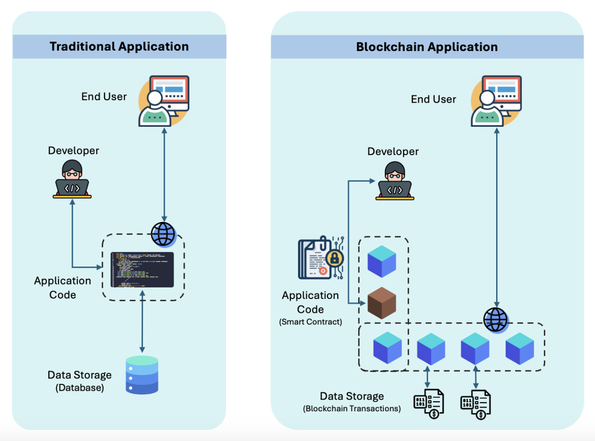

import { Callout } from "fumadocs-ui/components/callout";
import { Card } from "fumadocs-ui/components/card";

# Blockchain Application Design

<Callout type="info">
  Effective blockchain application design requires careful consideration of
  architecture, security, and scalability.
</Callout>

## Architecture Patterns

  <Card>
    ### On-Chain Components
    - Smart contracts
    - State management
    - Access control
    - Business logic
  </Card>

  <Card>
    ### Off-Chain Components
    - User interface
    - Data storage
    - API integration
    - Business services
  </Card>

## Design Principles

### 1. Decentralization

- Appropriate data distribution
- Trust minimization
- Consensus mechanisms
- Network topology

### 2. Security

- Smart contract security
- Access control
- Key management
- Audit trails

### 3. Scalability

- Layer 2 solutions
- Data optimization
- Caching strategies
- Load balancing

## Development Stack

1. **Frontend**

   - Web3 libraries
   - UI frameworks
   - State management
   - API integration

2. **Middleware**

   - Event listeners
   - Cache layers
   - API gateways
   - Authentication

3. **Blockchain Layer**
   - Smart contracts
   - Network selection
   - Gas optimization
   - Storage patterns

## Best Practices

### Smart Contract Design

- Modular architecture
- Upgrade patterns
- Gas optimization
- Security checks

### Data Management

- On-chain vs off-chain
- IPFS integration
- Database design
- Caching strategy

### Integration Patterns

- Event handling
- API design
- Error handling
- Transaction management

<Callout type="warning">
  Always consider gas costs, transaction speed, and user experience when
  designing blockchain applications.
</Callout>
