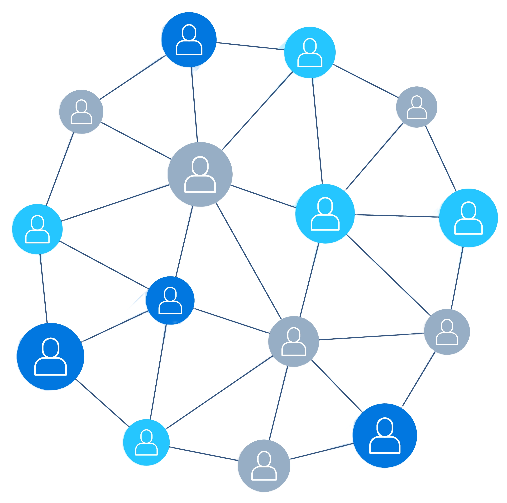

import { Callout } from 'fumadocs-ui/components/callout';
import { Tabs, Tab } from 'fumadocs-ui/components/tabs';
import { Steps } from 'fumadocs-ui/components/steps';
import { Accordion, Accordions } from 'fumadocs-ui/components/accordion';
import { Card } from 'fumadocs-ui/components/card';

## What is blockchain and why should business leaders care?

**Who needs this knowledge:** CTOs, digital transformation leaders, compliance officers, and project managers evaluating blockchain solutions for their organizations.

<Callout type="info" title="Blockchain business impact statistics">
- **$1.76 trillion** - Projected blockchain market value by 2030 (PwC analysis)
- **90% cost reduction** in transaction reconciliation for financial institutions
- **30% improvement** in supply chain transparency and traceability
- **50% faster** cross-border payments using blockchain networks
</Callout>

  

  
  

  

**What problem does blockchain solve?** Traditional business processes require trusted intermediaries (banks, clearinghouses, auditors) to verify transactions and maintain shared records. This creates delays, costs, and single points of failure.

Blockchain eliminates intermediaries by creating a **shared, tamper-proof digital ledger** that all parties can trust. Every transaction is cryptographically secured and verified by multiple participants, creating an immutable audit trail without central control.

  

### Why are enterprises adopting blockchain? Real business benefits

<Tabs defaultValue="cost">
  <Tab value="cost" label="💰 Cost Reduction">
    <Card title="Financial Service Savings">
      - **Cross-border payments:** Reduce costs from 5-7% to under 1%
      - **Trade finance:** Eliminate 80% of paper processing costs
      - **Regulatory reporting:** Automate compliance with shared audit trails
      - **Reconciliation:** Reduce settlement times from days to minutes
    </Card>
  </Tab>
  
  <Tab value="trust" label="🛡️ Trust & Transparency">
    <Card title="Enterprise Trust Benefits">
      - **Supply chain:** 100% product authenticity verification
      - **Healthcare:** Secure, interoperable patient data sharing
      - **Real estate:** Transparent property transaction history
      - **Carbon credits:** Verifiable sustainability claims
    </Card>
  </Tab>
  
  <Tab value="efficiency" label="⚡ Operational Efficiency">
    <Card title="Process Automation Results">
      - **Contract execution:** Smart contracts reduce processing time by 75%
      - **Document verification:** Instant credential validation
      - **Asset tracking:** Real-time visibility across complex supply chains
      - **Audit compliance:** Automated regulatory reporting
    </Card>
  </Tab>
</Tabs>

## How does blockchain security work? Understanding cryptographic foundations

**Why this matters for business:** Understanding blockchain security helps executives evaluate whether blockchain meets their organization's security requirements and compliance standards.

<Callout type="warning" title="Security compliance impact">
Blockchain's cryptographic security has enabled **95% of Fortune 500 companies** to explore blockchain pilots, with many meeting strict regulatory requirements including GDPR, HIPAA, and SOX compliance.
</Callout>

<Accordions>
  <Accordion title="What is cryptographic hashing and why does it secure blockchain?">
    **Business impact:** Hashing creates tamper-evident records that automatically detect any unauthorized changes to transaction data.

    **How it works:** A cryptographic hash function takes any input (transaction, document, entire block) and produces a unique fixed-size "fingerprint." Even changing one character creates a completely different hash.

    **Enterprise applications:**
    - **Document integrity:** Legal contracts automatically detect tampering
    - **Audit trails:** Financial records show instant evidence of modifications
    - **Supply chain:** Product data changes trigger immediate alerts
    - **Compliance:** Regulatory filings maintain provable integrity

    **Real example:** JPMorgan's blockchain platform processes $6 billion daily in transactions, with hash-linked blocks ensuring no transaction can be secretly modified.
  </Accordion>

  <Accordion title="What is a nonce and how does it prevent double-spending?">
    **Business value:** Nonces prevent duplicate transactions and ensure proper ordering, eliminating the double-spending problem that costs traditional payment systems billions annually.

    **Technical function:** A nonce ("number only used once") is a unique value that makes each transaction or block hash different. In proof-of-work systems, miners adjust nonces to create valid blocks.

    **Business applications:**
    - **Payment processing:** Prevents duplicate payments
    - **Asset transfers:** Ensures one-time ownership transfers
    - **Digital certificates:** Prevents credential reuse
    - **Inventory management:** Eliminates duplicate entries

    **Cost impact:** Eliminates the estimated **$24 billion** lost annually to payment fraud and double-spending across global payment networks.
  </Accordion>

  <Accordion title="How do public/private keys secure digital transactions?">
    **Executive summary:** Public/private key cryptography replaces usernames and passwords with mathematically-secured digital identities that can't be stolen or forged.

    **Business security model:**
    - **Private key (secret):** Like a digital signature that only you can create
    - **Public key (shareable):** Like a verification stamp that proves your signature is authentic
    - **Digital signatures:** Mathematically prove transaction authorization without revealing secrets

    **Enterprise security benefits:**
    - **Zero-knowledge authentication:** Verify identity without sharing credentials
    - **Non-repudiation:** Signers cannot deny their actions
    - **Scalable security:** No central certificate authority needed
    - **Regulatory compliance:** Meets digital signature legal requirements

    **Real-world impact:** The European Central Bank's digital euro pilot relies on public/private key infrastructure to secure over **€1 trillion** in potential digital transactions.
  </Accordion>
</Accordions>

## How are blockchain records structured? Understanding block architecture

**Business relevance:** Block structure determines transaction capacity, processing speed, and audit capabilities - key factors for enterprise blockchain adoption decisions.

<Callout type="success" title="Enterprise transaction volumes">
- **Visa blockchain settlements:** Process 24,000 transactions per second using optimized block structures
- **Trade finance platforms:** Bundle 1,000+ documents per block for efficient processing
- **Supply chain tracking:** Store 10,000+ product movements per block across global networks
</Callout>

<Tabs defaultValue="header">
  <Tab value="header" label="🏗️ Block Header">
    **What business leaders need to know:** The block header acts like a tamper-evident seal on a box of transactions, ensuring no records can be changed without detection.

    **Key business components:**
    - **Previous block hash:** Creates an unbreakable chain of custody
    - **Merkle root:** Instant verification of all transactions in the block
    - **Timestamp:** Provides legal-grade time stamping for compliance
    - **Version info:** Enables network upgrades without disrupting operations

    **Audit and compliance benefits:**
    - **Tamper detection:** Any change to historical data immediately visible
    - **Chain of custody:** Provable sequence of all business events
    - **Regulatory reporting:** Automated timestamp and sequencing for auditors
    - **Legal evidence:** Court-admissible proof of transaction timing and order
  </Tab>

  <Tab value="body" label="📄 Block Body">
    **Enterprise value:** The block body contains actual business transactions, contracts, and data transfers that drive your operations.

    **Transaction processing:**
    - **Batch efficiency:** Group related transactions for cost optimization
    - **Priority handling:** Important transactions processed first
    - **Fee optimization:** Bundle transactions to reduce per-operation costs
    - **Smart contracts:** Automated business logic execution

    **Business transaction types:**
    - **Payment processing:** Customer payments, supplier settlements
    - **Asset transfers:** Property deeds, inventory movements, securities trades
    - **Contract execution:** Automated milestone payments, insurance claims
    - **Data sharing:** Secure document exchange, audit trail creation

    **Real-world capacity:**
    - **Bitcoin:** 3,000-7,000 transactions per block (every 10 minutes)
    - **Ethereum:** 100-400 transactions per block (every 12 seconds)
    - **Enterprise networks:** 10,000+ transactions per block with optimized consensus
  </Tab>

  <Tab value="metadata" label="📊 Metadata & Analytics">
    **Strategic insights:** Block metadata provides business intelligence and operational metrics for continuous improvement.

    **Business intelligence features:**
    - **Performance metrics:** Transaction processing speeds and costs
    - **Network health:** Node participation and consensus reliability
    - **User analytics:** Transaction patterns and system utilization
    - **Compliance tracking:** Regulatory requirement adherence

    **Operational benefits:**
    - **Capacity planning:** Predict infrastructure needs based on usage trends
    - **Cost optimization:** Identify peak usage periods for fee management
    - **Performance monitoring:** Real-time network health dashboards
    - **SLA tracking:** Monitor service level agreement compliance

    **Enterprise examples:**
    - **Walmart:** Tracks food safety metadata across 2,000+ suppliers
    - **Maersk:** Maritime shipping metadata for 1,000+ ports globally
    - **BMW:** Automotive supply chain metadata for quality assurance
  </Tab>
</Tabs>

### Why does tamper-evidence matter for business?

<Card title="Immutable audit trail benefits">
Every block's cryptographic linking creates an **immutable audit trail** that automatically detects any unauthorized changes to business records. This eliminates the estimated **$42 billion** annual cost of accounting fraud and provides:

- **Regulatory compliance:** Automatic SOX, GDPR, and industry-specific audit trails
- **Risk reduction:** Immediate detection of unauthorized record modifications  
- **Insurance benefits:** Lower premiums due to provable security measures
- **Legal protection:** Court-admissible evidence of transaction integrity
</Card>

## Transactions

Transactions are the fundamental operations that update the ledger state within
a blockchain. Each transaction represents a transfer of value or an execution of
some logic (in the case of smart contracts). Key points about transactions
include:

> **Transaction structure**: While specifics differ between blockchain
> platforms, a transaction generally includes fields such as the source
> (implicitly or explicitly indicated by a signature or an input reference),
> destination address(es), the amount of value to transfer, and other
> parameters.

In a UTXO-based system (Unspent Transaction Output model, used by Bitcoin), a
transaction has one or more inputs (references to unspent outputs from previous
transactions that the sender owns) and one or more outputs (newly created
outputs assigning value to new owners). Each output can be locked by a
cryptographic condition (e.g., "only unlockable by a signature from X's key").

In an account-based system (used by Ethereum and others), a transaction
explicitly contains the sender's address, the receiver's address, the transfer
amount, and a unique sequence number (nonce) for the sender's account. It may
also include a payload data field (for carrying arbitrary data or contract
commands) and a gas limit or fee information (especially in systems that charge
computational fees).

> **Transaction validation**: When a node receives a new transaction, it will
> validate it before accepting it into the local transaction pool. Validation
> includes checking that the transaction is properly formed and that the sender
> has sufficient rights to spend the funds.

For UTXO transactions, this means verifying that each input refers to an
existing unspent output and that the sum of input values matches or exceeds the
sum of outputs (the difference being the transaction fee). For account-based
transactions, validation involves checking that the sender's account balance is
sufficient and that the nonce (sequence number) is correct (to prevent replay or
out-of-order execution).

In all cases, the transaction's digital signature(s) must be verified using the
associated public key(s) to ensure authenticity. If any part of validation
fails, the transaction is rejected by the node.

> **Transaction signing**: A transaction must be authorized by the owner of the
> funds or resources it is spending. This is achieved through digital
> signatures. The creator of a transaction uses their private key to sign the
> transaction's data (often the transaction hash or a structured message derived
> from the transaction fields). This signature is then attached to the
> transaction.

Nodes will use the corresponding public key (usually derivable from information
in the transaction, such as an included public key or an implicit address
reference) to verify the signature. A valid signature proves that the
transaction was approved by the holder of the private key associated with the
source address.

Modern blockchains use secure signature schemes (like ECDSA or EdDSA on elliptic
curves) to ensure that forging a signature without the private key is
computationally infeasible. Once signed and validated, transactions are
broadcast to the network for inclusion in a block.

## Wallets

A wallet in blockchain is a software or hardware component that manages a user's
key pairs and facilitates the creation of transactions. Importantly, wallets
store keys, not coins , the actual assets remain recorded on the blockchain
ledger. Key points about wallets include:

> **Types of wallets**: There are several forms of wallets, each with different
> security and usability trade-offs. Software wallets are applications (on a
> desktop, web, or mobile) that store private keys on the user's device, often
> encrypted with a password. Hardware wallets are dedicated physical devices
> that securely store private keys in a protected hardware module and sign
> transactions internally (the private key never leaves the device).

Paper wallets are an offline approach, where the key information (often a seed
phrase or a QR code of the private key) is printed or written on paper and kept
physically secure. Wallets can also be categorized as hot (connected to the
internet, e.g., a mobile app wallet for daily use) or cold (completely offline,
e.g., hardware or paper wallets) depending on how they are stored and used.

> **Key storage and usage**: Wallets generate or import a private key (or a set
> of keys). Modern wallets often use a single master seed (a random secret
> usually represented as a 12-24 word mnemonic phrase) from which they derive
> multiple key pairs (this is the hierarchical deterministic wallet approach,
> allowing one backup to secure many addresses).

The wallet stores the private key(s) securely, typically encrypted with a user
passphrase if it's a software wallet, or in secure hardware in the case of
hardware wallets. When the user wants to send a transaction, the wallet software
will assemble the transaction data (recipient, amount, etc.), then use the
appropriate private key to produce a digital signature on that transaction.

The signed transaction is then broadcast to the blockchain network via a node.
Wallets also manage addresses (which are often derived from the public keys) and
will track the user's balances by monitoring the blockchain (either by running a
full node internally, or by querying external nodes).

In summary, wallets abstract the cryptographic key management for users,
ensuring private keys are safely stored and used to sign transactions when
needed.

## Nodes and networking

Nodes are the computers that participate in the blockchain network, maintaining
and updating the ledger. The network of nodes is peer-to-peer, meaning there is
no central server; instead, each node connects to other nodes, forming a
resilient mesh that shares data. There are different kinds of nodes and various
responsibilities they hold:

> **Node types and roles**: In a typical blockchain, a full node downloads and
> stores the entire blockchain (all blocks and transactions) and independently
> verifies all transactions and blocks against the consensus rules. Full nodes
> are the backbone of the network's security and decentralization, as they do
> not trust others for validation.

A light node (SPV node), by contrast, downloads only block headers or a subset
of data and relies on full nodes to provide proofs of transactions (using
techniques like Merkle proofs). Light nodes verify that a transaction is
included in the chain without storing everything, trading some trust and
completeness for efficiency.

Miner/Validator nodes are specialized full nodes that, in addition to validating
blocks, also create new blocks. In proof-of-work, these are miners that compete
to find valid blocks, and in proof-of-stake or BFT systems, these are validators
that are selected or rotate to add blocks.

Some networks may further differentiate roles (for example, in certain protocols
there are "archival nodes" that keep full history vs. pruning nodes, or
dedicated witness/masternodes for special tasks), but fundamentally all nodes
share the goal of maintaining consensus on the blockchain state.

> **Peer-to-peer communication**: Nodes communicate through a peer-to-peer (P2P)
> network protocol. When a node starts up, it will discover and connect to a set
> of peer nodes (using discovery protocols or a list of known bootstrap peers).
> Once connected, nodes exchange information in a gossip-like fashion: if a node
> finds out about a new transaction or block (either because it created it or
> received it from a peer), it will verify it and then forward it to its other
> peers.

In this way, new transactions propagate through the network, and newly
mined/validated blocks are quickly distributed to all nodes. The P2P network is
typically unstructured and robust: each node connects to a random sampling of
peers, ensuring redundancy. There is no single point of failure; even if many
nodes drop offline, others can still maintain the network.

Nodes continuously maintain connections, update each other about the latest
block (the tip of the chain), and request data (for example, if a node is
syncing from scratch, it will ask peers for blocks sequentially from the genesis
up to the latest block). This decentralized networking ensures that all copies
of the ledger held by honest nodes eventually converge to the same state.

## Transaction pool (mempool)

Before transactions are confirmed and added to a block, they reside in what's
commonly called the transaction pool or memory pool (mempool) of each node. The
mempool is a staging area for all pending transactions that have been propagated
to the network but not yet included in a block. Key aspects of the mempool
include:

> **Collection of pending transactions**: When a valid transaction is broadcast,
> each node that receives it and validates it will place it into its mempool (an
> in-memory list of unconfirmed transactions). These transactions remain queued
> in the mempool until a miner or validator picks them up to include in a new
> block.

Each node's mempool might not be exactly identical at all times (due to network
propagation delays or node-specific policies), but in general, popular
transactions will quickly be seen by most nodes' mempools.

> **Prioritization and fees**: Because blocks have a limited capacity (either a
> maximum size in bytes, or a gas limit in systems like Ethereum that limits
> computational work per block), not all pending transactions can be included
> immediately. Transactions in the mempool are typically prioritized by the fee
> they offer to the miner/validator.

For example, in Bitcoin, transactions offering higher satoshis per byte (fee
density) will be preferred, and in Ethereum, transactions with higher gas price
(or effective tip, under the EIP-1559 fee mechanism) take priority. Miners will
sort the mempool to select the highest paying transactions that fit in the next
block.

This market mechanism encourages users to attach sufficient fees during busy
periods to have their transactions confirmed faster. Low-fee transactions might
remain in the mempool for an extended time if the network is congested.

> **Mempool management**: Nodes typically impose limits on their mempool size
> (in memory), and may drop old or low-fee transactions if the pool is full.
> There are also rules to prevent spam, such as not relaying transactions with
> absurdly low fees or invalid transactions that could never be mined.

Some networks support transaction replacement policies (for instance,
"Replace-By-Fee" in Bitcoin allows a transaction in the mempool to be replaced
with a new version that pays a higher fee). In general, the mempool ensures that
the network has a reservoir of ready-to-include transactions and that no valid
transaction is forgotten.

Once a transaction is included in a new block and that block is accepted, nodes
will remove that transaction from their mempools (since it's now confirmed
on-chain). The mempool serves as the buffer and waiting room for the transaction
throughput of the network.

## Consensus mechanisms

Consensus mechanisms are protocols that enable distributed nodes to agree on the
contents of the blockchain (which block comes next) in the presence of potential
faults or malicious actors. Different blockchains use different consensus
algorithms, each with its own trade-offs:

> **Proof of work (PoW)**: PoW is a consensus mechanism where miners compete to
> solve a cryptographic puzzle. The puzzle involves finding a hash value for the
> next block that is below a target threshold (the target is adjusted
> periodically to control the block production rate). Miners achieve this by
> varying the nonce in the block header and hashing repeatedly until a valid
> hash is found.

The first miner to find a valid block broadcasts it, and the network verifies
it. PoW makes it extremely costly to rewrite history, because an attacker would
need to redo the cumulative work (hashing computations) of the chain. It thus
leverages computational difficulty to secure the chain.

PoW is robust and fully decentralized (anyone with hardware can attempt to
mine), but it consumes significant energy and can have relatively longer times
to finality (since multiple blocks might need to pile up to consider a block
settled). Bitcoin pioneered PoW, and Ethereum used PoW until it transitioned to
PoS; many public blockchains still use PoW for its proven security.

> **Proof of stake (PoS)**: PoS is a class of consensus algorithms where the
> ability to create new blocks and secure the network is based on ownership of
> the blockchain's native asset (the stake) rather than computational work.
> Validators in a PoS system must lock up a certain amount of cryptocurrency as
> stake.

The protocol then pseudo-randomly selects a validator (or a committee of
validators) to propose the next block, with probability often weighted by the
amount of stake. Other validators will then validate the proposed block, and
depending on the protocol, may vote or sign to finalize it.

Honest behavior is encouraged by economic incentives: a validator who produces a
fraudulent block or contradicts consensus can be penalized, typically by
slashing (losing a portion of their staked funds). PoS can significantly reduce
the resource usage compared to PoW and often achieves faster consensus (for
instance, by finalizing blocks in a few network rounds).

There are many PoS variants: some operate in rounds with designated leaders,
others use random beacon mechanisms; examples include Casper-style finality,
Ouroboros, Tendermint, and more. The security of PoS relies on the assumption
that a majority (by stake weight) of validators act honestly, and that the cost
of acquiring a majority stake is prohibitive.

> **Byzantine fault tolerant protocols (e.g., PBFT)**: In permissioned or
> consortium blockchains where participants are known, more traditional
> Byzantine Fault Tolerance (BFT) algorithms can be used for consensus.
> Practical Byzantine Fault Tolerance (PBFT) is a classic algorithm that allows
> a network to reach agreement even if some fraction (typically up to 1/3) of
> nodes are faulty or malicious.

In a PBFT-like consensus, a block (or transaction batch) is proposed by a leader
node, and then a series of voting rounds occur: other validator nodes will vote
to accept the block in a prepare phase and a commit phase. If a sufficient
supermajority (usually ≥2/3 of nodes) agree on the block, it is finalized and
becomes part of the ledger.

BFT protocols provide immediate finality , once a block is agreed on, it will
not be reversed as long as the assumptions hold. They tend to have higher
communication overhead (each node often needs to communicate with all others)
and thus are used in networks with dozens of validators rather than thousands.

Variants of BFT are used in various contexts: for example, Istanbul BFT (IBFT
2.0) and QBFT are used in some Ethereum-based consortium chains, and Tendermint
BFT is used in Cosmos. In addition to PBFT variants, some blockchains use
simplified consensus for known validators (like proof-of-authority schemes, or
Raft/Kafka-based ordering in Fabric) which are not fully Byzantine fault
tolerant but can be suitable when a higher level of trust exists among
participants.

All these consensus mechanisms aim to ensure that all honest nodes eventually
agree on the same sequence of blocks, preserving a single authoritative ledger.
They deter double-spending and conflicting histories through different means
(economic cost, computational cost, or reliance on trust among a group), but the
end result is a tamper-resistant chain agreed upon by the network.

## Forks and protocol upgrades

In blockchain terminology, a "fork" can refer to a divergence in the chain's
history or an update to the rules governing the system. Here we discuss protocol
forks (rule changes) and their implications:

> **Hard fork**: A hard fork is a change to the blockchain protocol that is not
> backward compatible. This means that blocks created under the new rules are
> considered invalid by nodes running the old software. To avoid a permanent
> split, all participants must upgrade their software to follow the new rules.

If there is disagreement or incomplete upgrade, a blockchain can split into two
separate chains at the fork point: one following the old rules and one following
the new rules. Each chain will continue independently, and they will not
reconverge since their consensus rules differ.

Hard forks are used for major upgrades or changes (for example, altering block
size limits, changing consensus rules, or repairing a severe security flaw), and
require coordination. After a hard fork, nodes that have not upgraded will
either stop at the fork point or continue on an incompatible chain.

> **Soft fork**: A soft fork is a protocol change that is backward compatible
> with older nodes, typically achieved by making the new rules a strict subset
> of the old rules. In a soft fork, blocks that follow the new rules also appear
> valid to old nodes (because they don't violate the old rules), though the
> reverse is not necessarily true (old nodes might accept some transactions that
> new rules would reject).

Soft forks usually rely on a majority of miners/validators enforcing the new
rules; once the majority does so, the network as a whole will reject any blocks
that don't conform to the new rules, effectively bringing all participants onto
a single upgraded chain even if some nodes haven't updated their software.

Because old nodes still accept the new blocks, a chain split is less likely (as
long as the majority enforces the new rules). Soft forks have been used to add
features or restrictions without splitting the network (for example, Bitcoin's
Segregated Witness was deployed as a soft fork). They require careful
coordination to succeed, as an unsuccessful soft fork (without sufficient
support) could lead to temporary confusion or orphaned blocks.

In summary, a hard fork mandates an update by all and can result in a permanent
chain split if consensus isn't reached among the community, whereas a soft fork
is an incremental change that can be adopted more gradually and usually
maintains one chain (given sufficient support). Both mechanisms are ways a
blockchain protocol can evolve over time.

## Blockchain network models

Blockchain systems can be categorized by how they are governed and who is
allowed to participate in the network:

> **Public blockchains**: These are open, permissionless networks where anyone
> can join as a node, submit transactions, and participate in the consensus
> process (e.g., mining or validating). Public blockchains prioritize
> decentralization and trustlessness – they assume no central authority, and
> consensus mechanisms (PoW, PoS, etc.) are used to secure the network against
> Sybil attacks and malicious actors.

All transaction data on public chains is generally visible to any observer
(though participants are usually pseudonymous, identified only by their
addresses or public keys). Public networks often have a native cryptocurrency
used as an incentive for participants and as a way to prevent spam (transaction
fees paid in the native coin).

> **Private blockchains**: A private blockchain is a closed network where write
> permissions (and sometimes read permissions) are restricted to one
> organization or a specific group of participants. These are permissioned
> ledgers often used internally within a company or organization.

In a private blockchain, nodes are known and controlled by the organization, so
the consensus mechanism can be simpler (since there is a higher degree of trust
internally , some private chains even use a single authority node or basic
majority vote to confirm blocks).

Private chains trade decentralization for speed and control – they can achieve
high transaction throughput and can enforce strict privacy on the data (since
access is limited). However, they rely on the trustworthiness of the controlling
entity and do not have the censorship resistance or open participation features
of public chains.

> **Consortium blockchains**: Consortium chains (also known as federated
> blockchains) are a hybrid model where the network is permissioned, but instead
> of a single organization, a group of independent organizations collaboratively
> maintain the blockchain. Only approved participants (the consortium members)
> run nodes and validate blocks.

This model is common in enterprise scenarios where multiple organizations (for
example, a group of banks or supply chain partners) want to share a distributed
ledger without any single party having sole control. Consensus in consortium
chains might use Byzantine fault tolerant algorithms or rotating leadership,
since participants are known entities (e.g., a group of validators where 2/3
agreement finalizes a block).

Consortium blockchains strike a balance between decentralization and controlled
access: they are more decentralized than a purely private single-owner chain,
but more controlled than a completely public network. Data can be kept private
to the consortium members, and performance can be optimized for the relatively
smaller number of nodes.

Each model has its design considerations: public blockchains for trust-minimized
environments with open participation, private blockchains for fully internal use
with trusted nodes, and consortium blockchains for collaborative applications
among multiple organizations. Technically, the underlying blockchain data
structures may be similar; the differences lie in how nodes are managed, how
consensus is achieved, and what trust assumptions are made.

## Data immutability and append-only design

One of the defining features of blockchain technology is the immutability of the
ledger. The data structure is effectively append-only: new transactions can be
added (through new blocks), but once a block is confirmed and part of the chain,
its contents cannot be altered or deleted without breaking the chain's
consensus. This immutability is achieved through cryptographic linking and the
consensus process:

> **Hash linking for integrity**: As described in the block structure, each
> block header contains the hash of the previous block. This creates a chain of
> hashes from the latest block back to the first block (genesis). If an
> adversary attempted to change a transaction in an old block, that block's hash
> would change.

Consequently, the next block (which contains the previous hash) would no longer
be consistent, and every subsequent block's hash would be invalid as well. The
only way to make such a change "stick" would be to recompute all the subsequent
blocks' hashes and, in a proof-of-work system, also redo all the computational
work (and catch up and surpass the current chain length to convince others).

In a well-secured blockchain, this is computationally infeasible without
controlling the majority of the network's hashing power or validation power.

> **Consensus and finality**: Consensus algorithms reinforce immutability by
> making it extremely difficult to replace a confirmed block with an
> alternative. In PoW, a malicious chain reorganization requires creating an
> alternate chain with more total work – an almost impossible task if honest
> miners control most of the hash power.

In PoS or BFT systems, once a block is finalized by a supermajority, protocol
rules will not allow reverting it without significant collusion or violation of
assumptions (and in many PoS protocols, such collusion would result in the
offenders' stakes being slashed).

Thus, after a certain point (a number of confirmations or a finality
checkpoint), a block and its transactions can be considered permanent.
Blockchain's append-only nature means that to correct errors or compensate for
fraud, new transactions must be issued (for example, a reversing transaction)
rather than rewriting history.

> **Auditability**: The immutable ledger provides a verifiable history of all
> transactions. Anyone can audit the chain from the beginning and be confident
> that what's recorded is exactly what occurred, since any tampering would be
> evident in the broken hash links or invalid signatures.

In scenarios where a blockchain is permissioned, immutability still holds within
the trust assumptions of that network (the operators agree via consensus not to
rewrite history arbitrarily, and the software enforces that by cryptographic
checks).

Some blockchains add checkpoints or use cryptographic commitments to further
cement history (for example, periodically snapshotting or notarizing the
blockchain state elsewhere), but the core operation remains that the ledger
grows by appending blocks and previous records remain indelible.

Immutability can be thought of as a spectrum depending on the threat model
(e.g., a private chain controlled by one entity could technically alter history
if that entity chose to, but cryptographic proofs would reveal the change to any
observers with the original data). In public decentralized chains, immutability
is one of the strongest guarantees, upheld by economic and computational
security measures.

## Merkle trees and block integrity

Merkle trees are a fundamental data structure used in blockchain to ensure the
integrity of large sets of data (such as all transactions in a block) in an
efficient manner:

> **Merkle tree structure**: A Merkle tree is a binary tree of hashes built from
> the bottom up. For a given block, each transaction is hashed (typically using
> the same hash function as the block hash, e.g., SHA-256) to produce a leaf
> node. These transaction hashes form the leaves of the Merkle tree.

Pairs of hashes are then concatenated and hashed together to form parent nodes.
This process repeats layer by layer until a single hash remains at the top ,
this is the Merkle root. The Merkle root, as mentioned in the block structure
section, is placed in the block header.

The tree structure means that the Merkle root is a cryptographic summary of all
transactions in the block. If any single transaction were different, its leaf
hash would change, which would change its parent hash, and so on up to the root,
yielding a completely different Merkle root. Thus, the Merkle root in the header
effectively seals the content of the block.

> **Efficient verification (Merkle proofs)**: Merkle trees enable a feature
> called Merkle proofs or Merkle paths. Suppose a node (like a light client)
> wants to verify that a particular transaction is included in a block without
> downloading the entire block.

The node can obtain the transaction itself and a set of sibling hashes that form
the path from that transaction's leaf up to the known Merkle root. By
iteratively hashing the transaction with its sibling hash, then hashing that
result with the next sibling, and so forth, the node can reproduce the Merkle
root.

If the computed Merkle root matches the one in the block header (which the light
client trusts as part of the known chain), then the transaction's inclusion is
verified. This way, a client does not need the full list of transactions, only a
small logarithmic number of hashes relative to the total number of transactions
in the block.

Merkle proofs are crucial for scalability features like Simplified Payment
Verification (SPV) in Bitcoin, where lightweight wallets verify transactions by
relying on Merkle proofs and block headers instead of all transaction data.

Additionally, Merkle trees allow quick comparisons of entire datasets , if two
Merkle roots differ, one can deduce that the underlying data has differences,
and by comparing branches, pinpoint which transaction(s) differ. Overall, Merkle
trees contribute to blockchain integrity by making verification of contents both
secure (cryptographically) and efficient.

## Chain reorganization and finality

In a distributed system where multiple blocks can be proposed (especially in PoW
or certain PoS chains), temporary forks in the chain may occur. A chain
reorganization (reorg) is the process of the network abandoning one branch of
the chain in favor of a longer or more "correct" branch. Additionally, the
concept of finality relates to how confident participants can be that a given
block will not be reversed.

> **Chain reorganization**: A reorg typically happens when two miners find a
> block at nearly the same time, causing a short-term divergence (two competing
> "tips"). Nodes might temporarily disagree on the latest block. When the next
> block is found, if it attaches to one of these branches, that branch becomes
> longer; the network will adopt the longer chain as the canonical one (this is
> part of the longest-chain rule in PoW).

The transactions in the orphaned block (the block that lost the race) are not
lost – if they weren't included in the winning block, they go back to the
mempool to be retried in a later block. Reorgs in normal operation are usually
only one or two blocks deep and resolve quickly.

Longer reorgs can happen in the event of major network delays or attacks (for
example, if a malicious actor had significant mining power and privately mined a
hidden chain and then released it, overtaking the public chain). Reorganizations
ensure that the network eventually converges on a single chain, but they imply
that blockchain confirmations are not absolutely final until a block has several
blocks on top of it.

During a reorg, no protocol rules are violated – it's a natural outcome of
decentralized block production and the rule of adopting the chain with the most
work (or highest stake weight, in some PoS cases).

> **Finality**: Finality is the guarantee that a block (and the transactions in
> it) will not be reverted or dropped from the chain. Different consensus
> mechanisms provide different notions of finality. In PoW systems, finality is
> probabilistic – a block becomes more secure the more blocks are mined on top
> of it.

For example, after 6 confirmations in Bitcoin, the probability of a block being
reversed is vanishingly small (because an attacker would need to redo the
proof-of-work faster than the rest of the network). However, it's never
absolute; there's always a theoretical chance if someone controls enough hashing
power.

In PoS systems, especially those with explicit voting and checkpoints, finality
can be deterministic (or economic finality). Many modern PoS protocols have
validators vote to finalize checkpoints; once a block or epoch is finalized
(e.g., by 2/3 of validators voting for it), reverting it would require an
extremely large collusion and typically results in severe penalties (slashing of
staked funds).

Thus, users can consider finalized blocks practically immutable. In pure BFT
consensus used in private/consortium chains, finality is immediate – once
validators reach agreement in a round and commit a block, that block is
irrevocably part of the ledger (assuming less than the fault-tolerance threshold
of nodes are malicious).

In summary, finality means that after a certain point in time or number of
blocks, participants can trust that the ledger's history will remain fixed.
Blockchain designs try to minimize the uncertainty window; for instance, by
aiming for fast block times and quick finality (as in many PoS networks) or by
advising waiting for several confirmations (as in PoW networks) to achieve
practical finality.

## Smart contracts

Smart contracts are programs that run on the blockchain network, enabling
automated and complex transactions beyond simple value transfers. They are an
integral part of blockchain architecture on platforms that support them (like
Ethereum, Hyperledger Fabric, and others), and they operate as follows:

> **Embedded code execution**: A smart contract is essentially code stored on
> the blockchain that executes in response to transactions. When a transaction
> invokes a smart contract (for example, calling a function of a contract with
> certain parameters), every node in the network will execute that code as part
> of block processing.

All nodes must arrive at the same result (since the code is deterministic),
which then is used to update the ledger's state. This means the blockchain not
only stores data but also enforces the logic defined by the contracts. In
effect, the ledger becomes a state machine that is advanced by executing
contract code included in transactions, with every node verifying the outcome.

> **Deterministic, sandbox environment**: Smart contract execution happens in a
> controlled environment (such as the Ethereum Virtual Machine for Ethereum's
> contracts, or docker containers for Fabric's chaincode). The code cannot
> perform disallowed or undeterministic operations (for example, it generally
> cannot make external network requests or generate truly random numbers without
> consensus) because all nodes need to replicate the execution exactly.

Instead, contracts are limited to the data on the blockchain and the input
provided. The environment ensures that the execution is deterministic and
sandboxed from the node's host system. In public blockchain settings, gas or
execution fees are used to meter the computation and storage usage of contracts
, the sender of the transaction must pay for the operations their contract call
performs.

This not only prevents abuse (infinite loops or excessive computation) but also
ties the execution cost to economic incentives.

> **State and immutability of contracts**: Once deployed, smart contract code is
> usually immutable (the code becomes part of the blockchain record). Contracts
> often live at a specific address on the blockchain, and they maintain their
> own persistent state (for example, a token contract keeps track of balances
> mapping addresses to numbers).

Every time the contract is invoked and modifies its state, those changes are
recorded on the blockchain as part of the transaction results. There are
patterns to introduce upgradability (such as proxy contracts that can delegate
calls to a new implementation), but these must be designed intentionally;
otherwise, a bug in a contract is permanent.

The immutability of the code and the transparency of its logic mean that anyone
can inspect how the contract will behave. The contract's state is also
transparent (though it may be encoded), and all changes to it are a matter of
public record on the ledger. This combination ensures that the rules set by the
contract are enforced exactly and predictably, which is crucial in trustless
environments.

> **Trustless automation**: Smart contracts remove the need for a central or
> trusted party to execute agreements or business logic. Instead of relying on a
> server or an authority, the blockchain network itself enforces the execution
> of the contract code. For example, a simple smart contract for an escrow will
> automatically release funds to the seller when conditions are met, without
> needing a bank or escrow agent.

The participants trust the code and the consensus of the network rather than
each other. However, this also means that errors or exploits in the code can
have serious consequences, since there is no easy way to intervene once the
contract is deployed (short of all nodes agreeing to a fork or upgrade, which is
rare and controversial).

For a technical team, it's important to follow secure coding practices and
thorough testing when developing smart contracts. Nonetheless, the ability to
encode arbitrary rules that will execute automatically and consistently across
the network is a powerful feature that turns the blockchain into a platform for
decentralized applications and protocols, not just a ledger of coin transfers.

## Enterprise blockchain platforms

Not all blockchain frameworks follow the exact same design as public
cryptocurrencies. Two notable enterprise-focused blockchain platforms are
Hyperledger Fabric and Hyperledger Besu. These platforms incorporate the core
ideas of blockchain (distributed ledger, cryptography, consensus) but make
different architectural choices to suit enterprise needs.

### Hyperledger fabric

Hyperledger Fabric is a permissioned blockchain framework under the Linux
Foundation's Hyperledger project. It is designed for enterprise use, with a
focus on modularity and flexibility.

> **Architecture and roles**: Fabric's architecture divides the transaction
> workflow into distinct phases and assigns different roles to different node
> types. It introduces the concept of peers (nodes that maintain the ledger and
> can execute smart contract code) and orderers (nodes that provide ordering
> service for transactions).

When a transaction proposal is initiated (for example, a user invokes a
chaincode function), it is first sent to designated endorsing peers. These peers
simulate the transaction by executing the chaincode with the provided input, but
they do not update the ledger at this stage. Instead, each endorsing peer
returns a cryptographic endorsement (essentially the proposed transaction's
output and a signature) to the client.

The client then collects these endorsements and sends the transaction to the
ordering service. The ordering service (which can consist of multiple ordering
nodes) is responsible for establishing a total order of transactions across the
network. It takes endorsed transactions from clients and packages them into
blocks in a sequential order.

The ordered block is then disseminated to all peers. Finally, each peer will
validate the block: it checks that the transactions in the block have the
required endorsements (per the network's endorsement policy) and that there are
no conflicts, such as double-spending or version conflicts in the state.
Transactions that fail validation are marked invalid in the block.

After validation, each peer appends the block to its copy of the ledger and
updates the world state database with the results of the valid transactions.
This design (execute first on endorsers, then order, then validate/commit on all
peers) improves performance and scalability and allows for certain privacy
