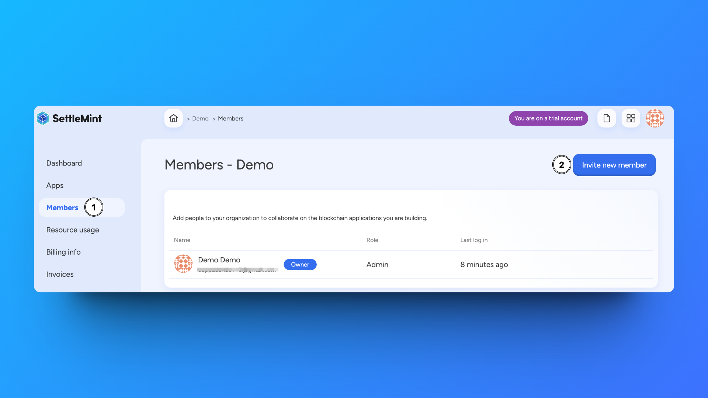

An organization is the highest level of hierarchy in SettleMint.

It's at this level that you:

- Create and manage
  [blockchain applications](/building-with-settlemint/create-an-application)
- [Invite team members](#invite-new-organization-members) to collaborate
- Manage [billing](/account-billing/billing)

You created your first organization when you signed up to use the SettleMint
platform, but you can create as many organizations as you want, e.g. for your
company, departments, teams, clients, etc. Organizations help you structure your
work, manage collaboration, and keep your invoices clearly organized.

## Create an organization

Navigate to the **homepage**, or click the **grid icon** in the upper right
corner.

Click **Create new organization**. This opens a form. Follow these steps to
create your organization:

1. Choose a **name** for your organization. Choose a name that is easily
   recognizable in your dashboards, e.g. your company name, department name,
   team name, etc. You can change the name of your organization at any time.
2. Enter **billing information**. SettleMint creates a billing account for this
   organization. You will be billed monthly for the resources you use within
   this organization.
3. Click **Confirm** to go to the organization dashboard. From here, you can
   [create your first application](/building-with-settlemint/create-an-application)
   in this organization. The dashboard will show you a summary of your
   organization's applications, the members in this organization, and a status
   of the resource costs for the current month.

When you create an organization, you are the owner, and therefore an
administrator of the organization. This means you can perform all actions within
this organization, with no limitations.

## Invite new organization members

Navigate to the **Members section** of your organization, via the homepage, or
via your organization dashboard.

Follow these steps to invite new members to your organization:

1. Click **Invite new member**.
2. Enter the **email adress** of the person you want to invite.
3. Select their **role**, i.e. whether they will be an administrator or a user.
4. Optionally, you can add a **message** to be included in the invitation email.
5. Click **Confirm** to go to the list of your organization's members. Your
   email invitation has now been sent, and you see in the list that it is
   pending.

## Manage an organization

Navigate to the **organization dashboard**.

Click **Manage organization** to see the available actions. You can only perform
these actions if you have administrator rights for this organization.

- **Change name** - Changes the organization name without any further impact.
- **Delete organization** - Removes the organization from the platform.

:::warning Warning

You can only delete an organization when it has no applications related to it.
Applications have to be deleted one by one, once all their related resources
(e.g. networks, nodes, smart contract sets, etc.) have been deleted.

:::
