##### This guide will help you explore some of the core building blocks of working with SettleMint even if this is your first time working with a Blockchain

In this guide you will learn how to [create a blockchain network](/building-with-settlemint/add-a-network-to-an-application), [deploy a node](/building-with-settlemint/add-a-node-to-a-network), write a [smart contract](/building-with-settlemint/dev-tools/code-studio/smart-contract-sets/add-smart-contract-set) and [create an integration](/building-with-settlemint/integration-studio).

Below is both a video and written guide for you to build along to:

<iframe width="560" height="315" src="https://www.youtube.com/embed/EPCzEXuc4-0?si=dYpYIGV8Tc4-iuKz" title="YouTube video player" frameborder="0" allow="accelerometer; autoplay; clipboard-write; encrypted-media; gyroscope; picture-in-picture; web-share" allowfullscreen></iframe>

At the end of this guide, you will have deployed a smart contract to your own blockchain network. The smart contract will send a "Hello World" message but we will also create a way to add any message we want!

## Setting Up An Organization

Organizations can create blockchain applications, monitor service usage, and manage billing. For this guide, our focus is on building a "Hello World" application.

When registering an account, you have created an organization. If you already have an account, click the `+ Create an Organization` option on the main dashboard after logging in.

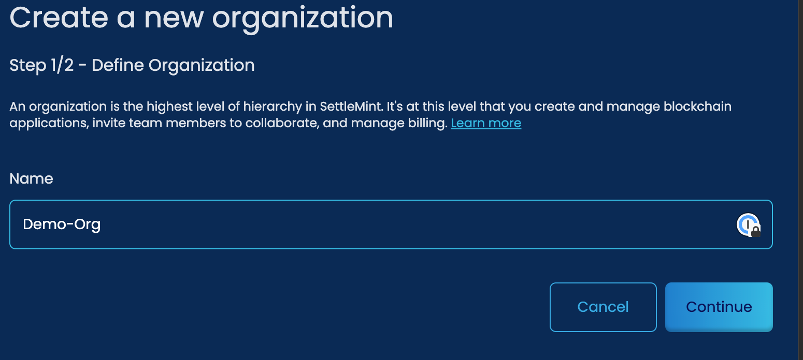

## Create A Blockchain Application

After you create an organization, the page will take you to the Organization dashboard.

Here you will find the applications you have created, the number of members within this organization, and the total resource costs for the month.

If you are currently on a trial of SettleMint, you will also see your remaining credits.

Let's start creating our application by clicking on the `Let's create one!` link:

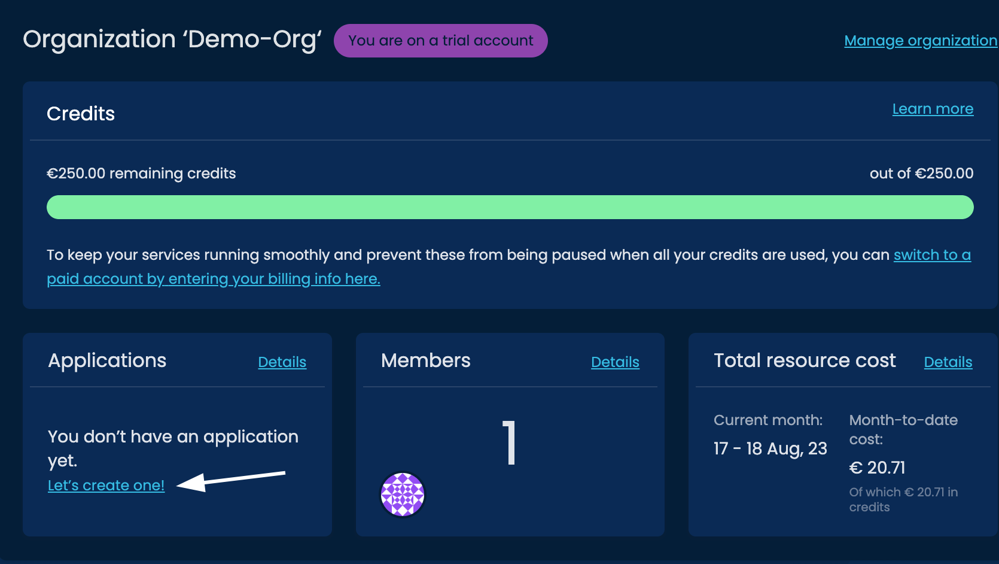

From here, you will now need to provide a name of your blockchain application. To keep it simple, let's name this application `HelloWorld`:

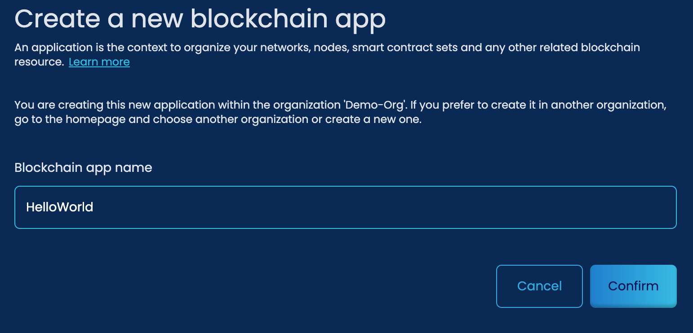

### Choosing a Network

To start creating a blockchain network, we must first choose the specific network type.

We have options covering both permissioned and public networks. To understand the different options, you can lean more here.

For this guide, we will select to deploy a `Hyperledger Besu` network:

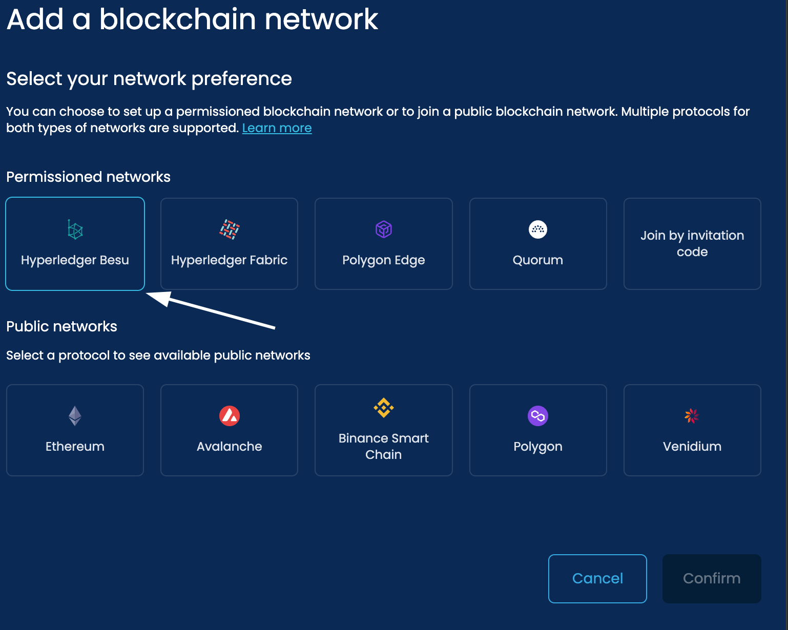

### Configuring Network Details

After selecting the network type, we must provide a name for both the network and the node.

Nodes keep the blockchain network running. For this guide, we will only deploy one node that is required.

To keep us organized in the future, we will name the network `helloworld-network` and the node `helloworld-node`.

### Choosing a Deployment Plan

The blockchain network and node require resources to keep them running.

SettleMint provides various hosting choices, including both cloud-hosted and on-premise solutions.

We will use the below settings:

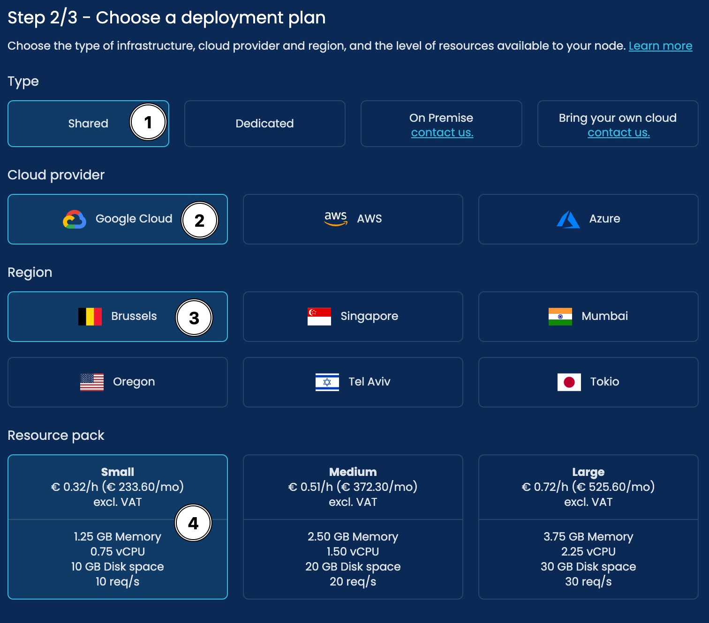

Deployment Options:

**1. Type** - Shared - This means the hosted resources will be logically separated but share cloud resources with other hosted networks saving on costs and energy.

**2.Cloud Provider** - SettleMint offers hosting on Google Cloud, Amazon Web Services (AWS), and Azure. Each of these services offers different hosting regions.

**3. Region** - You can now select what region you would like your resources deployed at. A best practice for the best performance is to choose a hosting provider that offers a region that is closest to your location.

**4. Resource Pack** - This is the technical resources that will be allocated to your network and node. For this guide, we will choose a `Small Pack`. Don't worry, you can easily scale up resources later if needed!

### Configure Settings

After choosing the deployment plan, you have the option to configure additional settings for your blockchain network.

For this guide, we will leave these settings **unchanged** and keep the default values.

## Deploying the Network and Node

Once you've chosen your deployment plan configuration, you'll be able to view the costs in Euros for maintaining these resources, presented both on an hourly and monthly basis.

If you are on the trial version, you will see your remaining credits that will cover the costs of these resources. After using up these credits, the network will stop operating until you supply payment details.

Click confirm and let's get deploying!

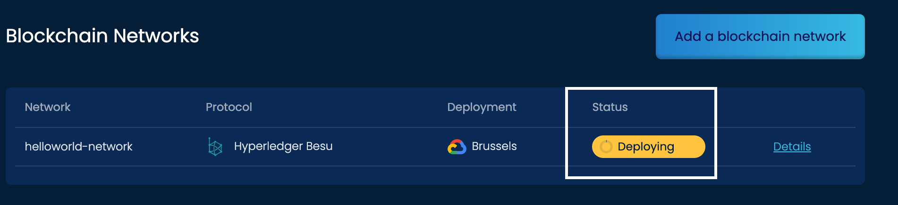

You can now see the status of the deployment of the network and node. Deployment times range depending on the traffic, region, and resources.

In the case there is an issue with deployment, the status of the deployment will turn red. If this happens, try deploying to a different cloud provider/region.

Once you've completed the full deployment of the network and node, the status will change to Running.

We are now ready to deploy our next component, the smart contract set.

## Adding a Smart Contract Set

A smart contract set includes a hosted developer environment where you can write, edit and deploy smart contracts to your blockchain network.

It also comes with smart contract templates that can help you get started quicker on building on your use case.

Click on `Smart contract sets` on the left navigation and then `Add a smart contract set` to start the deployment configuration:

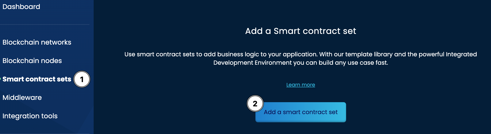

### Selecting the Node

You will first have the option to choose a node to which the smart contract will be deployed.

Since we have only created the `helloworld-node`, you should only see that one option.

### Choosing a Template

Next, you have the option to choose a template.

This is a list of popular standardized smart contracts like ERC-20 for launching tokens and ERC-721 for non-fungible tokens (NFTs). Each option has a `Learn More` link to explain more about it.

Since we are going to be creating a `Hello World` smart contract, you can choose the `Empty` option:

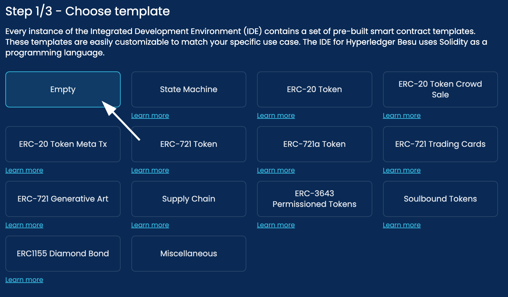

### Choosing a Deployment Plan

Just like the process of deploying the blockchain network and node, you will also need to select a deployment plan.

Let's use the same settings that you chose for the blockchain network.

### Deploying the Smart Contract Set

The process for deploying the smart contract set will begin. Note, that this is not deploying any smart contracts on the network yet. We will do this later!

## Writing Smart Contract Code

Now it is time to write some smart contract code! It is ok if you have not worked with Solidity before. We have provided you with the code in this guide to get you started.

### Opening the IDE

1. Click the name of the smart contract set
2. Navigate to the `IDE` tab.
3. Select `View in Fullscreen Mode`. This will open another tab with a Visual Studio Code IDE like the one above.

In the IDE, you need to locate and rename the `Example.sol` file that comes included in your smart contract set. You can do this by following these steps:

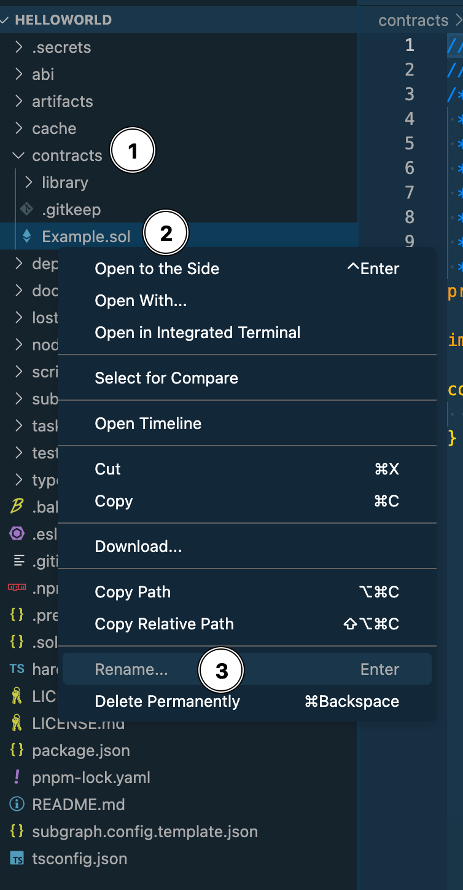

1. On the left File Explorer panel, find the `contracts` folder and click the arrow to expand.
2. Find the `Example.sol` file in the list
3. Right-click on the file and select `Rename`. Rename the file to `HelloWorld.sol`. This is case-sensitive so make sure you have named it exactly `HelloWorld

Now you can replace the code that is in the `HelloWorld.sol` file.

### Replacing the Solidity Code

Delete everything currently in the file and replace it with the code below. Make sure you have all the code when copying and pasting or you will receive errors.

```solidity

pragma solidity ^0.8.17;

contract HelloWorld {

string public greetingMessage;


constructor() {

greetingMessage = "Hello world!";

}

function setGreetings(string memory name) public returns (string memory) {

greetingMessage = string(abi.encodePacked("Hello, ", name, "!"));

return greetingMessage;

}

}


```

Leave this tab open to the IDE and go back to the tab with the dashboard still open. We will now deploy our last component, the Integration Studio!

## Deploying the Integration Studio

Allowing blockchain applications to integrate with existing applications and business logic can add more value to your projects.

On SettleMint you can deploy different tools to make integration more effective. In this guide, we will use the `Integration Studio`. You can deploy this tool by following the steps below:

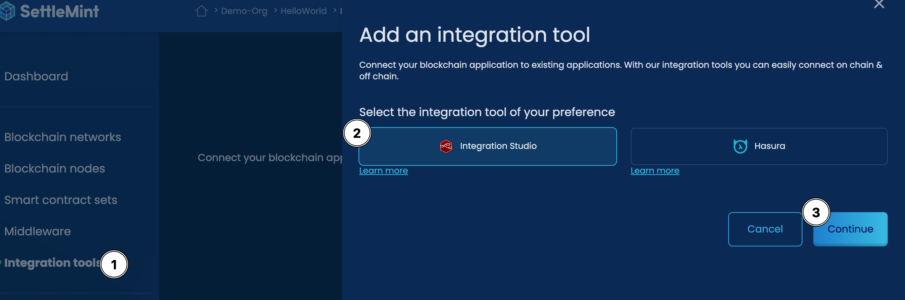

After you have the Integration Studio has been deployed, you can now go to the interface to start building the integration using the following steps:

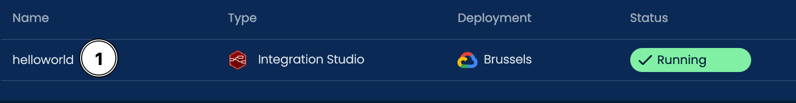
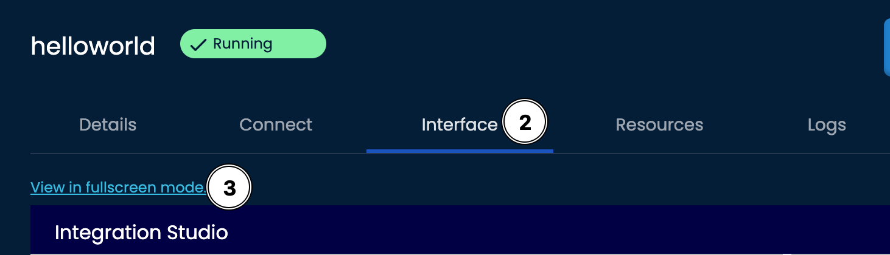

1. Click on the name of the Integration Studio
2. Select the `Interface` tab
3. Select the `View in fullscreen mode` to open up a new tab with the Integration Studio interface

### Importing the Template

The Integration Studio allows you to build a visual version of an integration to your blockchain application.
  
In this guide, we have provided a contract template that will allow you to start interacting with the Hello World smart contract.

To import the JSON file listed below, click on the top right "hamburger" icon and select the `Import` option:
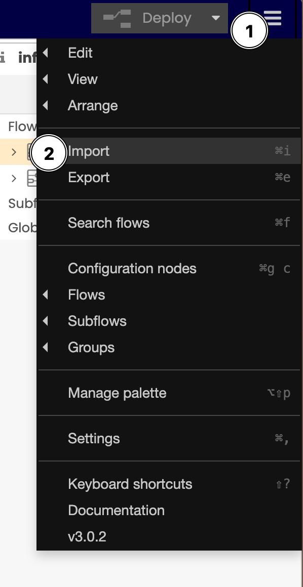

Copy the code below and paste it into the import window. As the code is in JSON format, make sure you have copied the complete code sample or you will receive an error.

```json
[
  {
    "id": "cfc3eb139dc03dc5",
    "type": "tab",
    "label": "Contract Editor",
    "disabled": false,
    "info": "",
    "env": []
  },
  {
    "id": "0119534f2720d10a",
    "type": "template",
    "z": "cfc3eb139dc03dc5",
    "name": "Hello World Contract Editor",
    "field": "payload",
    "fieldType": "msg",
    "format": "html",
    "syntax": "mustache",
    "template": "<!DOCTYPE html>\n<html>\n<head>\n <title>Smart Contract Interface</title>\n <script src=\"https://cdnjs.cloudflare.com/ajax/libs/ethers/6.6.0/ethers.umd.min.js\"></script>\n <style>\n body {\n background-color: #f7f7f7;\n font-family: Arial, sans-serif;\n margin: 20px;\n padding: 0;\n overflow-x: hidden;\n }\n\n h1 {\n text-align: center;\n margin-top: 20px;\n }\n\n .contract-section {\n margin-top: 30px;\n }\n\n .contract-title {\n color: #333;\n font-size: 24px;\n margin-bottom: 15px;\n padding: 0;\n }\n\n .contract-functions {\n display: grid;\n grid-template-columns: repeat(auto-fit, minmax(320px, 1fr));\n gap: 20px;\n margin-top: 10px;\n }\n\n .function-card {\n background-color: #fff;\n border-radius: 8px;\n box-shadow: 0 2px 6px rgba(0, 0, 0, 0.1);\n padding: 20px;\n }\n\n .function-title {\n font-size: 20px;\n font-weight: bold;\n margin: 0 0 10px;\n padding: 0;\n }\n\n .function-description {\n color: #555;\n margin-bottom: 10px;\n }\n\n .function-input {\n display: flex;\n align-items: center;\n margin-bottom: 10px;\n }\n\n .input-label {\n width: 120px;\n font-weight: bold;\n margin-right: 10px;\n }\n\n .input-field {\n flex: 1;\n border: 1px solid #ccc;\n border-radius: 4px;\n box-sizing: border-box;\n font-size: 14px;\n padding: 8px;\n }\n\n .function-result {\n margin-top: 10px;\n font-size: 14px;\n white-space: pre-wrap;\n overflow-y: auto;\n }\n\n .function-result-label {\n margin-bottom: 5px;\n }\n\n .function-button {\n background-color: #007bff;\n border: none;\n border-radius: 4px;\n color: #fff;\n cursor: pointer;\n font-size: 14px;\n padding: 10px 20px;\n margin-top: 10px;\n }\n\n .function-button:hover {\n background-color: #0056b3;\n }\n\n .logs-div {\n background-color: #222;\n color: #fff;\n margin: 20px auto;\n padding: 20px;\n border-radius: 8px;\n position: sticky;\n bottom: 0px;\n }\n\n .logs-div p {\n margin: 5px;\n padding: 5px;\n line-height: 1.5;\n overflow-x: auto;\n }\n\n .error-message {\n background-color: #f44336;\n border-radius: 4px;\n color: white;\n margin-top: 10px;\n padding: 10px;\n overflow-x: auto;\n }\n\n .error-message button {\n background-color: transparent;\n border: none;\n color: white;\n cursor: pointer;\n font-size: 16px;\n line-height: 1;\n padding: 0;\n position: absolute;\n top: 5px;\n right: 5px;\n }\n </style>\n</head>\n\n<body>\n <h1>Contract Editor</h1>\n<h2>Contract : {{payload.contractAddress}}</h2>\n <div class=\"contract-section\">\n <h2 class=\"contract-title\">Read-only Functions</h2>\n <div class=\"contract-functions\" id=\"readFunctions\"></div>\n </div>\n\n <div class=\"contract-section\">\n <h2 class=\"contract-title\">Write Functions</h2>\n <div class=\"contract-functions\" id=\"writeFunctions\"></div>\n </div>\n\n <div class=\"logs-div\" id=\"logsDiv\"></div>\n\n <script>\n \n\n window.onload = async function () {\n \n const contractAddress = '{{{payload.contractAddress}}}'; // Contract address placeholder\n const privateKey = '{{{payload.privateKey}}}'; // Private key placeholder\n const abi = JSON.parse('{{{payload.abi}}}'); // ABI placeholder\n\n const provider = new ethers.JsonRpcProvider('{{{payload.jsonRpc}}}');\n const wallet = new ethers.Wallet(privateKey, provider);\n const contract = new ethers.Contract(contractAddress, abi, wallet);\n\n const readFunctionsDiv = document.getElementById('readFunctions');\n const writeFunctionsDiv = document.getElementById('writeFunctions');\n const logsDiv = document.getElementById('logsDiv');\n\n function formatResult(result) {\n if (typeof result === 'bigint') {\n return result.toString();\n }\n if (Array.isArray(result)) {\n return result.map(formatResult);\n }\n if (typeof result === 'object') {\n const formattedResult = {};\n for (const key in result) {\n formattedResult[key] = formatResult(result[key]);\n }\n return formattedResult;\n }\n return result;\n}\n\n abi.forEach((func) => {\n if (func.type === \"function\" || func.type === \"variable\") {\n const functionDiv = document.createElement('div');\n functionDiv.className = 'function-card';\n\n const functionName = document.createElement('h3');\n functionName.className = 'function-title';\n functionName.textContent = func.name;\n functionDiv.appendChild(functionName);\n\n const functionDescription = document.createElement('p');\n functionDescription.className = 'function-description';\n functionDescription.textContent = func.stateMutability === 'view' ? 'Read-only function' : 'Write function';\n functionDiv.appendChild(functionDescription);\n\n const inputFields = [];\n if (func.inputs && func.inputs.length > 0) {\n func.inputs.forEach((input) => {\n const inputContainer = document.createElement('div');\n inputContainer.className = 'function-input';\n\n const inputLabel = document.createElement('label');\n inputLabel.className = 'input-label';\n inputLabel.textContent = input.name + ' (' + input.type + '): ';\n inputContainer.appendChild(inputLabel);\n\n const inputField = document.createElement('input');\n inputField.className = 'input-field';\n inputField.setAttribute('name', func.name + '_' + input.name);\n inputContainer.appendChild(inputField);\n\n inputFields.push(inputField);\n\n functionDiv.appendChild(inputContainer);\n });\n }\n\n const resultMessage = document.createElement('div');\n resultMessage.className = 'function-result';\n resultMessage.id = func.name + '_result';\n functionDiv.appendChild(resultMessage);\n\n const callButton = document.createElement('button');\n callButton.className = 'function-button';\n callButton.textContent = 'Call';\n callButton.onclick = async function () {\n const args = inputFields.map(inputField => inputField.value);\n try {\n let result;\n if (func.stateMutability === 'view') {\n resultMessage.textContent = 'Loading...';\n result = await contract[func.name](...args);\n resultMessage.textContent = 'Result:\\n' + formatResult(result);\n } else {\n resultMessage.textContent = 'Loading...';\n const tx = await contract[func.name](...args);\n const logMessage = document.createElement('p');\n logMessage.textContent = 'Transaction hash: ' + tx.hash + ', Args: ' + JSON.stringify(args) + ', Function: ' + func.name;\n logsDiv.appendChild(logMessage);\n resultMessage.textContent = 'Transaction sent. Waiting for confirmation...';\n await tx.wait();\n resultMessage.textContent = 'Transaction confirmed for ' + func.name;\n\n // Display complete transaction object in logs\n const txObjectMessage = document.createElement('p');\n txObjectMessage.textContent = 'Transaction object: ' + JSON.stringify(tx);\n logsDiv.appendChild(txObjectMessage);\n }\n } catch (err) {\n const errorMessage = document.createElement('div');\n errorMessage.className = 'error-message';\n errorMessage.textContent = 'Error for ' + func.name + ': ' + err.message;\n const dismissButton = document.createElement('button');\n dismissButton.textContent = 'X';\n dismissButton.onclick = function () {\n functionDiv.removeChild(errorMessage);\n };\n errorMessage.appendChild(dismissButton);\n functionDiv.appendChild(errorMessage);\n }\n };\n\n functionDiv.appendChild(callButton);\n\n if (func.stateMutability === 'view') {\n readFunctionsDiv.appendChild(functionDiv);\n } else {\n writeFunctionsDiv.appendChild(functionDiv);\n }\n }\n });\n};\n </script>\n</body>\n\n</html>",
    "output": "str",
    "x": 660,
    "y": 300,
    "wires": [["a52e534fe124b0d5"]]
  },
  {
    "id": "a52e534fe124b0d5",
    "type": "http response",
    "z": "cfc3eb139dc03dc5",
    "name": "",
    "statusCode": "",
    "headers": {},
    "x": 830,
    "y": 300,
    "wires": []
  },
  {
    "id": "3944e3fbedb2ac27",
    "type": "http in",
    "z": "cfc3eb139dc03dc5",
    "name": "",
    "url": "/helloworld",
    "method": "get",
    "upload": false,
    "swaggerDoc": "",
    "x": 200,
    "y": 300,
    "wires": [["15e052d0b38acb4f"]]
  },
  {
    "id": "15e052d0b38acb4f",
    "type": "function",
    "z": "cfc3eb139dc03dc5",
    "name": "Set Information",
    "func": "const privateKey = '';\nconst contractAddress = '';\nconst jsonRpc = ''\nconst abi = [\n {\n \"inputs\": [],\n \"stateMutability\": \"nonpayable\",\n \"type\": \"constructor\"\n },\n {\n \"inputs\": [],\n \"name\": \"greetingMessage\",\n \"outputs\": [\n {\n \"internalType\": \"string\",\n \"name\": \"\",\n \"type\": \"string\"\n }\n ],\n \"stateMutability\": \"view\",\n \"type\": \"function\"\n },\n {\n \"inputs\": [\n {\n \"internalType\": \"string\",\n \"name\": \"name\",\n \"type\": \"string\"\n }\n ],\n \"name\": \"setGreetings\",\n \"outputs\": [\n {\n \"internalType\": \"string\",\n \"name\": \"\",\n \"type\": \"string\"\n }\n ],\n \"stateMutability\": \"nonpayable\",\n \"type\": \"function\"\n }\n]\n\nconst templatePayload = {\n contractAddress: contractAddress,\n privateKey: privateKey,\n abi: JSON.stringify(abi),\n jsonRpc: jsonRpc\n};\n\nmsg.payload = templatePayload;\nreturn msg;",
    "outputs": 1,
    "noerr": 0,
    "initialize": "",
    "finalize": "",
    "libs": [],
    "x": 450,
    "y": 300,
    "wires": [["0119534f2720d10a"]]
  }
]
```

### Configuring the Contract Editor

After importing the code, this will create a new tab on the interface called `Contract Editor`. You should also see the configuration like in the below image:

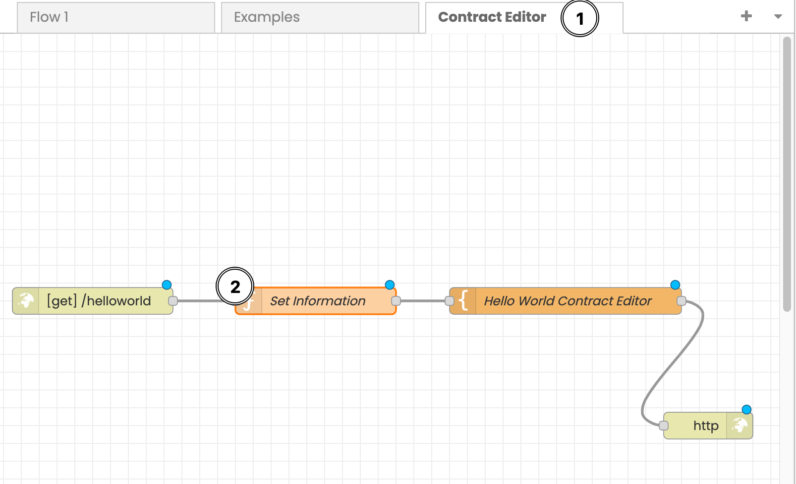

The JSON code we pasted below is set up for the Hello World contract. We still need to set up the specific information contract you are working with. This is done by clicking on the `Set Information` block.

### Setting Up The Integration Information

After selecting the `Set Information` option, you will now see the configuration options for this block. Click on the `On Message` tab if it is not open already.

Here we will start to paste important information about your smart contract and blockchain network.
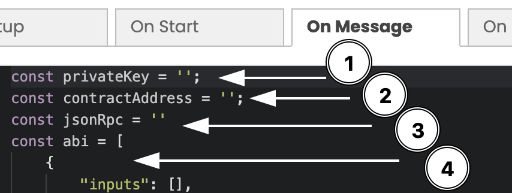

#### 1. Creating a Private Key

You will need to create a private key for the Blockchain node. This allows you to sign transactions on the blockchain network. You can do this by following the steps below:

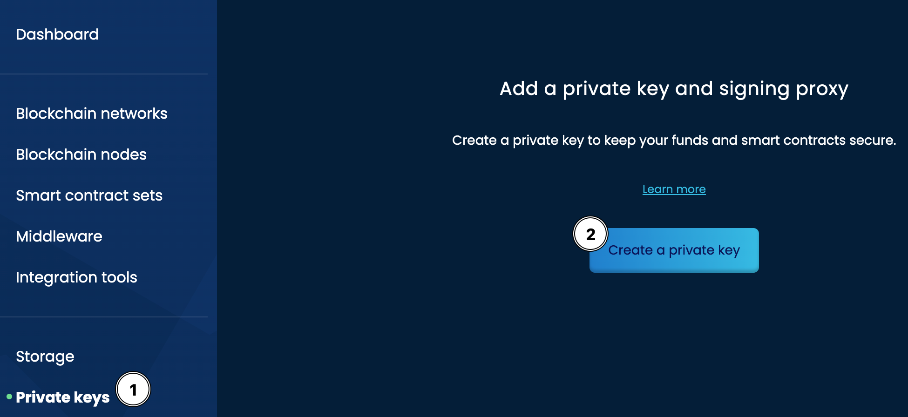

1. Select the `Private keys` from the left menu
2. Select the `Create a private key` button

This will open the configuration option for the private key. Use the below settings for your private key:

**Private Key Configuration:**

**1. Private Key Type** - Accessible EC DSA P256 -

**2. Enter details** - Naming of the key

**3. Select nodes** - Select the `helloworld-node` that you have deployed

**4.Confirm** - Confirm the deployment

Now that you have deployed the private key, you can copy this key and paste it into the Integration Studio.

This is done by clicking the name of the private key. There select the `Details` tab and the copy option by the `Private Key` field like below:

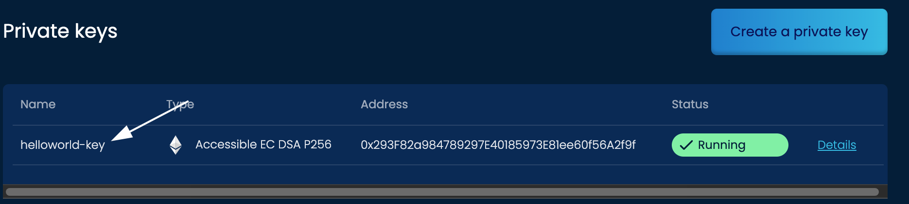
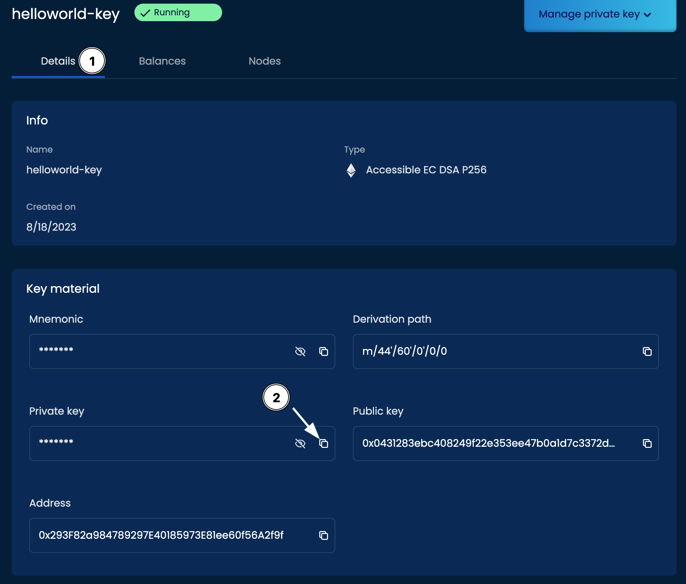

With the private key copied, you can now go back to the Integration Studio and paste this key into the first line after `const privateKey =` inside the ' ''. The private key should begin with `0x`.

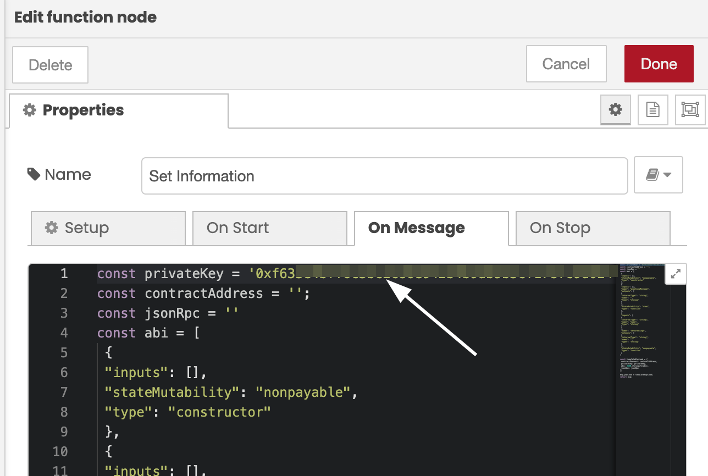

#### 2. Get the Contract Address

Now we will get the contract address for the Hello World smart contract. This is the location where the smart contract has been deployed on your blockchain network.

To get the contract address you need to deploy the contract. This is done in the smart contract IDE that you opened up earlier.

**Step 1: Deploy the Contract**

SettleMint uses Hardhat scripts to deploy smart contracts. To deploy the Hello World smart contract, follow the steps below:

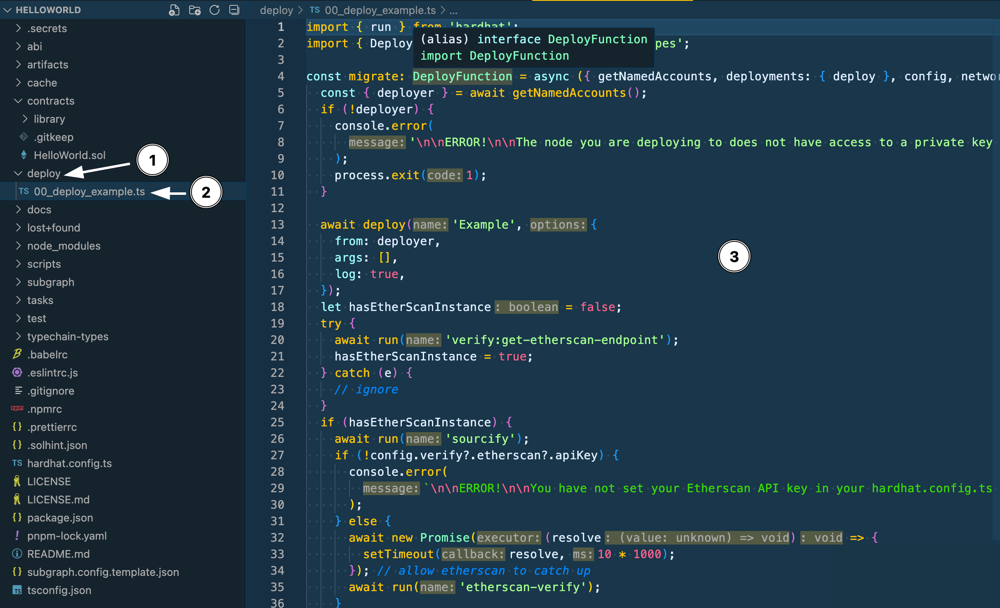

1. Go to the `deploy` folder in the file explorer on the left
2. Open the `00_deploy_example.ts` file
3. Delete the code that is currently in this file
4. Copy and paste the code below:

```typescript
import { DeployFunction } from 'hardhat-deploy/types';

const deploy: DeployFunction = async ({ deployments, getNamedAccounts }) => {
  const { deploy } = deployments;

  const { deployer } = await getNamedAccounts();

  await deploy('HelloWorld', {
    from: deployer,

    args: [],

    log: true
  });
};

deploy.tags = ['HelloWorld'];

export default deploy;
```

**Step 2: Compile the Smart Contract**

After replacing the code with the code above, it is now time to compile. This will create some important files you will use later and check to see if there is any errors in our code.

To compile the Hello World contract, follow the steps below:

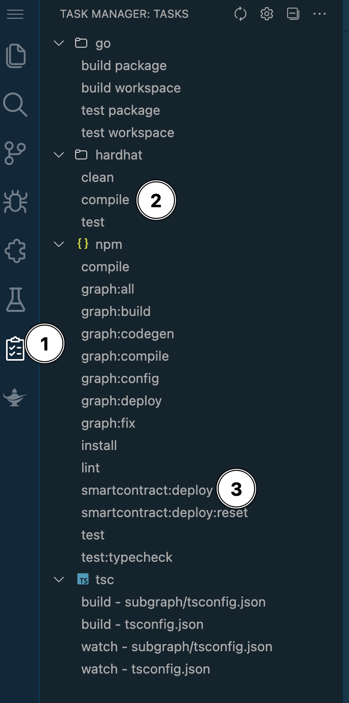

1. Click on the Clipboard icon on the left menu

2. Double click on `Compile`. This should open the terminal at the bottom of the screen. After the compiling is complete, the output should look similar to the below:

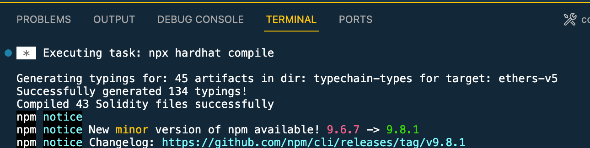

3. After successfully compiling the contract, double click on the `smartcontract:deploy`option in the Tasks Menu. This will run the deploy script we created earlier and deploy the contract to your blockchain network.

Once the contract is deployed, the terminal will show its `contractAddress`. Copy this address and head back over to the Integration Studio.

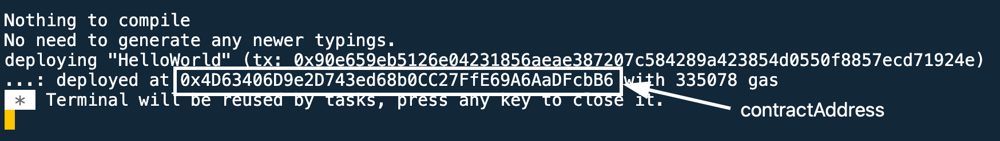

Once the contract is deployed, the terminal will show its `contractAddress`. Copy this address and head back over to the Integration Studio.

Paste the `contractAddress` into the next line in the `Set Information` window where you pasted the `privateKey`earlier.

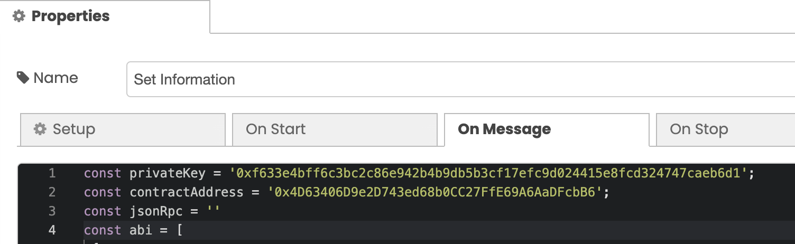

We are almost done! The last thing we need to add is the JSON RPC that will allow you to connect to our blockchain node.

## Setting the JSON RPC URL

First, you will need to get the JSON RPC URL. This is the URL to make the connection to the blockchain node. Follow the steps below to find this information:

### Getting the JSON-RPC URL

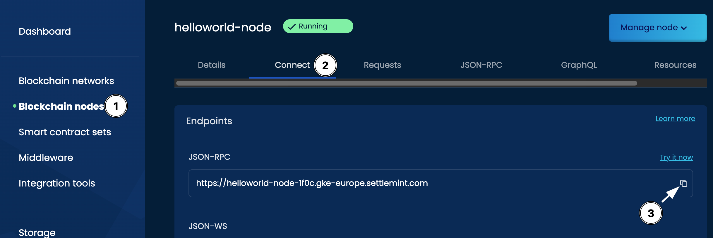

1. Go to the Blockchain nodes menu on the main dashboard
2. Go to the `Connect` tab
3. Copy the JSON-RPC URL by using the copy icon

Now that you have the JSON-RPC URL, it is time to add this to the `Set Information` window of the Integration Studio:

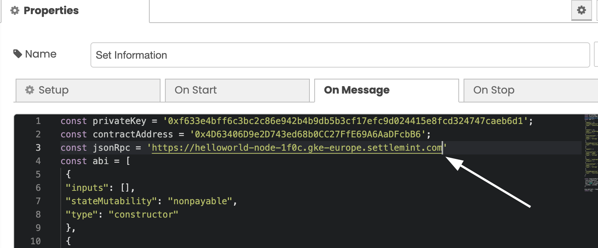

Paste the URL into the next line titled `jsonRPC` like the above image.

### Generating the API Key

Below are the steps to generate an API key: 1. On the main dashboard, click on the `Profile` icon in the top right:

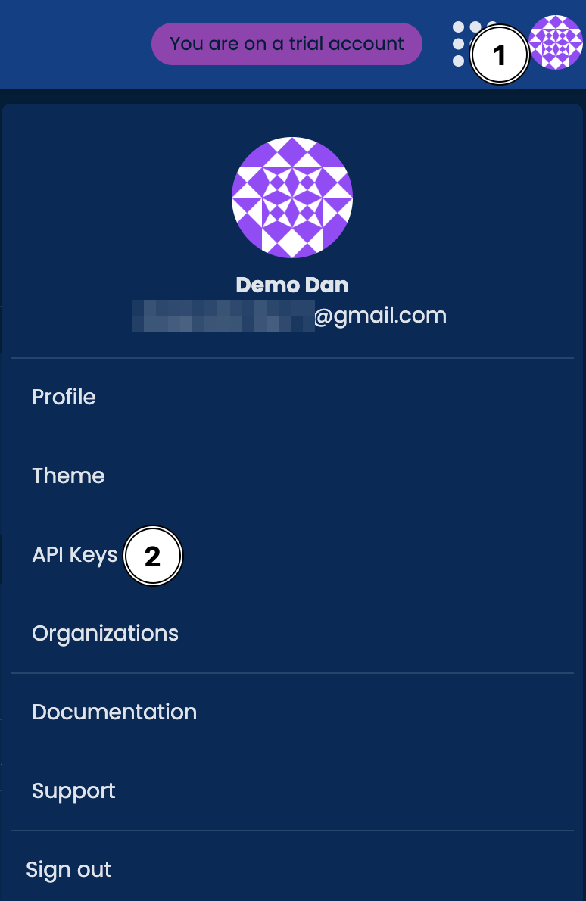

1. On the main dashboard, click on the `Profile` icon in the top right
2. Select `API Keys`from the menu options

Click the button to `Generate new API Key`. This will open up the configuration options.

Let's name the API key, `helloworld-key` and give it `No expiration` so you know it will continue to work.

Next, you will need to configure what access this key has. For this guide, you can select all the options like the image below.

If you have multiple apps, you can control the access of the API key to specific apps and resources.
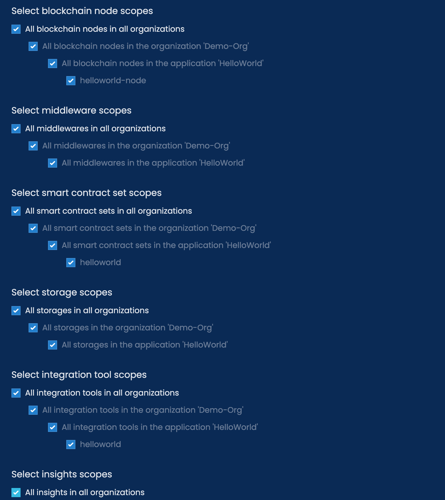

After clicking the `Confirm` button, you will now be shown the new API key that has been created. Click on the copy icon to copy the API key. This key will only be shown to you once.

Go back to the Integration Studio and the `Set Information` window. You can now add the key to the end of the JSON-RPC URL that we added in the previous step. The format should look like this:

`const jsonRPC = 'JSON-RPC-URL/API KEY'`

Your `Set Information`window should look like the below image:

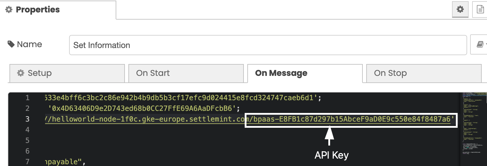

#### A Note about ABI

There is one last field in the `Set Information` window called abi. The Application Binary Interface (ABI) of the smart contract is a list of the operations that the smart contract performs.

Since we already had the code for the smart contract written, the ABI was already provided. If you change the smart contract code or deploy another smart contract, the ABI field will also need to be changed.

## Deploying the Integration

Now that we have added all the required information for our integration, it is now time to deploy it!

Close the `Set Information` window and click the `Deploy` button on the top right.

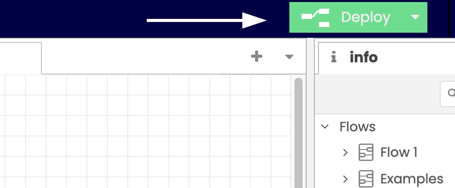

You will now receive a notification that the integration has been deployed:

### Interacting with the Contract

You can now start interacting with the Hello World contract via a front-end page. To do this go to the URL in your browser and replace the ending of the URL to `/helloworld`.

Your URL will look something similar to this:

Before: `https://helloworld-9ece.gke-europe.settlemint.com/#flow/cfc3eb139dc03dc5`
After: `https://helloworld-9ece.gke-europe.settlemint.com/helloworld`

In your browser you will see two options `Read-only` and `Write`functions:

- `Read-only`: These functions can only read the data from the smart contract

- `Write Functions`: These functions can change the value of the data

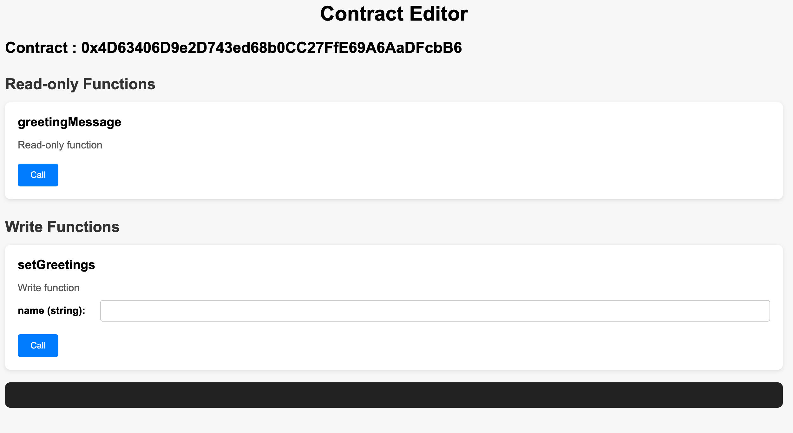

By clicking the `Call` Button under `greetingMessage` this will call the contract and read the current value of the `greetingMessage`

The result will be `Hello world!` as this was the initial value set we set in the `constructor` of the smart contract.

To make it interesting, you can also change this value to whatever message you want!
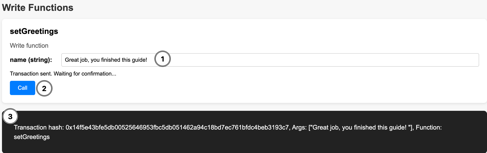

1. Write a new message in the text field of `setGrettings`
2. Click the `Call` button
3. A transaction that will change the value will show at the bottom terminal

Now to confirm that the `greetingMessage` has changed, click the `Call` button again:

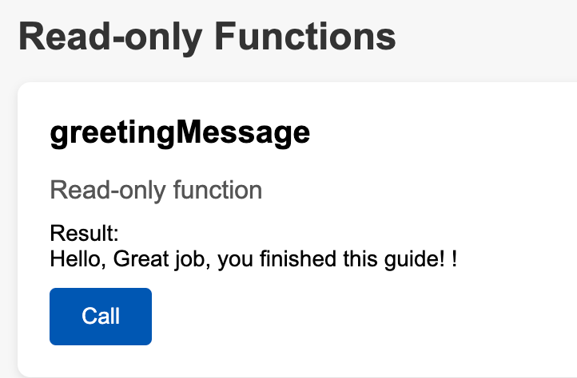

## Wrapping Up

In this guide, you used SettleMint to:

- Deploy a blockchain network and node
- Write and deploy a smart contract
- Create an integration with the smart contract
- Interact with the deployed smart contract

Great work! This is the basic building block to start creating blockchain applications on SettleMint.
