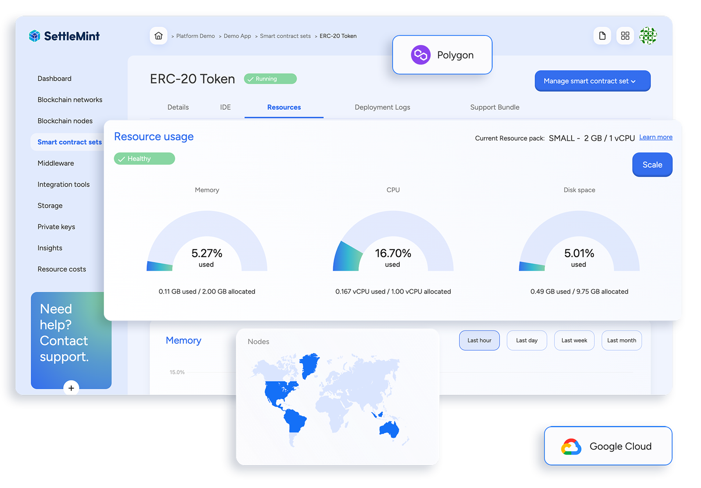

SettleMint’s SaaS delivery model is designed to be developer-friendly from day one. Developers gain instant access to pre-configured blockchain environments via a simple web interface or APIs, removing the need to install, configure, or troubleshoot infrastructure components. 
Everything from network provisioning to smart contract deployment is abstracted into intuitive workflows, letting developers build, test, and iterate applications with minimal friction.

 

One of the key strengths of SettleMint’s SaaS approach is the future-proof flexibility it offers. 
Applications built on the SaaS platform can be migrated to self-managed or on-premise environments at any stage, without needing to re-architect the solution. This provides enterprises with full control over deployment models—whether they start on SaaS for speed and scale or later shift to on-premise for compliance, data sovereignty, or regulatory alignment.

  

By enabling such smooth transitions between deployment models, SettleMint ensures that technical decisions made early in the project lifecycle do not become limitations later. 
Organizations are empowered to innovate quickly while maintaining the freedom to adapt their infrastructure strategy as business or compliance needs evolve.
