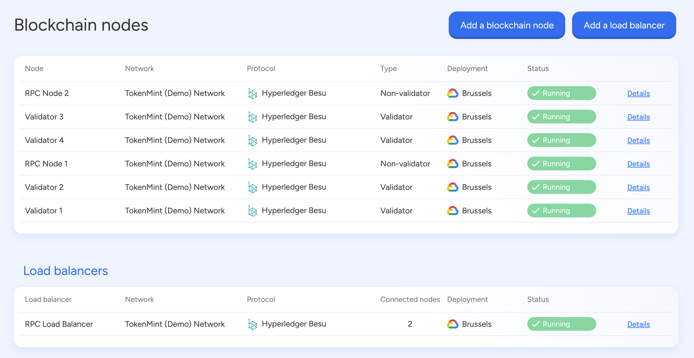
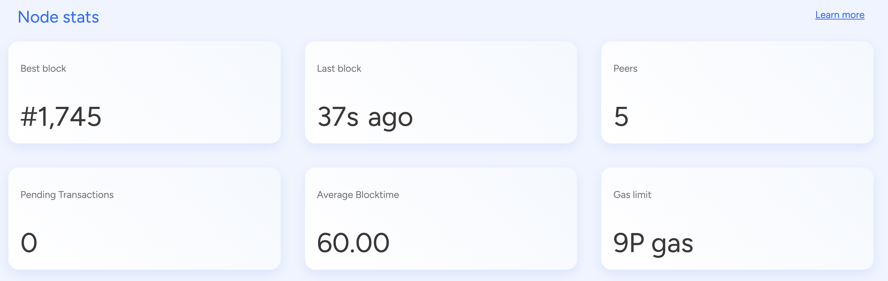
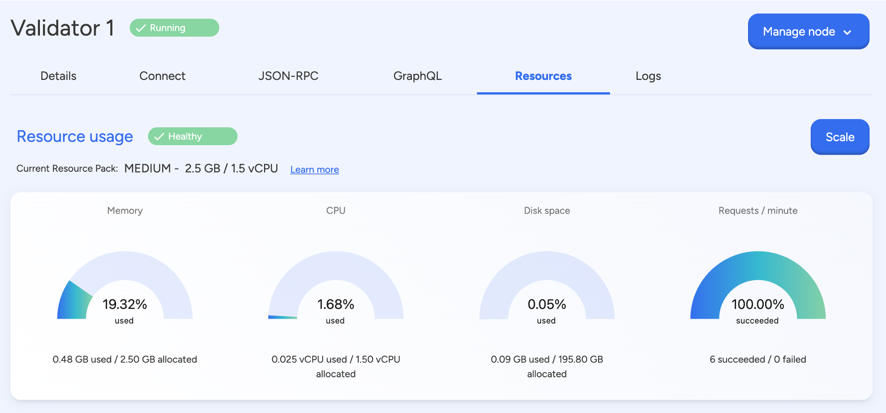
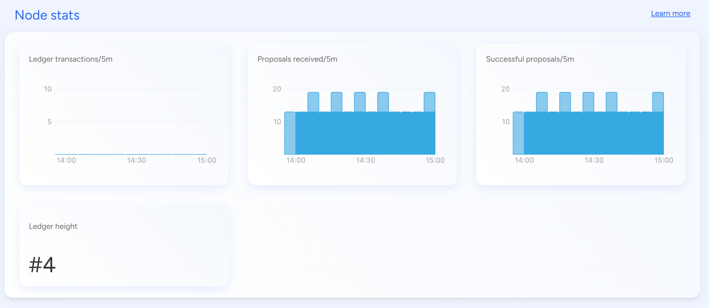

import { Tabs, Tab } from "fumadocs-ui/components/tabs";
import { Callout } from "fumadocs-ui/components/callout";
import { Steps } from "fumadocs-ui/components/steps";
import { Card } from "fumadocs-ui/components/card";

A **blockchain node** is a **computer program** that maintains and verifies the
integrity of a distributed ledger. A **set of nodes** forms a **network**,
ensuring decentralized operations by synchronizing blockchain data and executing
transactions. Nodes collectively validate and store information, making
blockchains secure, transparent, and immutable.

**EVM-based blockchains** support both **public** and **permissioned** networks.
**Public EVM blockchains**, such as **Ethereum and Polygon**, are open to
anyone, allowing decentralized participation in transaction validation and smart
contract execution. These networks rely on economic incentives and
permissionless consensus mechanisms like **Proof of Stake (PoS)** to maintain
security and decentralization. On the other hand, **permissioned EVM
blockchains**, such as **Quorum and Hyperledger Besu**, restrict participation
to authorized entities. These networks prioritize privacy, regulatory
compliance, and efficiency, often using **Proof of Authority (PoA)** or **Quorum
Byzantine Fault Tolerance (QBFT)** to validate transactions. Whether public or
permissioned, all EVM-based blockchains rely on a distributed set of nodes to
maintain state synchronization and network security.

**Hyperledger Fabric** is a **permissioned blockchain framework** built for
enterprises requiring secure, controlled, and scalable blockchain solutions.
Unlike EVM-based blockchains, which may be **public or permissioned**, Fabric
networks are exclusively **permissioned**, ensuring that only pre-approved
entities can operate nodes, validate transactions, and access network data.
Fabric’s modular architecture allows organizations to define governance models,
identity management policies, and consensus mechanisms tailored to their
specific needs. Transactions in Fabric are endorsed by selected peers and then
ordered into blocks using mechanisms like **Raft** or **Byzantine Fault Tolerant
(BFT) ordering**, prioritizing efficiency and compliance over decentralization.

---

### **Types of nodes in evm-based blockchains**

- **Validator Nodes:** Actively participate in consensus by proposing and
  finalizing new blocks. These nodes maintain ledger integrity by operating
  under consensus mechanisms like **Proof of Authority (PoA)** or **Istanbul
  Byzantine Fault Tolerance (IBFT)**.
- **Non-Validator Nodes (Observer Nodes):** Do not take part in consensus but
  instead **synchronize blockchain data, respond to queries, and facilitate
  smart contract execution**. They maintain updated copies of the blockchain
  without finalizing blocks.

### **Among non-validator nodes:**

- **Full Nodes:** Store the entire blockchain history and verify transactions
  without participating in block finalization.
- **Archive Nodes:** Extend full node functionality by retaining complete
  historical blockchain states, making them essential for querying past
  transactions.

### **Core components of an evm-based node**

- **Execution Layer (EVM):** Processes smart contracts and updates the
  blockchain state.
- **Networking Layer (devp2p Protocol):** Facilitates peer-to-peer communication
  for efficient data propagation.
- **Storage Layer:** Manages blockchain data, including account states, logs,
  receipts, and the **Merkle Patricia Trie** for world-state management.
- **JSON-RPC Interface:** Provides an API for dApps, wallets, and external
  applications to interact with the blockchain.

---

### **Types of nodes in hyperledger fabric**

- **Peer Nodes:** Maintain the ledger and execute smart contracts
  (**Chaincode**).
  - **Endorsing Peers:** Simulate transactions and provide endorsement
    signatures, ensuring compliance with business rules.
  - **Committing Peers:** Validate endorsed transactions and update the ledger.
- **Ordering Nodes (Orderers):** Handle transaction sequencing, package
  transactions into blocks, and distribute them to peers. These nodes ensure
  consensus across the network using mechanisms like **Raft** or **Byzantine
  Fault Tolerant (BFT) ordering**.
- **Certificate Authority (CA) Nodes:** Issue and authenticate identities using
  **Public Key Infrastructure (PKI)**, enforcing security policies and access
  controls.

Unlike EVM-based blockchains, Fabric nodes **do not store a global state in
shared memory**. Instead, they use separate **key-value stores and dedicated
ledgers**, enhancing **privacy and scalability**.

## **Certificate authorities**

Certificate Authorities play a key role in the network because they dispense
X.509 certificates that can be used to identify components as belonging to an
organization. Certificates issued by CAs can also be used to sign transactions
to indicate that an organization endorses the transaction result - a
precondition of it being accepted onto the ledger. Let's examine these two
aspects of a CA in a little more detail.

Firstly, different components of the blockchain network use certificates to
identify themselves to each other as being from a particular organization. CAs
are so important that Hyperledger Fabric provides you with a built-in one
(called the Fabric-CA) to help you get going.

The mapping of certificates to member organizations is achieved via a structure
called a Membership Services Provider (MSP), which defines an organization by
creating an MSP which is tied to a root CA certificate to identify that
components and identities were created by the root CA.

The mapping of certificates to member organizations is achieved via a structure
called a Membership Services Provider (MSP), which defines an organization by
creating an MSP which is tied to a root CA certificate to identify that
components and identities were created by the root CA. The channel configuration
can then assign certain rights and permissions to the organization through a
policy.

Secondly, certificates issued by CAs are at the heart of the transaction
generation and validation process. Specifically, X.509 certificates are used in
client application transaction proposals and smart contract transaction
responses to digitally sign transactions. Subsequently the network nodes who
host copies of the ledger verify that transaction signatures are valid before
accepting transactions onto the ledger.

More information about the Fabric-CA can be found on the official Hyperledger
Fabric-CA documentation website.

## **Identities**

The different actors in a blockchain network include peers, orderers, client
applications, administrators and more. Each of these actors — active elements
inside or outside a network able to consume services — has a digital identity
encapsulated in an X.509 digital certificate. These identities really matter
because they determine the exact permissions over resources and access to
information that actors have in a blockchain network.

A digital identity furthermore has some additional attributes that Fabric uses
to determine permissions, and it gives the union of an identity and the
associated attributes a special name — principal. Principals are just like
userIDs or groupIDs, but a little more flexible because they can include a wide
range of properties of an actor's identity, such as the actor's organization,
organizational unit, role or even the actor's specific identity. When we talk
about principals, they are the properties which determine their permissions.

For an identity to be verifiable, it must come from a trusted authority. A
membership service provider (MSP) is that trusted authority in Fabric. More
specifically, an MSP is a component that defines the rules that govern the valid
identities for this organization. The default MSP implementation in Fabric uses
X.509 certificates as identities, adopting a traditional Public Key
Infrastructure (PKI) hierarchical model.

More information about identities can be found on the official Hyperledger
Fabric documentation website.

SettleMint's platform uses the Fabric-CA to create a root CA, this CA acts as a
dual-headed CA, meaning that it is used for issuing MSP and TLS certificates.
This CA must be used to issue all certificates for the network, orderers, peers,
administrators, and client applications.

## **Peers**

Peers are a fundamental element of the network because they host ledgers and
chaincode (which contain smart contracts) and are therefore one of the physical
points at which organizations that transact on a channel connect to the channel
(the other being an application). A peer can belong to as many channels as an
organizations deems appropriate (depending on factors like the processing
limitations of the peer pod and data residency rules that exist in a particular
country).

More information about peers can be found on the official Hyperledger Fabric
documentation website.

## **Orderers**

An orderer (also known as an "ordering node") does transaction ordering, which
along with other orderer nodes forms an ordering service. Because Fabric's
design relies on deterministic consensus algorithms, any block validated by the
peer is guaranteed to be final and correct. Orderers also enforce basic access
control for channels, restricting who can read and write data to them, and who
can configure them.

The ordering service gathers endorsed transactions from applications and orders
them into transaction blocks, which are subsequently distributed to every peer
node in the channel. At each of these committing peers, transactions are
recorded and the local copy of the ledger updated appropriately. An ordering
service is unique to a particular channel, with the nodes servicing that channel
also known as a "consenter set". Even if a node (or group of nodes) services
multiple channels, each channel's ordering service is considered to be a
distinct instance of the ordering service.

More information about orderers and the ordering service can be found on the
official Hyperledger Fabric documentation website.

Application channels, or simply channels SettleMint's platform creates by
default an application channel called "default-channel" which is used to create
an initial ledger for the network.

Users can create additional application channels using the binaries provided by
Hyperledger Fabric (install them locally and download the node's certificates)
or by creating a Smart contract set which is a configured web IDE with all the
necessary files and binaries to interact with your peer node and orderers.

### **Core components of a hyperledger fabric node**

- **Chaincode Layer:** Executes smart contract logic and enforces business
  rules.
- **Ledger Layer:** Stores transactional data using **LevelDB** or **CouchDB**
  as key-value state databases.
- **Communication Layer:** Manages gRPC-based interactions between nodes.
- **Membership Service Provider (MSP):** Governs identity verification, access
  policies, and network governance.

## **Settlemint platform’s node manager**



The **SettleMint Node Manager** simplifies blockchain node deployment and
management, offering a **user-friendly interface** to configure, monitor, and
maintain nodes on different blockchain networks. It enables businesses and
developers to:

- **Deploy nodes in a few clicks** without complex configurations.
- **Monitor network health and performance** with real-time statistics.
- **Pause and resume nodes** to optimize resource usage and costs.
- **Interact with blockchain APIs** through JSON-RPC, WebSockets, and GraphQL.
- **Manage security and identity credentials** via cryptographic key management.

## Node types on SettleMint platform

For Ethereum, SettleMint provides support for the Geth client. This means that
when you add an Ethereum node, you get a Geth node by default. All nodes running
in SettleMint are configured to be archive nodes, meaning they all include all
previous states of a given blockchain since its origin.

For hyperledger besu, SettleMint provides the option between Validator and
Non-validator nodes. All nodes are configured to be archive nodes.

For hypelerledger fabric, SettleMint offers options between peer and orderer
nodes.

## **1. hyperledger besu node overview**

The **Besu Node Dashboard** serves as a comprehensive interface for managing and
monitoring a **Hyperledger Besu node**. It provides insights into node status,
network connectivity, blockchain interactions, and system performance.

### **1.1 details tab**


The **Details** tab provides key deployment information, including:

- **Node Name & Status** – Identifies the instance and operational state.
- **Deployment Location** – Specifies where the node is hosted.
- **Blockchain Network & Protocol** – Indicates network participation and
  protocol in use.
- **Node Type** – Determines whether the node is a **validator** or other roles.



### Node identity (evm chains)


The **Node Identity section** holds cryptographic keys and credentials that
establish the node’s uniqueness within the network.

- **Mnemonic** – A set of words that generate the private key.
- **Derivation Path** – Defines how keys are generated from the mnemonic.
- **Private Key** – The secret key used for signing transactions.
- **Public Key** – The public identifier associated with the node.
- **Blockchain Address** – The node’s address on the Ethereum network.
- **Enode URL** – A unique identifier for node-to-node communication.

The **node identity** plays a vital role in **establishing trust, securing
transactions, and enabling peer-to-peer connectivity**.

---

### **1.2 connect with node**


This tab provides the **API endpoints** to interact with the node via different
protocols:

- **JSON-RPC Endpoint** – Used for blockchain interactions and queries.
- **WebSocket (JSON-WS) Endpoint** – Enables real-time event streaming.
- **GraphQL Endpoint** – Allows structured data querying.

---

### **1.3 json-rpc**

The **JSON-RPC** interface enables blockchain queries, transactions, and
debugging.


#### **Key features:**

- Querying blockchain information (blocks, transactions, accounts).
- Sending transactions and interacting with smart contracts.
- Debugging and tracing blockchain activities.

#### **Json-rpc methods (grouped by category):**

##### **Transaction & gas management**

| Method                     | Description                                |
| -------------------------- | ------------------------------------------ |
| `eth_gasPrice`             | Retrieves the current gas price.           |
| `eth_maxPriorityFeePerGas` | Returns the max priority fee per gas unit. |
| `eth_feeHistory`           | Fetches historical gas fees.               |
| `eth_estimateGas`          | Estimates gas required for a transaction.  |
| `eth_sendRawTransaction`   | Sends a signed transaction.                |
| `eth_sendTransaction`      | Sends a new transaction.                   |

##### **Transaction pool**

| Method                           | Description                                  |
| -------------------------------- | -------------------------------------------- |
| `txpool_content`                 | Retrieves pending and queued transactions.   |
| `txpool_status`                  | Returns transaction pool status.             |
| `txpool_besuPendingTransactions` | Fetches Besu pending transactions.           |
| `txpool_besuStatistics`          | Provides statistics on the transaction pool. |

##### **Blockchain data**

| Method                      | Description                          |
| --------------------------- | ------------------------------------ |
| `eth_blockNumber`           | Returns the latest block number.     |
| `eth_getBlockByHash`        | Retrieves block details by hash.     |
| `eth_getBlockByNumber`      | Retrieves block details by number.   |
| `eth_getTransactionByHash`  | Fetches transaction details by hash. |
| `eth_getTransactionReceipt` | Retrieves transaction receipt.       |
| `eth_getLogs`               | Fetches logs for a given filter.     |

##### **Mining & network**

| Method                | Description                             |
| --------------------- | --------------------------------------- |
| `eth_mining`          | Checks if the node is currently mining. |
| `eth_hashrate`        | Returns the mining hashrate.            |
| `eth_protocolVersion` | Retrieves the protocol version.         |
| `eth_syncing`         | Checks if the node is syncing.          |
| `net_peerCount`       | Returns the number of peers connected.  |

##### **Debug & trace**

| Method                    | Description                                        |
| ------------------------- | -------------------------------------------------- |
| `debug_traceTransaction`  | Returns a full trace of a transaction.             |
| `debug_traceBlock`        | Provides traces for an entire block.               |
| `debug_getRawTransaction` | Fetches raw transaction data.                      |
| `debug_storageRangeAt`    | Retrieves a storage range from a specific account. |

---

### **1.4 graphql**

GraphQL provides an efficient querying method for blockchain data.


#### **Benefits:**

- Fetch specific blockchain details, such as transaction history.
- Optimize data retrieval for dApps and front-end applications.

---

### **1.5 resources**

Monitors **CPU, memory, disk usage, and network connections** to optimize
performance.



#### **Capabilities:**

- Prevent system overload by tracking hardware usage.
- Ensure proper network connectivity and peer synchronization.

---

### **1.6 logs**


Real-time logs provide visibility into **node operations**, including:

- **Peer connections and network status.**
- **Transaction processing and block synchronization.**
- **Debugging and security auditing.**

---

## **2. hyperledger fabric node overview**

The **Hyperledger Fabric Node Dashboard** is designed to monitor and manage
Fabric nodes, focusing on consensus, network identity, and operational metrics.

### **2.1 details tab**


The **Details** tab provides:

- **Node Name & Deployment Location** – Identifies the instance.
- **Blockchain Network & Protocol** – Hyperledger Fabric-specific details.
- **Node Type** – Defines the node as an **Orderer** or **Peer**.
- **Version** – Displays the running Hyperledger Fabric version.


---

### **2.2 node stats**

Provides critical **consensus and participation metrics**, including:



- **Consensus Leader Status** – Indicates if the node is leading consensus.
- **Consensus Relation** – Defines the node’s role (e.g., **Consenter**).
- **Participation Status** – Specifies whether the node is actively
  participating.
- **Ledger Height** – Displays the blockchain height.
- **Proposal Metrics** – Tracks transaction proposals received per time
  interval.

---

### **2.3 node identity & security**


This section contains **cryptographic details** for network security:

- **Administrator’s TLS Certificates & Keys** – Ensures secure communication.
- **Node’s TLS Certificates & Public Keys** – Verifies node identity.
- **Private Keys & Certificates** – Used for authentication and encryption.

#### **Capabilities:**

- **Secure Network Communication** – TLS encryption for data integrity.
- **Node Authentication** – Ensures trusted interactions within Fabric.
- **Certificate Management** – Maintains cryptographic security.

---

### **2.4 resources tab**

Similar to Besu, this tab provides:

- **CPU & Memory Monitoring** – Optimizes resource allocation.
- **Storage Usage** – Ensures sufficient disk space for operations.
- **Peer & Orderer Connectivity** – Maintains network stability.

---

### **2.5 logs tab**


Displays **Fabric-specific logs** related to:

- **Orderer operations & consensus messages.**
- **Transaction validation & endorsement events.**
- **Network health & debugging information.**

---

## Node connections

For an application to interact with a blockchain (e.g. by sending
transactions/data to the network, or even just by reading data), it must connect
to a node.

To connect to a node, you use an endpoint, which is a URL that enables an API to
gain access to the node. You interact with the node by sending requests to, and
receiving responses from it via an API.

You can find the endpoints on the node detail page, in the Connect tab, together
with node interaction tools with playgrounds for real-time tryouts (e.g.
JSON-RPC, GraphQL, etc.).

<div className="grid grid-cols-1 md:grid-cols-2 gap-6 mb-8">
  <Card>
    ### Connection Methods
    - JSON-RPC endpoints
    - WebSocket connections
    - IPC connections
    - GraphQL endpoints
  </Card>

  <Card>
    ### Key Features
    - Secure connections
    - Multiple protocols
    - Authentication support
    - Load balanced access
  </Card>
</div>

## Connection details

<Tabs items={['Platform UI', 'SDK CLI', 'SDK JS']}>
  <Tab value="Platform UI">
    <Steps>
      ### Access Node
      Navigate to your node in the application

      ### View Connection Info
      Open the **Connect** tab to find:
      - Endpoint URLs
      - Authentication tokens
      - Connection examples
    </Steps>

  </Tab>

  <Tab value="SDK CLI">
    ```bash
    # Get node connection details
    SettleMint platform read node <node-name> --show-connection
    ```
  </Tab>

  <Tab value="SDK JS">
    ```typescript
    const getConnectionDetails = async () => {
      const node = await client.node.read("node-name");
      console.log('Connection details:', node.connection);
    };
    ```
  </Tab>
</Tabs>

## Connection examples

<Tabs items={['Web3.js', 'Ethers.js', 'Curl']}>
  <Tab value="Web3.js">
    ```javascript
    const Web3 = require('web3');
    const web3 = new Web3('https://your-node-url/token');
    ```
  </Tab>

<Tab value="Ethers.js">
  ```javascript const {ethers} = require('ethers'); const provider = new
  ethers.JsonRpcProvider('https://your-node-url/token'); ```
</Tab>

  <Tab value="Curl">
    ```bash
    curl -X POST https://your-node-url \
      -H "Content-Type: application/json" \
      -H "x-auth-token: <token>" \
      --data '{"jsonrpc":"2.0","method":"eth_blockNumber","params":[],"id":1}'
    ```
  </Tab>
</Tabs>

<Callout type="info">
  Replace `your-node-url` and `token` with the actual values from your node's
  connection details.
</Callout>
