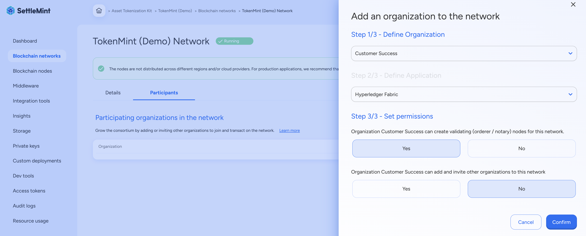

import { Callout } from "fumadocs-ui/components/callout";
import { Steps } from "fumadocs-ui/components/steps";

Permissioned networks, although started by a single organization, allow multiple
organizations with a shared business goal to come together and form the
consortium. The different organizations transacting with each other in a
permissioned network are called **network participants**. The organization who
created the network, i.e. the owner, can invite network participants and set
specific permissions for the organizations joining the network.

Depending on how you organize your work, you can grow the network with new
participants in two ways:

- **Invite an organization** to join the SettleMint platform so they can join
  the network (e.g. if the organization itself is responsible for adding and
  managing their nodes)
- **Add an organization** to the network yourself (e.g. if the organization is
  your client and you are managing the project for them)

## Invite an Organization

Navigate to the relevant **application**, and click **Blockchain network** in
the left navigation.

Open the **Participants** tab and click **Invite organization**. This opens a
form.

<Steps>
### Enter Contact Information
Enter the **email address** of the contact person from the organization you want to invite.

### Set Permissions

Set the **permissions** for this new network participant. You can change these
permissions at any time.

### Add Optional Message

Optionally, you can add a **message** to be included in the invitation email.

### Confirm Invitation

Click **Confirm** to go to the list of organizations participating in the
network. Your email invitation has now been sent, and you see in the list that
it is pending.

</Steps>

The invitation email includes a code that the recipient can use to get access to
the network.

## Add an Organization

Navigate to the relevant **application**, and click **Blockchain network** in
the left navigation.

Open the **Participants** tab and click **Add organization**. This opens a form.

<Steps>
### Define Organization
Define the **organization**. You can select an organization you already have in place, or create a new one and choose a name for this new organization. Separate invoices are generated for each organization, so creating a new organization might be more convenient if you need to separate invoices.

### Enter Billing Information

Enter **billing information** if you created a new organization. SettleMint
creates a billing account for this organization. You will be billed monthly for
the resources you use within this organization.

### Define Application

Define the **application**. You can select an application you already created,
or create a new one and choose a name for this new application.

### Set Permissions

Set the **permissions** for this new network participant. You can change these
permissions at any time.

### Confirm Addition

Click **Confirm** to go to the list of organizations participating in the
network. You see the new participant added to the list.

</Steps>

## Manage a Network Participant

Navigate to the relevant **application**, and click **Blockchain network** in
the left navigation.

Open the **Participants** tab and click **Manage participant** to see available
actions. You can only perform these actions if you have administrator rights.

**Change permissions** - Changes the network participant's permissions with
immediate effect.

<Callout type="info">
  All operations require appropriate permissions in your workspace.
</Callout>

# Join a Network by Invitation

In a permissioned blockchain network (often called a consortium network),
participants need to be invited by the network's owner to join the network.

<Callout type="info">
  You need an invitation code from the network owner to join a permissioned
  network.
</Callout>
