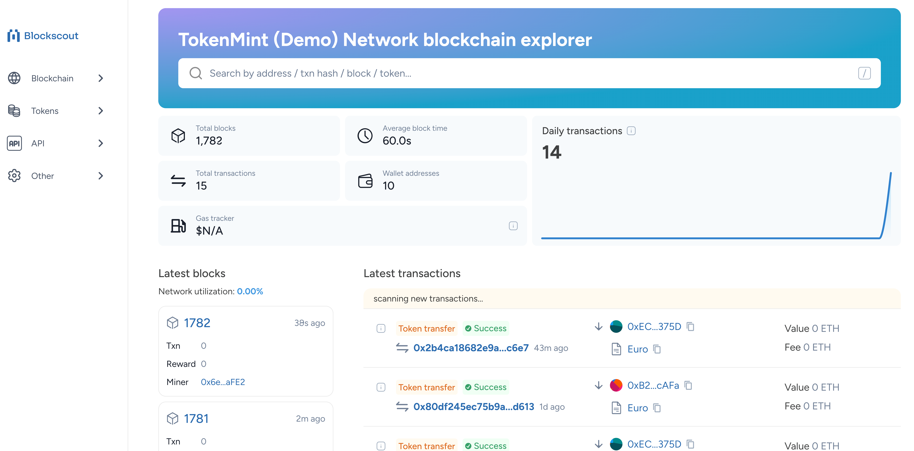
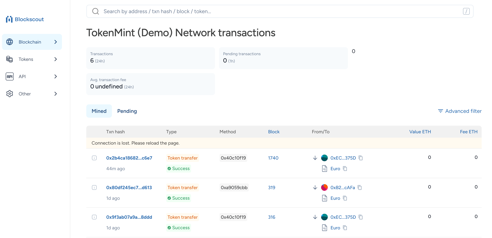
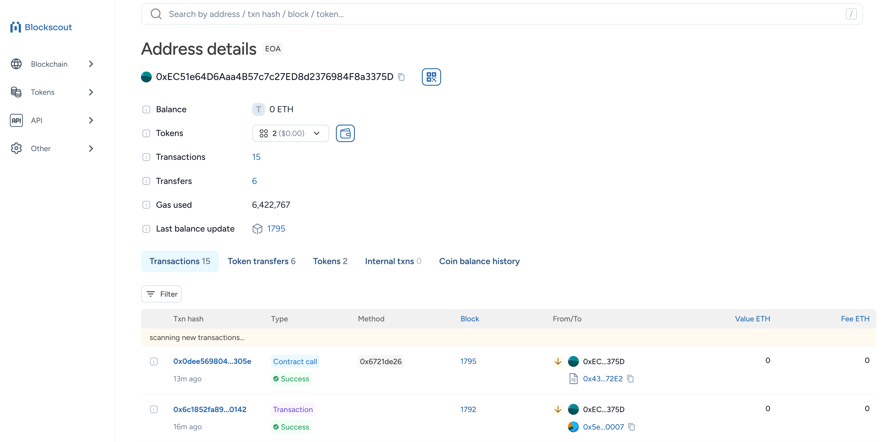
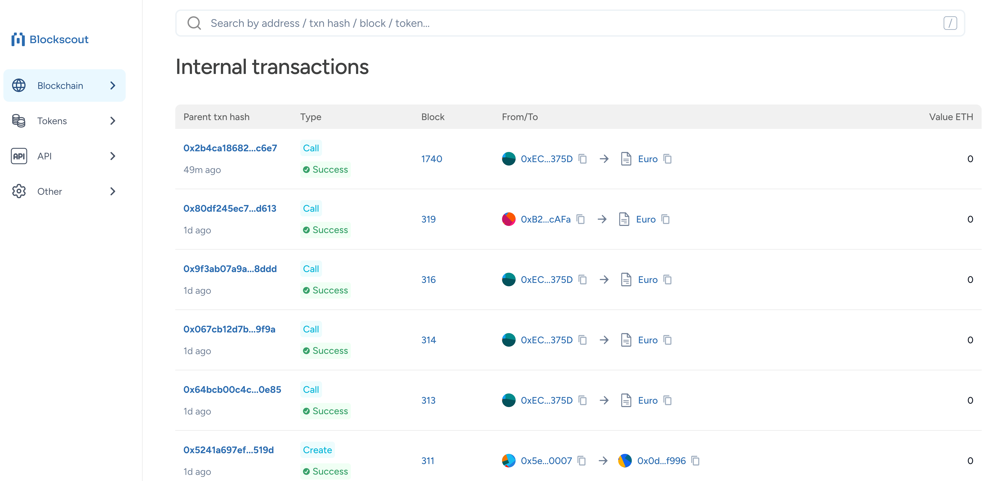
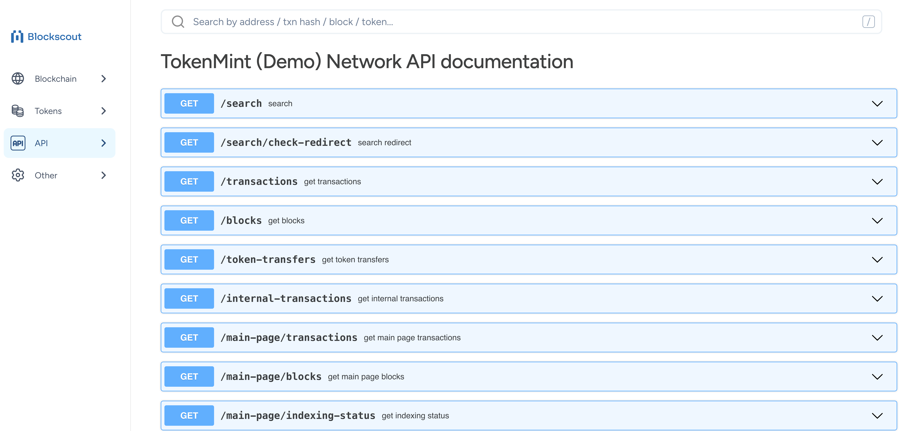
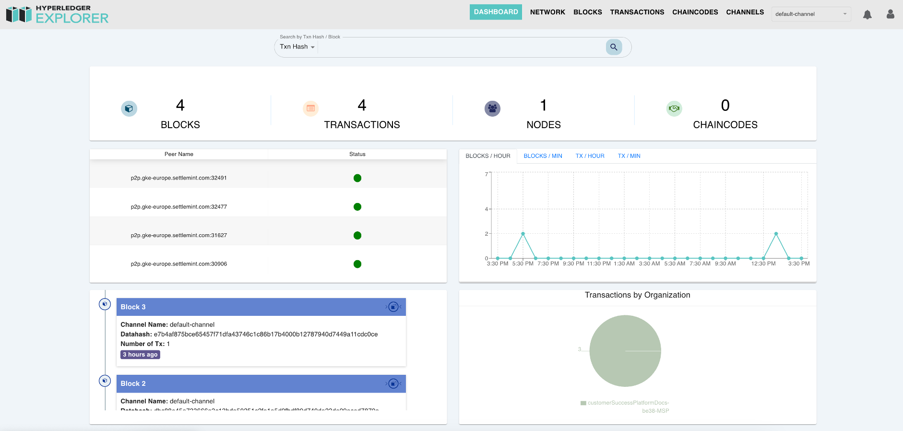

import { Tabs, Tab } from "fumadocs-ui/components/tabs";
import { Callout } from "fumadocs-ui/components/callout";
import { Steps } from "fumadocs-ui/components/steps";
import { Card } from "fumadocs-ui/components/card";

To view and inspect transactions in your blockchain application, SettleMint
provides insightful dashboards via integrated blockchain explorers:

- **Blockscout** - For EVM compatible networks (Besu, Polygon Edge)
- **Hyperledger Explorer** - For Fabric networks

## Add Blockchain Explorer

<Tabs items={['Platform UI', 'SDK CLI', 'SDK JS']}>
  <Tab value="Platform UI">
    Navigate to the **application** where you want to add a blockchain explorer. Click **Insights** in the left navigation, and then click **Add Insights**. This opens a form.

    Follow these steps:
    1. Select **Blockchain Explorer**
    2. Select the target **blockchain node** and click **Continue**
    3. Enter a **name** for your explorer instance
    4. Configure deployment settings (provider, region, size)
    5. Click **Confirm** to add the explorer

  </Tab>

  <Tab value="SDK CLI">
    First ensure you're authenticated:
    ```bash
    settlemint login
    ```

    Create blockchain explorer:
    ```bash
    # Create blockchain explorer
    settlemint platform create insights blockscout <name>

    # Get information about the command and all available options
    settlemint platform create insights blockscout --help
    ```

  </Tab>

  <Tab value="SDK JS">
    For a full example of how to create a blockchain explorer using the SDK, see the [Blockscout SDK API Reference](https://www.npmjs.com/package/@settlemint/sdk-blockscout#api-reference).
  </Tab>
</Tabs>

## Manage Explorer

<Tabs items={['Platform UI', 'SDK CLI', 'SDK JS']}>
  <Tab value="Platform UI">
    Navigate to your explorer and click **Manage insights** to:
    - View explorer details and status
    - Monitor health status
    - Access the explorer interface
    - Update configurations

    Current status values:
    - `DEPLOYING` - Initial deployment in progress
    - `COMPLETED` - Running normally
    - `FAILED` - Deployment or operation failed
    - `PAUSED` - Explorer is paused
    - `RESTARTING` - Explorer is restarting

    Health status indicators:
    - `HEALTHY` - Operating normally
    - `HAS_INDEXING_BACKLOG` - Processing backlog
    - `NOT_HA` - High availability issue
    - `NO_PEERS` - Network connectivity issue

  </Tab>

  <Tab value="SDK CLI">
    ```bash
    # List explorers
    settlemint platform list services --type insights

    # Restart explorer
    settlemint platform restart insights blockscout <name>
    ```

  </Tab>

  <Tab value="SDK JS">
    ```typescript
    // List explorers
    const listExplorers = async () => {
      const explorers = await client.insights.list("your-app");
      console.log('Explorers:', explorers);
    };

    // Get explorer details
    const getExplorer = async () => {
      const explorer = await client.insights.read("explorer-unique-name");
      console.log('Explorer details:', explorer);
    };

    // Restart explorer
    const restartExplorer = async () => {
      await client.insights.restart("explorer-unique-name");
    };
    ```

  </Tab>
</Tabs>

## Using the Explorer

When the blockchain explorer is deployed and running successfully, you can:

1. Access the web interface through the **Interface tab**
2. View in fullscreen mode for better visibility
3. Inspect blocks, transactions, addresses and balances

Key features:

- View latest blocks and transactions
- Search by block number, transaction hash, or address
- Inspect transaction details and status
- View account balances and token transfers
- Monitor smart contract interactions



### Transaction Details

Click a Transaction hash to see detailed information including:

- Gas usage and fees
- Input data and events
- Status and confirmations
- Related addresses



### Address Details

Click an Account address to view:

- Balance and token holdings
- Transaction history
- Contract interactions
- Analytics and graphs



<Callout type="info">
  All operations require appropriate permissions in your workspace.
</Callout>

# Blockscout Explorer for EVM Chains

Blockscout is an open-source blockchain explorer optimized for Ethereum Virtual
Machine (EVM)-compatible networks. It provides a comprehensive interface for
querying and analyzing blockchain data, including transactions, blocks, token
transfers, addresses, and smart contracts. Designed for real-time visibility,
Blockscout delivers structured access to on-chain operations, serving as a
critical tool for developers, auditors, and system architects. Its extensible
architecture and detailed data presentation facilitate both high-level
monitoring and granular inspection of EVM-based ecosystems.

Transactions refer to standard on-chain actions initiated by externally owned
accounts (EOAs), like sending tokens, deploying contracts, or interacting with
smart contracts. These are recorded directly on the blockchain with their own
transaction hash.


Internal Transactions (also called “message calls”) are operations triggered
within smart contracts, often as a result of a transaction. For example, a
contract calling another contract or transferring ETH/token internally. These
are not standalone transactions but are captured through execution traces and
don’t appear directly on-chain.


It enables precise interrogation of blockchain state through its block and
transaction monitoring capabilities. Blocks are indexed by unique hashes or
sequential numbers, exposing attributes such as block height, timestamp, gas
consumption, and transaction volume. Transaction data includes sender and
recipient addresses, transferred values, gas costs, and execution status (e.g.,
success, failure, pending). For smart contract interactions, Blockscout parses
input data to extract function calls and parameters, providing developers with
actionable insights for debugging and validation workflows. The explorer
supports detailed address inspection for both externally owned accounts (EOAs)
and smart contracts. Queryable data encompasses current balances, transaction
histories, and token associations. For verified smart contracts, Blockscout
exposes source code and Application Binary Interface (ABI), enabling direct
interaction via the platform. This functionality supports use cases such as
wallet tracking, address investigation, and contract deployment verification,
making it an indispensable resource for EVM developers and security analysts.

## API Overview

Blockscout provides multiple API interfaces to interact with blockchain data,
including REST API, JSON RPC & ETH Compatible RPC Endpoints, and GraphQL. These
APIs are designed for ease of use, supporting developers transitioning from
other explorers like Etherscan to Blockscout, as well as those requiring general
API and data support.



### API Access

```
REST API URL: /api
JSON RPC URL: /api/eth-rpc
GraphQL URL: /graphiql
```

## REST API Endpoints

The REST API supports both GET and POST requests and is structured around
modules and actions. The following modules are supported: Account, Logs, Token,
Stats, Block, Contract, and Transaction.

### Search

```http
GET /search                         # Perform a general search
GET /search/check-redirect          # Search redirect
```

### Transactions

```http
GET /transactions                                           # Retrieve transactions
GET /transactions/{transaction_hash}                        # Get transaction details
GET /transactions/{transaction_hash}/token-transfers        # Get token transfers for a transaction
GET /transactions/{transaction_hash}/internal-transactions  # Get internal transactions
GET /transactions/{transaction_hash}/logs                   # Get transaction logs
GET /transactions/{transaction_hash}/raw-trace              # Get transaction raw trace
GET /transactions/{transaction_hash}/state-changes          # Get transaction state changes
GET /transactions/{transaction_hash}/summary                # Get a human-readable transaction summary
```

### Blocks

```http
GET /blocks                                                 # Retrieve blocks
GET /blocks/{block_number_or_hash}                          # Get block details
GET /blocks/{block_number_or_hash}/transactions             # Get transactions in a block
GET /blocks/{block_number_or_hash}/withdrawals              # Get block withdrawals
```

### Addresses

```http
GET /addresses                                              # Get native coin holders list
GET /addresses/{address_hash}                               # Get address details
GET /addresses/{address_hash}/transactions                  # Get transactions related to an address
GET /addresses/{address_hash}/token-transfers               # Get token transfers
GET /addresses/{address_hash}/internal-transactions         # Get internal transactions
GET /addresses/{address_hash}/logs                          # Get logs related to an address
GET /addresses/{address_hash}/blocks-validated              # Get blocks validated by the address
GET /addresses/{address_hash}/token-balances                # Get all token balances
GET /addresses/{address_hash}/tokens                        # Get token balances with filtering and pagination
GET /addresses/{address_hash}/coin-balance-history          # Get coin balance history
GET /addresses/{address_hash}/coin-balance-history-by-day   # Get balance history by day
GET /addresses/{address_hash}/withdrawals                   # Get withdrawals related to an address
GET /addresses/{address_hash}/nft                           # Get list of NFTs owned by an address
GET /addresses/{address_hash}/nft/collections               # Get NFTs grouped by collection
```

### Tokens

```http
GET /tokens                                                  # Get a list of tokens
GET /tokens/{address_hash}                                   # Get token details
GET /tokens/{address_hash}/transfers                         # Get token transfers
GET /tokens/{address_hash}/holders                           # Get token holders
GET /tokens/{address_hash}/counters                          # Get token statistics
GET /tokens/{address_hash}/instances                         # Get NFT instances
GET /tokens/{address_hash}/instances/{id}                    # Get NFT instance by ID
GET /tokens/{address_hash}/instances/{id}/transfers          # Get NFT instance transfers
GET /tokens/{address_hash}/instances/{id}/holders            # Get NFT instance holders
GET /tokens/{address_hash}/instances/{id}/transfers-count    # Get NFT transfer count
PATCH /tokens/{address_hash}/instances/{id}/refetch-metadata # Re-fetch NFT metadata
```

### Smart Contracts

```http
GET /smart-contracts                                     # Get verified smart contracts
GET /smart-contracts/{address_hash}                      # Get smart contract details
GET /smart-contracts/{address_hash}/methods-read         # Get read methods of a smart contract
GET /smart-contracts/{address_hash}/methods-write        # Get write methods of a smart contract
POST /smart-contracts/{address_hash}/query-read-method   # Query a smart contract's read method
```

### Statistics & Charts

```http
GET /stats                                               # Get statistics counters
GET /stats/charts/transactions                           # Get transactions chart
GET /stats/charts/market                                 # Get market chart
```

### Other Endpoints

```http
GET /config/json-rpc-url                                 # Get JSON-RPC URL
GET /withdrawals                                         # Get withdrawals
GET /proxy/account-abstraction/status                    # Get account abstraction indexing status
```

### Schemas

Blockscout provides multiple schemas representing different blockchain data
structures, including: Block, Transaction, TokenTransfer, InternalTransaction,
SmartContract, NFTInstance, TokenInfo, and TransactionSummary.

**Last Updated:** 8 months ago

## JSON RPC & ETH Compatible RPC Endpoints

In addition to custom RPC endpoints, the Blockscout ETH RPC API supports most
commonly used methods in the exact format specified for Ethereum nodes, as per
the Ethereum JSON-RPC Specification. These methods are provided for convenience
and are most suitable as a fallback option in your JSON RPC API providers. For
other use cases, REST or custom RPC methods are recommended.

### Supported Methods

```json
eth_blockNumber                  # Returns the latest block number in the chain in hexadecimal format
eth_getBalance                   # Returns the balance of a given address in wei
eth_getLogs                      # Returns an array of logs matching a specified filter object
eth_gasPrice                     # Returns the current gas price
eth_getTransactionByHash         # Retrieves a transaction by its hash
eth_getTransactionReceipt        # Retrieves the receipt of a transaction
eth_chainId                      # Returns the chain ID
eth_maxPriorityFeePerGas         # Returns the maximum priority fee per gas
eth_getTransactionCount          # Returns the number of transactions sent from an address
eth_getCode                      # Returns the code at a given address
eth_getStorageAt                 # Returns the value from a storage position at a given address
eth_estimateGas                  # Estimates the gas needed for a transaction
eth_getBlockByNumber             # Retrieves a block by number
eth_getBlockByHash               # Retrieves a block by hash
eth_sendRawTransaction           # Sends a raw transaction
eth_call                         # Executes a new message call immediately without creating a transaction
```

## GraphQL in Blockscout

The Graph is a decentralized protocol for indexing and querying blockchain data,
making it easier to access and use. It acts like a librarian for blockchain
data, organizing it for quick retrieval. It decentralizes the reading layer,
ensuring reliability and security by avoiding single points of failure.
Subgraphs are custom databases within The Graph that define how to collect,
organize, and store data from blockchain smart contracts. They make data
queryable via GraphQL, simplifying access to complex information like NFT
transfer histories. Blockscout integrates with The Graph to enhance its data
querying capabilities. Subgraphs can be created to index data from EVM chains
supported by Blockscout, such as Ethereum or Sepolia. Once deployed to The
Graph's network, which includes over 450 indexers worldwide, this data can be
queried efficiently using GraphQL. This integration allows developers to combine
Blockscout's detailed blockchain exploration with The Graph's powerful indexing
and querying, enabling more advanced dApp development.


### What is GraphQL?

GraphQL is an open-source data query and manipulation language for APIs, and a
runtime for fulfilling queries with existing data. It provides an efficient,
powerful, and flexible approach to developing web APIs. It allows clients to
define the structure of the data required, and exactly the same structure of the
data is returned from the server, preventing excessively large amounts of data
from being returned.

#### Key Concepts of GraphQL

- **Hierarchical:** Queries are structured hierarchically, allowing nested data
  retrieval.
- **Strongly Typed:** Schemas define types for all data, ensuring predictable
  responses.
- **Client-Specified Queries:** Clients can request exactly the data they need,
  reducing over-fetching or under-fetching.

#### Advantages of GraphQL

- **Declarative Integration on Client:** Clients specify what data/operations
  they need.
- **Standard Way to Expose Data and Operations:** Provides a consistent API
  structure.
- **Support for Real-Time Data:** Enables real-time updates with subscriptions.

### Query Types

There are three main query types in a GraphQL schema:

1. **Query:** Fetch data, such as retrieving posts or transactions.
2. **Mutation:** Change data, such as updating a post or modifying a record.
3. **Subscription:** Subscribe to real-time data, such as new posts in a
   category.

### Access GraphQL API

To access Blockscout's GraphQL interface, use **GraphiQL**, an in-browser IDE
for exploring GraphQL, which is built into Blockscout. From the APIs dropdown
menu, choose GraphQL. Alternatively, you can use your favorite HTTP client to
send requests to the GraphQL endpoint.

#### GraphiQL Interface

The GraphiQL interface provides a user-friendly environment to explore and test
GraphQL queries. It includes a documentation explorer (Docs section) that
provides schema details, such as root types, and a query editor to write and
execute queries.

### Queries

Blockscout's GraphQL API provides queries and a subscription, viewable in the
GraphQL interface under the Docs menu. Example queries include:

```graphql
address(hash: AddressHash!): Address           # Gets an address by hash
addresses(hashes: [AddressHash!]): [Address]   # Gets addresses by hashes
block(number: Int!): Block                     # Gets a block by number
transaction(hash: FullHash!): Transaction      # Gets a transaction by hash
```

#### Example Query to Retrieve Transactions for a Specific Address

```graphql
{
  address(hash: "0xaddressHash") {
    transactions(first: 10) {
      edges {
        node {
          blockNumber
          createdContractAddressHash
          fromAddressHash
          gas
          hash
        }
      }
    }
  }
}
```

## Hyperledger Fabric Explorer

Hyperledger Explorer is a web-based tool designed to provide a **comprehensive
and real-time** view of blockchain operations within **Hyperledger Fabric**
networks. It enables users to monitor and analyze blockchain activities,
including **blocks, transactions, and chaincodes**, while maintaining privacy
and security. With its feature-rich dashboard, Hyperledger Explorer allows users
to **navigate through blocks, transactions, peers, and channels** with ease. The
tool provides advanced search and filtering capabilities, real-time
notifications for new blocks, and interactive metrics for visualizing blockchain
trends. By offering deep insights into ledger data and enabling efficient
network management, Hyperledger Explorer becomes an essential solution for
organizations leveraging **Hyperledger Fabric**.



- **Real-time Monitoring**: Displays network activity as it happens, providing
  immediate visibility into new blocks and transactions.
- **Comprehensive Dashboard**: A central hub for monitoring network health,
  including metrics such as the number of blocks, transactions, nodes, and
  chaincodes.
- **Detailed Block & Transaction Views**:
  - Block list with metadata such as block hash, transaction count, and
    timestamps.
  - Transaction explorer for tracking transaction details, types, and associated
    metadata.
- **Search & Filtering**:
  - Filter transactions and blocks by **date range, channel, or organization**.
  - Advanced sorting capabilities for customized data views.
- **Channel & Chaincode Management**:
  - View and manage available channels.
  - Display installed chaincodes with versioning details.
- **Interactive Metrics & Analytics**:
  - Graphical visualizations of blockchain activity.
  - Hover-based insights for precise data analysis.

## Dashboard Overview

The **Dashboard** serves as the main interface, providing an overview of the
blockchain network. It includes various panels such as **Peer Lists, Network
Metrics, and Recent Transactions by Organization**. Users can dynamically switch
channels via a dropdown to customize their view. Additionally, a **Latest Blocks
Notification Panel** presents key block details, including:

- Block number
- Channel name
- Data hash
- Transaction count

Each block link redirects to an in-depth **Block Details** view, offering
insights into timestamps, hashes, and transaction summaries.

## Network & Channel Management

The **Network View** presents details on configured properties for each channel.
Users can analyze peer statuses, their roles, and network configurations,
including **ledger height and Membership Service Provider (MSP) identity**.

The **Channel List** section provides an overview of available channels,
enabling users to navigate different segments of the blockchain network
effortlessly.

## Exploring Blocks & Transactions

Hyperledger Explorer provides powerful tools for tracking blockchain activities:

- **Block List**: A sortable, filterable table displaying block metadata like
  block hash, transaction count, and creation timestamps.
- **Transaction List**: Supports up to **100 rows per page** with pagination and
  allows users to drill down into transaction specifics.
- **JSON Transaction Views**: Enables structured previews with fold/unfold
  options for easy data inspection.

## Chaincodes & Smart Contracts

The **Chaincode List** presents installed chaincodes across the network,
allowing filtering and sorting by:

- Chaincode name
- Version
- Deployment status
- Associated transactions

This section helps users manage smart contracts efficiently and track changes
over time.

## Analytics & Metrics

A dedicated **Metrics Panel** delivers real-time statistics, such as:

- Number of blocks and transactions processed per hour or minute
- Network activity trends over time
- Interactive charts for monitoring blockchain operations

These visual analytics tools enhance user insights and ensure efficient
blockchain monitoring.
