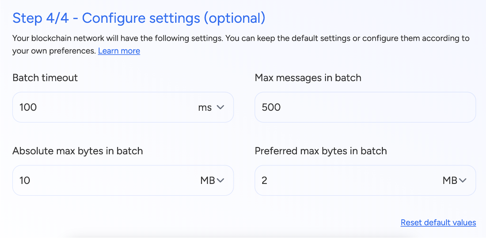
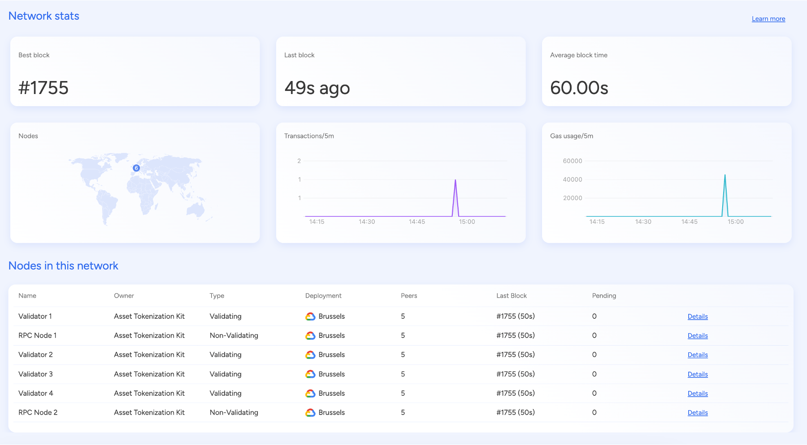
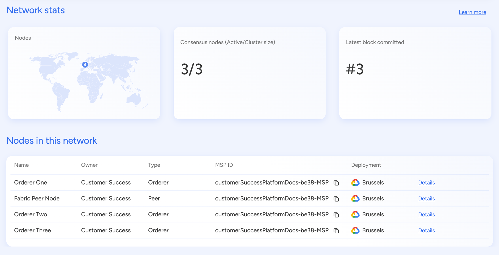
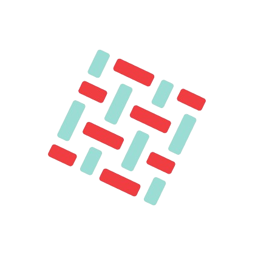
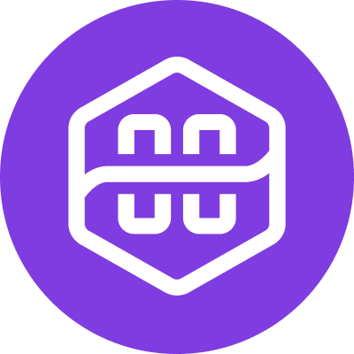

## Key Capabilities

### Create Private Permissioned Networks

- Deploy **Hyperledger Besu, Hyperledger Fabric, or Quorum** networks with
  pre-configured templates and guided workflows, ensuring rapid setup for
  enterprise use cases.

### Connect with Public Networks

- Seamlessly integrate with **Ethereum, Polygon, Hedera, Avalanche, Arbitrum,
  Optimism**, and other leading public blockchains, enabling hybrid solutions
  that leverage both public and private networks.

### Join External Networks

- Use **SettleMint's tooling** to connect to existing networks, expand
  infrastructure, or migrate to the SettleMint platform, providing flexibility
  for organizations with pre-existing blockchain deployments.

### Join via Invitation Code

- Easily connect to **pre-existing networks** within SettleMint using an
  invitation code, streamlining collaboration in consortium setups.

---

## Supported Networks

The SettleMint Network Manager supports a wide range of blockchain protocols,
catering to both private permissioned and public network requirements. Below is
a summary of the supported networks:

| Network Type | Protocol           | Description                                                            |
| ------------ | ------------------ | ---------------------------------------------------------------------- |
| Permissioned | Hyperledger Besu   | Enterprise-grade permissioned blockchain with QBFT consensus. |
| Permissioned | Quorum             | Ethereum fork with privacy features and encrypted transactions.        |
| Permissioned | Hyperledger Fabric | Modular blockchain with pluggable consensus and customizable policies. |
| Public L1    | Ethereum           | Decentralized blockchain with PoS, known for smart contracts.          |
| Public L1    | Avalanche          | High-speed chain with subnet support and PoS.                          |
| Public L1    | Hedera Hashgraph   | Scalable public ledger with aBFT and low fees.                         |
| Public L2    | Polygon PoS        | Ethereum sidechain for faster, cheaper transactions.                   |
| Public L2    | Polygon zkEVM      | Zero-knowledge rollup for efficient Ethereum scaling.                  |
| Public L2    | Optimism           | Optimistic Rollup solution for Ethereum scalability.                   |
| Public L2    | Arbitrum           | Optimistic Rollup for improved Ethereum performance and lower fees.    |

---

## Network Deployment & Configuration

### EVM-Based Private Networks (Besu, Quorum)

Users can configure the following parameters before deploying a private
permissioned **EVM-based network**:

| Parameter           | Description                                                     |
| ------------------- | --------------------------------------------------------------- |
| Chain ID            | A unique identifier for the blockchain network.                 |
| Seconds per Block   | Time interval for block creation.                               |
| Gas Price           | Minimum gas price required for transactions (specified in wei). |
| Gas Limit           | Maximum amount of gas allowed per block.                        |
| EVM Stack Size      | Maximum stack size for the Ethereum Virtual Machine (EVM).      |
| Contract Size Limit | Maximum size of a smart contract in kilobytes (KB).             |

#### Genesis Block Configuration

The `genesis.json` file is a critical component of EVM-based blockchain
networks, defining the initial state and parameters of the blockchain to ensure
secure and structured network operations. Key elements include:

- **Chain ID**: Uniquely identifies the network to prevent replay attacks.
- **Consensus Mechanism**: Determines how blocks are validated, providing the
  necessary governance structure (e.g. QBFT, PoA, PoS).
- **Pre-allocated Balances**: Specify the initial allocation of tokens for
  specific addresses.
- **QBFT Validator Information**: Defines the nodes responsible for validating
  transactions in Quorum Byzantine Fault Tolerance (QBFT)-based networks.

#### Developer Integrations

The SettleMint Network Manager provides developer-friendly tools to facilitate
smart contract development and network interactions:

- **Faucet Wallets**: Enable test token distribution for private networks,
  making it easier for developers to test transactions.
- **Genesis file availability**: Users can access and download `genesis.json`
  file, allowing for easy network expansion outside SettleMint platform.

### Hyperledger Fabric Networks

Users can configure the following settings before deploying a **Fabric
network**:

| Parameter                    | Description                                                                              |
| ---------------------------- | ---------------------------------------------------------------------------------------- |
| Endorsement Policy           | Defines transaction endorsement requirements ("By all peers" or "By majority of peers"). |
| Batch Timeout                | Time before transactions are grouped into a block.                                       |
| Max Messages in Batch        | Maximum number of messages in a batch.                                                   |
| Absolute Max Bytes in Batch  | Upper limit on batch size in megabytes (MB).                                             |
| Preferred Max Bytes in Batch | Preferred batch size in megabytes (MB).                                                  |

#### Channel Configuration and Policies

Hyperledger Fabric networks use a `configtx.json` file to define network
channels, membership rules, and policies. Key components include:

- **Application Group**: Defines policies for participating organizations,
  specifying details such as:
  - **Organization Name**
  - **Policies**:
    - **Admin**: Roles allow users to modify configurations.
    - **Endorsement**: Policies require transaction approvals from specific
      peers.
    - **Readers and Writers**: Policies define access to channel data.
- **Orderer Group**: Configures the ordering service responsible for transaction
  finalization. Settings include:
  - **Batch Timeout**: Determines the time before transactions are grouped into
    a block.
  - **Max Messages Per Batch**: Controls block size.
- **Consensus Type**: Typically `etcdraft`, a Raft-based ordering service.

#### Network Governance and Security

Hyperledger Fabric networks require robust security and governance mechanisms:

- **Membership Service Provider (MSP)**: Controls identity verification and
  authentication, ensuring only authorized participants can access the network.
- **Root Certificates and TLS Certificates**: Define trusted entities for secure
  communication.
- **Endorsement Policies**: Determine how transactions are validated across
  organizations, enforcing compliance and preventing unauthorized modifications.
- **Block Validation Policies**: Ensure the integrity and security of the
  distributed ledger, maintaining network trustworthiness.

---

## Network Monitoring & Management

### EVM-Based Networks

The **dashboard** provides insights into:

- **Network Details**: Name, deployment location, creation date, blockchain
  version, protocol type.
- **Key Configurations**: Chain ID, block time, gas price, gas limit, contract
  size limit, EVM stack size.
- **Genesis File Access**: Contains initial network configuration.

#### System Recommendations

> **Recommendation**  
> At least **four validator nodes** are required to ensure **Byzantine Fault
> Tolerance**.

#### Faucet Wallet

- Includes **mnemonic phrase, private key, derivation path, Ethereum address**.
- Provides a **large test balance** for development and testing.

#### Public Network Monitoring Parameters

The **dashboard** provides real-time analytics on:

- Best block height
- Current gas price
- Current gas used
- Block height over time
- Suggested gas price over time
- Gas used over time
- Transactions per block
- Pending transactions over time
- Gas limit over time
- Block size over time
- Geographical location of nodes

#### Monitoring and Analytics

The Network Manager provides real-time insights into network performance:

- **Current Block Height**: Represents the latest block processed.
- **Transaction Volume**: Gives an overview of the number and frequency of
  transactions, allowing organizations to analyze usage trends.
- **Node Health Monitoring**: Ensures that validator and RPC nodes remain active
  and operational.
- **Gas Consumption**: Analytics provide insights into network congestion and
  transaction costs.
- **Pending Transactions**: Monitoring helps identify potential bottlenecks in
  the system, enhancing troubleshooting and optimization efforts.

### Hyperledger Fabric Networks

The **dashboard** offers comprehensive network monitoring, including:

- **Network Overview**: Name, deployment location, creation date, blockchain
  version, protocol type, channel ID, MSP ID.
- **Channel Configuration JSON File Access**.
- **Batch Processing Settings**:
  - Timeout
  - Maximum messages
  - Batch size

#### Real-Time Performance Monitoring

- Number and location of nodes.
- Active consensus nodes and cluster size.
- Latest block committed.
- Real-time transaction monitoring, allowing users to keep track of all
  blockchain activities.
- Health status of orderer and peer nodes.
- Performance analytics, including block generation times, to help organizations
  optimize their blockchain operations.
- Endorsement policy compliance tracking to ensure transactions adhere to
  predefined security and governance policies.

#### System Recommendations

> **Recommendation**  
> Alerts for **fault tolerance** and **orderer node requirements** are provided
> in the system.

#### Key Benefits

- Simplifies the deployment process for Hyperledger Fabric networks through a
  guided setup approach.
- Efficiently configures access control, consensus models, and governance
  settings, ensuring a seamless blockchain deployment experience.
- Designed for scalability, supporting multi-organization setups with secure
  identity management.
- Integrated monitoring provides organizations with real-time insights into
  network performance and compliance adherence.

---

# Supported Blockchain Network Protocols

## Private Permissioned Networks

SettleMint's Network Manager excels at creating and managing private
permissioned networks, which are ideal for enterprises requiring strict control
over data privacy, access, and governance. Below are the supported frameworks,
enriched with additional details and practical use cases.

### Hyperledger Besu

<table>
  <tbody>
    <tr>
      <td style={{width: "30%"}}>
          
      

      </td>
      <td style={{width: "70%"}}>

      Hyperledger Besu is an enterprise-grade, Ethereum-based blockchain framework
      designed for permissioned and consortium networks. It offers private
      transactions, configurable consensus mechanisms (IBFT, QBFT), and Ethereum
      Virtual Machine (EVM) compatibility, allowing seamless integration with existing
      Ethereum tools. Its modular architecture makes it a flexible choice for
      businesses that require high security and compliance.

      </td>
    </tr>
  </tbody>
</table>

<table>
  <tbody>
    <tr>
      <td style={{width: "50%"}}>

      **Key Features**

      - Private transactions via Tessera.
      - High performance with configurable consensus mechanisms.
      - Ethereum compatibility for smart contract development.

      </td>
      <td style={{width: "50%"}}>

      **Example Use Cases**

      - Enterprise financial settlements.
      - Private blockchain networks for regulated industries.
      - Supply chain tracking and transparency.

      </td>
    </tr>
  </tbody>
</table>

---

### Quorum

<table>
  <tbody>
    <tr>
      <td style={{width: "30%"}}>

      

      </td>
      <td style={{width: "70%"}}>

      Quorum is an Ethereum-based blockchain designed for enterprises needing privacy
      and confidentiality in transactions. It supports Raft and IBFT consensus,
      ensuring high throughput and fast finality. With private transactions and smart
      contract execution, Quorum is widely used in finance, healthcare, and government
      sectors where data protection is crucial.

      </td>
    </tr>
  </tbody>
</table>

<table>
  <tbody>
    <tr>
      <td style={{width: "50%"}}>

      **Key Features**

      - Privacy through private transactions and contract execution.
      - Ethereum compatibility for existing smart contracts.
      - High throughput with Raft consensus.

      </td>
      <td style={{width: "50%"}}>

      **Example Use Cases**

      - Banking and financial services requiring confidential transactions.
      - Healthcare data exchange with controlled access.
      - Corporate consortia with secure shared ledgers.

      </td>
    </tr>
  </tbody>
</table>

---

### Hyperledger Fabric

<table>
  <tbody>
    <tr>
      <td style={{width: "30%"}}>

      

      </td>
      <td style={{width: "70%"}}>

      Hyperledger Fabric is a modular and scalable blockchain framework, ideal for
      enterprise solutions requiring private and permissioned networks. Its
      multi-channel architecture allows organizations to share data securely while
      maintaining privacy. Fabric's pluggable consensus mechanisms and endorsement
      policies make it a powerful choice for industries needing custom governance
      models.

      </td>
    </tr>
  </tbody>
</table>

<table>
  <tbody>
    <tr>
      <td style={{width: "50%"}}>

      **Key Features**

      - Channels for private data sharing.
      - Pluggable consensus for optimization.
      - Endorsement policies for transaction validation.

      </td>
      <td style={{width: "50%"}}>

      **Example Use Cases**

      - Enterprise supply chain management.
      - Trade finance and document verification.
      - Interbank settlements with controlled access.

      </td>
    </tr>
  </tbody>
</table>

---

## Layer 1 (L1) Public Networks

### Ethereum

<table>
  <tbody>
    <tr>
      <td style={{width: "30%"}}>

      

      </td>
      <td style={{width: "70%"}}>

      Ethereum is the most widely adopted decentralized blockchain, supporting smart
      contracts, decentralized applications (dApps), and financial services (DeFi). It
      transitioned to Proof of Stake (PoS) with Ethereum 2.0, reducing energy
      consumption while improving scalability. Ethereum's rich ecosystem makes it a
      leading choice for developers and enterprises.

      </td>
    </tr>
  </tbody>
</table>

<table>
  <tbody>
    <tr>
      <td style={{width: "50%"}}>

      **Key Features**

      - Smart contracts written in Solidity.
      - Large ecosystem of tools and dApps.
      - PoS consensus for scalability.

      </td>
      <td style={{width: "50%"}}>

      **Example Use Cases**

      - Decentralized finance (DeFi) applications.
      - Non-fungible tokens (NFTs) marketplaces.
      - Enterprise-grade smart contract automation.

      </td>
    </tr>
  </tbody>
</table>

---

### Avalanche

<table>
  <tbody>
    <tr>
      <td style={{width: "30%"}}>

      

      </td>
      <td style={{width: "70%"}}>

      Avalanche is a high-speed Layer 1 blockchain that enables the creation of custom
      subnets, making it highly scalable and interoperable. It uses a unique Proof of
      Stake (PoS) consensus, ensuring low fees, near-instant finality, and high
      transaction throughput. Its EVM compatibility allows seamless migration of
      Ethereum-based dApps.

      </td>
    </tr>
  </tbody>
</table>

<table>
  <tbody>
    <tr>
      <td style={{width: "50%"}}>

      **Key Features**

      - Subnets for isolated, customizable blockchain environments.
      - High throughput with transaction finality in under 2 seconds.
      - EVM compatibility for easy migration of Ethereum dApps.

      </td>
      <td style={{width: "50%"}}>

      **Example Use Cases**

      - Institutional DeFi solutions.
      - Gaming and metaverse projects.
      - Tokenized assets and securities.

      </td>
    </tr>
  </tbody>
</table>

---

### Hedera Hashgraph

<table>
  <tbody>
    <tr>
      <td style={{width: "30%"}}>

      

      </td>
      <td style={{width: "70%"}}>

      Hedera Hashgraph is an enterprise-ready public ledger that uses asynchronous
      Byzantine Fault Tolerance (aBFT) for security and efficiency. It provides
      low-cost transactions, predictable pricing, and high throughput with up to
      10,000 transactions per second. Its governance model, managed by major
      enterprises, ensures stability and regulatory compliance.

      </td>
    </tr>
  </tbody>
</table>

<table>
  <tbody>
    <tr>
      <td style={{width: "50%"}}>

      **Key Features**

      - aBFT consensus for high security and fault tolerance.
      - Scalability with up to 10,000 transactions per second.
      - Fixed, low-cost fees for predictable budgeting.

      </td>
      <td style={{width: "50%"}}>

      **Example Use Cases**

      - Government ID and voting systems.
      - Secure digital asset management.
      - Supply chain and logistics solutions.

      </td>
    </tr>
  </tbody>
</table>

---

## Layer 2 (L2) Public Networks

### Polygon PoS

<table>
  <tbody>
    <tr>
      <td style={{width: "30%"}}>

      

      </td>
      <td style={{width: "70%"}}>

      Polygon PoS is an Ethereum-compatible Layer 2 sidechain that provides faster
      transactions and lower fees while being secured by the Ethereum mainnet. It
      supports high-volume applications like gaming, DeFi, and NFTs, reducing
      congestion on Ethereum. The PoS mechanism ensures low-cost and scalable
      transaction processing.

      </td>
    </tr>
  </tbody>
</table>

<table>
  <tbody>
    <tr>
      <td style={{width: "50%"}}>

      **Key Features**

      - Near-instant transactions with minimal fees.
      - Full Ethereum compatibility for smart contracts and dApps.
      - Bridging mechanism for secure asset transfers between Polygon and Ethereum.

      </td>
      <td style={{width: "50%"}}>

      **Example Use Cases**

      - High-volume gaming applications.
      - NFT marketplaces with low transaction fees.
      - Scalable DeFi platforms.

      </td>
    </tr>
  </tbody>
</table>

---

### Polygon zkEVM

<table>
  <tbody>
    <tr>
      <td style={{width: "30%"}}>

      

      </td>
      <td style={{width: "70%"}}>

      Polygon zkEVM is a zero-knowledge rollup solution that enables secure and
      private transactions while maintaining Ethereum compatibility. It improves
      scalability, reduces gas fees, and supports high-throughput applications.
      Businesses looking for privacy-preserving blockchain solutions benefit from its
      advanced cryptographic techniques.

      </td>
    </tr>
  </tbody>
</table>

<table>
  <tbody>
    <tr>
      <td style={{width: "50%"}}>

      **Key Features**

      - zk-rollups for high throughput and low costs.
      - EVM compatibility for seamless dApp migration.
      - Enhanced privacy through zero-knowledge proofs.

      </td>
      <td style={{width: "50%"}}>

      **Example Use Cases**

      - Secure enterprise transactions with privacy.
      - Scalable Ethereum-based DeFi applications.
      - Cost-effective NFT minting and trading.

      </td>
    </tr>
  </tbody>
</table>

---

### Optimism

<table>
  <tbody>
    <tr>
      <td style={{width: "30%"}}>

      

      </td>
      <td style={{width: "70%"}}>

      Optimism uses Optimistic Rollups to batch process transactions off-chain,
      reducing Ethereum's congestion and gas fees. It ensures faster finality while
      maintaining Ethereum's security and decentralization. Optimism is widely used
      for scalable DeFi applications and developer-friendly dApps.

      </td>
    </tr>
  </tbody>
</table>

<table>
  <tbody>
    <tr>
      <td style={{width: "50%"}}>

      **Key Features**

      - Optimistic Rollups for cost-effective scaling.
      - Near-identical Ethereum experience for developers.
      - Fast transaction confirmation with Ethereum finality.

      </td>
      <td style={{width: "50%"}}>

      **Example Use Cases**

      - Scalable decentralized exchanges (DEXs).
      - Identity verification systems.
      - Secure voting mechanisms.

      </td>
    </tr>
  </tbody>
</table>

---

### Arbitrum

<table>
  <tbody>
    <tr>
      <td style={{width: "30%"}}>

      

      </td>
      <td style={{width: "70%"}}>

      Arbitrum is an Optimistic Rollup solution that enhances Ethereum's scalability
      by processing transactions off-chain while ensuring on-chain security and
      fraud-proof verification. It provides reduced fees, high throughput, and
      seamless Ethereum compatibility, making it a popular choice for scalable dApps
      and DeFi applications.

      </td>
    </tr>
  </tbody>
</table>

<table>
  <tbody>
    <tr>
      <td style={{width: "50%"}}>

      **Key Features**

      - High throughput with reduced gas costs.
      - Full EVM compatibility for smart contracts.
      - Seamless integration with Ethereum's ecosystem.

      </td>
      <td style={{width: "50%"}}>

      **Example Use Cases**

      - Cost-effective Layer 2 scaling for DeFi applications.
      - Scalable smart contract automation.
      - Low-fee gaming and metaverse applications.

      </td>
    </tr>
  </tbody>
</table>
---